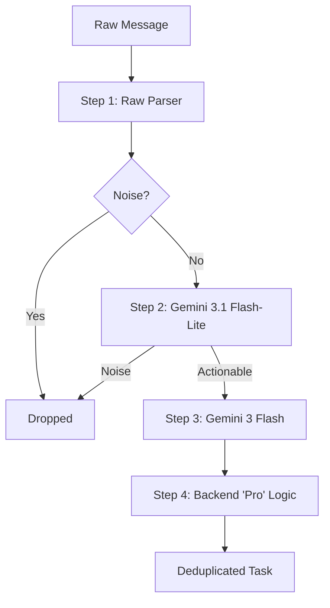

# Project GEM Filtering Pipeline & Technical Architecture

Message Consolidator은 수많은 메시지(Email, Slack, WhatsApp 등) 속에서 **실행 가능한 작업(Task)**을 효율적으로 추출하고 관리하기 위해 고안된 다단계 필터링 파이프라인을 갖추고 있습니다.

## 1. 필터링 파이프라인 개요
이 파이프라인은 리소스 효율성(Cost)과 처리속도(Latency), 그리고 정확도(Accuracy)를 동시에 잡기 위해 "Parser -> Flash-Lite -> Flash -> Pro"로 이어지는 단계별 정제 과정을 거칩니다.



---

## 2. 파이프라인 단계별 상세 구성

### Step 1: Raw Parser (Pre-processing)
*   **역할**: 메시지의 메타데이터(Sender, Time, Channel)를 추출하고, 기술적인 화이트리스트/블랙리스트를 적용합니다.
*   **기술적 특징**:
    *   **Context Window Optimization**: Gmail은 15,000자, Chat은 30,000자로 입력을 제한하여 토큰 낭비를 방지합니다.
    *   **Time-Topic Hybrid Grouping**: 동일 발신자가 짧은 간격(Interval)으로 보낸 여러 메시지를 하나의 컨텍스트로 묶어 AI에 전달합니다.

### Step 2: Gemini 3.1 Flash-Lite (Noise Filter)
*   **역할**: 고속 바이너리 필터링을 통해 '소음(Noise)'을 제거합니다.
*   **필터링 대상**:
    *   인사말("Hi", "좋은 아침입니다"), 감사의 표현("감사합니다"), 단순 확인("네", "OK").
    *   시스템 알림(OTP, 로그인 알림, 부재중 알림).
    *   광고 및 뉴스레터.
*   **효율성**: 초경량 모델인 **Flash-Lite**를 사용하여 전체 파이프라인 비용을 대폭 절감하고, 불필요한 고성능 추론을 방지합니다.

### Step 3: Gemini 3 Flash (Task Extraction & State Evaluation)
*   **역할**: 필터링된 "실행 가능한 메시지"에서 실제 작업 데이터를 추출합니다.
*   **주요 기능**:
    *   **Task Extraction**: 작업명(Task), 카테고리(TASK/POLICY/QUERY/PROMISE), 담당자(Assignee)를 추출합니다.
    *   **English Synthesis**: 글로벌 협업 및 UI 일관성을 위해 모든 작업 제목은 AI가 즉석에서 **영어(EN)**로 요약 및 번역합니다.
    *   **State Evaluation**: 새로운 메시지가 기존 작업의 '업데이트', '해결(Resolve)', '취소(Cancel)' 중 무엇에 해당하는지 판별합니다.

### Step 4: Pro Context (Report Generation)
*   **역할**: 축적된 작업 데이터를 분석하여 고성능 통찰력보고서(Executive Report)를 생성합니다.
*   **기술적 특징**:
    *   **Gemini 3.1 Pro**: 하이엔드 추론 능력을 가진 **Pro** 모델을 사용하여 복잡한 컨텍스트 분석 및 전략적 비즈니스 인사이트를 도출합니다.
    *   **Visualization Extraction**: 보고서 내부에 포함된 JSON 데이터를 파싱하여 인적 네트워크 및 협업 관계를 시각화 데이터로 변환합니다.

---

## 3. 효율성을 위한 기타 기술

### 1) Semantic Deduplication & Similarity (Local Logic)
*   **Jaro-Winkler Algorithm**: AI가 추출한 결과물들 사이의 의미적 유사도를 측정(기본 임계값 0.85)하여 중복 생성을 막습니다.
*   **Affinity Grouping**: AI가 부여한 `affinity_group_id`와 로컬 유사도 분석을 결합하여 유사도가 낮더라도 맥락상 동일한 업무를 효과적으로 병합합니다.

### 2) Backend Identity Intelligence
*   **Identity Mapping**: `나`, `Me`, `__CURRENT_USER__` 등으로 표현된 담당자를 실제 시스템 사용자의 ID와 이름으로 정규화합니다.
*   **Gmail Header Discovery**: Gmail의 `To` 헤더와 `CC/BCC` 헤더를 직접 분석하여, 내가 참조(CC)인 경우의 오탐지를 서버 로직에서 최종적으로 걸러냅니다.

### 3) Page-unit Pure JIT Translation
*   대량의 작업 목록을 화면에 표시할 때 모든 항목을 미리 번역하지 않습니다.
*   사용자가 보고 있는 페이지 단위로 **Batch Translation**을 수행하며, 이미 번역된 내용은 DB에 캐싱하여 재사용합니다.

### 2) Thread-Aware Intelligence
*   메시지 간의 관계(Reply-To)를 추적하여 부모 작업과 자식 답변 사이의 인과 관계를 분석합니다. 이를 통해 "답변이 달렸을 때 작업이 완료되었는가?"를 자동으로 판별합니다.

### 3) Memory Optimizer (LRU & Bulk)
*   N+1 Query 문제를 방지하기 위해 사용자 Alias 및 담당자 정보를 **Bulk Resolve** 로직으로 처리하여 DB 부하를 최소화합니다.

### 4) Distributed Locking (sync.Map & RoomLock)
*   동일한 채팅방이나 이메일 스레드에 대해 고성능 AI 추론이 동시에 중복 실행되는 것을 방지하기 위해 **In-flight Lock** 시스템을 운영합니다.

---

## 4. Prime-Pool Cadence — 백그라운드 스캐너 부하 분산

### 4.1 문제

이 앱의 단위 작업은 단순 polling이 아니라 **`scan → parse → LLM API → DB update`** 파이프라인입니다. 하나의 cycle이 트리거되면

1. 채널(Gmail/Slack/WhatsApp/Telegram)에서 신규 메시지 fetch,
2. Raw Parser → Flash-Lite → Flash로 이어지는 다단계 LLM 호출,
3. Task 추출 결과를 SQLite/Turso에 batch upsert

까지 한 번에 발생합니다. 모든 채널을 **단일 ticker**로 묶어 일괄 주기로 돌리면 다음 부작용이 누적됩니다.

| 현상 | 원인 |
|---|---|
| LLM API 429 (rate limit) | 4개 채널이 동시에 Flash/Flash-Lite를 호출 → burst |
| DB write 경합 | 여러 채널이 동시에 task upsert · `PersistAllScanMetadata` 발화 |
| 외부 1분 cron과의 harmonic resonance | 단일 60s 주기 ticker가 다른 60s cron과 정렬되며 부하가 같은 시점에 누적 |
| 단일 장애점 | 한 채널의 긴 LLM 호출이 다음 사이클 전체를 지연시킴 |

### 4.2 설계

모든 백그라운드 주기 태스크를 **독립 ticker**로 분리하고, 각 tick의 *다음 주기*를 매번 prime pool에서 random pick.

```go
// scanner/scanner_loop.go
var primePool = []time.Duration{
    59 * time.Second,
    61 * time.Second,
    67 * time.Second,
    71 * time.Second,
    73 * time.Second,
}
```

| 결정 | 근거 |
|---|---|
| **소수만** 사용 | 외부 cron(1분/5분/15분 등)과의 LCM(최소공배수)이 길어 harmonic resonance를 구조적으로 회피 |
| 60초 근방 (59 ~ 73) | 사용자 체감 latency를 기존 단일 59s ticker 수준으로 유지 (평균 ≈ 66s) |
| 풀에서 5종 | 4개 채널 + 3개 유지보수 + 1개 sweep = **8 loop** 가 매 tick 다른 prime을 추첨 → 동시 정렬 확률 매우 낮음 |
| **매 tick 재추첨** | 두 loop가 우연히 같은 prime을 뽑아도 다음 tick에서 위상이 어긋남. 장기 정렬 자동 와해 |
| **Skip-when-running** (atomic CAS) | 한 사이클이 다음 tick까지 늘어져도 queue 폭증 없이 단순 skip → 회복력 확보 |
| 풀 확장 1줄 | `primePool` 슬라이스에 prime 1개 추가하면 전 loop 즉시 반영 (e.g. 79s, 83s) |

### 4.3 적용된 8개 Loop

| Loop | runFn | WhaTap Transaction |
|---|---|---|
| Gmail scan | `runGmailForAllUsers` | `/Background-ScanGmail` |
| WhatsApp scan | `runWhatsAppForAllUsers` | `/Background-ScanWhatsApp` |
| Telegram scan | `runTelegramForAllUsers` | `/Background-ScanTelegram` |
| Slack scan | `runSlackForAllUsers` | `/Background-ScanSlack` |
| Archive old tasks | `runArchiveOldTasks` | `/Background-ArchiveOldTasks` |
| Token usage flush | `runFlushTokenUsage` | `/Background-FlushTokenUsage` |
| DB stats log | `runLogDBStats` | `/Background-LogDBStats` |
| Slack thread sweep | `runSlackSweep` | `/Background-SweepSlackThreads` |

> 관리자용 manual full scan(`/api/internal/scan` → `FullScanFunc`)은 본 분산 정책을 우회하고 기존 일괄 흐름(`RunAllScans`)을 유지합니다 — 운영자가 명시적으로 "지금 전부 스캔"을 의도한 신호이기 때문.

### 4.4 동작 모식

```
시각:  0s            70s           140s          210s
gmail  ▮─── 67s ───▮─── 71s ───▮─── 59s ───▮─── 73s ───▮
whats  ▮── 59s ─▮─── 73s ───▮─── 61s ───▮─── 67s ───▮
slack  ▮─── 71s ───▮─── 67s ───▮─── 73s ───▮── 59s ─▮
...
```

- 시작 시 모든 loop가 즉시 1회 실행 후, 각자 prime 풀에서 랜덤 주기 추첨
- 같은 시점에 정렬되는 burst가 발생해도 **다음 사이클에는 자동으로 어긋남**
- LLM API/DB 부하는 시간축에 평탄하게 분산
