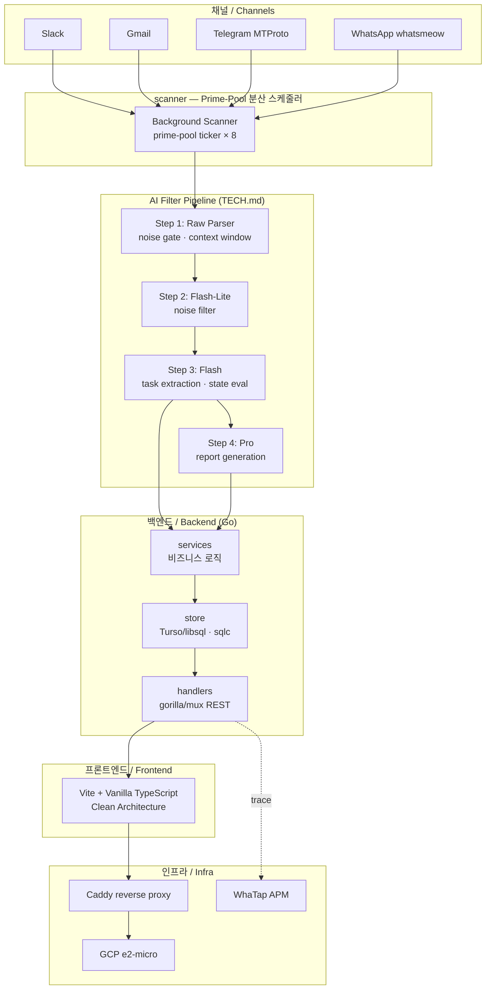

# 00 — Project Overview

> **SSOT**: 이 파일은 코드를 진실로 삼습니다. 레거시 문서와 충돌 시 코드 우선.

---

## 비전 / Vision

**한국어:**
Message Consolidator는 Slack·Gmail·Telegram·WhatsApp 등 흩어진 채널에서 **실행 가능한 작업(Task)** 을 자동 추출·통합하고, 팀이 놓치는 업무를 0에 가깝게 줄이는 것을 목적으로 합니다. 단순 메시지 집약기가 아닌, 4단계 AI 필터 파이프라인으로 소음을 제거하고 가치 있는 신호만 남깁니다.

**English:**
Message Consolidator extracts actionable Tasks from scattered channels (Slack, Gmail, Telegram, WhatsApp) via a 4-stage AI filter pipeline, minimizing missed work items across distributed teams. It is not a message aggregator — it is a noise-eliminating task intelligence layer.

---

## 시스템 다이어그램 / System Diagram

---

## 기술 스택 / Tech Stack

| 레이어 | 기술 | 버전 / 비고 |
|---|---|---|
| **Backend** | Go | 1.25.6, CGO_ENABLED=0 |
| **Router** | gorilla/mux | REST, WhatapMiddleware 적용 |
| **DB** | Turso (libsql) + SQLite | edge-distributed SQLite |
| **ORM/Query** | sqlc v2 | `db/*.sql.go` 자동 생성 — 직접 수정 금지 |
| **AI** | Google Gemini | Flash-Lite(소음 필터) / Flash(태스크 추출) / Pro(리포트) |
| **Messaging** | slack-go, whatsmeow, gotd/td | Slack API / WA Protobuf / Telegram MTProto |
| **Auth** | Google OAuth2 | Gmail 연동·세션 쿠키 |
| **APM** | WhaTap Go SDK | Manual instrumentation only — `whatap-go-inst` 금지 |
| **Frontend** | Vite 6 + Vanilla TypeScript | Clean Architecture, vitest |
| **CSS** | BEM + variables.css | px/hex 하드코딩 금지 |
| **Infra** | Docker + Caddy + GCP e2-micro | FE/BE 컨테이너 분리 |
| **Build** | `make build-all` → UPX -1 압축 | 빌드 단축 시 UPX 제거 금지 |

---

## AI 필터 파이프라인 요약 / Filter Pipeline Summary

**한국어:**
"Parser → Flash-Lite → Flash → Pro"로 이어지는 4단계 필터. 비용(Cost)·지연(Latency)·정확도(Accuracy)를 동시에 최적화하며, Step 1의 noise gate가 마케팅·인사말 등을 선제 차단해 LLM 비용을 최소화합니다.

**English:**
A 4-stage cascade — Raw Parser noise gate → Flash-Lite binary filter → Flash task extraction → Pro report synthesis — balances cost, latency, and accuracy. The early parser stage prevents marketing/greeting noise from reaching any LLM call.

→ 상세: [TECH.md](../../TECH.md)

---

## 챕터 인덱스 / Chapter Index

| # | 파일 | 한 줄 요약 |
|---|---|---|
| 00 | [00-overview.md](00-overview.md) | 비전·시스템 다이어그램·스택 (현재 문서) |
| 01 | [01-getting-started.md](01-getting-started.md) | 환경 설정·빌드·테스트·로컬 실행 |
| 02 | *(예정)* 02-backend-architecture.md | 패키지 구조·데이터 흐름·레이어 규칙 |
| 03 | *(예정)* 03-database.md | sqlc 흐름·마이그레이션·쿼리 패턴 |
| 04 | *(예정)* 04-ai-pipeline.md | 4단계 파이프라인 상세·프롬프트 설계 |
| 05 | *(예정)* 05-channels.md | Slack·Gmail·Telegram·WhatsApp 어댑터 |
| 06 | *(예정)* 06-scanner.md | Prime-Pool 분산 스케줄러·8개 loop |
| 07 | *(예정)* 07-services.md | 비즈니스 로직·게이미피케이션·번역 |
| 08 | *(예정)* 08-handlers.md | REST API·미들웨어·라우팅 |
| 09 | *(예정)* 09-auth.md | Google OAuth·세션 쿠키 흐름 |
| 10 | *(예정)* 10-frontend-architecture.md | Clean Architecture·Vite·TypeScript |
| 11 | *(예정)* 11-frontend-ui-components.md | BEM·variables.css·컴포넌트 카탈로그 |
| 12 | *(예정)* 12-reports.md | Daily Digest·Weekly Report·Notion 연동 |
| 13 | *(예정)* 13-reminders.md | Reminder 스케줄·Slack Block Kit DM |
| 14 | *(예정)* 14-identity-resolution.md | AI Identity Resolver·Alias·DSU 병합 |
| 15 | *(예정)* 15-gamification.md | XP·스트릭·업적 시스템 |
| 16 | *(예정)* 16-whatap-apm.md | WhaTap 수동 계측 패턴·Gotcha |
| 17 | *(예정)* 17-config.md | 환경변수 전체 목록·오버레이 흐름 |
| 18 | *(예정)* 18-infra.md | Docker·Caddy·GCP·systemd 서비스 |
| 19 | *(예정)* 19-testing.md | 테스트 전략·AI regression·vitest |
| 20 | *(예정)* 20-ci-lint.md | golangci-lint·gocyclo 규칙 |
| 21 | *(예정)* 21-migration-guide.md | DB 마이그레이션·Phase C 보류 사항 |
| 22 | *(예정)* 22-ops-runbook.md | 배포·서비스 설치·로그·장애 대응 |
| 99 | [99-glossary.md](99-glossary.md) | 용어 사전 (도메인·기술·패턴·약어) |

---

## 어디서 시작할까? / Where to Start?

| 역할 | 진입점 |
|---|---|
| **신규 개발자** | → [01-getting-started.md](01-getting-started.md) — 환경 설정부터 첫 빌드까지 |
| **백엔드 개발자** | → `02-backend-architecture.md` (예정) · [TECH.md](../../TECH.md) · [main.go](../../main.go) |
| **프론트엔드 개발자** | → `10-frontend-architecture.md` (예정) · [`src/`](../../src/) |
| **AI / 파이프라인** | → [TECH.md](../../TECH.md) · `04-ai-pipeline.md` (예정) · [`ai/`](../../ai/) |
| **운영자** | → `22-ops-runbook.md` (예정) · `make install-service` · `make logs` |
| **용어 모르겠으면** | → [99-glossary.md](99-glossary.md) |

---

## 핵심 설계 원칙 / Core Design Principles

**한국어:**
- **단방향 의존**: Handler → Service → Store. Store에 비즈니스 로직 금지.
- **소수(Prime) 주기**: 백그라운드 스캐너 8개 loop가 각각 소수 초를 무작위 추첨 → 외부 cron과의 harmonic resonance 회피.
- **Graceful Shutdown**: SIGINT/SIGTERM 수신 시 외부 채널 연결 해제 → 메모리 플러시 → HTTP drain → DB 종료 순서 병렬 보장.
- **수동 APM**: `trace.Init()` 없이 모든 WhaTap 호출은 silent no-op. `whatap-go-inst` 자동 주입 금지.

**English:**
- **Unidirectional dependency**: Handler → Service → Store. No business logic in Store.
- **Prime-pool cadence**: 8 background scanner loops each draw a random prime-second interval per tick, structurally avoiding harmonic resonance with external crons.
- **Graceful shutdown**: On SIGINT/SIGTERM — disconnect channels → flush memory → drain HTTP → close DB, run concurrently.
- **Manual APM only**: All WhaTap trace calls are silent no-ops without `trace.Init()`. Auto-instrumentation toolchain is prohibited.

→ 부트스트랩 코드: [main.go:44](../../main.go#L44)
