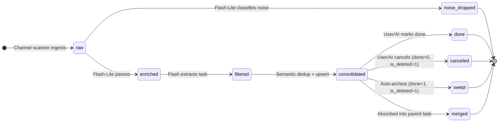
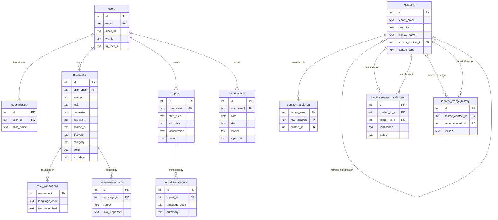
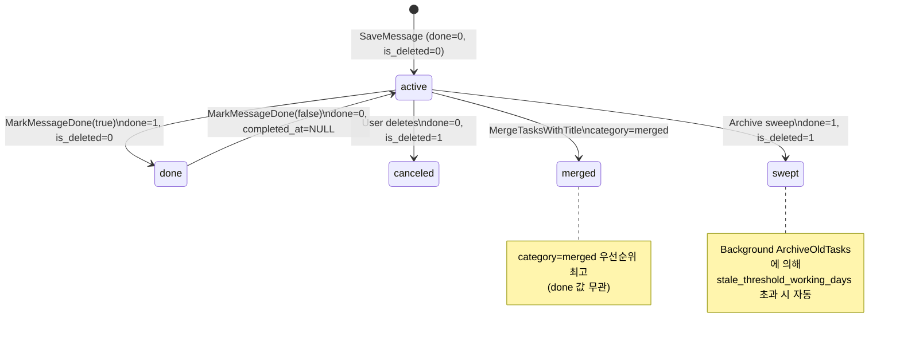
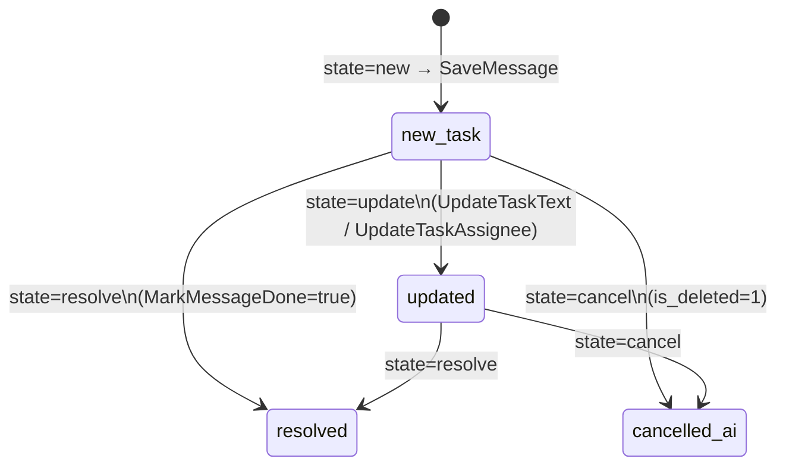
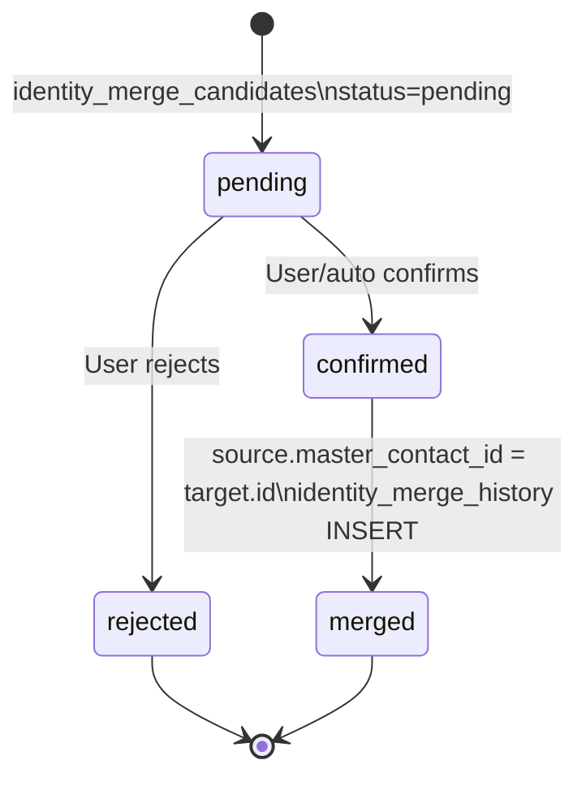

# 02 — Domain Model

> Cross-references: DB 스키마 상세 → [04-data-layer.md](04-data-layer.md) · AI 식별/매핑 알고리즘 → [09-identity-resolution.md](09-identity-resolution.md) · 데이터 영속화 → [04-data-layer.md](04-data-layer.md)

---

## 1. 도메인 핵심 개념 (Conceptual Model)

**한국어:**

Message Consolidator의 핵심 목적은 다채널(Slack, Gmail, WhatsApp, Telegram)에서 유입되는 원시 메시지를 **실행 가능한 작업(Task)**으로 정제하고, 그 결과를 구조화된 보고서로 집계하는 것입니다. 이 라이프사이클은 4단계로 구성됩니다.

1. **Ingest** — 각 채널 스캐너가 `RawMessage`를 수집하고 `source_ts` 기반 중복 판별을 수행합니다.
2. **Enrich & Filter** — Flash-Lite(노이즈 제거) → Flash(태스크 추출/상태 평가) 다단계 LLM 파이프라인을 거칩니다. 결과물인 `TodoItem`은 AI가 부여한 상태(`new`/`update`/`resolve`/`cancel`)를 포함합니다.
3. **Consolidate** — Jaro-Winkler 유사도(임계값 0.85) + `affinity_group_id` 기반 의미론적 중복 제거 후 `ConsolidatedMessage`가 DB에 upsert됩니다. 연락처 식별은 `contact_resolution` 조회 후 `contacts` 테이블의 master/slave 병합 체인으로 canonical ID를 결정합니다.
4. **Report** — Pro 모델이 축적된 ConsolidatedMessage를 분석하여 `reports`와 `report_translations`를 생성합니다.

**English:**

The system's purpose is to refine raw multi-channel messages (Slack, Gmail, WhatsApp, Telegram) into actionable Tasks, then aggregate them into structured Reports. The lifecycle has four phases:

1. **Ingest** — Channel scanners collect `RawMessage`s and perform `source_ts`-based deduplication.
2. **Enrich & Filter** — Flash-Lite (noise gate) → Flash (task extraction/state evaluation) multi-stage LLM pipeline. The resulting `TodoItem` carries an AI-assigned state (`new`/`update`/`resolve`/`cancel`).
3. **Consolidate** — Jaro-Winkler similarity (threshold 0.85) + `affinity_group_id` semantic deduplication, then `ConsolidatedMessage` is upserted to the DB. Contact identity is resolved via `contact_resolution` lookup then the `contacts` master/slave merge chain to determine canonical ID.
4. **Report** — The Pro model analyzes accumulated ConsolidatedMessages to produce `reports` and `report_translations`.



---

## 2. 핵심 엔티티 (Core Entities)

### 2.1 Message (ConsolidatedMessage)

**한국어:**

`messages` 테이블은 시스템의 중심 엔티티입니다. 원시 메시지가 아니라 **AI가 추출·정규화한 작업 단위**를 저장합니다. 단일 행이 여러 채널 원본(source_channels JSON 배열)을 통합할 수 있기 때문에 "consolidated"라는 명칭을 사용합니다. `task` 컬럼에는 AI가 영어로 요약한 작업 제목이 저장되고, `original_text`에는 원문이 보존됩니다.

`is_archived`와 `lifecycle`은 GENERATED ALWAYS AS 가상 컬럼으로, `done`/`is_deleted`/`category` 세 필드의 불리언 조합을 단일 의도 레이블로 변환합니다. 이 설계는 쿼리 측에서 불리언 조합을 매번 재도출하는 오류를 방지합니다.

**English:**

The `messages` table is the system's central entity. It stores **AI-extracted, normalized task units** — not raw messages. The name "consolidated" reflects that one row may aggregate multiple channel origins (via the `source_channels` JSON array). The `task` column holds the AI-generated English summary title; `original_text` preserves the raw content.

`is_archived` and `lifecycle` are GENERATED ALWAYS AS virtual columns that collapse the boolean triplet (`done`/`is_deleted`/`category`) into a single intent label, preventing query-side re-derivation errors.

```go
// store/types.go — application-level view
type ConsolidatedMessage struct {
    ID           MessageID
    Source       string   // "slack" | "gmail" | "whatsapp" | "telegram"
    Task         string   // AI-synthesized English title
    Lifecycle    string   // "active"|"done"|"canceled"|"swept"|"merged"
    SourceChannels []string // JSON array — all contributing channels
    Subtasks       []Subtask
}
```
Source: [`store/types.go`](../../store/types.go#L32)

**식별자:** `MessageID` (phantom type `int64`) — `internal/ids/ids.go#L11`

**주요 필드 의미:**

| 필드 | 의미 |
|---|---|
| `source_ts` | 채널 원본 타임스탬프. `UNIQUE(user_email, source_ts)`로 수집 단계 중복 방지 |
| `thread_id` | 플랫폼 스레드 ID. AI가 대화 맥락 분석 시 부모 작업 식별에 사용 |
| `replied_to_id` | 이 메시지가 답변하는 원본 메시지 ID. Task 완료 자동 판별의 입력값 |
| `constraints` | POLICY 카테고리 메시지에서 추출된 행동 규칙 (JSON 배열) |
| `consolidated_context` | 원문에서 추출한 1-2문장 근거 스니펫 (JSON 배열) |
| `lifecycle` | 가상 컬럼 — `done`/`is_deleted`/`category` 조합의 정규화된 레이블 |

---

### 2.2 Task (TaskTranslation)

**한국어:**

별도의 `tasks` 테이블은 존재하지 않습니다. `messages` 행 자체가 Task 역할을 합니다 (주석: `// MessageID identifies a row in consolidated_messages. Also serves as TaskID since tasks are persisted as consolidated messages.`). `task_translations`는 JIT 번역 캐시입니다 — AI가 추출한 영어 타이틀의 다국어 버전을 페이지 단위로 생성하고 DB에 캐싱하여 재번역 비용을 제거합니다.

**English:**

There is no separate `tasks` table. Each `messages` row *is* a Task (per the comment in [`internal/ids/ids.go#L9`](../../internal/ids/ids.go#L9)). `task_translations` is a JIT translation cache — page-unit multilingual versions of the AI-extracted English title are generated on demand and cached in the DB to eliminate retranslation cost.

```go
// store/types.go — subtask within a task
type Subtask struct {
    Task       string  `json:"task"`
    AssigneeID *UserID `json:"assignee_id"`
    Done       bool    `json:"done"`
}
```
Source: [`store/types.go`](../../store/types.go#L70)

**식별자:** `MessageID` (tasks와 동일 — 별도 TaskID 타입 없음)

---

### 2.3 Contact

**한국어:**

`contacts`는 시스템 외부 발신자(requester/assignee)의 채널별 별칭을 통합합니다. 한 실제 인물이 Slack(`U012ABC`), Gmail(`alice@co.com`), WhatsApp(`+8210...`)으로 각각 등장할 때, 각각의 행이 생성되고 `master_contact_id`로 대표 행을 가리킵니다. `v_contacts_resolved` 뷰가 이 병합 체인을 자동으로 따라 `effective_canonical_id`와 `effective_display_name`을 노출합니다.

`contact_resolution`은 raw 식별자(`나`, `Alice`, `alice@co.com` 등) → `contact_id` 의 캐시 맵입니다. AI가 반환한 이름이 항상 정규 형태가 아니기 때문에, 이 테이블이 없으면 매 메시지마다 fuzzy 매핑을 재수행해야 합니다.

**English:**

`contacts` consolidates per-channel aliases for external senders (requester/assignee). When one real person appears as Slack `U012ABC`, Gmail `alice@co.com`, and WhatsApp `+8210...`, each gets its own row linked to a master via `master_contact_id`. The `v_contacts_resolved` view follows this merge chain automatically, exposing `effective_canonical_id` and `effective_display_name`.

`contact_resolution` is a cache map from raw identifiers (`나`, `Alice`, `alice@co.com`) → `contact_id`. Without this table, fuzzy re-mapping would be required for every message.

**식별자:** `ContactID` (phantom type `int64`) — [`internal/ids/ids.go#L14`](../../internal/ids/ids.go#L14)

**주요 필드:**

| 필드 | 의미 |
|---|---|
| `canonical_id` | 채널 내 고유 식별자 (Slack UserID, 이메일 주소 등) |
| `master_contact_id` | NULL이면 마스터 행. Non-NULL이면 해당 ID가 실질적 대표 |
| `secondary_ids` | 동일 인물의 보조 식별자 목록 (JSON 배열) |
| `contact_type` | `none`\|`internal`\|`partner`\|`customer` — 보고서 집계 분류 기준 |

```go
// store/contacts_store.go — in-memory DSU for O(α) canonical resolution
var GlobalContactDSU = NewContactDSU()
```
Source: [`store/contacts_store.go`](../../store/contacts_store.go#L54)

---

### 2.4 User

**한국어:**

`users`는 시스템 인증 주체입니다. `contacts`와의 차이는 명확합니다: User는 이 시스템에 로그인하고 task를 소유하는 내부 구성원이며, Contact는 메시지를 보내거나 작업을 요청하는 외부 발신자(또는 아직 매핑되지 않은 내부 구성원)입니다.

`user_aliases`는 사용자가 자신을 지칭하는 다양한 이름(`나`, `저`, `Jaejin` 등)을 등록해두는 테이블입니다. AI가 `__CURRENT_USER__` 또는 발신자 이름을 실제 UserID로 정규화할 때 이 테이블을 조회합니다.

**English:**

`users` represents authentication principals. The distinction from `contacts` is clear: a User is an internal member who logs in and owns tasks; a Contact is an external sender (or an unmapped internal member) who appears in messages. `user_aliases` stores self-referential name aliases (`나`, `저`, `Jaejin`) so the AI normalization layer can map `__CURRENT_USER__` or sender names to a real UserID.

**식별자:** `UserID` (phantom type `int64`) — [`internal/ids/ids.go#L20`](../../internal/ids/ids.go#L20)

```go
// store/types.go
type User struct {
    ID        UserID
    Email     string
    SlackID   string
    WaJID     string   // WhatsApp JID
    TgUserID  string   // Telegram numeric ID
    Aliases   []string // from user_aliases
    StaleThresholdWorkingDays int
}
```
Source: [`store/types.go`](../../store/types.go#L87)

---

### 2.5 Identity Merge (IdentityMergeCandidate / IdentityMergeHistory)

**한국어:**

같은 사람이 채널마다 다른 식별자로 나타나는 문제를 해결하기 위한 두 테이블입니다. `identity_merge_candidates`는 AI 또는 휴리스틱이 "두 Contact가 동일인일 수 있음"을 감지했을 때 후보를 등록합니다(`status: pending`). 사용자 또는 자동화 로직이 확인하면 `identity_merge_history`에 병합 이유가 기록되고, 소스 Contact의 `master_contact_id`가 대상 Contact를 가리키도록 업데이트됩니다.

이 2단계 구조(후보 → 이력)를 채택한 이유는 자동 병합의 오탐지를 역추적하고 롤백 근거를 보존하기 위함입니다.

**English:**

These two tables address the cross-channel identity fragmentation problem. `identity_merge_candidates` records candidates when AI or heuristics detect two Contacts may be the same person (`status: pending`). Once confirmed, `identity_merge_history` logs the merge reason and the source Contact's `master_contact_id` is updated to point to the target. The two-step structure (candidate → history) exists to enable post-hoc tracing and rollback justification for false-positive merges.

---

### 2.6 Report

**한국어:**

`reports`는 Pro 모델이 생성하는 일간/주간 분석 보고서의 메타데이터 행입니다. `visualization`은 인적 네트워크와 협업 관계를 표현하는 Node/Edge JSON입니다. `report_translations`는 1:N 관계로 동일 보고서의 다국어 요약을 저장하여 번역 재생성 비용을 제거합니다.

`status` 필드(`processing`/`completed`/`failed`)는 긴 Pro 추론이 진행 중일 때 UI가 로딩 상태를 표시할 수 있도록 합니다.

**English:**

`reports` stores the metadata row for daily/weekly AI-generated reports produced by the Pro model. `visualization` is a Node/Edge JSON representing the human network and collaboration graph. `report_translations` holds 1:N multilingual summaries of the same report to avoid regeneration cost. The `status` field (`processing`/`completed`/`failed`) allows the UI to show loading state while the Pro inference is in progress.

**식별자:** `ReportID` (phantom type `int64`) — [`internal/ids/ids.go#L17`](../../internal/ids/ids.go#L17)

```go
// store/types.go
type Report struct {
    ID            ReportID
    Status        string   // "processing" | "completed" | "failed"
    Visualization string   // Node/Edge JSON
    IsTruncated   bool     // Why: flag when Pro hit token boundary
    Translations  map[string]string
}
```
Source: [`store/types.go`](../../store/types.go#L241)

---

### 2.7 TokenUsage

**한국어:**

`token_usage`는 AI 호출 비용을 (user, date, step, model, source, report_id) 복합 키로 집계합니다. 매 LLM 호출마다 행을 생성하는 대신 **증분 누적(UPSERT)**으로 같은 조합을 하나의 행에 더합니다. 이 설계는 고빈도 스캐너가 분당 수십 회 LLM을 호출할 때 행 폭증 없이 일별 비용 조회를 O(1)로 유지합니다.

**English:**

`token_usage` aggregates AI call costs by the composite key `(user_email, date, step, model, source, report_id)`. Rather than inserting a new row per LLM call, incremental accumulation via UPSERT adds to the same row. This keeps daily cost queries O(1) without row explosion when the high-frequency scanner calls the LLM dozens of times per minute.

---

## 3. ID 시스템 (Phantom Type)

**한국어:**

모든 도메인 엔티티 기본키는 `internal/ids/` 패키지의 Phantom Type으로 정의됩니다. 단순 `int64`를 금지하는 이유는 **컴파일 타임 매개변수 혼동 방지**입니다. 예를 들어 `GetReport(ctx, userID)` 형태의 오탈자는 Go 타입 시스템이 `UserID ≠ ReportID`로 거부합니다. 런타임이 아닌 빌드 단계에서 오류를 잡습니다.

sqlc 생성 코드(`db/*.sql.go`)는 기본 `int64`를 사용하므로, store 레이어에서 변환이 필요합니다: `int64(id)` (DB 방향) 및 `MessageID(lastID)` (애플리케이션 방향). `store/types.go`는 `internal/ids` 타입을 type alias(`=`)로 재노출하여 외부 패키지가 별도 임포트 없이 `store.MessageID`를 사용할 수 있게 합니다.

**English:**

All domain entity primary keys are defined as Phantom Types in the `internal/ids/` package. The rationale for prohibiting plain `int64` is **compile-time parameter confusion prevention**. A typo like `GetReport(ctx, userID)` is rejected by the Go type system because `UserID ≠ ReportID`. Errors are caught at build time, not runtime.

Since sqlc-generated code (`db/*.sql.go`) uses bare `int64`, conversions are needed at the store boundary: `int64(id)` (toward DB) and `MessageID(lastID)` (toward application). `store/types.go` re-exports `internal/ids` types as type aliases (`=`) so external packages can use `store.MessageID` without an extra import.

```go
// internal/ids/ids.go
type MessageID int64  // rows in consolidated_messages (also acts as TaskID)
type ContactID int64  // rows in contacts
type ReportID  int64  // rows in reports
type UserID    int64  // rows in users
```
Source: [`internal/ids/ids.go`](../../internal/ids/ids.go)

```go
// store/types.go — re-export as aliases for consumer convenience
type (
    MessageID = ids.MessageID
    ContactID = ids.ContactID
    ReportID  = ids.ReportID
    UserID    = ids.UserID
)
```
Source: [`store/types.go`](../../store/types.go#L12)

> **주의:** `AiInferenceLog`, `ScanMetadatum`, `SlackThread` 등 일부 보조 엔티티는 Phantom Type ID를 사용하지 않습니다. 이는 이 엔티티들이 다른 도메인 코드에서 ID로 참조되지 않아 혼동 위험이 없기 때문입니다.

---

## 4. 엔티티 관계 (ER Diagram)

**한국어:**

핵심 관계: `messages`는 `users`에 소속(user_email FK)되고, requester/assignee 필드는 `contacts.canonical_id`를 텍스트로 참조합니다(DB 수준 FK 없음 — 아래 불변 섹션 참조). `contacts`는 자기 참조(`master_contact_id`)로 병합 체인을 형성합니다. `reports`는 `users`에 소속되며, `token_usage`도 마찬가지입니다.

**English:**

Core relationships: `messages` belong to `users` (via user_email), and the requester/assignee fields reference `contacts.canonical_id` as text (no DB-level FK — see Invariants section). `contacts` form a merge chain via self-referential `master_contact_id`. Both `reports` and `token_usage` belong to `users`.



**외래키 목록 (주요):**

| 테이블 | 컬럼 | 참조 |
|---|---|---|
| `user_aliases.user_id` | → `users.id` | ON DELETE — (묵시적 제약) |
| `task_translations.message_id` | → `messages.id` | ON DELETE CASCADE |
| `report_translations.report_id` | → `reports.id` | ON DELETE CASCADE |
| `contact_resolution.contact_id` | → `contacts.id` | ON DELETE CASCADE |
| `contacts.master_contact_id` | → `contacts.id` | self-referential |
| `identity_merge_candidates.contact_id_a/b` | → `contacts.id` | |
| `ai_inference_logs.message_id` | → `messages.id` | |

> `messages.requester` / `messages.assignee` → `contacts.canonical_id` 는 **DB FK 없음**. 이유: canonical_id는 채널마다 다른 형식(이메일, Slack ID, 전화번호)이라 정규화 전 텍스트로 저장하고, `v_contacts_resolved` 뷰 JOIN으로 해소합니다. → [04-data-layer.md](04-data-layer.md)

---

## 5. 상태 머신 (State Machines)

### 5.1 Message Lifecycle

**한국어:**

`lifecycle` 가상 컬럼은 `done`/`is_deleted`/`category` 세 필드의 조합을 정규화합니다. 우선순위: `merged > canceled > swept > done > active`. 이 순서는 `category = 'merged'` 체크가 가장 먼저 오는 이유입니다 — 병합된 태스크는 `done`이어도 'merged'로 표시되어야 합니다.

**English:**

The `lifecycle` virtual column normalizes the combination of `done`/`is_deleted`/`category`. Priority order: `merged > canceled > swept > done > active`. This precedence explains why `category = 'merged'` is checked first — a merged task must show as 'merged' even if `done=1`.



### 5.2 Task (AI-Driven State Transitions)

**한국어:**

AI가 반환하는 `TodoItem.state`는 후속 메시지가 기존 태스크에 미치는 영향을 선언합니다. `update`는 제목/담당자를 갱신하고, `resolve`는 `done=1`로, `cancel`은 `is_deleted=1`로 전환합니다.

**English:**

`TodoItem.state` returned by AI declares what effect a subsequent message has on an existing task. `update` refreshes title/assignee, `resolve` sets `done=1`, `cancel` sets `is_deleted=1`.



### 5.3 Contact Merge

**한국어:**

Contact 병합은 단방향 흐름입니다. 후보 등록 → 확인 → 이력 기록 후, 소스 Contact의 `master_contact_id`를 업데이트합니다. 병합 후 `v_contacts_resolved` 뷰가 자동으로 effective ID를 마스터로 위임합니다.

**English:**

Contact merging is a unidirectional flow. After candidate registration → confirmation → history recording, the source Contact's `master_contact_id` is updated. Post-merge, the `v_contacts_resolved` view automatically delegates effective ID resolution to the master.



---

## 6. 불변 (Invariants)

**한국어:**

아래 제약은 코드 또는 DB 수준에서 보장됩니다. 이를 위반하면 데이터 일관성이 깨집니다.

**English:**

The constraints below are enforced at code or DB level. Violating them breaks data consistency.

| # | 불변 | 보장 위치 |
|---|---|---|
| I-1 | `messages.UNIQUE(user_email, source_ts)` — 같은 사용자·타임스탬프 조합은 1행만 존재 | DB UNIQUE 제약 |
| I-2 | `task_translations.PRIMARY KEY(message_id, language_code)` — 메시지당 언어별 번역은 1행 | DB PRIMARY KEY |
| I-3 | `report_translations.UNIQUE(report_id, language_code)` — 보고서당 언어별 요약은 1행 | DB UNIQUE 제약 |
| I-4 | `user_aliases.UNIQUE(user_id, alias_name)` — 동일 사용자에 중복 별칭 불가 | DB UNIQUE 제약 |
| I-5 | `contacts.UNIQUE(tenant_email, canonical_id)` — 테넌트 내 canonical_id는 유일 | DB UNIQUE 제약 |
| I-6 | `identity_merge_candidates.UNIQUE(contact_id_a, contact_id_b)` — 동일 쌍 중복 후보 불가 | DB UNIQUE 제약 |
| I-7 | `token_usage.UNIQUE(user_email, date, step, model, source, report_id)` — 동일 차원 중복 행 불가. 비용 집계는 UPSERT로만 | DB UNIQUE 제약 |
| I-8 | `done=0 ⇔ completed_at IS NULL` — `unmarkMessageDone`이 raw SQL로 함께 초기화. sqlc COALESCE 우회 사유 | `store/message_store.go#L172` |
| I-9 | `is_archived`는 수정 불가 가상 컬럼 — `done`/`is_deleted`/`category`만 변경 가능 | DB GENERATED ALWAYS AS |
| I-10 | `messages.requester` / `messages.assignee`는 `contacts.canonical_id` 텍스트 참조 — DB FK 없음. 정합성은 `AutoUpsertContact` + `contact_resolution` UPSERT 체인이 보장 | `store/contacts_store.go` |
| I-11 | `contacts.master_contact_id`가 Non-NULL이면 마스터 행이 반드시 존재해야 함 (`REFERENCES contacts(id)`) — 순환 참조 방지는 애플리케이션 책임 | DB FK 제약 |

---

## 7. Cross-References

- **DB 스키마 상세 (테이블 DDL, 인덱스, 마이그레이션)** → [04-data-layer.md](04-data-layer.md)
- **AI 식별/매핑 알고리즘 (Flash-Lite 노이즈 게이트, Flash 태스크 추출, Jaro-Winkler 중복 제거)** → [09-identity-resolution.md](09-identity-resolution.md)
- **데이터 영속화 (sqlc 생성 흐름, store 레이어 패턴)** → [04-data-layer.md](04-data-layer.md)
- **백그라운드 스캐너 및 Prime-Pool 분산** → [06-scanner-pipeline.md](06-scanner-pipeline.md)
- **보고서 생성 파이프라인** → [07-report-pipeline.md](07-report-pipeline.md)
- **WhaTap APM 계측 패턴** → [10-observability.md](10-observability.md)
