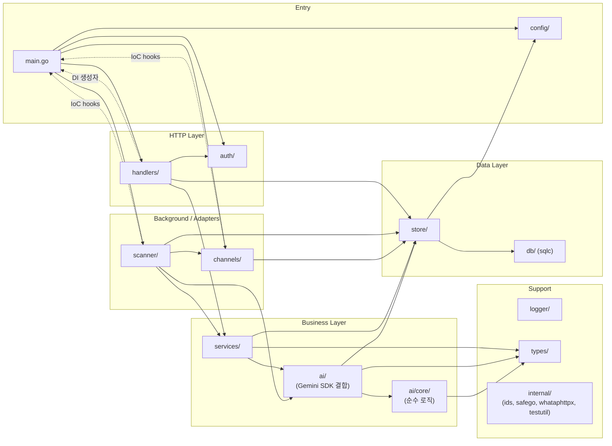
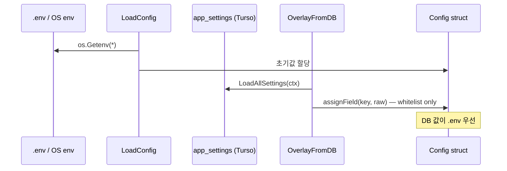
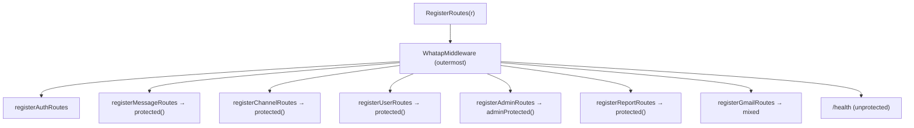
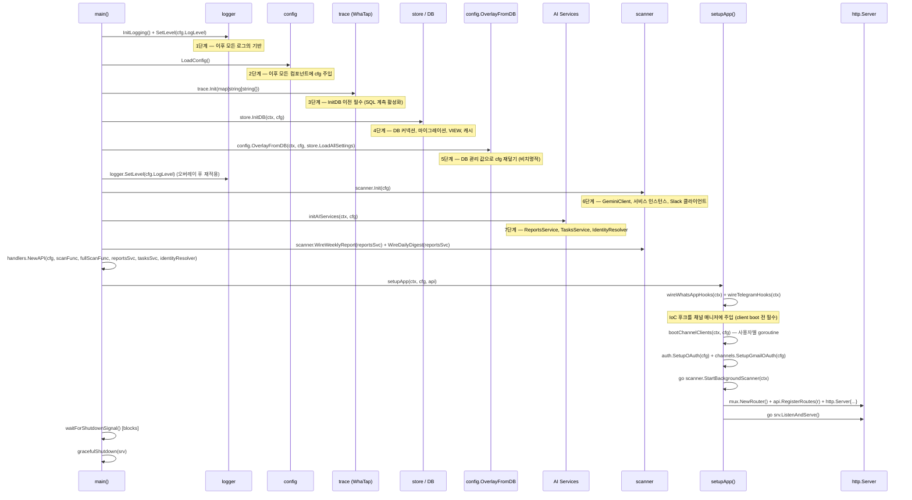
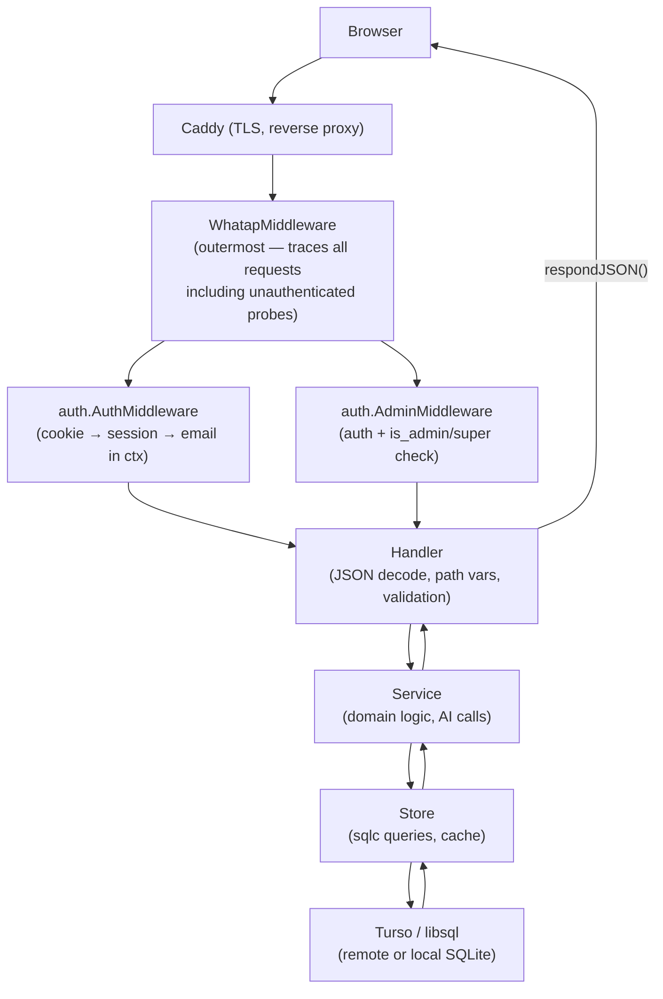

# 03. 백엔드 아키텍처 (Backend Architecture)

> **대상 독자:** 신규 백엔드 기여자, 아키텍처 리뷰어
> **코드 기준:** 2026-04-30 main 브랜치

---

## 1. 레이어 구조 개요

**한국어:**
백엔드는 세 개의 수직 레이어로 나뉩니다. 의존성은 단방향(Handler → Service → Store)으로만 흐르고, 역방향 참조는 컴파일 오류 수준에서 차단됩니다. 각 레이어의 역할은 아래와 같습니다.

| 레이어 | 책임 한 줄 요약 |
|--------|----------------|
| **Handler** | HTTP 직렬화·인증·라우팅 전담. 비즈니스 판단 없음 |
| **Service** | 도메인 규칙·AI 연동·게임화 로직. DB를 직접 호출하지 않음 |
| **Store** | Turso(libsql) 쿼리 전담, 비즈니스 로직 금지 |

지원 패키지(`config`, `channels`, `ai`, `ai/core`, `scanner`, `auth`, `logger`, `internal/*`, `types`)는 레이어를 수평으로 보조합니다. `ai/`는 Gemini SDK 결합 레이어이고, `ai/core/`는 SDK import 없는 순수 로직(프롬프트·파서·분석기·RAG)을 분리한 서브패키지입니다. `channels`와 `scanner`는 고루틴 기반 독립 수명 주기를 가지며, `main.go`가 IoC 후크로 연결합니다.

**English:**
The backend is divided into three vertical layers with a one-way dependency rule (Handler → Service → Store). Circular imports are blocked at compile time. Support packages (`config`, `channels`, `ai`, `ai/core`, `scanner`, `auth`, `logger`, `internal/*`, `types`) assist horizontally without forming a fourth layer. `ai/` is the Gemini SDK coupling layer; `ai/core/` is a sub-package containing pure logic (prompts, parsers, analyzers, RAG) with no SDK import. `channels` and `scanner` each own their own goroutine lifecycle; `main.go` wires them via IoC hooks.



---

## 2. 패키지 카탈로그

### 2.1 `main.go` — 진입점 및 DI 오케스트레이터

**한국어:**
`main.go`는 코드를 작성하는 파일이 아니라 **배선도**입니다. 비즈니스 로직은 없고, 초기화 순서와 생명 주기 제어만 담당합니다. `setupApp`·`wireWhatsAppHooks`·`wireTelegramHooks`·`bootChannelClients`·`gracefulShutdown`·`initAIServices`로 관심사를 분리해 단일 함수 복잡도를 15 이하로 유지합니다.

**English:**
`main.go` is the wiring diagram, not a logic file. It owns initialization order and lifecycle control exclusively. Concerns are split into named helpers to keep cyclomatic complexity ≤ 15 per function.

- **주요 심볼:** `main()`, `setupApp()`, `initAIServices()`, `wireWhatsAppHooks()`, `wireTelegramHooks()`, `bootChannelClients()`, `gracefulShutdown()`
- **진입점:** `go run main.go` / `make` (UPX 압축 바이너리)
- **외부 의존:** `gorilla/mux`, `whatap/go-api/trace`
- **코드 링크:** [`main.go`](../../main.go)

---

### 2.2 `config/` — 설정 로딩 + DB 오버레이

**한국어:**
설정은 두 단계로 적용됩니다. 1단계: `.env`/`.env.local`/환경 변수에서 `Config` 구조체를 빌드합니다(`LoadConfig`). 2단계: DB에 저장된 `app_settings` 값을 덮어씁니다(`OverlayFromDB`). DB 오버레이가 실패해도 `.env` 기본값으로 계속 동작하기 때문에 비-치명적으로 처리합니다.

오버레이 키는 `assignField`의 `switch` 블록으로 화이트리스트를 관리합니다. 리플렉션을 쓰지 않는 이유는 어떤 키가 런타임에 변경 가능한지를 코드 리뷰에서 한눈에 파악하기 위해서입니다.

**English:**
Config is applied in two passes. Pass 1 builds the `Config` struct from `.env`/env vars (`LoadConfig`). Pass 2 merges `app_settings` rows from the DB (`OverlayFromDB`). Overlay failure is non-fatal so a DB outage at boot does not block startup. The explicit `switch` in `assignField` (no reflection) keeps the mutable surface auditable at review time.

- **주요 심볼:** `Config`, `LoadConfig()`, `OverlayFromDB()`, `SettingsLoaderFunc`
- **진입점:** [`config/config.go`](../../config/config.go)
- **오버레이 패턴:** [`config/overlay.go`](../../config/overlay.go)
- **외부 의존:** `joho/godotenv`
- **DB 오버레이 흐름:** `store.LoadAllSettings` → `OverlayFromDB` → `assignField`



→ DB 레이어 상세: [04-data-layer.md](04-data-layer.md)

---

### 2.3 `handlers/` — HTTP 전송 레이어

**한국어:**
`handlers`의 역할은 세 가지로 제한됩니다: (1) JSON 직렬화/역직렬화, (2) 경로 변수 추출 및 입력 검증, (3) Service 계층 위임. 비즈니스 판단은 없습니다. 모든 핸들러는 `API` 구조체의 메서드로 구현돼 전역 상태 없이 테스트 가능합니다.

11개 도메인 그룹으로 라우트가 분리됩니다. 모든 `/api/*` 엔드포인트는 `protected()` 래퍼(→ `auth.AuthMiddleware`)로 감싸지고, `/api/admin/*`는 추가로 `adminProtected()`를 사용합니다.

**English:**
Handlers are limited to three responsibilities: (1) JSON serialization, (2) path/query parameter extraction and validation, (3) delegating to services. No business logic belongs here. All handlers are methods on `API`, enabling dependency injection and isolated unit tests.

- **주요 심볼:** `API`, `NewAPI()`, `RegisterRoutes()`, `WhatapMiddleware`, `respondJSON()`, `handleAPIError()`, `BatchIDsRequest`
- **11 도메인 그룹:** message, channel, user, contact, identity, admin, report, gmail, auth, static, health
- **파일 목록:**
  - [`handlers/handlers.go`](../../handlers/handlers.go) — API 구조체, 공통 유틸
  - [`handlers/routes.go`](../../handlers/routes.go) — 라우트 등록
  - [`handlers/middleware_whatap.go`](../../handlers/middleware_whatap.go) — WhaTap APM 미들웨어
  - `handlers/handlers_*.go` — 도메인별 핸들러 구현
- **외부 의존:** `gorilla/mux`, `whatap/go-api/instrumentation/whatapmux`



---

### 2.4 `services/` — 비즈니스 로직 레이어

**한국어:**
서비스 계층은 도메인 규칙의 단일 진실 공급원입니다. Store에 직접 접근하되, HTTP 컨텍스트를 알지 못합니다. AI 연동(`ai/`), 번역, 게임화(XP/스트릭/업적), 태스크 라우팅, 리포트 생성, 알림 등 13개 이상의 서비스가 있습니다.

**English:**
Services are the single source of truth for domain rules. They call `store/` directly but are HTTP-unaware. All services accept interfaces, return concrete structs, and receive dependencies through constructors.

- **주요 서비스:**
  - `TasksService` — 태스크 생성·완료·머지·번역 (핵심)
  - `ReportsService` — Gemini 기반 주간/일간 리포트 생성
  - `TranslationService` — Gemini 다국어 번역
  - `CompletionService` — 스레드 완료 자동 감지
  - `ReminderService` — Slack DM 기반 미완료 태스크 알림
  - `ConsolidateService` — 채널별 메시지 중복 제거·통합
  - `NotionExportService` — 리포트 Notion 페이지 내보내기
  - `DailyDigestService` / `WeeklyReportService` — 정기 리포트 스케줄링
- **파일 목록 (발췌):**
  - [`services/tasks.go`](../../services/tasks.go)
  - [`services/reports_service.go`](../../services/reports_service.go)
  - [`services/consolidate.go`](../../services/consolidate.go)
  - [`services/task_routing.go`](../../services/task_routing.go)
- **외부 의존:** `ai/` (Gemini), `store/`, `channels/SlackClient`

→ Scanner와의 연계: [06-scanner-pipeline.md](06-scanner-pipeline.md)
→ AI 서비스 상세: [07-ai-filter-pipeline.md](07-ai-filter-pipeline.md)

---

### 2.5 `store/` — 데이터 접근 레이어

**한국어:**
Store는 DB 통신의 단일 창구입니다. sqlc 생성 코드(`db/`)를 래핑하고, 인메모리 캐시, 마이그레이션, 커넥션 풀 설정, keepalive 등을 담당합니다. **비즈니스 로직은 금지입니다.** 복잡한 집계 쿼리는 SQL VIEW로 처리해 Go 코드 복잡도를 낮춥니다.

**English:**
Store is the single gateway to the database. It wraps sqlc-generated code, manages in-memory caches, runs migrations, and tunes the connection pool. Business logic is forbidden here by architectural rule.

- **주요 심볼:** `InitDB()`, `RunInTx()`, `RefreshAllCaches()`, `FlushTokenUsage()`, `FlushAllScanMetadata()`
- **주요 파일:**
  - [`store/db.go`](../../store/db.go) — DB 초기화, 커넥션 풀, keepalive
  - [`store/migrations.go`](../../store/migrations.go) — 마이그레이션 실행
  - [`store/message_store.go`](../../store/message_store.go) — 메시지 CRUD
  - [`store/cache_store.go`](../../store/cache_store.go) — 인메모리 캐시
  - [`store/report_store.go`](../../store/report_store.go) — 리포트 CRUD
- **외부 의존:** `tursodatabase/libsql-client-go`, `whatap/go-api/instrumentation/whatapsql`, `modernc.org/sqlite`

→ 데이터 레이어 상세: [04-data-layer.md](04-data-layer.md)

---

### 2.6 `db/` — sqlc 자동 생성 (수정 금지)

**한국어:**
`db/` 하위의 모든 `*.sql.go` 파일은 `sqlc generate` 명령으로 자동 생성됩니다. **직접 수정은 절대 금지입니다.** 쿼리 변경이 필요하면 `store/queries/*.sql`을 편집한 뒤 `sqlc generate`를 실행해 갱신합니다.

**English:**
All `*.sql.go` files under `db/` are auto-generated by `sqlc generate`. **Direct edits are forbidden.** To change a query: edit `store/queries/*.sql` → run `sqlc generate` → verify the diff.

- **핵심 파일:**
  - [`db/models.go`](../../db/models.go) — 모든 DB 모델 struct
  - [`db/querier.go`](../../db/querier.go) — 쿼리 인터페이스
  - `db/<domain>.sql.go` — 도메인별 쿼리 구현
- **쿼리 원본:** `store/queries/*.sql`
- **생성 명령:** `sqlc generate`

> `sqlc generate` 후 의도치 않게 변경된 파일은 `git checkout <file>`로 원복합니다.

→ 데이터 레이어 상세: [04-data-layer.md](04-data-layer.md)

---

### 2.7 `scanner/` — 백그라운드 메시지 수집 워커

**한국어:**
Scanner는 채널(Slack/WhatsApp/Telegram/Gmail)을 주기적으로 폴링해 원시 메시지를 수집하고, AI 분류 파이프라인에 공급합니다. 각 루프는 `primeLoop`로 구현되어 59-73초 소수(prime) 중 무작위 간격으로 동작합니다. 소수를 사용하는 이유는 업스트림 cron/포워더와 위상이 고정되는 것을 방지해 thundering herd를 분산하기 위해서입니다.

`scanner.Init(cfg)` → `scanner.WireWeeklyReport(svc)` / `scanner.WireDailyDigest(svc)` → `go scanner.StartBackgroundScanner(ctx)` 순서로 초기화됩니다.

**English:**
Scanner polls channels at randomized prime-second intervals (59–73 s) to avoid phase-locking with upstream cron schedulers. Each channel has its own `primeLoop` with an atomic `running` guard that skips overlapping ticks when a previous scan is still in flight.

- **주요 심볼:** `Init()`, `StartBackgroundScanner()`, `Scan()`, `RunAllScans()`, `primeLoop`, `WireWeeklyReport()`, `WireDailyDigest()`
- **주요 파일:**
  - [`scanner/scanner.go`](../../scanner/scanner.go) — 초기화, 채널 디스패치
  - [`scanner/scanner_loop.go`](../../scanner/scanner_loop.go) — primeLoop, 소수 풀
  - `scanner/scanner_slack.go`, `scanner_whatsapp.go`, `scanner_telegram.go` — 채널별 수집
  - [`scanner/enricher.go`](../../scanner/enricher.go) — AI 분류 파이프라인
  - [`scanner/scanner_weekly_report.go`](../../scanner/scanner_weekly_report.go), [`scanner/scanner_digest.go`](../../scanner/scanner_digest.go) — 정기 리포트
- **외부 의존:** `channels/`, `services/`, `ai/`, `store/`, `whatap/trace`

→ Scanner 상세: [06-scanner-pipeline.md](06-scanner-pipeline.md)

---

### 2.8 `ai/` — Gemini SDK 결합 레이어

**한국어:**
`ai/`는 Google Gemini SDK와의 결합 지점입니다. Gemini SDK를 직접 import하는 파일만 이 패키지에 놓이며, 순수 로직(프롬프트·파서·분석기·RAG)은 SDK import 없는 `ai/core/`로 분리됩니다. `GeminiClient`는 분석 모델(`gemini-3-flash-preview`)과 번역 모델(`gemini-3.1-flash-lite`)을 분리해 비용을 최적화합니다.

**English:**
`ai/` is the Gemini SDK coupling layer — only files that directly import the SDK live here. Pure logic (prompts, parsers, analyzers, RAG) is isolated in `ai/core/`, which has no SDK dependency. Two model slots (analysis + translation) let heavier models be assigned only where needed.

- **주요 심볼:** `GeminiClient`, `NewGeminiClient()`, `IdentityResolver`, `GeminiLiteFilter`, `EmbeddingClient`
- **주요 파일:**
  - [`ai/gemini.go`](../../ai/gemini.go) — 클라이언트, 모델 분리
  - [`ai/embedding.go`](../../ai/embedding.go) — 임베딩 클라이언트
  - [`ai/identity_resolver.go`](../../ai/identity_resolver.go) — 발신자 아이덴티티 해석
  - [`ai/filter_service.go`](../../ai/filter_service.go) — 노이즈 게이트 필터
- **외부 의존:** `google.golang.org/genai`, `whataphttpx.ClientWithAPIKey()`

#### `ai/core/` — 순수 로직 서브패키지

**한국어:**
`ai/core/`는 Gemini SDK import 없는 순수 Go 로직만 포함합니다. 프롬프트 렌더링, 응답 파싱, 메시지 분류 분석기, RAG 컨텍스트 조립, 추출 컨텍스트 타입 등이 여기에 있습니다. SDK와 분리되어 있어 단독 단위 테스트가 가능합니다.

**English:**
`ai/core/` contains pure Go logic with no Gemini SDK dependency. This makes it independently unit-testable. All prompt rendering, response parsing, message analyzers, and RAG logic live here.

- **주요 심볼:** `SourceAnalyzer`, `ExtractionContext`, `RAG`, 프롬프트 렌더러
- **주요 파일:**
  - [`ai/core/analyzers.go`](../../ai/core/analyzers.go) — 메시지 분류 분석기
  - [`ai/core/rag.go`](../../ai/core/rag.go) — RAG 컨텍스트 주입
  - [`ai/core/prompts.go`](../../ai/core/prompts.go) + `ai/core/prompts/` — 프롬프트 관리
  - [`ai/core/parser.go`](../../ai/core/parser.go) — 응답 파싱
  - [`ai/core/executor.go`](../../ai/core/executor.go) — 분석 실행기

→ AI 엔진 상세: [07-ai-filter-pipeline.md](07-ai-filter-pipeline.md)

---

### 2.9 `channels/` — 플랫폼 어댑터

**한국어:**
각 채널(`Slack`, `WhatsApp`, `Telegram`, `Gmail`)은 외부 SDK를 감싸는 어댑터입니다. 공통 인터페이스(`channel_adapter.go`)를 구현하며, 플랫폼별 Rate Limit·페이지네이션·세션 관리를 캡슐화합니다.

WhatsApp과 Telegram은 장기 연결(persistent connection)을 유지하며, 생명 주기 이벤트(`OnConnected`, `OnLoggedOut`, `OnSessionUpdated`)는 `main.go`에서 IoC 후크로 주입됩니다.

**English:**
Each channel adapter wraps an external SDK behind a common interface. Platform-specific concerns (rate limiting, pagination, session persistence) are fully encapsulated. WhatsApp and Telegram maintain persistent connections; their lifecycle callbacks are injected by `main.go` as IoC hooks to avoid a direct `channels → store` dependency at boot time.

- **주요 심볼:** `SlackClient`, `DefaultWAManager`, `DefaultTelegramManager`, `NewSlackClient()`, `DisconnectAllWhatsApp()`, `DisconnectAllTelegram()`, `SetupGmailOAuth()`
- **주요 파일:**
  - [`channels/slack.go`](../../channels/slack.go) — Slack API 래퍼
  - [`channels/whatsapp.go`](../../channels/whatsapp.go) — whatsmeow 기반 세션 관리
  - [`channels/telegram.go`](../../channels/telegram.go) — gotd/td MTProto 연동
  - [`channels/gmail.go`](../../channels/gmail.go) — Gmail 스레드 추출, OAuth
- **외부 의존:** `slack-go`, `whatsmeow`, `gotd/td`, `google.golang.org/api/gmail`

→ 채널 어댑터 상세: [05-channels.md](05-channels.md)

---

### 2.10 `auth/` — 인증 및 미들웨어

**한국어:**
Google OAuth 2.0 흐름 전체(`/auth/login` → `/auth/callback` → 세션 쿠키 발급)와 두 개의 HTTP 미들웨어(`AuthMiddleware`, `AdminMiddleware`)를 담당합니다. `GetUserEmail(r)`은 모든 핸들러가 현재 사용자를 꺼내는 단일 진입점입니다.

**English:**
Owns the full Google OAuth 2.0 flow and two HTTP middlewares. `GetUserEmail` is the single extraction point for the authenticated user across all handlers.

- **주요 심볼:** `SetupOAuth()`, `AuthMiddleware`, `AdminMiddleware`, `GetUserEmail()`, `HandleGoogleLogin`, `HandleGoogleCallback`, `HandleLogout`
- **파일:** [`auth/auth.go`](../../auth/auth.go)
- **외부 의존:** `golang.org/x/oauth2/google`, `whataphttp`

→ 인증 상세: [12-auth-and-security.md](12-auth-and-security.md)

---

### 2.11 `logger/` — 구조화 로깅

**한국어:**
`logger/`는 전역 leveled logger(`Debugf/Infof/Warnf/Errorf`)와 lumberjack 기반 로그 로테이터, AI 호출 전용 구조화 로거(`ai_logger.go`)를 제공합니다. `SetLevel`로 런타임 로그 레벨 변경이 가능합니다.

**English:**
Provides a leveled global logger (DEBUG/INFO/WARN/ERROR), lumberjack-backed rotation, and a structured AI call logger for prompt/response tracing. Log level is configurable at runtime via `logger.SetLevel`.

- **주요 심볼:** `InitLogging()`, `StartLogRotator()`, `SetLevel()`, `Debugf/Infof/Warnf/Errorf`
- **파일:** [`logger/logger.go`](../../logger/logger.go), [`logger/ai_logger.go`](../../logger/ai_logger.go)
- **외부 의존:** `gopkg.in/natefinch/lumberjack.v2`

→ 로깅 상세: [15-observability.md](15-observability.md)

---

### 2.12 `internal/` — 프로젝트 내부 유틸리티

**한국어:**
`internal/`은 외부 패키지가 import할 수 없는 프로젝트 전용 유틸을 담습니다. 네 개의 서브패키지로 구성됩니다.

**English:**
`internal/` holds project-private utilities that cannot be imported by external packages (Go `internal` visibility rule enforced by the compiler).

#### `internal/ids` — 팬텀 타입 ID
DB 기본키를 타입 안전하게 다루기 위한 팬텀 타입 정의입니다. `MessageID`, `ReportID`, `ContactID`, `UserID`는 모두 `int64`의 named type으로, 서로 다른 도메인 ID를 혼용하면 컴파일 오류가 발생합니다.

> **Why phantom types?** sqlc 경계에서만 `int64`로 캐스팅하고, 그 외 모든 레이어에서는 타입 불일치를 컴파일 타임에 잡습니다. 단순 `int64` 사용은 프로젝트 규칙 위반입니다.

- [`internal/ids/ids.go`](../../internal/ids/ids.go)

#### `internal/safego` — 고루틴 패닉 격리
`defer safego.Recover("tag")` 패턴으로 고루틴 패닉을 격리합니다. 패닉이 프로세스 전체를 종료하지 않도록 스택 트레이스와 함께 에러 로그를 남깁니다.

- [`internal/safego/safego.go`](../../internal/safego/safego.go)

#### `internal/whataphttpx` — WhaTap HTTP 계측 중앙화
모든 아웃바운드 HTTP 통합이 WhaTap HTTPC step을 보고하도록 RoundTripper를 중앙 관리합니다. 세 가지 팩토리가 있습니다:

- `Client()` — 신규 plain HTTP 클라이언트 (Slack 등)
- `WrapClient(c)` — OAuth2 토큰 인젝션이 된 기존 클라이언트 래핑 (Gmail)
- `ClientWithAPIKey(key)` — API Key 헤더 주입 + WhaTap 계측 (Gemini)

> `WithHTTPClient`를 쓰면 google SDK가 `WithAPIKey`를 무시하므로, Gemini는 반드시 `ClientWithAPIKey`를 사용해야 합니다. (CLAUDE.md SDK auth transport 섹션 참고)

- [`internal/whataphttpx/whataphttpx.go`](../../internal/whataphttpx/whataphttpx.go)

#### `internal/testutil` — 테스트 DB 유틸
인메모리 SQLite DB를 테스트용으로 초기화하는 헬퍼입니다. `store.TestDSN`에 주입해 실제 Turso 없이도 store 계층 테스트를 수행할 수 있습니다.

- [`internal/testutil/db.go`](../../internal/testutil/db.go)

---

### 2.13 `cmd/` — 운영 유틸리티

**한국어:**
`cmd/` 아래에는 프로덕션 서버가 아닌 1회성 운영 도구와 시뮬레이터가 있습니다.

**English:**
`cmd/` contains one-off operational tools and simulators, not the production server binary.

- `cmd/mc-util/` — 마이그레이션/관리 CLI
- `cmd/check-models/` — Gemini 모델 가용성 확인
- `cmd/check-slack-scope/` — Slack Bot Scope 진단
- `cmd/reset-gmail-checkpoint/` — Gmail 체크포인트 초기화
- `cmd/sim_d/`, `cmd/sim_daily/`, `cmd/sim_weekly/`, `cmd/sim_normalize/` — 스캔/리포트 시뮬레이터
- `cmd/verify/` — 통합 검증 스크립트

→ 운영 도구 상세: [16-cli-and-tools.md](16-cli-and-tools.md)

---

### 2.14 `tests/` — 통합/회귀 테스트

**한국어:**
`tests/`에는 단위 테스트로 커버하기 어려운 엔드-투-엔드 흐름(로직 검증, 모바일 레이아웃, 회귀)을 포함합니다. 개별 패키지의 `*_test.go`와 분리해 관리합니다.

**English:**
Contains integration-level and regression tests that require a full stack. Separate from per-package `*_test.go` files to avoid coupling unit test setup with integration fixtures.

- [`tests/logic_verification_test.go`](../../tests/logic_verification_test.go)
- `tests/regression/`

---

### 2.15 `types/` — 패키지 간 공유 타입

**한국어:**
순환 참조를 방지하기 위해 여러 패키지에서 공유해야 하는 도메인 타입을 `types/`에 모읍니다. `RawMessage`(채널에서 수집된 원시 메시지)와 `EnrichedMessage`(AI 분석용 표준화 모델)가 핵심입니다.

**English:**
Holds shared domain types that would cause import cycles if defined in a more specific package. `RawMessage` and `EnrichedMessage` are the two central transfer objects flowing from channels through scanner to AI and services.

- [`types/types.go`](../../types/types.go) — `RawMessage`, `EnrichedMessage`, `MessageCategory`
- [`types/utils.go`](../../types/utils.go) — 타입 변환 유틸

---

## 3. DI 부트스트랩 시퀀스

**한국어:**
`main()`의 초기화는 7단계로 진행됩니다. 각 단계의 순서는 **의존성**에 의해 결정됩니다. 임의로 순서를 바꾸면 silent no-op(WhaTap), nil pointer(AI 서비스), 미반영 오버레이(config) 등의 문제가 발생합니다.

**English:**
`main()` initialization follows a strict 7-phase sequence dictated by dependency order. Reordering phases produces subtle failures (silent traces, nil AI client, unapplied DB config overrides).



### 각 단계의 WHY

| 단계 | 이유 |
|------|------|
| **1. logger 초기화** | 모든 이후 단계의 에러·경고를 로깅할 수 있어야 함. `log.Fatalf`는 logger 없어도 동작하지만, 구조화 로그는 logger 초기화 이후부터 가능 |
| **2. config 로딩** | DB URL, API 키 등 이후 모든 컴포넌트가 `cfg`를 필요로 함 |
| **3. trace.Init** | [`store/db.go:65`](../../store/db.go#L65)의 `whatapsql.OpenContext`가 trace 비활성화 상태에서는 SQL step을 기록하지 않음. trace.Init이 `store.InitDB`보다 앞서야 SQL 계측이 활성화됨 |
| **4. store.InitDB** | 마이그레이션·VIEW 재구성·캐시 초기화까지 포함. AI 서비스보다 앞서야 서비스가 DB를 안전하게 쿼리 가능 |
| **5. OverlayFromDB** | `.env`로 로드한 cfg를 DB 관리 값으로 재덮음. scanner.Init보다 앞서야 Gemini API 키 등 오버레이된 값이 적용됨. 실패해도 기본값으로 계속 동작(비치명적) |
| **6. scanner.Init** | cfg(GeminiAPIKey 등)를 받아 내부 서비스를 초기화. OverlayFromDB 이후이므로 DB 오버레이된 키가 반영됨 |
| **7. initAIServices** | scanner와 독립적인 Reports/Tasks AI 서비스 인스턴스 생성. API 핸들러에 주입 |
| **IoC 훅 (setupApp 내)** | `wireWhatsAppHooks/wireTelegramHooks`는 `bootChannelClients` 이전에 실행. 채널 매니저가 OnConnected를 실행하기 전에 스토어 콜백이 등록되어야 WAJID/TgID가 DB에 기록됨 |
| **bootChannelClients** | 사용자별 고루틴을 띄움. ctx가 아닌 `context.Background()`로 실행하는 이유는 boot ctx 종료 후에도 채널 생명 주기가 독립적으로 지속되어야 하기 때문 |

---

## 4. HTTP 요청 플로우

**한국어:**
브라우저 요청은 Caddy 리버스 프록시를 거쳐 백엔드로 도달합니다. `WhatapMiddleware` → 인증 미들웨어 → 핸들러 → 서비스 → 스토어 순서로 처리됩니다.

**English:**
Browser requests pass through Caddy (TLS termination, optional static file serving) before reaching the Go backend. The middleware stack is outermost-first: WhaTap tracing → auth guard → handler → service → store.



### 미들웨어 책임

**`WhatapMiddleware`** ([`handlers/middleware_whatap.go`](../../handlers/middleware_whatap.go))
- `whatapmux.Middleware()`를 위임. 모든 요청을 WhaTap 트랜잭션으로 등록
- 가장 바깥에 배치하는 이유: 인증 실패 요청과 미인증 프로브도 APM에 포착되어야 함

**`auth.AuthMiddleware`** ([`auth/auth.go`](../../auth/auth.go))
- 세션 쿠키 검증 → `context`에 `userEmail` 주입
- `AUTH_DISABLED=true`이면 `DEFAULT_USER_EMAIL` 환경 변수를 정적 폴백으로 반환 (로컬 개발용)

**`auth.AdminMiddleware`**
- `AuthMiddleware` 포함 + `is_admin` 또는 super 권한 확인
- `/api/admin/*` 라우트 전용

### Handler vs Service 책임 분리

| Handler 책임 | Service 책임 |
|-------------|-------------|
| `json.Decode` / `respondJSON` | 도메인 규칙 판단 |
| 경로 변수 추출 (`mux.Vars`) | AI 분석 호출 |
| 입력 유효성 검사 (`Validate()`) | 게임화 로직 (XP, 스트릭) |
| 사용자 이메일 추출 (`auth.GetUserEmail`) | Store 호출·조율 |
| HTTP 상태 코드 결정 | 에러 변환·래핑 |

---

## 5. Graceful Shutdown

**한국어:**
`SIGINT` 또는 `SIGTERM` 수신 시 `waitForShutdownSignal()`이 해제되고, `cancel()`로 root context가 취소됩니다. `gracefulShutdown(srv)`은 4단계로 안전하게 종료합니다: (1) WhatsApp/Telegram 연결 종료, (2) 인메모리 데이터 플러시, (3) HTTP drain(30초), (4) DB close. Step 1–2는 병렬 실행됩니다. `defer trace.Shutdown()`은 main() 반환 시 자동 실행됩니다.

**English:**
On `SIGINT`/`SIGTERM`, the root context is cancelled and `gracefulShutdown` runs four ordered steps. Steps 1–2 run concurrently; step 3 waits for in-flight HTTP requests (30 s timeout); step 4 closes the DB connection last. `defer trace.Shutdown()` fires automatically on `main()` return.

**자세한 시퀀스 다이어그램 및 단계별 WHY → [10-locking-and-concurrency.md](10-locking-and-concurrency.md#5-graceful-shutdown)**

**Detailed sequence diagram and per-step WHY → [10-locking-and-concurrency.md](10-locking-and-concurrency.md#5-graceful-shutdown)**

---

## 6. Go 컨벤션 (Project-specific)

**한국어:**
다음 규칙은 CLAUDE.md Go Constraints를 흡수한 것입니다. 코드 리뷰와 lint CI에서 강제됩니다.

**English:**
The following conventions are absorbed from CLAUDE.md Go Constraints and enforced by `golangci-lint` CI.

### 6.1 복잡도 제한

- `gocyclo`/`gocognit` ≤ 15. 함수가 60줄을 초과하면 분리를 검토합니다(단, 의미 없는 분리는 금지).
- 중첩 ≤ 3. 중첩이 깊어지면 Guard Clause(early return)으로 평탄화합니다.
- `if-else` 체인 대신 `switch`/early return을 사용합니다.

예시 — `gracefulShutdown`에서 WG로 Step 1+2를 분리해 단일 함수 복잡도를 낮춘 패턴: [`main.go:142-179`](../../main.go#L142)

### 6.2 Context 첫 파라미터

모든 I/O 함수의 첫 파라미터는 `ctx context.Context`입니다. `context.TODO()`는 머지 전 제거해야 합니다. 예외는 `nolint:contextcheck` 주석으로 이유를 명시합니다.

### 6.3 Phantom Type ID

`int64` 직접 사용 금지. `internal/ids` 패키지의 `MessageID`, `ReportID`, `ContactID`, `UserID`를 사용합니다. sqlc 경계(`db/*.sql.go`)에서만 `int64`로 캐스팅합니다.

```go
// store 레이어에서의 올바른 사용
func GetMessage(ctx context.Context, id store.MessageID) (*types.Task, error) { ... }
```

### 6.4 에러 래핑

에러는 `fmt.Errorf("context: %w", err)`로 래핑하고 `errors.Is`/`errors.As`로 검사합니다. 런타임 `panic` 사용은 금지입니다.

### 6.5 Accept interfaces, return structs

인터페이스는 **사용처(consumer)**에서 정의합니다(메서드 ≤ 3). 생성자는 concrete struct를 반환합니다. 이 규칙 덕분에 store와 service의 mock이 테스트 파일에 인라인으로 정의될 수 있습니다.

### 6.6 고루틴 ctx 가드

모든 고루틴은 `ctx` 취소 또는 `done` 채널 가드가 필수입니다. `safego.Recover`로 패닉을 격리합니다. 공유 상태는 mutex 또는 채널 중 하나로만 보호합니다.

```go
// scanner/scanner_loop.go 패턴
select {
case <-ctx.Done():
    return
case <-ticker.C:
    l.tick(ctx, wg)
}
```

### 6.7 `any`/`interface{}` 사용 제한

`any` 사용 시 사유 주석이 필수입니다. 예시: [`handlers/handlers.go:68`](../../handlers/handlers.go#L68)의 `respondJSON` — "payload는 호출자별 임의 DTO 구조체 — 제네릭 marshaller 시그니처".

### 6.8 약어 케이스 일관성

`userID`, `httpClient`, `dbConn`과 같이 약어는 모두 대문자 또는 모두 소문자로 일관합니다. `userId`, `HttpClient`는 사용하지 않습니다.

### 6.9 lint CI

`golangci-lint`는 `.github/workflows/lint.yml`에서 CI로 실행됩니다. 로컬에서는 `make lint` 또는 `golangci-lint run ./...`으로 확인합니다.

---

## 7. Cross-References

이 챕터와 연계된 다른 문서의 진입점입니다.

| 주제 | 링크 |
|------|------|
| ai/ 패키지 분리 델타 | `ai/` (Gemini SDK 결합: GeminiClient·EmbeddingClient·LiteFilter) + `ai/core/` (순수 로직: SourceAnalyzer·ExtractionContext·RAG·프롬프트 렌더링, SDK import 없음) |
| 데이터 레이어 (DB 스키마, sqlc 워크플로, 마이그레이션, 캐시) | [04-data-layer.md](04-data-layer.md) |
| 채널 어댑터 (Slack, WhatsApp, Telegram, Gmail) | [05-channels.md](05-channels.md) |
| Scanner 상세 (primeLoop, 스캔 파이프라인, 주간/일간 리포트) | [06-scanner-pipeline.md](06-scanner-pipeline.md) |
| AI 엔진 (Gemini 클라이언트, RAG, 필터, 프롬프트) | [07-ai-filter-pipeline.md](07-ai-filter-pipeline.md) |
| 인증 (Google OAuth 2.0 플로우, 세션 쿠키) | [12-auth-and-security.md](12-auth-and-security.md) |
| 로깅·APM (WhaTap 계측, 로그 레벨, AI 로거) | [15-observability.md](15-observability.md) |
| 운영 도구 (cmd/, 마이그레이션 CLI, 시뮬레이터) | [16-cli-and-tools.md](16-cli-and-tools.md) |
| 도메인 모델 (Task, Report, User, Message) | [02-domain-model.md](02-domain-model.md) |
