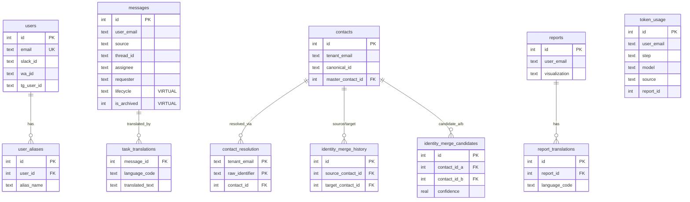
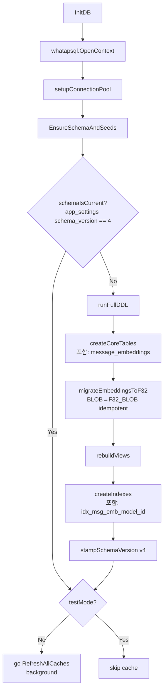

# 04 — Data Layer

**한국어:** 이 챕터는 `db/` 자동생성 레이어, `store/` 비즈니스 레이어, DB 백엔드 선택 이유, sqlc 워크플로, 스키마 카탈로그, 코드 기반 마이그레이션, 트랜잭션·캐시 패턴을 다룹니다. 도메인 의미는 → [02-domain-model.md](02-domain-model.md), WhaTap SQL trace는 → [15-observability.md](15-observability.md), 종료 시 flush는 → [10-locking-and-concurrency.md](10-locking-and-concurrency.md)을 참고하세요.

**English:** This chapter covers the `db/` auto-generated layer, the `store/` business layer, why Turso was chosen, the sqlc workflow, schema catalogue, code-based migrations, and transaction/cache patterns. For domain meaning see → [02-domain-model.md](02-domain-model.md); for WhaTap SQL trace → [15-observability.md](15-observability.md); for shutdown flush → [10-locking-and-concurrency.md](10-locking-and-concurrency.md).

---

## 1. 레이어 분리: `db/` vs `store/`

### 1.1 두 디렉터리의 역할

**한국어:**

| 디렉터리 | 생성 주체 | 역할 | 직접 수정 |
|---|---|---|---|
| `db/*.sql.go` | sqlc 자동생성 | 타입-세이프 SQL 바인딩, 모델 struct | **금지** |
| `db/querier.go` | sqlc 자동생성 | `Querier` 인터페이스 선언 | **금지** |
| `store/*.go` | 수동 작성 | 비즈니스 로직, 트랜잭션, 캐시, 마이그레이션 | 자유 |

`db/` 는 sqlc가 `store/queries/*.sql` 을 읽어 내뿜는 산출물입니다. CLAUDE.md 룰: **`db/*.sql.go` 는 직접 수정 금지 — `store/queries/*.sql` 편집 → `sqlc generate` → 갱신** 흐름을 반드시 지켜야 합니다.

`store/` 는 `db/` 를 호출하는 유일한 레이어입니다. Handler나 Service가 `db/` 패키지를 직접 import하는 것은 아키텍처 위반입니다. 의존성 방향: `handler → service → store → db`.

**English:**

`db/` is the read-only artefact produced by sqlc. `store/` owns all business logic, caching, and migration state. The architectural invariant is that no layer above `store/` imports `db/` directly.

### 1.2 데이터 흐름 요약

```
store/queries/*.sql
        ↓  sqlc generate
db/*.sql.go  (자동생성 — 수정 금지)
        ↑  db.New(q).QueryName(ctx, params)
store/*.go   (비즈니스 로직, 캐시, TX 관리)
        ↑  호출
services/*.go / handlers/*.go
```

**한국어:** `sqlc generate` 실행 후, 의도치 않게 변경된 `db/` 파일은 반드시 `git checkout db/<file>` 로 원복합니다. 스키마와 무관한 파일이 수정되면 sqlc 설정 오류 또는 경로 충돌을 의심하세요.

**English:** After `sqlc generate`, any unintentionally modified `db/` file must be reverted via `git checkout db/<file>`. Spurious changes signal a sqlc config error or path collision.

---

## 2. DB 백엔드: Turso / libsql / SQLite

### 2.1 WHY Turso

**한국어:** Turso는 libsql 기반의 서버리스 분산 SQLite SaaS입니다. 선택 이유:

1. **엣지 레이턴시**: e2-micro(us-central1)에서 Turso us-east-1 replicas까지 RTT ~900–1800ms 수준. 인메모리 캐시로 대부분의 읽기를 흡수하므로 허용 범위.
2. **SQLite 호환**: sqlc가 `engine: sqlite` 로 쿼리를 검증. 로컬 dev·테스트에 동일 SQL을 그대로 사용 가능 — dual-backend 관리 불필요.
3. **운영 오버헤드 제거**: GCP e2-micro에서 PostgreSQL/MySQL을 직접 운영할 수 없는 비용·메모리 제약 하에 관리형 DB를 선택.
4. **libsql 드라이버**: `github.com/tursodatabase/libsql-client-go/libsql` — HTTP/2 기반 스트림. pool conn 재사용이 아닌 요청별 fresh stream 방식.

**English:** Turso provides managed SQLite with edge replication. The key trade-off accepted is ~1s cross-region RTT absorbed by the in-memory cache layer.

### 2.2 드라이버 등록 및 DSN 분기 (`store/db.go`)

**한국어:** `store/db.go` 의 `GetDBDriverAndDSN` 함수가 환경에 따라 드라이버를 선택합니다.

```go
// store/db.go — GetDBDriverAndDSN 분기 요약
if TestDSN != ""       → driver="sqlite",  DSN=TestDSN          // 테스트
if dbURL starts "libsql://" → driver="libsql", DSN+=authToken  // 프로덕션 Turso
else                   → driver="sqlite",  DSN="file:local.db"  // 로컬 dev
```

`init()` side-effect import 두 개가 드라이버를 등록합니다:
- `_ "github.com/tursodatabase/libsql-client-go/libsql"` — Turso HTTP 스트림
- `_ "modernc.org/sqlite"` — 로컬 파일·인메모리 테스트용 순수 Go SQLite

**English:** Two blank imports register drivers via `init()`. The correct driver is selected at `InitDB` time, not at compile time, so both coexist in the binary.

### 2.3 whatapsql 래핑 → APM Trace 자동화

**한국어:** 모든 SQL은 `whatapsql.OpenContext(ctx, driverName, dsn)` 로 연결합니다. 이 래퍼는 `sql.DB` 의 `Exec/Query/QueryRow` 호출마다 WhaTap SQL 트레이스 스텝을 자동으로 생성합니다. sqlc가 생성한 코드는 `DBTX` 인터페이스만 의존하므로, 래퍼를 교체해도 `db/` 패키지 수정이 불필요합니다. → cross-ref [15-observability.md](15-observability.md)

**English:** `whatapsql.OpenContext` wraps the underlying driver transparently. All sqlc-generated queries gain automatic APM traces without any changes to generated code. → [15-observability.md](15-observability.md)

### 2.4 연결 풀 설정

**한국어:** `setupConnectionPool` 에서 환경별로 다음 전략을 적용합니다.

| 환경 | MaxOpen | MaxIdle | 이유 |
|---|---|---|---|
| 프로덕션 Turso (`libsql://`) | 25 (cfg 기본) | **0** | hranaV2 `ResetSession`이 매 borrow마다 stream 닫음 → idle pool 무의미; maxIdle=0으로 요청마다 fresh stream — robust by design |
| 로컬 파일 (`file:`) | 100 | cfg 기본 | WAL 모드에서 다중 읽기 병행 허용 |
| 테스트 (in-memory) | 1 | 1 | modernc.org/sqlite는 `cache=shared` 미지원 — 마지막 커넥션 닫히면 DB 파괴됨 |

**English:** The `maxIdle=0` rule for libsql is critical: a "warm pool" only reuses TCP/TLS, not the HTTP stream, because `ResetSession` calls `closeStream` on every borrow. Keeping idle connections risks `stream is closed: bad connection` on the next use.

### 2.5 SQLite Pragma 설정 (파일 DSN 한정)

**한국어:** `applySQLitePragmas` 는 `file:` DSN 에만 적용됩니다.

```sql
PRAGMA busy_timeout = 10000;  -- 대기 재시도, libsql에는 미적용
PRAGMA journal_mode = WAL;    -- 읽기/쓰기 병행
PRAGMA synchronous = NORMAL;  -- 성능·안전성 균형
```

Turso(`libsql://`) 에는 PRAGMA 적용 불가 — 서버 측 설정 주도.

**English:** `applySQLitePragmas` applies only to `file:` DSN connections. Turso (`libsql://`) does not accept `PRAGMA` commands — server-side configuration governs those settings instead.

### 2.6 Keep-alive: `SELECT 1` 패턴

**한국어:** `startKeepAlive` 는 `libsql://` DSN 에서만 백그라운드 goroutine으로 기동됩니다. 핵심 결정: `db.PingContext` 대신 `db.QueryRowContext("SELECT 1")` 를 사용합니다.

이유: `PingContext` 는 Turso libsql 드라이버에서 실제 스트림 warm 상태를 보장하지 않습니다. `SELECT 1` 은 실제 쿼리 라운드트립을 발생시켜 커넥티비티 손실을 WhaTap trace + 로그에 노출합니다. 각 tick은 `/Background-DBKeepAlive` 트랜잭션으로 감쌉니다 — WhaTap의 `urlutil.NewURL` 이 `/` 없는 이름을 Host로 파싱하여 Transaction 컬럼이 빈 칸이 되는 버그를 회피.

**English:** `SELECT 1` instead of `PingContext` because the libsql driver's `PingContext` does not guarantee a warm stream. The `/` prefix on the transaction name is required by WhaTap's URL parser. → [15-observability.md](15-observability.md)

### 2.7 SQLite 폴백 — 로컬 dev·테스트

**한국어:** `TURSO_URL` 환경 변수가 없으면 `file:local.db` 로 폴백합니다. 테스트는 `store.TestDSN` 에 `file:memdb_<nano>?mode=memory&cache=shared` 를 주입하여 `ResetForTest()` 호출마다 완전히 새 DB를 생성합니다.

**English:** Without `TURSO_URL`, the binary falls back to `file:local.db` for local development. Tests inject a unique in-memory DSN via `store.TestDSN` so that each `ResetForTest()` call creates a fresh, isolated database instance.

---

## 3. sqlc 워크플로

### 3.1 `sqlc.yaml` 설정 분석

**한국어:**

```yaml
version: "2"
sql:
  - schema: "store/queries/schema.sql"   # DDL 기준 파일
    queries: "store/queries/"            # *.sql 파일 디렉터리 전체
    engine: "sqlite"
    gen:
      go:
        package: "db"
        out: "db"
        emit_json_tags: true       # JSON 마샬링 지원
        emit_prepared_queries: false  # Turso HTTP 스트림은 prepared statement 불필요
        emit_interface: true       # Querier 인터페이스 자동 생성
```

`emit_prepared_queries: false` 이유: Turso libsql HTTP 프로토콜에서 prepared statement는 추가 RTT를 발생시키며, 현재 드라이버 구현에서 이점이 없습니다.

`emit_interface: true` 이유: `db.Querier` 인터페이스가 생성되어 `store/` 에서 mock 테스트 가능.

**English:** The `sqlite` engine is used even for Turso because libsql is SQLite-compatible. This lets sqlc perform static analysis on local SQLite semantics while the binary connects to Turso at runtime.

### 3.2 새 쿼리 추가 절차

**한국어:**

1. `store/queries/<domain>.sql` 에 `-- name: QueryName :one/:many/:exec/:execrows` 주석과 함께 쿼리 작성
2. `sqlc generate` 실행 (`make` 포함 또는 직접)
3. `db/<domain>.sql.go` 갱신 확인 — 의도치 않은 변경 파일은 `git checkout db/<file>` 원복
4. `store/<domain>_store.go` 에서 `db.New(q).QueryName(ctx, params)` 호출

```bash
sqlc generate   # db/*.sql.go 재생성
go build        # 컴파일 검증 (whatap-go-inst 금지 — manual only)
go test ./...   # 단위 테스트 통과 확인
```

**English:** The `-- name:` annotation drives code generation. The return mode (`:one`, `:many`, `:exec`, `:execrows`) determines the generated method signature.

### 3.3 동적 쿼리 한계 — raw SQL 허용 케이스

**한국어:** sqlc는 정적 분석 불가 케이스를 지원하지 않습니다. 다음 경우에만 raw SQL을 허용합니다:

- **동적 IN절**: 슬라이스 길이가 런타임에 결정 — `sqlc.slice()` 로 해결 가능한 케이스는 sqlc 사용
- **NULL 세트 쿼리**: `UPDATE ... SET col = NULL` — sqlc의 `COALESCE(?, col)` 패턴이 NULL 설정 불가. 예: `unmarkMessageDone` 에서 raw `UPDATE messages SET done = 0, completed_at = NULL`
- **임시 PRAGMA / DDL**: `PRAGMA table_info(...)` 는 sqlc 파서 범위 밖

**English:** `sqlc.slice()` resolves most dynamic IN-clause cases. Raw SQL is justified only when the static query planner cannot express the intent — the canonical example being `SET col = NULL` in update statements.

### 3.4 쿼리 파일 인벤토리 (13개 파일)

**한국어:** `store/queries/` 하위 13개 파일 (schema.sql 제외) 의 단일 책임:

| 파일 | 책임 요약 |
|---|---|
| `messages.sql` | 메시지 CRUD, 캐시 초기화 쿼리, 아카이브 검색, 병합·라이프사이클 조작 |
| `contacts.sql` | 연락처 upsert, contact_resolution 유지, 머지 히스토리 기록 |
| `users.sql` | 사용자 조회·upsert·권한 설정, user_aliases join |
| `aliases.sql` | tenant_aliases + user_aliases CRUD — 이름 정규화 데이터 |
| `reports.sql` | 보고서 생성·조회·삭제, 번역 레코드 관리 |
| `stats.sql` | 대시보드 통계 집계 (완료 수, 소스 분포, gamification 지표) |
| `tokens.sql` | token_usage upsert·집계, Gmail OAuth 토큰 저장 |
| `slack_threads.sql` | Slack 스레드 상태 추적 (active/resolved) |
| `ai_inference_logs.sql` | AI 추론 원본 텍스트·응답 감사 로그 삽입 |
| `scan.sql` | scan_metadata 상태 관리, 처리된 메시지 중복 방지 |
| `app_settings.sql` | 키-값 앱 설정 upsert·조회·삭제 |
| `telegram.sql` | Telegram 세션 BLOB·자격증명 upsert/삭제 |
| `translations.sql` | 태스크 번역 캐시 upsert, 배치 조회 |

**English:** Each file maps to a single domain responsibility. The `messages.sql` file is the largest, covering CRUD, lifecycle mutation, archive search, and merge operations. Files with no runtime dependency on each other (e.g. `stats.sql` and `telegram.sql`) can be edited independently without risk of query-name collision.

---

## 4. 스키마 카탈로그

**한국어:** `store/queries/schema.sql` 에 정의된 19개 엔티티 (테이블 17개 + VIEW 2개) 를 카테고리별로 기술합니다. 인덱스는 sqlc가 파싱하지 않으므로 `store/migrations.go` 의 `createIndexes()` 에서 별도 정의합니다.

**English:** 19 entities total: 17 tables + 2 views. Indexes are defined separately in `createIndexes()` because sqlc strips `CREATE INDEX` from the schema file.

### 4.1 ER 다이어그램 (핵심 관계)



### 4.2 사용자/식별 엔티티

**한국어:**

#### `users`
- **책임**: 플랫폼 사용자(테넌트) 레코드. 이메일이 시스템 전반의 기본 식별자.
- **주요 컬럼**: `email UNIQUE`, `slack_id`, `wa_jid`, `tg_user_id`, `is_admin`
- **외래키**: 없음 (루트 엔티티)
- **인덱스**: `email` UNIQUE 제약이 자연 인덱스 역할

#### `user_aliases`
- **책임**: 시스템 사용자 계정에 연결된 대체 이름(표시 이름, 별칭) 목록. 메시지 필터링에서 "나" 판단에 사용.
- **주요 컬럼**: `user_id FK → users(id)`, `alias_name`
- **인덱스**: `idx_user_aliases_user_id ON user_aliases(user_id)` — user_id 기반 조회 최적화

#### `contacts`
- **책임**: 테넌트별 외부 연락처 정규화 레코드. 동일인이 플랫폼마다 다른 ID를 갖는 문제를 `canonical_id` 로 통일.
- **주요 컬럼**: `tenant_email`, `canonical_id`, `display_name`, `master_contact_id` (셀프 FK — 병합 대상), `contact_type`, `secondary_ids JSON`
- **외래키**: `master_contact_id → contacts(id)` (병합된 연락처가 가리키는 마스터)
- **인덱스**: `idx_contacts_canonical`, `idx_contacts_tenant_canonical`, `idx_contacts_tenant_display_name(LOWER(display_name))`

#### `contact_resolution`
- **책임**: raw identifier(이름, ID 문자열) → `contacts.id` 빠른 룩업 테이블. 메시지의 requester/assignee 문자열을 정규 연락처로 변환할 때 매번 LIKE 탐색 대신 이 테이블을 참조.
- **주요 컬럼**: `(tenant_email, raw_identifier) PK`, `contact_id FK`
- **외래키**: `contact_id → contacts(id) ON DELETE CASCADE`

#### `identity_merge_history`
- **책임**: 두 연락처를 병합한 이력 감사 로그. 언제 왜 병합했는지 추적.
- **주요 컬럼**: `source_contact_id FK`, `target_contact_id FK`, `reason`, `merged_at`

#### `identity_merge_candidates`
- **책임**: AI 또는 규칙 기반으로 동일인일 가능성이 있는 연락처 쌍 후보 큐. `status=pending` 상태로 적재, 관리자 승인 후 병합.
- **주요 컬럼**: `contact_id_a FK`, `contact_id_b FK`, `confidence REAL`, `status DEFAULT 'pending'`
- **제약**: `UNIQUE(contact_id_a, contact_id_b)` — 중복 후보 방지

#### `tenant_aliases`
- **책임**: 테넌트별 이름 정규화 규칙. 메시지에서 추출된 `original_name` 을 `primary_name` 으로 교체. `contacts` 와 독립적으로 빠른 문자열 치환에 특화.
- **주요 컬럼**: `user_email`, `original_name`, `primary_name`
- **제약**: `UNIQUE(user_email, original_name)` — 테넌트별 중복 규칙 방지

**English:** `users` is the root entity — no foreign key dependencies. `user_aliases` enables "self" detection during message filtering. `contacts` normalises cross-platform identities via `canonical_id`; `contact_resolution` provides an O(1) lookup table to avoid repeated `LIKE` scans. `identity_merge_history` and `identity_merge_candidates` support the deduplication pipeline. `tenant_aliases` handles fast string substitution independently from the contact graph.

### 4.3 메시지/태스크 엔티티

**한국어:**

#### `messages` ★ 핵심 테이블
- **책임**: 모든 채널(Slack, WhatsApp, Gmail, Telegram)에서 추출된 태스크 레코드 단일 저장소.
- **주요 컬럼**:

| 컬럼 | 타입 | 설명 |
|---|---|---|
| `user_email` | TEXT | 테넌트 식별자 |
| `source` | TEXT | 채널 식별자 (slack/whatsapp/gmail/telegram) |
| `thread_id` | TEXT | 채널별 스레드 묶음 키 |
| `assignee` / `requester` | TEXT | raw 식별자 (v_messages에서 정규화됨) |
| `lifecycle` | TEXT VIRTUAL | active/done/canceled/swept/merged — 5개 상태 |
| `is_archived` | INT VIRTUAL | done=1 OR is_deleted=1 OR category='merged' → 1 |
| `constraints` | TEXT JSON | AI 추출 제약 조건 배열 |
| `metadata` | TEXT JSON | 소스별 추가 메타데이터 |
| `subtasks` | TEXT JSON | 하위 태스크 배열 |

- **UNIQUE**: `(user_email, source_ts)` — 채널 타임스탬프 기반 중복 방지
- **인덱스**: `idx_messages_dashboard_filter(user_email, is_deleted, done, category, assignee)`, `idx_messages_archive_filter(user_email, is_archived, done, is_deleted)` — 주요 대시보드 쿼리 커버

**English:** The two VIRTUAL computed columns `lifecycle` and `is_archived` collapse multiple boolean states into a single label, eliminating repeated `CASE` expressions in every query and making filter indexes composable. `task_translations` is a translation cache keyed by `(message_id, language_code)` to avoid redundant AI API calls; `language_deprecated` is kept for backwards compatibility only. `slack_threads` acts as a per-thread polling cursor: `last_reply_ts` prevents re-fetching replies already seen, and the `status` index keeps the active-threads query fast.

#### `task_translations`
- **책임**: 메시지 태스크 텍스트의 언어별 번역 캐시. AI 번역 API 재호출 비용 절감.
- **주요 컬럼**: `(message_id, language_code) PK`, `translated_text`
- **외래키**: `message_id → messages(id) ON DELETE CASCADE`
- **비고**: `language_deprecated` 컬럼 — 과거 언어 코드 호환성 유지용. 현재 사용 안 함.

#### `slack_threads`
- **책임**: Slack 스레드의 폴링 상태 추적. 마지막 reply 타임스탬프를 기억해 중복 스캔 방지, 스레드 resolved 처리 지원.
- **주요 컬럼**: `(channel_id, thread_ts, user_email) PK`, `last_reply_ts`, `last_activity_ts`, `status DEFAULT 'active'`
- **인덱스**: `idx_slack_threads_status(status)` — active 스레드 폴링 쿼리 최적화

### 4.4 보고서/번역 엔티티

**한국어:**

#### `reports`
- **책임**: 사용자별 주간/기간 활동 보고서 메타데이터 저장. `visualization` 컬럼에 JSON 직렬화된 시각화 데이터 전체를 보관.
- **주요 컬럼**: `user_email`, `start_date`, `end_date`, `visualization TEXT`, `status DEFAULT 'completed'`, `is_truncated`
- **TTL**: `DeleteOldReports` 쿼리로 30일 경과 레코드 자동 삭제

#### `report_translations`
- **책임**: 보고서 요약 텍스트의 언어별 번역 저장. 보고서 본문(`visualization`)과 분리하여 번역만 갱신 가능.
- **주요 컬럼**: `(report_id, language_code) UNIQUE`, `summary TEXT`
- **외래키**: `report_id → reports(id) ON DELETE CASCADE`
- **비고**: `language_deprecated` — task_translations 와 동일한 호환성 컬럼

**English:** `reports` stores serialised visualisation JSON alongside metadata; the 30-day TTL is enforced by `DeleteOldReports`. `report_translations` separates translated summaries from the visualisation blob so that re-translation does not require rewriting the entire report row. Both tables cascade-delete on parent removal.

### 4.5 운영/메타 엔티티

**한국어:**

#### `scan_metadata`
- **책임**: 채널별 마지막 스캔 타임스탬프 기록. 스캐너가 재시작 후에도 이미 처리한 구간을 건너뛸 수 있게 하는 체크포인트. `source='processed_msg'` 레코드는 메시지 중복 처리 방지용으로도 사용.
- **주요 컬럼**: `(user_email, source, target_id) UNIQUE`, `last_ts`

#### `gmail_tokens`
- **책임**: 사용자별 Gmail OAuth 리프레시 토큰 안전 저장. DB 저장으로 서버 재시작 후에도 재인증 불필요.
- **주요 컬럼**: `user_email PK`, `token_json TEXT`, `updated_at`

#### `telegram_sessions`
- **책임**: Telegram MTProto 세션 BLOB 저장 (gotd/td). 세션 데이터가 유지되어야 Telegram 로그인 플로 없이 재접속 가능.
- **주요 컬럼**: `email PK`, `session_data BLOB`, `updated_at`

#### `telegram_credentials`
- **책임**: Telegram API 앱 자격증명 (`app_id`, `app_hash`). 사용자별로 다를 수 있어 별도 테이블로 분리.
- **주요 컬럼**: `email PK`, `app_id INT`, `app_hash TEXT`

#### `app_settings`
- **책임**: 시스템 전반 키-값 설정 저장소. 코드 재배포 없이 런타임 동작 변경 가능 (예: auto-archive 일수, 기능 플래그).
- **주요 컬럼**: `key TEXT PK`, `value TEXT`, `updated_by TEXT`, `updated_at`

#### `token_usage`
- **책임**: AI API 호출 비용 추적. (user, date, step, model, source, report_id) 6-dimensional 집계 키로 세분화된 비용 분석 제공.
- **주요 컬럼**: `(user_email, date, step, model, source, report_id) UNIQUE`, `prompt_tokens`, `completion_tokens`, `call_count`, `filtered_count`
- **마이그레이션 이력**: 원래 단순 (user, date) 집계였다가 `step/model/source` 추가 (`migrateTokenUsageBreakdown`), 이후 `report_id` 추가 (`migrateTokenUsageReportID`) — SQLite UNIQUE 수정 불가로 두 번 table rebuild 수행

#### `ai_inference_logs`
- **책임**: AI 추론 감사 로그. 원본 텍스트와 raw AI 응답을 보존하여 재현 및 디버깅 가능.
- **주요 컬럼**: `message_id FK`, `source`, `original_text`, `raw_response`, `created_at`
- **외래키**: `message_id → messages(id)` (nullable — message 생성 전 로깅 허용)

#### `message_embeddings` ★ (schema v2 추가)
- **책임**: 아카이브 메시지의 벡터 임베딩 저장. 의미 검색(hybrid archive search)에 사용.
- **주요 컬럼**:

| 컬럼 | 타입 | 설명 |
|---|---|---|
| `message_id` | INT PK | `messages(id)` 참조 |
| `model` | TEXT | 임베딩 모델명 (예: `gemini-embedding-001`) |
| `dim` | INT | 벡터 차원 수 (현재 768) |
| `vec` | F32_BLOB(768) | little-endian float32 벡터 (schema v4 이후) |
| `text_hash` | TEXT | 텍스트 변경 감지용 해시 — 동일 텍스트 재임베딩 방지 |

- **인덱스**: `idx_msg_emb_model_id ON message_embeddings(model, message_id)` — `SemanticTopK`의 WHERE+ORDER BY 커버링
- **마이그레이션**: schema v2에서 BLOB로 최초 생성 → v4에서 `migrateEmbeddingsToF32`로 F32_BLOB(768) 재구성

**English:** `scan_metadata` is the scanner's restart checkpoint — `source='processed_msg'` rows double as a deduplication guard. `gmail_tokens` persists OAuth refresh tokens so that server restarts do not trigger re-authorisation. `telegram_sessions` and `telegram_credentials` are keyed by email so multi-user deployments each carry their own MTProto state. `app_settings` is a runtime feature-flag store updated without redeployment. `token_usage` tracks AI cost at a 6-dimensional grain; `ai_inference_logs` retains raw request/response pairs for reproducibility. `message_embeddings` holds the 768-d float32 vectors used by the hybrid archive search — stored as `F32_BLOB(768)` so libsql can run `vector_distance_cos` server-side without transferring raw blobs over the network.

### 4.6 VIEW 엔티티

**한국어:**

#### `v_contacts_resolved`
- **책임**: `contacts` 의 병합 관계를 풀어 effective 식별자·표시명·연락처 타입을 단일 행으로 제공. 병합된 연락처(`master_contact_id IS NOT NULL`) 는 마스터의 값으로 덮어씌워진 결과를 반환.
- **핵심 JOIN**: `contacts c LEFT JOIN contacts m ON c.master_contact_id = m.id`
- **노출 컬럼**: `effective_canonical_id`, `effective_display_name`, `contact_type`, `is_merged`

**English:** `v_contacts_resolved` flattens the merge graph into a single row per contact, replacing merged records' attributes with their master's values. Consumers always read `effective_canonical_id` and `effective_display_name` rather than the raw columns, so contact merges are transparent to query callers.

#### `v_messages`
- **책임**: `messages` 에 연락처 정규화를 인라인으로 적용한 읽기 전용 뷰. requester/assignee의 raw identifier를 `v_contacts_resolved` 를 통해 `effective_display_name` 으로 변환.
- **핵심 JOIN**: `messages m LEFT JOIN v_contacts_resolved cr_req ON m.requester = cr_req.original_canonical_id LEFT JOIN v_contacts_resolved cr_asg ON m.assignee = ...`
- **추가 컬럼**: `requester_canonical`, `assignee_canonical`, `requester_type`, `assignee_type`
- **중요**: 뷰는 `rebuildViews()` 에서 `DROP IF EXISTS → CREATE` 패턴으로 스키마 변경 후 항상 재구성

**English:** `v_messages` is rebuilt on every `EnsureSchemaAndSeeds` call (via `rebuildViews`) to keep it current with any schema changes. Store-layer cache loads (`RefreshCacheActive`/`RefreshCacheArchive`) query `messages` directly — not `v_messages` — to skip the view JOIN overhead; contact resolution is then performed in-process in Go via `BuildContactResolver`. The view is used for single-row lookups (`GetMessageByID`) and report queries where contact resolution accuracy matters more than throughput.

---

## 5. 마이그레이션 (코드 기반)

### 5.1 WHY `.sql` 파일이 아닌 `migrations.go`

**한국어:** 외부 마이그레이션 툴(goose, migrate 등)이나 `.sql` 파일 대신 Go 코드로 마이그레이션을 관리하는 이유:

1. **동적 분기**: `tableHasColumn` 으로 현재 스키마 상태를 쿼리한 뒤 조건부 실행. 단순 SQL 파일은 이 분기를 표현할 수 없음.
2. **멱등성 보장**: 각 함수가 자신의 전제조건을 검사하고 이미 적용됐으면 skip. 버전 테이블 불필요.
3. **SQLite 제약 우회**: SQLite는 ALTER TABLE로 UNIQUE 제약 변경 불가. Go에서 `CREATE TABLE ... NEW → INSERT → DROP → RENAME` 시퀀스를 트랜잭션 내에서 명시적으로 제어.
4. **백필 로직**: `migrateContactResolution` 처럼 기존 데이터를 읽어 파생 테이블을 채우는 작업은 SQL 파일로는 표현이 복잡.

**English:** The code-based approach handles SQLite's inability to `ALTER TABLE ... ADD CONSTRAINT` and enables conditional, data-aware migrations that static SQL files cannot express cleanly.

### 5.2 초기화 흐름



**한국어:** `schemaIsCurrent` 가 `true` 이면 전체 DDL을 건너뜁니다 — 이미 v4인 프로덕션 DB는 재시작마다 마이그레이션을 재실행하지 않습니다. DDL이 필요한 경우 `runFullDDL` 이 단일 트랜잭션(`BeginTx(ctx, LevelDefault)`) 내에서 실행됩니다. `LevelDefault` 사용 이유: WAL 모드 SQLite에서 `Serializable` 격리 수준은 DDL 실행 시 `SQLITE_BUSY` 를 발생시킵니다.

**English:** The entire `EnsureSchemaAndSeeds` flow runs inside a single transaction. `LevelDefault` (read-committed equivalent) is chosen deliberately — `Serializable` isolation triggers `SQLITE_BUSY` on DDL statements in WAL mode SQLite.

### 5.3 `createCoreTables()` 패턴

**한국어:** `createCoreTables` 는 `db.New(q)` 로 sqlc 쿼리 객체를 만들고, 19개 테이블을 순서대로 호출합니다. 각 DDL은 `CREATE TABLE IF NOT EXISTS` 이므로 멱등합니다. 순서가 중요합니다 — 외래키 참조 대상 테이블이 먼저 생성되어야 합니다 (예: `contacts` 전에 `identity_merge_history` 불가).

**English:** Table creation order in `createCoreTables` respects foreign key dependencies. SQLite enforces FK constraints at DML time (not DDL), but maintaining declaration order documents intent.

### 5.4 `runFullDDL()` 함수 체인

**한국어:** `schemaIsCurrent` 가 `false` 일 때 실행되는 `runFullDDL` 의 단계:

| 단계 | 함수 | 목적 |
|---|---|---|
| 1 | `createCoreTables` | 21개 테이블 `CREATE TABLE IF NOT EXISTS` (message_embeddings 포함) + FTS5 트리거 |
| 2 | `migrateEmbeddingsToF32` | `message_embeddings.vec` BLOB → F32_BLOB(768) 원자적 재구성 (멱등, §5.8 참고) |
| 3 | `rebuildViews` | `v_contacts_resolved`, `v_messages` DROP+CREATE |
| 4 | `createIndexes` | 전체 인덱스 `CREATE INDEX IF NOT EXISTS` (idx_msg_emb_model_id 포함) |
| 5 | `stampSchemaVersion` | `app_settings["schema_version"] = "4"` — 다음 재시작 시 DDL 건너뜀 |

**한국어:** 과거 프로덕션 DB에서 개별 idempotent 마이그레이션 함수(`migrateTokenUsageBreakdown` 등)로 처리하던 스키마 변경은 schema v4로 전환하면서 `createCoreTables` 의 `IF NOT EXISTS` DDL로 흡수됐습니다. `runFullDDL` 은 전체 DDL을 한 번에 재실행하며, `schemaVersion` 상수(현재 4)가 게이팅합니다.

**English:** The former `runMigrations` chain (per-function idempotency guards) was replaced by schema-version gating. `runFullDDL` re-runs all DDL atomically when `schemaVersion` advances, relying on `IF NOT EXISTS` clauses and `migrateEmbeddingsToF32`'s DDL probe for idempotency.

### 5.5 SQLite UNIQUE 재구성 패턴

**한국어:** SQLite는 기존 UNIQUE 제약 변경 불가 — `ALTER TABLE ADD CONSTRAINT` 지원 안 됨. `migrateTokenUsageBreakdown` / `migrateTokenUsageReportID` 가 사용하는 4-단계 패턴:

```sql
CREATE TABLE token_usage_new (..., UNIQUE(new_composite_key));
INSERT INTO token_usage_new SELECT ... FROM token_usage;
DROP TABLE token_usage;
ALTER TABLE token_usage_new RENAME TO token_usage;
```

이 시퀀스 중 실패 시 트랜잭션 롤백으로 원본 보존. 단계별 오류는 `logger.Errorf` 로 기록 후 함수 종료 (panic 금지).

**English:** The 4-step `CREATE NEW → INSERT → DROP → RENAME` sequence is the only portable way to change a SQLite UNIQUE constraint. A failure at any step rolls back the transaction, leaving the original table intact. Errors are logged but do not panic — a partially-migrated DB is safer than a crashed server.

### 5.6 FTS5 Virtual Table — `messages_fts`

**한국어:** `migrateMessagesFTS` 는 `messages` 테이블에 full-text search를 추가합니다.

```sql
CREATE VIRTUAL TABLE messages_fts USING fts5(
    task, original_text, requester, assignee,
    content='messages', content_rowid='id',
    tokenize='trigram case_sensitive 0'
);
```

`trigram` 토크나이저 선택 이유: `LIKE '%keyword%'` 전체 스캔 없이 부분 문자열 매칭 가능. INSERT/DELETE/UPDATE 트리거 3개가 `messages` 변경 시 `messages_fts` 를 자동 동기화합니다.

**English:** The `trigram` tokeniser enables substring search without a leading wildcard table scan. Three triggers (`after_insert`, `after_delete`, `after_update`) keep `messages_fts` in sync with `messages` automatically. `case_sensitive 0` normalises casing so searches are case-insensitive by default.

### 5.7 Phase C 완료 (2026-05-02)

**한국어:** 이전 "Phase C 보류"에서 예고했던 개별 마이그레이션 함수(`migrateTokenUsageBreakdown`, `migrateTokenUsageReportID`, `migrateOriginalTextOrder`, `migrateContactResolution`) 제거가 완료됐습니다. `schemaVersion` 게이팅 메커니즘으로 전환하면서 프로덕션 DB 동등성 확인 후 해당 함수들을 `migrations.go` 에서 제거했습니다. 이제 `createCoreTables` 의 `IF NOT EXISTS` DDL이 동일한 역할을 흡수합니다.

**English:** The per-function migration chain (`migrateTokenUsageBreakdown` etc.) has been removed. Schema correctness is now guaranteed by the `schemaVersion` constant: when the version advances, `runFullDDL` re-runs all DDL atomically. Fresh deployments and upgrades both follow the same path.

### 5.8 Vector & FTS Indices (Hybrid Archive Search)

**한국어:** Hybrid Archive Search는 두 종류의 인덱스를 조합합니다.

#### F32_BLOB(768) — libsql 벡터 컬럼

`message_embeddings.vec` 는 schema v4 기준 `F32_BLOB(768)` 타입입니다. libsql 고유 타입으로 sqlc가 `interface{}` 로 매핑하며, 드라이버는 실제로 `[]byte` 를 반환합니다.

```go
// store/embeddings_store.go — GetEmbedding
vecBytes, ok := row.Vec.([]byte)
// Why: F32_BLOB(768) is a libsql extension type that sqlc maps to interface{};
// assert back to []byte which is what the driver actually delivers.
```

v3→v4 마이그레이션(`migrateEmbeddingsToF32`): 기존 little-endian float32 BLOB 바이트를 그대로 복사하므로 데이터 손실 없음.

#### `vector_distance_cos` — 서버사이드 코사인 거리

`SemanticTopK`는 코사인 유사도 계산을 libsql에 위임하여 WAN 전송량을 대폭 줄입니다.

```sql
-- store/embeddings_store.go — SemanticTopK
SELECT m.id, vector_distance_cos(e.vec, vector32(?1)) AS dist
FROM message_embeddings e
JOIN messages m ON m.id = e.message_id
WHERE e.model = ?2 AND m.user_email = ?3 AND m.lifecycle != 'active'
ORDER BY dist
LIMIT ?4
```

| 방식 | WAN 전송 (top-100, 768d) | 연산 위치 |
|---|---|---|
| 이전 (BLOB 스트리밍) | ~1.1 MB (전체 vec BLOB) | Go 클라이언트 |
| 현재 (vector_distance_cos) | ~1.6 KB ((id, dist) 페어만) | libsql 서버 |

`vector32(?1)` 바인딩: 쿼리 벡터를 JSON `[f32, f32, ...]` 형식으로 전달. `vectorToJSON(vec []float32) string` 헬퍼가 인코딩.

#### `idx_msg_emb_model_id` 인덱스

```sql
CREATE INDEX IF NOT EXISTS idx_msg_emb_model_id ON message_embeddings(model, message_id)
```

`SemanticTopK` 의 `WHERE model = ?` + `ORDER BY message_id`(내부 정렬)를 커버링 인덱스로 처리합니다. 이 인덱스 없이는 전체 `message_embeddings` 스캔 후 정렬이 발생합니다.

#### FTS5 (`messages_fts`) — BM25 전문 검색

```sql
-- store/embeddings_store.go — ArchiveFTSTopIDs
SELECT rowid FROM messages_fts WHERE messages_fts MATCH ?
```

`ArchiveFTSTopIDs` 는 BM25 순위로 아카이브 메시지 ID를 반환합니다. `messages_fts` 는 `trigram` 토크나이저로 부분 문자열 매칭을 지원합니다 (→ §5.6).

#### Hybrid Search 흐름 요약

FTS와 cosine topK의 결합은 `services/embedding_service.go` 의 `SearchHybrid` 에서 수행됩니다 (→ [08-services-business-logic.md](08-services-business-logic.md)). 데이터 레이어는 `SemanticTopK`와 `ArchiveFTSTopIDs` 두 함수만 노출하며, 퓨전(RRF) 로직은 서비스 계층 책임입니다.

**English:** The data layer exposes two primitives — `SemanticTopK` (cosine via `vector_distance_cos`) and `ArchiveFTSTopIDs` (BM25 via FTS5) — and delegates rank fusion to the service layer. The `F32_BLOB(768)` column type and `vector_distance_cos` are libsql extensions; the same SQL would not run on standard SQLite, which must be noted in any portability analysis. For the hybrid ranker implementation (RRF k=60, candidate caps) see → [08-services-business-logic.md](08-services-business-logic.md).

---

## 6. 트랜잭션 & 캐시

### 6.1 트랜잭션 패턴

**한국어:** `store/` 는 두 가지 트랜잭션 헬퍼를 제공합니다.

**`RunInTx`** — 독립 트랜잭션이 필요한 호출처:
```go
// store/db.go
func RunInTx(ctx context.Context, fn func(tx *sql.Tx) error) error {
    tx, _ := conn.BeginTx(ctx, &sql.TxOptions{Isolation: sql.LevelDefault})
    if err := fn(tx); err != nil { _ = tx.Rollback(); return err }
    return tx.Commit()
}
```

**`withTx`** — 트랜잭션 전파 패턴 (caller가 tx를 전달하면 재사용, nil이면 신규 시작):
```go
// store/message_store.go
func withTx(ctx context.Context, q Querier, fn func(q Querier) error) error {
    if q == nil { return RunInTx(ctx, func(tx *sql.Tx) error { return fn(tx) }) }
    return fn(q)
}
```

**English:** `withTx` enables the store layer to participate in a caller-supplied transaction. This is how `MergeTasksWithTitle` coordinates multi-statement updates — it opens its own `sql.Tx`, passes it down, and commits once all steps succeed.

**한국어:** `Querier` 인터페이스 (`store/db.go`) 는 `sql.DB` 와 `sql.Tx` 양쪽을 허용합니다. 메서드 7개를 노출하는 이유: `database/sql` 표준 라이브러리가 `DB` 와 `Tx` 의 공통 supertype을 제공하지 않아 sqlc 호출 위임에 필요한 7개를 모두 선언해야 합니다.

**English:** The `Querier` interface in `store/db.go` accepts both `*sql.DB` and `*sql.Tx`. Because `database/sql` provides no shared supertype, all seven methods required for sqlc delegation must be declared explicitly in the interface.

### 6.2 메모리 캐시 아키텍처

**한국어:** `store/cache_store.go` 에서 전역 뮤텍스로 보호되는 캐시 맵들:

| 변수 | 보호 뮤텍스 | 내용 |
|---|---|---|
| `messageCache[email]` | `cacheMu` (RWMutex) | 활성 태스크 목록 (lifecycle='active') |
| `archiveCache[email]` | `cacheMu` | 아카이브 태스크 목록 |
| `knownTS[email]` | `cacheMu` | 처리된 source_ts 집합 (중복 방지) |
| `userCache[email]` | `metadataMu` | User 프로필 |
| `allUsersCache` | `metadataMu` | 전체 사용자 목록 (TTL 캐시) |
| `scanCache[key]` | `metadataMu` | 스캔 체크포인트 타임스탬프 |
| `tokenCache[email]` | `metadataMu` | OAuth 토큰 (refresh용) |

**English:** Three separate mutexes (`metadataMu`, `archiveMu`, `cacheMu`) avoid contention between unrelated operations. The `scanCache` is flushed to DB on shutdown to avoid re-scanning already-processed timestamps. → [10-locking-and-concurrency.md](10-locking-and-concurrency.md)

### 6.3 Single-Flight 캐시 스탬피드 방지

**한국어:** `ensureCache` 는 `golang.org/x/sync/singleflight` 를 사용합니다. 동일 사용자에 대한 동시 요청이 몰려도 DB 조회는 한 번만 실행되고 나머지는 결과를 공유합니다.

```go
// cache_store.go — singleflight 패턴
_, err, _ := sfGroup.Do(sfKey, func() (any, error) {
    return nil, refresh()
})
```

`any` 사용 이유: `singleflight.Group.Do` 의 콜백 시그니처가 `(any, error)` — 반환값 미사용, error 전파만 필요.

**English:** `ensureCache` uses `singleflight.Group.Do` to collapse concurrent cache-miss requests for the same user into a single DB round-trip. The `any` return type is mandated by the `singleflight` API; only the error is propagated to callers.

### 6.4 캐시 무효화 정책

**한국어:** 두 가지 무효화 함수로 범위를 제한합니다:

- `InvalidateCacheActive(email)` — 활성 메시지 캐시만 삭제. 아카이브 캐시 미영향. 사용처: `SaveMessage`, `UpdateTaskText`, `AppendOriginalText` 등 활성 메시지 변경
- `InvalidateCache(email)` — 활성 + 아카이브 캐시 모두 삭제. 사용처: `MarkMessageDone` (lifecycle 변경, is_archived flip), `MergeTasksWithTitle` (category='merged' 설정)

**English:** The distinction exists because `is_archived` is a virtual column derived from `done`, `is_deleted`, and `category`. Any write that changes those values must flush both caches. Writes that only update `task` text or `subtasks` can safely invalidate only the active cache.

### 6.5 Auto-Archive 쓰레기 수거

**한국어:** `ArchiveOldTasks` 는 6시간마다 한 번 실행되어 완료 후 N일 경과한 태스크를 `is_deleted=1` 로 처리합니다. `lastArchiveTime` 으로 throttle — 동시 호출 보호는 `archiveMu` 로.

**English:** `ArchiveOldTasks` runs at most once every six hours, controlled by `lastArchiveTime`. Concurrent callers are serialised through `archiveMu`; the time-guard prevents redundant DB writes when multiple scanner goroutines trigger the cleanup path in the same window.

---

## 7. Deltas from legacy docs

**한국어:** 이전 문서 대비 변경 사항:

| 항목 | 이전 문서 | 현재 코드 상태 |
|---|---|---|
| **마이그레이션 방식** | `.sql` 파일 (`store/migrations/` 경로 존재) | `cleanup_legacy_aliases.sql`, `definitions.sql`, `migrations.sql` 삭제 완료. `migrations.go` 로 완전 전환 |
| **초기화 흐름** | `runMigrations` 체인 (per-function 멱등성) | `schemaVersion` 게이팅 + `runFullDDL` 단일 패스 (schema v4) |
| **Phase C 보류** | 마이그레이션 함수 제거 보류 | 완료 — `migrateTokenUsageBreakdown` 등 제거됨 (2026-05-02) |
| **`message_embeddings` 테이블** | 없음 | schema v2 추가, v4에서 `F32_BLOB(768)` 으로 재구성 |
| **`vector_distance_cos`** | 없음 | libsql 서버사이드 코사인 계산 — WAN 전송 ~700× 감소 |
| **`idx_msg_emb_model_id`** | 없음 | `createIndexes` 에 추가 — SemanticTopK 커버링 |
| **Keep-alive 구현** | 명시 없음 | `SELECT 1` (PingContext 대신) — libsql warm 보장 목적 |
| **`v_messages` 뷰 빌드 시점** | "SQL VIEW 활용" 만 언급 | `schemaIsCurrent` 실패 시에만 `rebuildViews` 재실행 |
| **캐시 refresh 타이밍** | "인메모리 캐시 동기화" 언급 | background goroutine으로 분리 — startup_complete 즉시 발화 |
| **sqlc 버전** | 언급 없음 | `db/models.go` 헤더: `sqlc v1.30.0` |
| **contacts_store.go 분리** | 단일 `contacts_store.go` | 4개로 분리: `contacts_store.go` (공개 API 진입점), `contacts_channel.go` (채널별 upsert 헬퍼), `contacts_link.go` (DSU merge, alias 연결), `contacts_resolve.go` (식별자 → `ContactRecord` 해석) |

**English:** The most significant structural delta since the last SSOT update: the per-function migration chain has been replaced by `schemaVersion`-gated `runFullDDL`, the `message_embeddings` table was added and migrated to `F32_BLOB(768)` for libsql-side `vector_distance_cos` execution, and the legacy `store/migrations/*.sql` files were removed.

---

## 8. Cross-References

- **도메인 의미** (ConsolidatedMessage, lifecycle 상태, contact_type 등) → [02-domain-model.md](02-domain-model.md)
- **WhaTap SQL trace** (`whatapsql.OpenContext`, `/Background-DBKeepAlive` TX 이름 규칙) → [15-observability.md](15-observability.md)
- **shutdown flush** (scanCache → DB, token_usage 플러시 의무) → [10-locking-and-concurrency.md](10-locking-and-concurrency.md)
