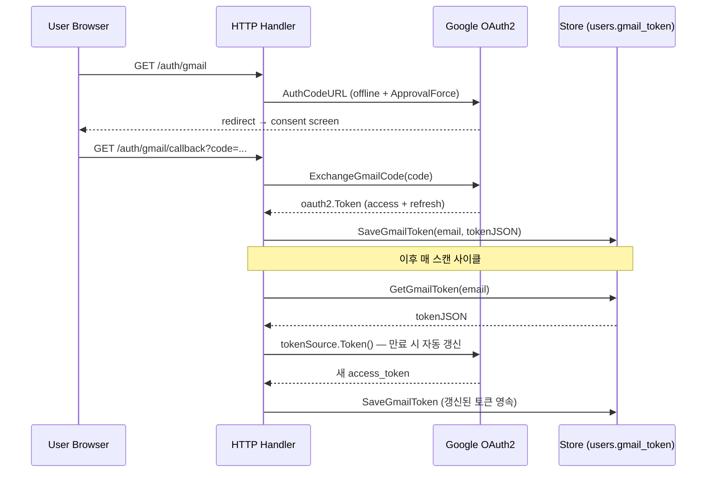
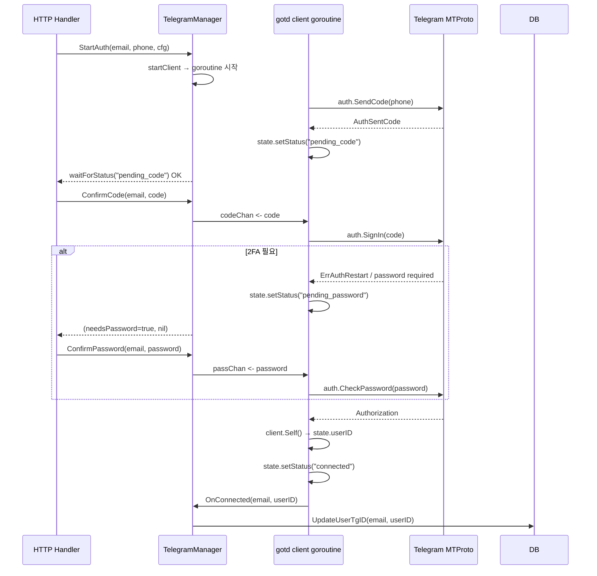
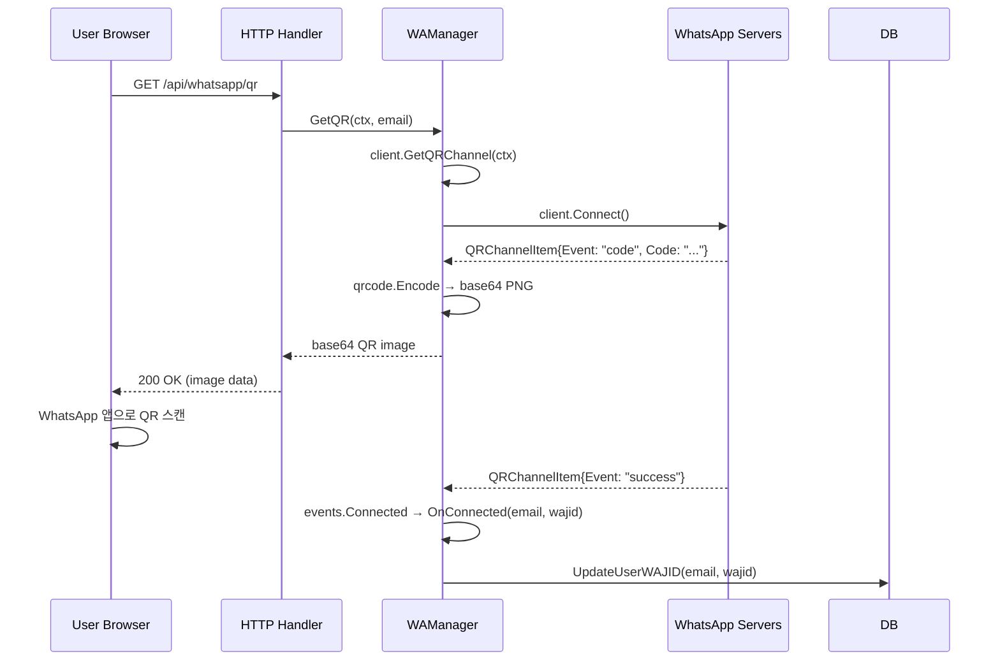

# 05 — Channel Adapters

**한국어:** 채널 어댑터는 외부 메시징 플랫폼(Slack, Gmail, Telegram, WhatsApp)과 내부 스캐너 파이프라인을 연결하는 통합 레이어입니다. 각 어댑터는 인증, 메시지 수신, 정규화의 책임을 분리하여 `types.RawMessage`로 통일된 형태를 스캐너에 전달합니다.

**English:** Channel adapters are the integration layer connecting external messaging platforms to the internal scanner pipeline. Each adapter owns authentication, message ingestion, and normalisation, delivering a uniform `types.RawMessage` to the scanner.

Cross-references: → [03-backend-architecture.md](03-backend-architecture.md) (Handler → Service → Store 의존 방향) | → [06-scanner-pipeline.md](06-scanner-pipeline.md) (스캐너가 어댑터를 호출하는 흐름) | → [15-observability.md](15-observability.md) (whataphttpx 래핑 패턴 전체)

---

## 1. 공통 어댑터 패턴 / Common Adapter Patterns

### 1.1 공유 인터페이스 / Shared Interface

**한국어:** 현재 코드베이스에는 단일 `ChannelAdapter` 인터페이스가 없습니다. 대신 각 어댑터는 스캐너가 직접 호출하는 패키지 수준 함수(`ScanGmail`, `GetMessages`, `TelegramManager.PopMessages`, `WAManager.PopMessages`)를 노출합니다. 공통 계약은 타입 수준이 아닌 호출 규약으로 존재합니다.

**English:** There is no single `ChannelAdapter` interface in the codebase. Instead, each adapter exposes package-level entry points called directly by the scanner. The shared contract is a calling convention, not a type constraint.

### 1.2 인증 모드별 분류 / Auth Mode Classification

| 채널 | 인증 방식 | 세션 영속 위치 |
|---|---|---|
| Slack | Bot Token (env) | 없음 — 토큰 만료 없음 |
| Gmail | Google OAuth2 (Authorization Code Flow) | `users.gmail_token` (JSON) |
| Telegram | MTProto phone/OTP/2FA | `telegram_sessions` (바이너리), `telegram_credentials` |
| WhatsApp | QR 페어링 (whatsmeow Web 프로토콜) | `whatsmeow_*` (sqlstore 자체 테이블) |

### 1.3 whataphttpx 래핑 정책 / whataphttpx Wrapping Policy

**한국어:** `internal/whataphttpx` 패키지는 WhaTap HTTPC 계측을 하나의 진입점으로 집약합니다([whataphttpx.go](../../internal/whataphttpx/whataphttpx.go)).

**핵심 규칙 (CLAUDE.md gotcha 흡수):**

```
OAuth2/토큰 SDK  → whataphttpx.WrapClient(<인증된 클라이언트>)
API key SDK      → whataphttpx.ClientWithAPIKey(apiKey)
plain SDK        → whataphttpx.Client()
```

`option.WithHTTPClient`를 명시하면 SDK는 `WithAPIKey`/`WithCredentials`/`WithTokenSource`를 모두 무시합니다. `base transport nil`인 `whataphttpx.Client()`에 OAuth2 토큰 소스를 얹으면 인증이 소실되어 403이 발생합니다. `WrapClient`는 기존 transport를 base로 보존하므로 OAuth2 토큰 주입이 WhaTap RoundTripper보다 먼저 실행됩니다.

**English:** `WrapClient` preserves the caller's transport as the inner layer so OAuth2 token injection fires before WhaTap observes the request. Never pass `whataphttpx.Client()` (nil base) to an SDK that expects a token-carrying transport — it silently drops auth and returns 403.

→ [15-observability.md](15-observability.md) (WhaTap RoundTripper 전체 설명)

---

## 2. Slack

### 2.1 SDK & 진입점 / SDK & Entry Points

- **SDK:** `github.com/slack-go/slack`
- **진입점:** [`channels/slack.go`](../../channels/slack.go)
- **핵심 타입:** `SlackClient` (api + users/channels 캐시)

### 2.2 인증 / Authentication

**한국어:** Slack은 Bot Token 단일 토큰 방식을 사용합니다. 토큰은 환경 변수로 주입되며 만료 없이 장기 유효합니다. `NewSlackClient`에서 `slack.OptionHTTPClient(whataphttpx.Client())`를 주입하여 모든 Web API 호출이 WhaTap HTTPC 스텝으로 계측됩니다. plain SDK이므로 `WrapClient`가 아니라 `Client()`를 사용합니다 — Bearer 토큰은 slack-go 내부에서 헤더에 삽입되므로 base transport에 의존하지 않습니다.

**English:** Slack uses a single long-lived Bot Token injected at startup. `whataphttpx.Client()` (plain client, nil base) is correct here because slack-go injects the `Authorization: Bearer` header internally, not via the transport.

```go
// channels/slack.go#L26
return &SlackClient{
    api: slack.New(token, slack.OptionHTTPClient(whataphttpx.Client())),
    // ...
}
```

### 2.3 메시지 수집 / Message Ingestion

Slack은 **polling 방식**을 채택합니다(Events API 미사용). 스캐너 루프가 주기적으로 `GetMessages`를 호출하고, 내부에서 `GetConversationHistoryContext`로 채널 히스토리를 페이지 단위로 가져옵니다.

```
GetMessages
  └─ withSlackRetry(3, ...) → api.GetConversationHistoryContext
       └─ processHistoryMessages
            └─ FetchNewThreadReplies (ReplyCount > 0인 경우만)
```

**채널 목록 조회:** `GetConversationsForUser`로 봇이 초대된 채널만 조회합니다(`Types: public_channel, private_channel, im, mpim`). `GetConversations`가 아닌 이유는 봇 권한 없는 채널까지 열거해 불필요한 API 호출이 발생하기 때문입니다.

**스레드 확장:** 메시지의 `ReplyCount > 0 && ThreadTimestamp == Timestamp` 조건을 만족하는 경우에만 `FetchNewThreadReplies`로 하위 스레드를 별도 페이지네이션합니다. 모든 스레드를 항상 가져오면 tier-1 API quota가 급증하므로 부모 메시지 조건으로 제한합니다.

**프로필 캐싱:** `GetUserName`은 초기 `FetchUsers`로 세운 `users` 맵을 우선 조회하고, 미스 시 `GetUserInfoContext` + 캐시 업데이트를 수행합니다. `users.list`는 restricted/external 멤버를 누락하므로 on-demand fallback이 필수입니다.

### 2.4 DM Bot

**한국어:** Slack DM Bot은 Events API, Block Kit 인터랙티브 콜백, slash command 세 진입점을 통해 사용자에게 task 목록 조회·완료 처리를 제공합니다.

**English:** The Slack DM Bot exposes three inbound surfaces — Events API, Block Kit interactive callbacks, and slash commands — all routing into `services.SlackBot`.

#### 수신 이벤트 유형 / Inbound Event Types

| 진입점 | 엔드포인트 | 수신 유형 | 핸들러 |
|---|---|---|---|
| Events API | `POST /api/slack/events` | `message.im` / `app_mention` / `url_verification` | `handlers.HandleSlackEvent` |
| Block Kit interactive | `POST /api/slack/interactive` | `block_actions` | `handlers.HandleSlackInteractive` |
| Slash command | `POST /api/slack/commands` | `/tasks` | `handlers.HandleSlackCommand` |

#### 라우팅 흐름 / Routing Flow

```
HandleSlackEvent
  ├─ url_verification  → 200 + challenge (동기)
  ├─ X-Slack-Retry-Num ≥ 1  → 200 + drop (중복 방지)
  ├─ AppMentionEvent   → dispatchSlackEvent → Bot.HandleDMText
  └─ MessageEvent (channel_type=im, bot_id="")
                       → dispatchSlackEvent → Bot.HandleDMText

HandleSlackInteractive
  └─ block_actions[0].action_id
       ├─ "task_done:<id>"   → Bot.HandleDoneAction → tasks.HandleTaskCompletion
       └─ "task_page:<page>" → Bot.HandlePageAction

HandleSlackCommand (/tasks)
  └─ text=="" → "tasks" 으로 정규화 → Bot.HandleDMText
```

**`HandleDMText` 파서:** `ParseDMCommand`가 `<@UXXXX>` 멘션 prefix를 제거하고 `tasks` / `done <id>` / `help` 세 키워드로 분기합니다. `app_mention`과 IM DM 양쪽에서 같은 파서를 재사용하여 동작 일관성을 유지합니다.

**Block Kit 메시지 갱신:** `HandleDoneAction`은 `chat.postMessage` 대신 `chat.update`(`UpdateDMBlocks`)로 완료 후 같은 메시지를 재렌더링합니다. 인터랙티브 payload의 `container.channel_id` / `container.message_ts`를 그대로 사용하므로 DM 스레드에 중복 메시지가 쌓이지 않습니다.

**서명 검증:** 모든 세 진입점은 `readAndVerifySlack`에서 `auth.VerifySlackRequest`를 공통으로 호출합니다. → [12-auth-and-security.md](12-auth-and-security.md) (HMAC-SHA256 검증 상세)

#### Rate Limit 방어 / Rate Limit Defence

DM 발송(`SendDM`, `SendDMBlocks`, `UpdateDMBlocks`)은 폴링 경로와 동일한 `withSlackRetry(3, ...)` 래퍼를 재사용합니다. Slack의 DM 관련 API는 `chat.*` Tier-3 rate limit에 속하며, 폴링과 같은 버킷을 공유하므로 전역 상한이 적용됩니다.

**Channel leak 방지:** `dispatchSlackInteraction`에서 `cb.Container.ChannelID`가 빈 칸이면 `cb.Channel.ID`로 fallback합니다. 일부 클라이언트(구형 앱)가 `container.channel_id`를 채우지 않는 경우를 방어합니다.

### 2.5 채널 이름 레이블링 / Channel Name Labelling

**한국어:** Slack은 IM(1:1 DM) 및 MpIM(그룹 DM) 대화에 대해 `Name` 필드를 빈 문자열로 반환합니다. `slackChannelDisplayName`이 이를 보완하여 대시보드에 `-`가 표시되거나 per-room lock 키가 빈 칸이 되는 현상을 방지합니다.

```go
// channels/slack.go
func slackChannelDisplayName(c *slack.Channel, fallback string) string {
    if c.Name != ""  { return c.Name }
    if c.IsIM        { return "DM" }
    if c.IsMpIM      { return "Group DM" }
    return fallback
}
```

**English:** `IsIM`/`IsMpIM` flags are checked only when `Name` is empty, so named public/private channels are unaffected.

### 2.6 Rate Limit 재시도 / Rate Limit Retry

```go
// channels/slack.go#L143
func withSlackRetry(maxRetries int, contextMsg string, attemptFunc func() error) error {
    var rateLimitedError *slack.RateLimitedError
    if errors.As(err, &rateLimitedError) {
        time.Sleep(rateLimitedError.RetryAfter)
        // ...
    }
}
```

**한국어:** `slack.RateLimitedError`가 응답 헤더 `Retry-After`를 파싱해 보관하므로, 재시도 대기 시간을 추측 없이 준수합니다. 최대 3회 재시도(`maxRetries = 3`)로 영구 장애 시 무한 루프를 방지합니다.

**English:** `withSlackRetry` honours the `Retry-After` value embedded in `slack.RateLimitedError`, eliminating guesswork backoff. The exported `WithSlackRetry` alias allows scanner-side callers (e.g. `runSlackSweep`) to reuse the same wrapper without reimplementing it.

---

## 3. Gmail

### 3.1 SDK & 진입점 / SDK & Entry Points

- **SDK:** `google.golang.org/api/gmail/v1`
- **진입점:** [`channels/gmail.go`](../../channels/gmail.go)
- **핵심 함수:** `ScanGmail`, `GetGmailService`

### 3.2 인증 흐름 / Authentication Flow

Gmail은 Google OAuth2 Authorization Code Flow를 사용합니다. Refresh Token을 DB에 JSON으로 영속하여 서버 재시작 후에도 재인증 없이 접근을 유지합니다.



**한국어:** `ApprovalForce`를 사용하는 이유: Google은 기본적으로 이미 동의한 앱에 대해 refresh token을 재발급하지 않습니다. `ApprovalForce`는 매번 동의 화면을 표시하여 refresh token이 항상 포함되도록 강제합니다.

**English:** `ApprovalForce` is required because Google omits `refresh_token` for repeat authorisations. Without it the stored token would expire and cannot be silently renewed.

→ [12-auth-and-security.md](12-auth-and-security.md) (Google OAuth2 전체 흐름)

### 3.3 whataphttpx 래핑 / whataphttpx Wrapping

```go
// channels/gmail.go#L90
httpClient := whataphttpx.WrapClient(oauth2.NewClient(ctx, tokenSource))
svc, err := gmail.NewService(ctx, option.WithHTTPClient(httpClient))
```

`oauth2.NewClient`가 반환하는 클라이언트는 이미 token-injecting transport를 내장합니다. `WrapClient`는 그 transport를 base로 보존하면서 WhaTap RoundTripper를 바깥에 덧씌웁니다. `whataphttpx.Client()`(nil base)를 사용하면 OAuth2 transport가 교체되어 모든 요청이 401/403으로 실패합니다.

### 3.4 체크포인트 패턴 / Checkpoint Pattern

**한국어:** Gmail은 History API 대신 **Unix timestamp 기반** 체크포인트를 사용합니다.

```
getGmailScanTime(email)
  └─ store.GetLastScan(email, "gmail", "inbox")
       → 없으면 7일 전 fallback
  └─ query: "in:inbox OR from:me after:<unix>"
```

스캔 완료 후 `store.UpdateLastScan`으로 `maxTS`(처리된 메시지 중 가장 최신 타임스탬프)를 저장합니다. History ID를 쓰지 않는 이유: History ID는 특정 토큰 발급 이후만 추적 가능하고, 토큰 재발급/재인증 시 연속성이 끊깁니다. Unix timestamp는 인증 라이프사이클과 독립적입니다.

**English:** Unix-timestamp checkpoints survive token re-issuance. Gmail's `after:` filter is second-precision inclusive, so `parseNewEmails` calls `store.IsProcessed` to skip already-processed boundary messages instead of paying for a full API fetch + parse every cycle.

→ [06-scanner-pipeline.md](06-scanner-pipeline.md) (스캐너 루프 및 UpdateLastScan 호출 위치)

### 3.5 노이즈 게이트 / Noise Gate

마케팅 메일, 자동발송 메일, 내부 Google Group 경유 메일을 구분하는 다층 필터가 `processSingleEmail` 앞단에 위치합니다.

| 필터 | 로직 | 예외 |
|---|---|---|
| `isMarketingHeader` | `List-Unsubscribe` / `Precedence: bulk\|list\|junk` | 내부 도메인 List-ID + 내부 발신자 조합은 통과 |
| `isSelfAddressedBulk` | From == To (단일 주소) && 발신자가 현재 사용자 아님 | — |
| `isSkipSender` | no-reply/noreply + 설정된 skip 목록 | — |

내부 Google Group(`indonesia@whatap.io` 등)은 RFC 2369에 따라 모든 멤버 사본에 `List-Unsubscribe`를 주입합니다. `isMarketingHeader`의 내부 도메인 예외가 없으면 정상적인 그룹 메일이 전부 차단됩니다.

---

## 4. Telegram (gotd/td)

### 4.1 WHY MTProto over Bot API

**한국어:** Telegram Bot API는 봇 계정으로 수신한 메시지만 처리할 수 있습니다. 일반 사용자 계정의 개인 메시지, 그룹 채팅, 채널 메시지를 읽으려면 MTProto 사용자 클라이언트가 필요합니다. `gotd/td`는 MTProto를 Go로 구현한 라이브러리로, 공식 Telegram 클라이언트와 동일한 프로토콜을 사용합니다.

**English:** The Bot API is scoped to bot accounts only; it cannot read personal conversations. MTProto user-level access via `gotd/td` grants full inbox visibility — the same protocol used by official Telegram clients.

### 4.2 진입점 & 구조 / Entry Points & Structure

- **진입점:** [`channels/telegram.go`](../../channels/telegram.go)
- **핵심 타입:** `TelegramManager` (싱글톤 `DefaultTelegramManager`)
- **세션 영속:** `telegram_sessions` (MTProto 바이너리 blob), `telegram_credentials` (App ID / Hash)

`TelegramManager`는 `WAManager`와 동일한 IoC 패턴을 사용합니다. `FetchUserTgSession`, `OnSessionUpdated`, `OnConnected`, `OnLoggedOut` 콜백을 `main.go`의 `wireTelegramHooks`에서 store 레이어와 연결합니다. 이 분리를 통해 `channels` 패키지가 `store`를 직접 임포트하지 않고 단독 테스트 가능합니다.

### 4.3 페어링 흐름 / Pairing Flow (Phone/OTP/2FA)



`channelAuth` 구조체가 `auth.UserAuthenticator` 인터페이스를 구현하여 HTTP 핸들러에서 채널로 전달된 phone/code/password를 gotd의 auth flow에 공급합니다. HTTP 핸들러와 gotd goroutine은 `codeChan`/`passChan` 채널을 통해 데이터를 교환하므로, 블로킹 RPC와 비동기 HTTP 응답 사이의 동기화 문제가 해결됩니다.

### 4.4 세션 복원 / Session Restore

서버 재시작 시 `bootChannelClients`가 `InitTelegram`을 per-user goroutine으로 호출합니다:

```go
// main.go#L276
go channels.DefaultTelegramManager.InitTelegram(u.Email, cfg)
```

`InitTelegram`은 `dbSessionStorage`를 통해 저장된 MTProto 세션 블롭을 로드하고, `ensureAuthorized(restoreOnly=true)`로 세션 유효성만 확인합니다(새 auth flow 진입 없음). 세션이 없거나 인증이 끊어진 경우 조용히 종료하고, 사용자가 수동으로 `/api/telegram/auth/start`를 호출해야 합니다.

### 4.5 메시지 버퍼링 / Message Buffering

**한국어:** Telegram은 polling이 아닌 **push 방식**입니다. `gotd/td`의 `UpdateDispatcher`가 `OnNewMessage`/`OnNewChannelMessage` 이벤트를 수신하면 `ingestMessage`가 `types.RawMessage`로 정규화하여 `messageBuffer[email][chatKey]`에 누적합니다(cap 200). 스캐너는 주기적으로 `PopMessages`를 호출하여 버퍼를 원자적으로 드레인합니다.

**chatKey 형식:** `tg_user_<id>` (DM) / `tg_chat_<id>` (그룹) / `tg_channel_<id>` (채널). 이 접두사 구분이 나중에 GetGroupName의 분기 로직과 스캐너의 chat type 판별에 사용됩니다.

**English:** Telegram uses push (gotd UpdateDispatcher) rather than polling. The buffer cap of 200 per chat prevents unbounded memory growth when the scanner lags behind a busy channel.

---

## 5. WhatsApp (whatsmeow)

### 5.1 WHY whatsmeow

**한국어:** WhatsApp은 공식 Business API(Meta Cloud API)가 존재하지만 사전 승인된 템플릿 메시지만 발신 가능하고, 개인 메시지 수신 API가 없습니다. `whatsmeow`는 WhatsApp Web 프로토콜을 Go로 역공학한 라이브러리로, 일반 WhatsApp 계정의 메시지를 QR 페어링 후 브라우저처럼 수신합니다.

**English:** The official Meta Business API cannot receive arbitrary personal messages. `whatsmeow` implements the WhatsApp Web WebSocket protocol, giving the same message access as a browser-based session after QR pairing.

### 5.2 진입점 & 구조 / Entry Points & Structure

- **진입점:** [`channels/whatsapp.go`](../../channels/whatsapp.go)
- **핵심 타입:** `WAManager` (싱글톤 `DefaultWAManager`)
- **세션 영속:** whatsmeow `sqlstore`가 `store.GetDB()` 위의 `whatsmeow_*` 테이블을 자체 관리

```go
// whatsapp.go#L78
m.container = sqlstore.NewWithDB(store.GetDB(), "sqlite3", dbLog)
```

같은 SQLite/Turso 커넥션을 재사용하므로 별도 DB 연결이 불필요합니다. `containerOnce`로 프로세스당 1회만 초기화합니다.

### 5.3 QR 페어링 흐름 / QR Pairing Flow



이미 연결된 상태에서 QR 요청이 오면 `Disconnect()` 후 채널을 재개설합니다. `IsConnected() && IsLoggedIn()`이면 `"CONNECTED"` 문자열을 즉시 반환합니다.

### 5.4 IoC 훅 연결 / IoC Hook Wiring

`WAManager`는 store 레이어를 직접 임포트하지 않습니다. 대신 세 콜백을 `main.go`의 `wireWhatsAppHooks`에서 주입합니다:

| 콜백 | 트리거 | store 동작 |
|---|---|---|
| `FetchUserWAJID` | `InitWhatsApp` | `store.GetOrCreateUser` → `u.WAJID` 반환 |
| `OnConnected` | `events.Connected` | `store.UpdateUserWAJID(email, wajid)` |
| `OnLoggedOut` | `events.LoggedOut` | `store.UpdateUserWAJID(email, "")` |

`OnConnected`/`OnLoggedOut`이 `context.Background()`를 사용하는 이유: 이 콜백은 `WAManager`의 goroutine에서 발화하므로 부트 ctx보다 생명주기가 길 수 있습니다.

### 5.5 메시지 처리 / Message Processing

**한국어:** `handleEvent`가 `events.Message`를 수신하면 다음 순서로 처리됩니다:

```
isSystemMessage?  → 제어 메시지(Protocol/SenderKeyDistribution)/status broadcast 차단
parseMessageContent → Conversation | ExtendedTextMessage | 미디어 표현식
resolveSenderName  → PushName 우선, 없으면 JID.User
resolveIncomingMentions → @숫자 → @이름 치환 (contacts 캐시 → whatsmeow Store)
bufferMessage(email, chat JID, RawMessage)
```

**Group vs DM 분기:** `msg.Info.Chat`의 JID server가 `g.us`이면 그룹입니다. `GetGroupName`에서 `jid.Server == "g.us"` 조건으로 `client.GetGroupInfo` API를 호출합니다. DM은 `jid.User`를 식별자로 contacts 테이블을 조회합니다.

**미디어 처리:** `extractMediaInfo`는 실제 파일을 다운로드하지 않습니다. `[Image]`, `[Document: <filename>]` 등 텍스트 표현으로 변환하여 버퍼에 저장하고 스캐너에 전달합니다. 미디어 다운로드는 현재 미구현 상태입니다.

**English:** Media messages are represented as textual placeholders (`[Image]`, `[Document: name]`) — actual binary download is not implemented. The scanner receives and processes these placeholders as if they were text.

### 5.6 자동 재연결 / Auto-Reconnect

**한국어:** whatsmeow 클라이언트는 내부적으로 WebSocket 재연결을 처리합니다. `events.LoggedOut`이 발화되면(세션 강제 종료, 기기 연결 해제) `handleEvent`가 `delete(clients[email])`과 `OnLoggedOut` 콜백을 실행하여 WAJID를 초기화합니다. 재연결은 사용자가 `/api/whatsapp/qr`를 다시 호출해야 합니다.

**English:** whatsmeow handles WebSocket reconnection internally. When `events.LoggedOut` fires (forced session termination or device unlink), the client entry is removed and `OnLoggedOut` clears the stored WAJID. A full QR re-pairing is required to restore connectivity.

---

## 6. 에러 처리 · 재시도 · 관측 / Error Handling, Retry, Observability

### 6.1 채널별 에러 전략 / Per-Channel Error Strategy

| 채널 | 재시도 | 에러 시 동작 |
|---|---|---|
| Slack | `withSlackRetry(3)` — `Retry-After` 준수 | 페이지 중단, partial 결과 반환 |
| Gmail | 없음 (Google 클라이언트 내부 처리) | `fetchRecentEmails`에서 early return |
| Telegram | gotd 내장 재연결 | `client.Run` exit → `doneChan` 에러 전파 |
| WhatsApp | whatsmeow 내장 WebSocket 재연결 | `events.LoggedOut`으로 세션 소멸 감지 |

### 6.2 WhaTap 계측 위치 / WhaTap Instrumentation Points

각 스캔 루프는 `trace.Start(ctx, "/<TxName>")` + `defer trace.End`로 백그라운드 TX를 생성합니다. 4개 채널의 TX 이름(`/Background-ScanGmail`, `/Background-ScanWhatsApp`, `/Background-ScanTelegram`, `/Background-ScanSlack`)과 11개 루프 전체 목록은 → [06-scanner-pipeline.md](06-scanner-pipeline.md)를 참조하세요.

HTTP 아웃바운드 계측은 `whataphttpx` 래핑으로 자동 처리됩니다. gotd(Telegram MTProto)와 whatsmeow(WhatsApp WebSocket)는 HTTP 클라이언트를 사용하지 않으므로 HTTPC 스텝이 발생하지 않습니다 — MTProto/WebSocket 구간은 `trace.Step`으로 수동 계측이 필요할 경우 별도 추가해야 합니다(현재 미구현).

WhaTap TX 이름 규칙, HTTPC 스텝 전체 설명 → [15-observability.md](15-observability.md)

### 6.3 인증 실패 시 fallback / Auth Failure Fallback

| 채널 | 실패 유형 | fallback |
|---|---|---|
| Gmail | `tokenSource.Token()` 에러 (refresh token 만료/취소) | `ScanGmail`이 `logger.Debugf` 후 nil 반환, 해당 사용자 스캔 skip |
| Telegram | `session present but not authorized` | `InitTelegram` 종료, 사용자가 `/api/telegram/auth/start` 재호출 필요 |
| WhatsApp | `events.LoggedOut` | WAJID 초기화, QR 재스캔 필요 |
| Slack | 토큰 만료 없음 | — |

Gmail refresh token이 만료된 경우 자동 알림 메커니즘이 현재 없습니다. 사용자는 `/auth/gmail` 재인증을 수동으로 수행해야 합니다.

---

## 7. Deltas from Legacy Docs / 레거시 문서 대비 변경사항

`TECH.md`의 채널 설명은 파이프라인 관점에서 기술되어 있으며 어댑터 구현 세부사항이 없습니다. 이 챕터가 해당 공백을 채웁니다.

| 항목 | 레거시(TECH.md) | 실제 코드 |
|---|---|---|
| Slack 메시지 수집 방식 | 언급 없음 | polling (`GetConversationHistoryContext`) |
| Gmail 체크포인트 | 언급 없음 | Unix timestamp (`last_scan` 테이블), History API 미사용 |
| Telegram auth 흐름 | 언급 없음 | 3-step (phone → code → optional 2FA), goroutine-channel 브릿지 |
| WhatsApp 미디어 | 언급 없음 | 다운로드 미구현, 텍스트 표현(placeholder) |
| whataphttpx 래핑 | CLAUDE.md에만 기술 | WrapClient(OAuth) vs Client(plain) vs ClientWithAPIKey 구분 명문화 |
| Slack DM Bot | 없음 | Events API + Block Kit + slash command DM 인터페이스 추가 (§2.4) |
| IM channel label | Name 빈 칸 처리 없음 | Name 빈 칸 시 `IsIM`→"DM", `IsMpIM`→"Group DM"으로 레이블링 (§2.5) |

---

## Cross-References / 관련 챕터

- → [03-backend-architecture.md](03-backend-architecture.md) — Handler → Service → Store 의존 방향, bootChannelClients 호출 시점
- → [06-scanner-pipeline.md](06-scanner-pipeline.md) — PopMessages, ScanGmail 호출 위치, prime-pool cadence
- → [12-auth-and-security.md](12-auth-and-security.md) — Gmail OAuth2 전체 흐름, 토큰 영속 상세
- → [15-observability.md](15-observability.md) — whataphttpx RoundTripper 원리, WhaTap TX/HTTPC 계측 전체
