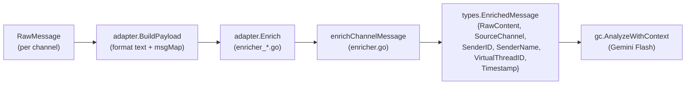

# 06. 스캐너 파이프라인 (Scanner Pipeline)

---

## 1. 스캐너 책임 (Scanner Responsibilities)

**한국어:**
스캐너는 외부 채널(Gmail, Slack, WhatsApp, Telegram)을 주기적으로 폴링하여 신규 메시지를 수집하고, Enricher를 거쳐 AI 파이프라인에 투입한 뒤 결과를 DB에 저장하는 **데이터 수집의 최전선**입니다. 동시에 일일 소화(Daily Digest), 주간 보고서(Weekly Report), 마감 리마인더(Deadline Reminder) 등 시간 기반 작업도 동일한 스케줄러 위에서 실행합니다.

**English:**
The scanner is the ingestion frontier: it periodically polls external channels, funnels raw messages through an enricher and AI pipeline, and persists results to the database. Time-based jobs (daily digest, weekly report, deadline reminders) share the same scheduler infrastructure.

진입점은 `scanner.StartBackgroundScanner(ctx)` 이며, `main.go`의 `initAIServices` 이후에 호출됩니다. `WireDailyDigest`와 `WireWeeklyReport`는 `ReportsService` 의존성이 `Init` 이후에 구성되므로 별도 wire 함수로 분리되어 있습니다.

**스캐너 패키지 파일 책임 요약:**

| 파일 | 책임 |
|---|---|
| [`scanner/scanner.go`](../../scanner/scanner.go) | 전역 상태 초기화(`Init`), 루프 등록(`StartBackgroundScanner`), 공통 헬퍼(`isAliasMatched`, `triggerAsyncTranslation`) |
| [`scanner/scanner_loop.go`](../../scanner/scanner_loop.go) | `primePool`, `primeLoop` 구조체 — 스케줄러 코어 |
| [`scanner/channel_adapter.go`](../../scanner/channel_adapter.go) | `ChannelAdapter` 인터페이스 + 공유 드라이버(`scanChannel`, `processChannelRoom`, `processChannelGroup`) |
| [`scanner/scanner_slack.go`](../../scanner/scanner_slack.go) | `scanSlack` 진입점, 채널 목록 조회, rate limiter 초기화 |
| [`scanner/scanner_slack_classify.go`](../../scanner/scanner_slack_classify.go) | `classifyMessage` — Task/Query 분류 |
| [`scanner/scanner_slack_threads.go`](../../scanner/scanner_slack_threads.go) | `sweepSlackThreads`, 스레드 활동 감지, `conversations.replies` 호출 |
| [`scanner/scanner_telegram.go`](../../scanner/scanner_telegram.go) | `telegramAdapter` 구현, `scanTelegram` 진입 |
| [`scanner/scanner_whatsapp.go`](../../scanner/scanner_whatsapp.go) | `whatsAppAdapter` 구현, `scanWhatsApp` 진입 |
| [`scanner/scanner_digest.go`](../../scanner/scanner_digest.go) | 일일 요약 디스패치 — 평일·시간·dedup 가드 |
| [`scanner/scanner_weekly_report.go`](../../scanner/scanner_weekly_report.go) | 주간 보고서 디스패치 — 금요일·시간·dedup 가드 |
| [`scanner/scanner_reminder.go`](../../scanner/scanner_reminder.go) | 마감 리마인더 디스패치 |
| [`scanner/enricher.go`](../../scanner/enricher.go) | `enrichChannelMessage` 공통 구현, 15분 윈도우 계산 |
| [`scanner/enricher_slack.go`](../../scanner/enricher_slack.go) | `EnrichSlackMessage` — thread-aware VirtualThreadID |
| [`scanner/enricher_telegram.go`](../../scanner/enricher_telegram.go) | `EnrichTelegramMessage` — chatKey → DB 사용자 매핑 |
| [`scanner/enricher_whatsapp.go`](../../scanner/enricher_whatsapp.go) | `EnrichWhatsAppMessage` — JID → DB 사용자 매핑 |

---

## 2. Scanner Loop 아키텍처 (Loop Architecture)

**한국어:**
`StartBackgroundScanner`는 11개의 `primeLoop` goroutine을 생성합니다. 각 루프는 독립 스케줄로 동작하며, 이전 실행이 아직 완료 중이면 `atomic.Bool` CAS로 다음 tick을 조용히 스킵합니다.

**English:**
`StartBackgroundScanner` spawns 11 independent `primeLoop` goroutines. Each loop owns its own schedule; if the previous run is still in flight, the next tick is silently skipped via an `atomic.Bool` CAS guard — no queue build-up, no panics.

```mermaid
sequenceDiagram
    participant M as main.go
    participant S as StartBackgroundScanner
    participant PL as primeLoop (×11)
    participant RF as runFn (e.g. runGmailForAllUsers)

    M->>S: StartBackgroundScanner(ctx)
    S->>PL: go l.start(ctx, wg, pickPrime())
    loop every pickPrime() seconds
        PL->>PL: CAS running false→true
        PL->>RF: l.runFn(traceCtx, wg)
        RF-->>PL: return
        PL->>PL: CAS running true→false
        PL->>PL: timer.Reset(pickPrime())
    end
    M->>S: ctx.Done()
    S->>PL: ctx cancelled → goroutine returns
    S->>S: wg.Wait() with 30s timeout
```



**한 iteration의 단계 (WhatsApp/Telegram 예시):**

```
loadUsersForScan
  └─ PopMessages(email)          ← 채널 버퍼 drain
       └─ scanChannel            ← ChannelAdapter 드라이버
            ├─ processChannelRoom (per roomKey, per user)
            │    ├─ RoomLockSvc.AcquireLock  ← 이중 실행 방지
            │    ├─ GroupMessagesByTime       ← Time-Topic 배치
            │    └─ processChannelGroup
            │         ├─ adapter.BuildPayload
            │         ├─ isIgnorableChannelNoise  ← Flash-Lite 게이트
            │         ├─ adapter.Enrich
            │         ├─ gc.AnalyzeWithContext    ← Flash 추출
            │         ├─ tasksSvc.ResolveProposals
            │         └─ processChannelItems → HandleTaskState
            └─ triggerAsyncTranslation
PersistAllScanMetadata            ← 체크포인트 flush
```

**직렬 vs 병렬:**
- 채널 간: 독립 goroutine — Gmail/WhatsApp/Telegram/Slack이 서로 블록하지 않음
- 사용자 간: `errgroup.SetLimit(5)` — MaxConcurrentScans = 5
- 채널 내(Slack): 채널별 `errgroup.SetLimit(3)`, 스레드 단위 순차(rate limiter)

---

## 3. Prime-Pool 부하 분산 (Prime-Pool Load Distribution)

**한국어:**
단일 60초 ticker는 외부 1분 cron과 harmonic resonance를 일으켜 LLM API 429·DB write 경합이 같은 순간에 집중됩니다. Prime-Pool은 이를 구조적으로 회피합니다.

**English:**
A single 60-second ticker would phase-lock with upstream 1-minute crons, creating periodic bursts of LLM API 429s and DB write contention. Prime-Pool eliminates this by design.

### 현재 prime 값

```go
// scanner/scanner_loop.go
var primePool = []time.Duration{
    59 * time.Second,
    61 * time.Second,
    67 * time.Second,
    71 * time.Second,
    73 * time.Second,
}
```

### Prime 선택 근거

| 결정 | 근거 |
|---|---|
| 소수만 사용 | 외부 cron(60s/300s/900s)과의 LCM이 극대화 → harmonic resonance 구조적 회피 |
| 59–73s 범위 | 사용자 체감 latency를 단일 ticker 수준으로 유지 (평균 ≈ 66s) |
| 5종 풀 | 11개 루프가 매 tick 다른 prime을 추첨 → 동시 정렬 확률 최소화 |
| 매 tick 재추첨 | 같은 prime을 우연히 연속으로 뽑아도 다음 tick에서 위상 자동 이탈 |
| atomic CAS skip | 긴 LLM 호출이 다음 tick을 덮쳐도 queue 폭증 없이 단순 skip |

> CLAUDE.md memory: "주기/타임아웃은 소수" — prime 추가 시 `primePool` 슬라이스에 1줄만 수정하면 전 루프에 즉시 반영됩니다 (e.g. `79 * time.Second`).

### 11개 루프 목록

| Loop 이름 | runFn | WhaTap Transaction |
|---|---|---|
| gmail | `runGmailForAllUsers` | `/Background-ScanGmail` |
| whatsapp | `runWhatsAppForAllUsers` | `/Background-ScanWhatsApp` |
| telegram | `runTelegramForAllUsers` | `/Background-ScanTelegram` |
| slack | `runSlackForAllUsers` | `/Background-ScanSlack` |
| archive-old-tasks | `runArchiveOldTasks` | `/Background-ArchiveOldTasks` |
| flush-token-usage | `runFlushTokenUsage` | `/Background-FlushTokenUsage` |
| log-db-stats | `runLogDBStats` | `/Background-LogDBStats` |
| sweep-slack-threads | `runSlackSweep` | `/Background-SweepSlackThreads` |
| deadline-reminder | `runDeadlineReminder` | `/Background-DeadlineReminder` |
| daily-digest | `runDailyDigest` | `/Background-DailyDigest` |
| weekly-report | `runWeeklyReport` | `/Background-WeeklyReport` |

> TECH.md는 "8 loop"로 기재되어 있으나, 현재 코드(`scanner.go:61-72`)에는 11개 루프가 등록되어 있습니다. Deadline reminder, daily digest, weekly report가 이후 추가되었습니다. → **Deltas from legacy docs** 참조.

### 동작 모식

```
시각:  0s            70s           140s          210s
gmail  ▮─── 67s ───▮─── 71s ───▮─── 59s ───▮
whats  ▮── 59s ─▮─── 73s ───▮─── 61s ───▮
slack  ▮─── 71s ───▮─── 67s ───▮─── 73s ───▮
...
```

시작 시 모든 루프가 즉시 1회 실행(legacy startup behavior 유지) 후 각자 prime 추첨. 버스트가 발생해도 다음 사이클에서 자동으로 위상이 어긋납니다.

---

## 4. 채널별 Scanner (Per-Channel Scanners)

→ 채널 구현 세부: [05-channels.md]

### 4.1 Slack (`scanner_slack.go` + `scanner_slack_classify.go` + `scanner_slack_threads.go`)

**한국어:**
Slack은 WhatsApp/Telegram과 달리 push-buffer 방식이 아니라 직접 API poll 방식입니다. `conversations.history` + `conversations.replies` 두 단계로 동작합니다. 파일이 3개로 분리되어 있습니다: `scanner_slack.go`(진입점·rate limiter), `scanner_slack_classify.go`(분류), `scanner_slack_threads.go`(스레드 sweep).

**English:**
Slack uses direct API polling rather than a local push buffer. It operates in two tiers: channel-level history scan, then per-thread reply sweep. Split across three focused files: entry point, classifier, and thread sweeper.

- **채널 스캔 (`scanSlack` — scanner_slack.go)**: `LookupChannels` → 채널별 `GetMessages(since=24h back, minTS)` → `classifyMessage`로 분류(Task/Query)
- **분류 (`classifyMessage` — scanner_slack_classify.go)**: Task/Query/noise 판별 로직
- **스레드 sweep (`sweepSlackThreads` — scanner_slack_threads.go)**: `GetTargetedActiveThreads` → 채널별 `conversations.history` 1회로 activity 사전 확인 → 변동 없는 스레드 skip → `conversations.replies` 호출 절감
- **Tier 3 rate limit**: `rate.NewLimiter(1/1000ms)` — Slack Tier 3 conversations.replies 50/min 제한 내 유지
- **클라이언트 캐시**: `getOrInitSlackClient` — 토큰 단위로 `users.list + auth.test`를 1회만 호출, sweep마다 재초기화 방지
- **스레드 타임아웃**: 7일 비활성 → 봇이 스레드에 "resolved" 메시지 게시 후 `CloseTargetedThread`
- **체크포인트**: 채널별 마지막 처리 timestamp를 `scan_metadata`(`source='slack'`)에 저장

### 4.2 Gmail (채널 레이어 위임)

**한국어:**
Gmail 스캔 자체는 `channels.ScanGmail`에서 처리됩니다. `scanner.go`의 `performGmailScan`은 완료 감지(CompletionService)와 중복 방지(`inFlightMessages`) 래퍼 역할만 합니다.

**English:**
The Gmail scan implementation lives in `channels.ScanGmail`. `performGmailScan` in `scanner.go` is a thin wrapper that adds completion detection and in-flight deduplication.

- **History ID 기반 증분 폴링**: Gmail API `history.list` — 이전 historyId 이후 변경만 수신
- **`onThreadActivity` 콜백**: 아웃고잉 메시지가 기존 스레드에 도착하면 `CompletionService.ProcessPotentialCompletion` 즉시 평가
- **`inFlightMessages` sync.Map**: 이미 처리 중인 메시지 ID를 기록 — AI 파이프라인 중복 실행 방지
- **노이즈 게이트**: Gmail은 채널 레이어에서 마케팅 메시지 사전 필터링 후 scanner에 전달 (commit `dc7c234`)
- **타임아웃**: 45초 (`context.WithTimeout`)

### 4.3 Telegram (`scanner_telegram.go`)

**한국어:**
Telegram은 `gotd/td` MTProto 클라이언트가 실시간으로 메시지를 수신해 `channels.DefaultTelegramManager` 내부 버퍼에 쌓습니다. Scanner는 `PopMessages`로 버퍼를 drain합니다.

**English:**
Telegram messages arrive via `gotd/td` MTProto push and are buffered in `channels.DefaultTelegramManager`. The scanner drains the buffer on each tick via `PopMessages` — no history polling needed.

- `telegramAdapter.Is1To1(roomKey)`: `tg_user_` prefix → DM, 그 외 → group/channel
- `EnrichTelegramMessage`: chatKey → `store.GetUserByTgID` DB 조회 → phantom-typed `UserID` → `int64` shim
- **peerKey 형식**: `tg_user_{id}` (DM), `tg_channel_{id}` (채널), `tg_chat_{id}` (그룹) → `channel_adapter.go`의 공유 드라이버로 직행

### 4.4 WhatsApp (`scanner_whatsapp.go`)

**한국어:**
WhatsApp도 Telegram과 동일한 push-buffer 패턴입니다. `whatsmeow` 이벤트 핸들러가 메시지를 `channels.DefaultWAManager` 버퍼에 적재하고, scanner가 주기적으로 drain합니다.

**English:**
WhatsApp follows the same push-buffer pattern as Telegram. The `whatsmeow` event handler writes to `channels.DefaultWAManager`; the scanner drains on each tick.

- `whatsAppAdapter.Is1To1(roomKey)`: `@g.us` suffix → group, 그 외 → DM
- **Mention 해석**: `channels.ResolveWAMentions` + `buildWAMetadataString`에서 `store.GetNameByWhatsAppNumber`로 멘션 JID → 표시명 변환 후 AI 페이로드에 `[Explicit-Mentions: ...]` 태그 삽입 — AI가 Assignee를 정확하게 식별하도록 보조
- `EnrichWhatsAppMessage`: JID → `store.GetUserByWAJID` → `int64` shim

---

## 5. Enricher 파이프라인 (Enricher Pipeline)

**한국어:**
Enricher는 채널 raw 데이터를 AI 입력 형식(`types.EnrichedMessage`)으로 정규화합니다. 채널 특이적 식별자(JID, chatKey, Slack thread_ts)를 공통 `VirtualThreadID`로 추상화하여, AI 분석 레이어가 채널을 몰라도 됩니다.

**English:**
The enricher normalizes channel-specific raw data into `types.EnrichedMessage`, abstracting channel-specific identifiers into a common `VirtualThreadID` so the AI layer operates without channel awareness.



### 공통 enricher (`enricher.go`)

- `enrichChannelMessage(source, threadPrefix, roomKey, payload, ts, resolveSender)` — 모든 채널이 공유
- `calculateWindowStart(t)`: `(unix / 900) * 900` — 15분 단위 `VirtualThreadID` 생성. 같은 room의 메시지가 15분 윈도우 내에 있으면 동일 `VirtualThreadID`를 가져 AI가 대화 연속성으로 처리

### 채널별 enricher 비교

| | `enricher_slack.go` | `enricher_telegram.go` | `enricher_whatsapp.go` |
|---|---|---|---|
| 함수 | `EnrichSlackMessage` | `EnrichTelegramMessage` | `EnrichWhatsAppMessage` |
| Sender 해결 | userID + userName (인자) | `GetUserByTgID(chatKey)` DB 조회 | `GetUserByWAJID(rawJID)` DB 조회 |
| VirtualThreadID | `slack_thread_{thread_ts 또는 channelID}` | `tg_thread_{chatKey}_{windowStart}` | `wa_thread_{jid}_{windowStart}` |
| 특이사항 | thread_ts 있으면 스레드 단위 컨텍스트 유지 | phantom UserID → int64 shim | phantom UserID → int64 shim |

**Why shim?** `types.EnrichedMessage`는 `store` 패키지를 임포트할 수 없는 upstream 레이어입니다. `store.UserID`(phantom type `int64`)를 직접 쓰면 순환 의존이 발생하므로, `telegramSenderShim`/`whatsAppSenderShim`이 경계에서 `int64`로 변환합니다.

---

## 6. Daily Digest / Weekly Report / Reminder Scanners

**한국어:**
세 스캐너는 메시지 수집이 아닌 **시간 기반 트리거** 역할입니다. 비즈니스 로직은 각 Service에 위임하고, 스캐너는 조건 평가 + dedup + 디스패치만 담당합니다.
→ 비즈니스 로직: [08-services-business-logic.md]

**English:**
These three scanners are time-based triggers, not message collectors. They evaluate conditions, prevent duplicate dispatches, and delegate business logic to the corresponding service.

### 6.1 Daily Digest (`scanner_digest.go`)

```
runDailyDigest (prime-loop tick)
  ├─ digestSvc == nil || !cfg.DailyDigestEnabled → return
  ├─ 토요일/일요일 → return  (평일만 발송)
  ├─ now.Hour() != cfg.DailyDigestHour → return
  ├─ now.Minute() >= 5 → return  (5분 window)
  ├─ digestLastSentDate == today → return  (당일 중복 방지)
  └─ digestSvc.Dispatch(ctx) → digestLastSentDate = today
```

- `digestSvc`는 `digestDispatcher` 인터페이스 — 테스트 시 mock 주입 가능
- `digestLastSentDate`는 `atomic.Value` — goroutine-safe dedup
- `WireDailyDigest(reportsSvc)`: `scanner.Init` 이후에 호출되어야 하는 이유 — `ReportsService`가 `GeminiClient`(Init에서 초기화)에 의존하기 때문

### 6.2 Weekly Report (`scanner_weekly_report.go`)

```
runWeeklyReport (prime-loop tick)
  ├─ weeklyReportSvc == nil || !cfg.WeeklyReportEnabled → return
  ├─ now.Weekday() != time.Friday → return
  ├─ now.Hour() != cfg.WeeklyReportHour || now.Minute() >= 5 → return
  ├─ weeklyReportLastSentDate == today → return
  └─ weeklyReportSvc.Dispatch(ctx) → weeklyReportLastSentDate = today
```

- 금요일 지정 시간에만 발송 (commit `a3a1e01` — multi-recipient, Block Kit DM)
- `NotionExporter`가 활성화된 경우에만 `WireWeeklyReport`가 `weeklyReportSvc`를 초기화
- `weeklyReportNowFn` 함수 변수로 테스트에서 시간 주입 가능

### 6.3 Reminder Scanner (`scanner_reminder.go`)

```
runDeadlineReminder (prime-loop tick)
  ├─ reminderSvc == nil → return
  ├─ !cfg.ReminderEnabled → return
  └─ reminderSvc.DispatchDueSoon(ctx)
```

- `reminderSvc`는 `reminderDispatcher` 인터페이스
- `scanner.Init`에서 `cfg.SlackToken != ""`일 때 `services.NewReminderService(slackClient, cfg.ReminderWindowsHours)` 초기화
- **3-working-day stale 룰** (commit `a3a1e01`): `DispatchDueSoon`은 영업일 기준 3일 이상 미처리된 태스크 담당자에게 Slack DM 발송

---

## 7. 체크포인트 & 멱등성 (Checkpoint & Idempotency)

**한국어:**
스캐너는 채널별·사용자별 마지막 처리 위치를 `scan_metadata` 테이블에 저장합니다. 프로세스가 재시작되어도 마지막 checkpoint 이후 메시지만 처리하여 중복을 방지합니다.

**English:**
Scanners persist per-user, per-channel last-processed positions in `scan_metadata`. On restart, only messages after the checkpoint are processed.

### `scan_metadata` 스키마 (`store/queries/scan.sql`)

```sql
-- UpsertScanMetadata: upsert로 checkpoint 갱신
INSERT INTO scan_metadata (user_email, source, target_id, last_ts)
VALUES (?, ?, ?, ?)
ON CONFLICT (user_email, source, target_id)
DO UPDATE SET last_ts = EXCLUDED.last_ts;
```

| 컬럼 | 역할 |
|---|---|
| `user_email` | 테넌트 키 |
| `source` | `'slack'`, `'gmail'`, `'slack_thread'`, `'processed_msg'` 등 |
| `target_id` | 채널 ID, thread_ts, 메시지 ID |
| `last_ts` | 마지막 처리 타임스탬프 또는 datetime |

**`processed_msg` source**: `IsSourceTSProcessed` / `MarkSourceTSProcessed` 쌍으로 메시지 단위 중복 처리 방지. Gmail 완료 감지(`onThreadActivity`)에서 동일 메시지가 두 경로로 들어오는 경우를 차단합니다.

**Flush 타이밍**: `PersistAllScanMetadata`는 각 채널 스캔 완료 직후 호출됩니다. 프로세스 비정상 종료 시 마지막 flush 이전 메시지는 재처리되지만, upsert 시맨틱과 `inFlightMessages` 가드로 실제 중복 저장은 방지됩니다.

**Graceful shutdown**: `StartBackgroundScanner`는 `ctx.Done()` 수신 후 `wg.Wait()`를 최대 30초 대기합니다. 이 window 안에 in-flight AI 호출(15–20초)과 `PersistAllScanMetadata`가 완료됩니다.

---

## 8. 분산 락 (Distributed Lock)

**한국어:**
같은 room에 대한 AI 분석이 동시에 중복 실행되면 동일 메시지에서 중복 태스크가 생성됩니다. `RoomLockService`가 이를 방지합니다.

**English:**
Concurrent AI analysis of the same room would create duplicate tasks from the same messages. `RoomLockService` prevents this with a per-room in-memory mutex.
→ [10-locking-and-concurrency.md]

### `RoomLockService` 동작

```go
// services/lock_service.go
lockKey := roomLockSvc.GetRoomKey(user.Email, source, roomID)
// lockKey 형식: "user@example.com:slack:C1234"
lock := roomLockSvc.AcquireLock(lockKey)
lock.Lock()
defer lock.Unlock()
```

- **`GetRoomKey`**: `userEmail:source:roomID` 삼중키 — 사용자 간, 채널 간 락 격리
- **`AcquireLock`**: `sync.Map.LoadOrStore`로 mutex 포인터를 stable하게 유지. 임시 삭제 후 재생성 패턴을 쓰면 Lock-reference race가 발생하므로 lifecycle 전체에 걸쳐 동일 pointer 반환
- **적용 위치**:
  - `processChannelRoom` (WhatsApp/Telegram) — ChannelAdapter 드라이버
  - `analyzeAndSaveSlack` (Slack) — scanner_slack.go

**in-flight 중복 방지 (`inFlightMessages`)**: `RoomLockService`가 동기 단계를 보호한다면, `inFlightMessages sync.Map`은 비동기 번역 작업이 중복으로 큐잉되는 것을 방지합니다. Gmail scan과 completion callback이 동일 message ID를 두 경로로 처리하려 할 때 `LoadOrStore`로 선점자만 통과시킵니다.

---

## 9. Deltas from Legacy Docs & Cross-References

### Legacy docs와의 차이

| 항목 | TECH.md 기재 | 실제 코드 (2026-04-30) |
|---|---|---|
| Loop 수 | 8개 | 11개 (`deadline-reminder`, `daily-digest`, `weekly-report` 추가) |
| Prime pool 설명 | "4개 채널 + 3개 유지보수 + 1개 sweep = 8 loop" | 동일 pool(5종 prime), 루프 수만 증가 |
| Gmail scanner 위치 | 미명시 | `channels.ScanGmail` (채널 레이어) — `performGmailScan`은 래퍼 |
| Weekly report | 미수록 | commit `a3a1e01` — Block Kit DM, multi-recipient |
| Stale 룰 | 미수록 | commit `a3a1e01` — 3-working-day |

### Cross-References

| 주제 | 문서 |
|---|---|
| 채널 클라이언트(SlackClient, WAManager, TGManager) 구현 | → [05-channels.md] |
| AI 파이프라인(Flash-Lite noise gate, Flash 추출, CompletionService) | → [07-ai-filter-pipeline.md] |
| Daily Digest / Weekly Report service 비즈니스 로직 | → [08-services-business-logic.md] |
| RoomLockService 상세, `inFlightMessages`, goroutine 패턴 | → [10-locking-and-concurrency.md] |
| `scan_metadata` 테이블 스키마 전체 | → [04-data-layer.md] |
