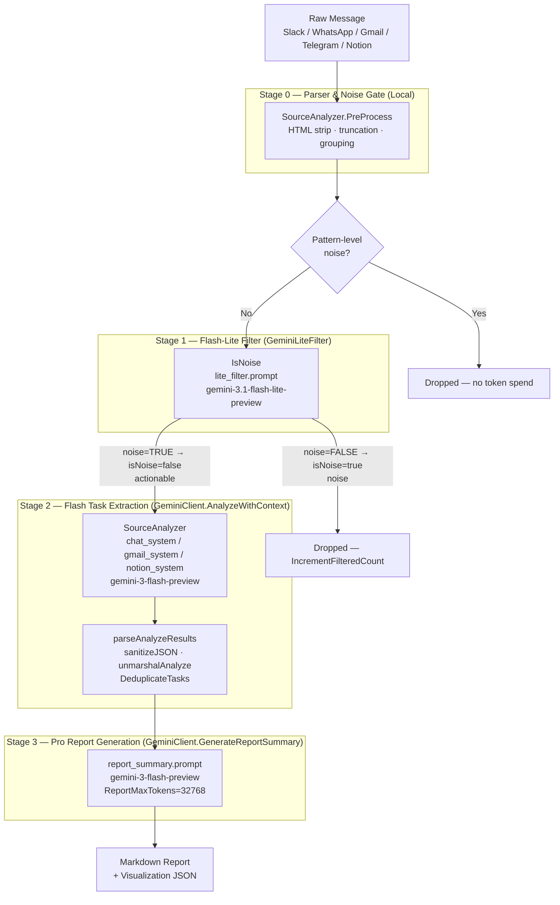

# 07. AI Filter Pipeline

> Cross-references: [02-domain-model.md], [06-scanner-pipeline.md], [08-services-business-logic.md], [09-identity-and-dedup.md], [15-observability.md]

---

## 1. 파이프라인 개요

Message Consolidator의 AI 처리 계층은 **비용·지연·정확도** 세 축을 동시에 최적화하기 위해 4단계 직렬 필터 파이프라인으로 설계되어 있습니다. 메시지는 왼쪽에서 오른쪽으로 한 방향만 흐르며, 각 단계는 다음 단계보다 더 강력하고 비싼 모델을 사용하는 대신 통과 볼륨을 줄여 총 비용을 제어합니다.



### 각 단계를 별도 모델로 분리한 이유

| 단계 | 모델 | 선택 이유 |
|---|---|---|
| Stage 0 | 로컬 코드 | 토큰 0 소비. 패턴 판별만으로 충분한 사전 필터 |
| Stage 1 | `gemini-3.1-flash-lite-preview` | 가장 저렴한 추론. 이진 분류(소음/비소음)이므로 정밀도보다 재현율이 중요 |
| Stage 2 | `gemini-3-flash-preview` | 구조화된 JSON 추출 + 다국어 작업명 영문 정규화. Flash는 Flash-Lite 대비 1.5–2× 정확도 우위 |
| Stage 3 | `gemini-3-flash-preview`<br/>(thinking model) | 복수 메시지 통합, 전략적 통찰, 긴 Markdown 보고서 생성. `ReportMaxTokens=32768`로 thinking 토큰을 충분히 확보 |

### Deltas — TECH.md 모델명 stale 경고

TECH.md §2는 "Gemini 3.1 Flash-Lite", "Gemini 3 Flash", "Gemini 3.1 Pro"로 기술하고 있으나, 실제 코드의 기본값은 다릅니다.

| TECH.md 표기 | 실제 기본값 (`gemini.go`) | 비고 |
|---|---|---|
| Gemini 3.1 Flash-Lite | `gemini-3.1-flash-lite-preview` | `lite_filter.prompt` 프론트매터에서도 동일 |
| Gemini 3 Flash | `gemini-3-flash-preview` | `analysisModel` 기본값 |
| Gemini 3.1 Pro | — | `report_summary.prompt` 프론트매터가 `gemini-3-flash-preview`로 라우팅. TECH.md §4의 "Pro" 표기는 stale |

Stage 3가 Pro가 아닌 Flash를 쓰는 것처럼 보이는 이유는 Flash thinking 모드가 활성화되기 때문입니다. `ReportMaxTokens=32768`을 할당하면 모델은 내부 reasoning에 ~24K 토큰을 소비하고 ~8K를 가시 출력에 사용합니다. 이 예산을 8192로 줄이면 보고서 섹션이 무음으로 잘립니다(`FinishReasonMaxTokens` 경고 발생).

---

## 2. Stage 0: Parser & Noise Gate

**파일**: `ai/analyzers.go`, `ai/parser.go` (프롬프트 파서), `services/ai_parser.go`

Stage 0은 토큰 비용이 전혀 없는 로컬 전처리 단계입니다. 메시지 원문을 AI에 전달하기 전에 콘텐츠 품질을 높이고 컨텍스트 윈도를 절약합니다.

### SourceAnalyzer.PreProcess

`SourceAnalyzer` 인터페이스의 `PreProcess(text string) string` 메서드가 채널별 전처리 로직을 캡슐화합니다.

| Analyzer | 구현체 | 입력 상한 | 전략 |
|---|---|---|---|
| `GmailAnalyzer` | `ai/analyzers.go` | 15,000자 | `text[:maxChars]` — 스레드 헤더부터 잘라 최신 본문 우선 |
| `ChatAnalyzer` | `ai/analyzers.go` | 30,000자 | `text[len(text)-maxChars:]` — 끝부터 잘라 최신 메시지 우선 |
| `NotionAnalyzer` | `ai/analyzers.go` | 무제한 | TODO: Notion 블록 필터링 예정 |

Gmail과 Chat이 잘라내는 방향(앞 vs 끝)이 다른 이유: 이메일 스레드는 인용이 하단에 쌓여 오래된 내용이 뒤에 위치하지만, 채팅 버퍼는 최신 메시지가 끝에 append되므로 잘라내는 방향이 반대입니다.

### Time-Topic Hybrid Grouping

`GroupMessagesByTime(msgs []types.RawMessage, interval time.Duration) [][]types.RawMessage` (ai/analyzers.go)는 동일 발신자가 단기간에 연속 전송한 메시지를 하나의 컨텍스트 묶음으로 합칩니다. 이렇게 하면 "오전에 연속으로 보낸 5개 메시지"가 각각 독립된 AI 호출을 유발하지 않습니다. 스캐너 레이어가 이 함수를 호출하여 배치를 구성합니다 (→ [06-scanner-pipeline.md]).

### services/ai_parser.go 역할

`services/ai_parser.go`는 AI 레이어가 아닌 서비스 레이어 유틸리티입니다. Stage 3 보고서 생성 후 Pro가 반환한 Markdown 안에 삽입된 시각화 JSON 블록을 꺼내는 역할을 합니다.

- `ExtractJSONBlock(content)` — ` ```json``` ` 펜스 우선 시도, 실패 시 `{…}` 브레이스 폴백
- `ExtractSection(content, sectionName)` — `## [Operations & Strategy Overview]` 같은 섹션 헤더로 특정 블록 추출

### Gmail 노이즈 게이트 (dc7c234 커밋)

2026-04-28 커밋 `dc7c234`은 Gmail 파이프라인에 "noise gate"를 추가하여 마케팅/뉴스레터 메시지가 Stage 1 Flash-Lite에 도달하기 전에 차단되도록 했습니다. 패턴 매칭으로 판별한 마케팅 발신자는 Stage 0에서 즉시 드롭되며 토큰을 소비하지 않습니다. 같은 커밋에서 "thread routing" 개선도 포함되어 Gmail 스레드의 CC/BCC 수신자가 잘못된 assignee로 매핑되는 오탐지를 서버 로직에서 최종 차단합니다.

---

## 3. Stage 1: Flash-Lite Filter

**파일**: `ai/filter_service.go`  
**프롬프트**: `ai/prompts/lite_filter.prompt` (model: `gemini-3.1-flash-lite-preview`)

### 구조

```go
type GeminiLiteFilter struct {
    client *GeminiClient
}

func (f *GeminiLiteFilter) IsNoise(ctx context.Context, email, source, text string) (bool, error)
```

`IsNoise`는 단 하나의 불리언 결정을 내립니다: 이 메시지가 소음인가? 반환 시맨틱이 주의가 필요합니다.

```
lite_filter.prompt 출력 의미:
  "TRUE"  → actionable  → isNoise = false  → Stage 2로 전진
  "FALSE" → noise       → isNoise = true   → 드롭
```

문자열 비교는 `strings.TrimSpace(strings.ToUpper(result)) == "FALSE"` 로 구현되어 있습니다. 역방향 논리(TRUE=비소음)는 프롬프트 설계에서 긍정 표현이 모델이 더 신뢰성 있게 출력하는 경향을 이용한 것입니다.

### Flash-Lite 선택 이유

Flash-Lite는 이진 분류 과제에서 아래 속성이 이상적입니다.

- **비용**: Flash 대비 약 1/5 수준
- **지연**: 단답 응답(TRUE/FALSE)에서 100ms 미만 달성 가능
- **충분한 정확도**: 인사말·감사·OTP 같은 패턴은 복잡한 추론이 필요 없음

Flash-Lite가 놓친 소음(False Negative)은 Stage 2에서 `state: none` 또는 빈 배열로 반환되므로 최종 비용 손실은 Flash-Lite 호출 1회로 한정됩니다.

### 필터링 대상 (lite_filter.prompt 정의)

- 인사말/감사/단순 확인 — "Hi", "좋은 아침입니다", "네", "OK"
- 시스템 알림 — OTP, 로그인 알림, 부재중 알림
- 광고·뉴스레터 (Stage 0 Gmail gate를 통과한 잔여분)
- 단순 정보 공유 (액션 없는 FYI)

### 토큰 귀속

```go
store.IncrementFilteredCount(email)              // 필터 카운터 증가
logTokenUsage(ctx, email, "LiteFilter", source, model, 0, resp)  // gemini.go
```

`source` 파라미터(`slack`, `whatsapp`, `gmail` 등)를 전달하여 채널별 비용 분석이 가능합니다 (→ [15-observability.md]).

---

## 4. Stage 2: Flash Task Extraction

**파일**: `ai/gemini.go` (Analyze, AnalyzeWithContext), `ai/analyzers.go` (SourceAnalyzer 구현체), `ai/few_shots.go` (FewShot 풀), `ai/utils.go` (unmarshalAnalyze)

### 진입 흐름

```
GeminiClient.Analyze(ctx, email, msg, language, source, room)
  → GetActiveContextTasks(ctx, db, email, source, room)       // 기존 작업 로드
  → AnalyzeWithContext(ctx, email, msg, language, source, room, tasks)
      → prepareAnalysisData(...)                              // ExtractionContext 구성
      → getAnalyzer(source)                                   // SourceAnalyzer 선택
      → analyzer.PreProcess(payload)                         // Stage 0
      → initModel(modelName, 0.0, 8192, "application/json")  // 온도 0으로 deterministic
      → generateWithRetry(ctx, model, prompt, 45s, 2)
      → parseAnalyzeResults(resp, currentUserID, userEmail)
```

### SourceAnalyzer 전략 패턴

`getAnalyzer(source string) SourceAnalyzer` (ai/analyzers.go)는 채널을 세 전략으로 라우팅합니다.

| source | 구현체 | 시스템 프롬프트 | 유저 프롬프트 |
|---|---|---|---|
| `gmail` | `GmailAnalyzer` | `gmail_system.prompt` | `gmail_user.prompt` |
| `slack`, `whatsapp`, `telegram` | `ChatAnalyzer` | `chat_system.prompt` | `chat_user.prompt` |
| `notion` | `NotionAnalyzer` | `notion_system.prompt` | `notion_user.prompt` |
| 기타 | `nil` → fallback | 하드코딩 JSON 스키마 | `data.MessagePayload` |

### ExtractionContext — 프롬프트 바인딩 타입

`ExtractionContext` (ai/executor.go)는 템플릿 렌더링에 사용되는 구조체입니다.

```go
type ExtractionContext struct {
    MessagePayload      string         // 전처리 완료된 메시지 텍스트
    CurrentTime         string         // UTC "2006-01-02 15:04:05 UTC"
    Version             string         // 릴리스 노트용 버전
    Locale              string         // 출력 언어 (기본 "Korean")
    FewShots            []FewShot      // RAG 선택된 예시 (chat만)
    ExistingTasksJSON   string         // 기존 활성 태스크 JSON (상태 평가용)
    EnrichedMessageJSON string         // 메타데이터 포함 메시지 전체 직렬화
    CurrentUser         string         // 호스트 사용자명 (requester/assignee 구분용)
    CurrentUserEmail    string         // 이메일 기반 신원 고정
    CurrentUserID       store.UserID   // DB 매핑 assignee 정규화용
    ParentTask          string         // completion check 전용
    StaleThreshold      int            // 보고서 stalled 판정 영업일 수
}
```

기존 작업 직렬화 시 필드를 최소화합니다.

```go
// id + task + original_text(120자 truncate) 만 포함
// Why: source/room은 쿼리 필터로 이미 범위 제한됨. thread_id는 프롬프트가 참조 안 함.
type contextTask struct {
    ID       store.MessageID `json:"id"`
    Task     string          `json:"task"`
    Original string          `json:"original_text,omitempty"`
}
```

### 추출 결과 JSON 스키마

모델에 `"application/json"` MIME을 지정하여 JSON 모드를 강제합니다. AI가 반환하는 각 태스크 아이템의 구조는 `flexItem` (ai/utils.go)이 수용합니다.

```
{
  "id": number | string,     // AI가 임의 직렬화 — normalize됨
  "state": "new|update|resolve|cancel|none",
  "task": "영문 작업 제목",
  "requester": "발신자명",
  "assignee": "수신자명 | shared | __CURRENT_USER__",
  "assigned_to": "보조 수신자명 (optional)",
  "assignee_reason": "판단 근거",
  "category": "PROMISE|QUERY|POLICY|WAITING",
  "deadline": "자연어 기한",
  "source_ts": "메시지 ID 또는 타임스탬프",
  "subtasks": [...]           // 선택적
}
```

### 상태 평가 (State Evaluation)

`ExistingTasksJSON` 필드에 기존 활성 태스크 목록을 주입함으로써 AI는 동일 작업을 재추출하는 대신 `state: update/resolve/cancel`로 마킹합니다. 이는 Stage 2가 단순 추출기가 아니라 **작업 상태 기계**임을 의미합니다.

### 태스크 카테고리 정의

| 카테고리 | 의미 |
|---|---|
| `PROMISE` | 특정인이 명시적으로 수행을 약속한 작업 |
| `QUERY` | 미지정 그룹에게 던진 질문/이슈 |
| `POLICY` | 정책 선언 (담당자=`shared`) |
| `WAITING` | 선행 조건이 완료되기를 기다리는 작업 |

---

## 5. Stage 2 세부: 태스크 파싱 & 디듀플리케이션

**파일**: `ai/utils.go`, `ai/gemini.go` (parseAnalyzeResults)

### sanitizeJSON — 3단계 정제

AI 응답은 마크다운 코드 블록이나 설명 텍스트가 섞여 도착할 수 있습니다.

```
sanitizeJSON(raw)
  1. CleanMarkdownText    — ```markdown, ```json, ``` 제거 + 공백 trim
  2. extractMarkdownBlock — ```json...``` 펜스 안 본문 추출
  3. extractBracketPayload — 첫 [ 또는 { 부터 마지막 ] 또는 } 까지 추출
                             잘린 배열 (ends with }) → "]" auto-repair
```

### unmarshalAnalyze — 3형식 허용

```
1. 단일 객체 {…}         — New Consolidated Format
2. 배열 [{…}, {…}]       — Legacy/Fallback
3. 래퍼 객체 {tasks: []} 또는 {items: []} — 일부 모델 변형
```

### mapFlexToTodo — 신원 정규화

`__CURRENT_USER__`, `나`, `Me` 같은 대명사를 처리합니다.

```go
if f.AssigneeID != nil && *f.AssigneeID == currentUserID {
    assignee = userEmail  // 실제 이메일로 교체
}
```

### 후처리 필터링

`state: "none"` 아이템은 AI가 "기존 작업과 관련 있지만 새 액션은 없음"을 표현하는 컨텍스트 플레이스홀더입니다. 이 아이템은 `parseAnalyzeResults`에서 걸러냅니다.

최종 반환 전 `store.DeduplicateTasks(filtered)` 호출 — Jaro-Winkler 유사도 0.85 임계값 기반 의미 중복 제거 (→ [09-identity-and-dedup.md]).

### 추론 로그

```go
g.logInferenceAsync(source, msg.RawContent, raw)
```

Fire-and-forget goroutine으로 `logger.LogAIInferenceToFile`과 `store.LogAIInference`를 호출합니다. context를 인자로 받지 않는 이유는 호출자 TX가 종료된 후에도 로그를 비동기로 기록하기 위함입니다 (→ [15-observability.md]).

---

## 6. Stage 3: Pro Report Generation

**파일**: `ai/gemini.go` (GenerateReportSummary, GenerateVisualizationData, EvaluateTaskTransition)  
**프롬프트**: `ai/prompts/report_summary.prompt` (model: `gemini-3-flash-preview`, v2.7.0)  
**호출자**: `services/` 보고서 서비스 (→ [08-services-business-logic.md])

### GenerateReportSummary

```go
func (g *GeminiClient) GenerateReportSummary(ctx context.Context, email string, tasks string, reportID store.ReportID) (string, error)
```

입력 `tasks`는 해당 기간의 전체 활성+완료 태스크 JSON 직렬화입니다. 보고서 서비스가 기간(daily/weekly)에 따라 집계한 후 이 함수에 전달합니다.

```go
data := ExtractionContext{
    MessagePayload: tasks,
    CurrentTime:    time.Now().UTC().Format("2006-01-02 15:04:05 UTC"),
    Locale:         "English",
    StaleThreshold: store.GetStaleThresholdWorkingDays(),  // 현재 3영업일
}
```

`StaleThreshold`는 보고서 내 "Stalled Tasks" 섹션의 판정 기준으로, 설정값이 바뀌면 보고서 로직도 자동으로 따라갑니다.

### ReportMaxTokens = 32768

```go
const ReportMaxTokens = 32768
// Why: Gemini 3 Flash는 thinking model — max_output_tokens가 thinking + 가시 출력
// 모두 예산함. 8192로 설정 시 thinking이 ~7800 소비 → 보고서가 ~300 토큰으로 잘림.
// 32768 = thinking ~24K + 가시 출력 ~8K 헤드룸.
```

`FinishReasonMaxTokens` 감지 시 경고 로그:

```go
if fr := resp.Candidates[0].FinishReason; fr == genai.FinishReasonMaxTokens {
    logger.Warnf("[GEMINI] ReportSummary output truncated: FinishReason=MAX_TOKENS, ...")
}
```

### GenerateVisualizationData

`ResponseSchema` (`genai.Schema`)를 주입하여 JSON 형식을 강제합니다. hallucination 방어 목적.

```
Schema:
  nodes: [{id, name, value, category}]   — 사람/팀 노드
  links: [{source, target, weight}]      — 핸드오버/멘션 엣지
```

이 데이터는 프런트엔드 인적 네트워크 그래프 시각화에 사용됩니다.

### EvaluateTaskTransition

```go
func (g *GeminiClient) EvaluateTaskTransition(ctx context.Context, email, parentTask, replyText string) (TaskTransition, error)
```

```go
type TaskTransition struct {
    Status      string `json:"status"`       // NEW | UPDATE | RESOLVE | NONE
    UpdatedText string `json:"updated_text"` // UPDATE 시 새 영문 요약
}
```

부모 메시지의 작업과 자식 답변의 관계를 분석하여 작업 상태를 결정론적으로 전이시킵니다. `completion_check.prompt` (model: `gemini-3.1-flash-lite-preview`)를 사용하므로 Flash-Lite로 내려가는 드문 케이스입니다 — completion 판별은 이진에 가까운 판단이기 때문입니다.

### Daily Digest vs Weekly Report 프롬프트 차이

두 경우 모두 `report_summary.prompt`를 공유하지만 입력 데이터의 시간 범위와 `Locale` 파라미터가 다릅니다. Daily digest는 단일 사용자 하루치 태스크, weekly report는 복수 수신자(`multi-recipient`, a3a1e01 커밋)를 지원하며 보고서 서비스가 집계 로직을 달리합니다 (→ [08-services-business-logic.md]).

---

## 7. RAG (Retrieval-Augmented Generation)

**파일**: `ai/rag.go` (SelectFewShots, calculateScore), `ai/few_shots.go` (GetDefaultFewShots)

### 아키텍처 위치

Message Consolidator의 RAG는 벡터 DB 없이 동작하는 **경량 키워드 기반 few-shot 선택기**입니다. Stage 2의 `ChatAnalyzer.GetSystemInstruction`에서만 활성화됩니다.

```go
func (c *ChatAnalyzer) GetSystemInstruction(data ExtractionContext) string {
    allShots := GetDefaultFewShots()
    data.FewShots = SelectFewShots(data.MessagePayload, allShots, 2)  // 최대 2개
    res, _ := LoadPrompt(PromptChatSystem).Render(data)
    return res
}
```

Gmail·Notion은 few-shot을 주입하지 않습니다 — 이메일/문서는 채팅보다 구조가 명확해서 예시 없이도 추출이 안정적이기 때문입니다.

### Few-Shot 풀 (GetDefaultFewShots)

`ai/few_shots.go`는 9개의 다국어 예시를 정의합니다.

| # | 언어 | 시나리오 | 카테고리 |
|---|---|---|---|
| 1 | EN | Alice→Bob API doc 요청, Bob 수락 | PROMISE |
| 2 | EN | Manager→Jaejin blog post 마감 | PROMISE |
| 3 | EN | User→Dev 앱 배포 요청 | PROMISE |
| 4 | ID (인니어) | POC report 검토 요청 | PROMISE |
| 5 | ID | Nginx log 이슈 그룹 공유 | QUERY |
| 6 | ID | 자기 스스로 내일 보고 약속 | PROMISE (requester=assignee) |
| 7 | EN | 자기 POC prep 약속 | PROMISE (requester=assignee) |
| 8 | ID | 그룹 정책 지시 | POLICY |
| 9 | EN | 선행 조건 대기 | WAITING |

특히 예시 6·7은 `requester == assignee` 케이스를 명시적으로 다루어, 화자가 스스로 약속하는 상황에서의 오탐지(타인 assignee로 추출)를 방지합니다.

### SelectFewShots 알고리즘 (ai/rag.go)

```go
func SelectFewShots(payload string, examples []FewShot, limit int) []FewShot
```

벡터 임베딩 없이 키워드 스코어링으로 최근접 예시를 선택합니다.

```go
func calculateScore(payload, input string) int {
    // 1. 채널/동작 키워드 매칭 (+1 per match)
    keywords := []string{"slack", "gmail", "whatsapp", "update", "finish", "deploy", "check"}
    
    // 2. 메시지 ID 패턴 가중치 ([ID:Slack...] 형식 +2)
    if strings.Contains(payload, "id:") && strings.Contains(input, "id:") {
        score += 2
    }
}
```

알고리즘은 `sort.Slice` 내림차순 정렬 후 상위 `limit`개 반환합니다. 시간 복잡도는 O(n log n)이며 풀 크기가 고정적이므로 실질적으로 O(1)입니다.

### 토큰 예산 관리

```go
func (ctx *ExtractionContext) LimitFewShots(max int) {
    if max <= 0 || len(ctx.FewShots) <= max { return }
    ctx.FewShots = ctx.FewShots[:max]
}
```

`ExtractionContext.LimitFewShots` (ai/executor.go)는 호출자가 few-shot 주입 개수를 O(1) 슬라이싱으로 상한 설정합니다. 현재 `ChatAnalyzer`는 `SelectFewShots(..., 2)` 호출 시 이미 2로 제한되므로 이중 방어입니다.

token_usage 테이블에는 step=`Analyze`, model=`gemini-3-flash-preview`로 기록됩니다. few-shot 포함 여부에 따른 prompt 토큰 증가는 이 레코드에 자연스럽게 반영됩니다 (→ [15-observability.md]).

---

## 8. Prompts 카탈로그

**파일**: `ai/prompts.go` (PromptName 타입 + LoadPrompt), `ai/prompts/*.prompt`

### PromptName — 컴파일 타임 인벤토리

`PromptName` 타입 별칭과 상수는 파일명을 코드에 고정시켜 오타나 파일 삭제를 런타임이 아닌 빌드 시점에 감지합니다.

```go
type PromptName string

const (
    PromptBatchTranslator      PromptName = "batch_translator.prompt"
    PromptChatSystem           PromptName = "chat_system.prompt"
    PromptChatUser             PromptName = "chat_user.prompt"
    PromptCompletionCheck      PromptName = "completion_check.prompt"
    PromptGmailSystem          PromptName = "gmail_system.prompt"
    PromptGmailUser            PromptName = "gmail_user.prompt"
    PromptIdentityGroupMerge   PromptName = "identity_group_merge.prompt"
    PromptLiteFilter           PromptName = "lite_filter.prompt"
    PromptNotionSystem         PromptName = "notion_system.prompt"
    PromptNotionUser           PromptName = "notion_user.prompt"
    PromptReleaseNotesCombined PromptName = "release_notes_combined.prompt"
    PromptReportSummary        PromptName = "report_summary.prompt"
    PromptReportTranslator     PromptName = "report_translator.prompt"
    PromptTaskMergeSummary     PromptName = "task_merge_summary.prompt"
    PromptTaskTranslator       PromptName = "task_translator.prompt"
    PromptTranslationSystem    PromptName = "translation_system.prompt"
)
```

총 **16개** 상수. `new_extraction.prompt`는 `ai/prompts/` 디렉토리에 파일이 존재하지만 `prompts.go`에 상수가 없으므로 현재 코드 경로에서 참조되지 않는 실험적 파일입니다.

### ai/prompts/ 파일 인벤토리 (17개 파일)

| 파일명 | 모델 라우팅 | 버전 | 용도 |
|---|---|---|---|
| `batch_translator.prompt` | `gemini-3.1-flash-lite-preview` | — | 태스크 배치 번역 (JSON 응답) |
| `chat_system.prompt` | `gemini-3-flash-preview` | 1.8.0 | Chat 채널 태스크 추출 시스템 프롬프트 |
| `chat_user.prompt` | `gemini-3-flash-preview` | 1.0.0 | Chat 채널 태스크 추출 유저 프롬프트 |
| `completion_check.prompt` | `gemini-3.1-flash-lite-preview` | 2.0.0 | 답변→부모 태스크 상태 전이 판별 |
| `gmail_system.prompt` | `gemini-3-flash-preview` | 1.6.0 | Gmail 스레드 태스크 추출 시스템 프롬프트 |
| `gmail_user.prompt` | `gemini-3-flash-preview` | 1.0.0 | Gmail 스레드 태스크 추출 유저 프롬프트 |
| `identity_group_merge.prompt` | `gemini-3-flash-preview` | 1.1.0 | 연락처 동일인 그룹 제안 |
| `lite_filter.prompt` | `gemini-3.1-flash-lite-preview` | 1.0.0 | Stage 1 이진 소음 필터 |
| `new_extraction.prompt` | `gemini-3-flash-preview` | 2.1.0 | (미사용 — 실험적) |
| `notion_system.prompt` | `gemini-3-flash-preview` | 1.2.0 | Notion 페이지 태스크 추출 시스템 프롬프트 |
| `notion_user.prompt` | `gemini-3-flash-preview` | 1.0.0 | Notion 페이지 태스크 추출 유저 프롬프트 |
| `release_notes_combined.prompt` | `gemini-3-flash-preview` | 2.0.0 | 릴리스 노트 생성 |
| `report_summary.prompt` | `gemini-3-flash-preview` | 2.7.0 | Stage 3 보고서 생성 |
| `report_translator.prompt` | `gemini-3.1-flash-lite-preview` | 1.0.0 | 완성된 보고서 Markdown 번역 |
| `task_merge_summary.prompt` | `gemini-3-flash-preview` | — | 병합된 태스크 영문 제목 30자 요약 |
| `task_translator.prompt` | `gemini-3.1-flash-lite-preview` | 1.0.0 | 단일 태스크 메시지 번역 |
| `translation_system.prompt` | `gemini-3.1-flash-lite-preview` | 1.0.0 | 배치 번역 시스템 프롬프트 |

### 프롬프트 파일 포맷 (Frontmatter)

모든 프롬프트는 YAML 프론트매터 + 본문 구조를 따릅니다.

```
---
name: <prompt_name>
version: <semver>
model: <gemini-model-id>        ← 빌드 시 고정; 빈 칸이면 호출자 기본값 사용
temperature: <float>            ← optional; 현재 ParsedPrompt.Render에서 미사용
response_mime_type: <mime>      ← optional
---
[시스템 프롬프트 본문]
```

`parser.go`의 `ParsePrompt`가 `---` 구분자로 헤더를 파싱하여 `ParsedPrompt.Meta.Model`에 저장합니다. `gemini.go`의 `getEffectiveModel`은 이 값이 비어있으면 호출자 기본값(`g.analysisModel` 또는 `g.translationModel`)을 사용합니다.

### 프롬프트 수정 워크플로

1. `ai/prompts/<name>.prompt` 파일 직접 편집
2. 개발 환경에서는 `runtime.Caller(0)`로 파일시스템 경로를 탐색하여 즉시 반영 (바이너리 재빌드 불필요)
3. 프로덕션 빌드에서는 `//go:embed prompts/*.prompt`로 바이너리에 내장되므로 재빌드 필요
4. 회귀 테스트: `ai/*_test.go`, `ai/prompts_verify_test.go` 실행 (→ [17-testing.md])
5. `version` 필드 증가 권장 (변경 추적용)

---

## 9. Identity Resolver

**파일**: `ai/identity_resolver.go`  
**상세**: → [09-identity-and-dedup.md]

`IdentityResolver`는 연락처 DB에 저장된 `ContactRecord` 목록을 분석하여 동일인일 가능성이 높은 그룹을 AI가 제안하는 독립적인 기능입니다. 파이프라인 4단계와는 별개로 실행됩니다.

```go
type IdentityResolver struct {
    client *GeminiClient
}

func (r *IdentityResolver) ProposeGroups(ctx context.Context, contacts []store.ContactRecord) ([]MergeGroup, error)
```

- 20개 초과 시 `identityChunkSize=20`으로 분할 처리
- `identity_group_merge.prompt` (model: `gemini-3-flash-preview`, temp: 0.1)
- 응답: `[]MergeGroup{ContactIDs, Confidence, Reason}`
- 마크다운 코드 펜스 수동 제거 후 JSON 언마샬 (sanitizeJSON 미사용 — 프롬프트 응답이 단순 배열이므로)
- trace step: `Gemini-IdentityResolve`, elapsed + 연락처 수를 value로 기록
- 비용 귀속: `store.AddTokenUsage` 미호출 — IdentityResolver가 `logTokenUsage`를 직접 호출하지 않음 (개선 여지)

---

## 10. 에러 처리 + 재시도 + 비용 관측

### 재시도 전략 (generateWithRetry)

```go
func generateWithRetry(ctx context.Context, model *genai.GenerativeModel, prompt genai.Part,
    timeout time.Duration, maxRetries int) (*genai.GenerateContentResponse, error)
```

- Attempt 당 독립적인 `context.WithTimeout(ctx, timeout)` 생성
- Exponential backoff + jitter: `backoff = 2^attempt seconds`, jitter = `backoff × [0.5, 1.0)` (thundering herd 방지)
- `ctx.Err() != nil` 즉시 탈출 (호출자 cancel/deadline 우선)
- API key를 로그에서 마스킹: `maskAPIKey(err)` — `key=<value>` 패턴을 `key=***`로 치환

| 호출 | timeout | maxRetries |
|---|---|---|
| LiteFilter (IsNoise) | 30s | 2 |
| Analyze (AnalyzeWithContext) | 45s | 2 |
| GenerateReportSummary | 180s | 2 |
| EvaluateTaskTransition | 30s | 2 |
| TranslateTasksBatch | 45s | 3 |
| GenerateMergedTaskTitle | 10s | 1 |
| IdentityResolver (proposeChunk) | 300s | 2 |

### JSON 파싱 실패 Fallback

```
1차: json.Unmarshal(sanitizeJSON(raw))         — 정제 후 직접 언마샬
2차: tryDecodeFlexItems                        — 배열 / {tasks:[]} / {items:[]} 3형식 시도
3차: 명시적 빈 배열 [] 반환                    — 작업 없음으로 처리 (오류 전파 안 함)
최종: fmt.Errorf("no valid items found")       — 호출자에 전파
```

번역 실패 fallback:

```
1차: json.Unmarshal → []store.TranslateRequest
2차: decodeTranslationFallback → store.TranslateResponse.Translations
```

### Rate Limit / Quota 에러

현재 `generateWithRetry`가 모든 에러를 동일하게 재시도합니다. 429 (Rate Limit), 503 (Service Unavailable) 등의 HTTP 에러는 backoff가 자연스럽게 처리하지만 코드 레벨에서 HTTP status를 구분하지는 않습니다.

### token_usage 기록

```go
func logTokenUsage(ctx context.Context, email, step, model, source string, reportID store.ReportID,
    resp *genai.GenerateContentResponse)
```

`resp.UsageMetadata`가 nil이면 no-op으로 처리합니다 (timeout/cancel 시 Gemini가 메타데이터를 미반환).

실패 시에도 비용 귀속을 시도합니다.

```go
// ReportSummary, TranslateTasksBatch 재시도 소진 시:
store.AddTokenUsage(email, step, modelName, "failed", reportID, 0, 0)
```

`trace.Step`으로 각 AI 호출의 경과 시간이 WhaTap APM 트랜잭션에 step으로 기록됩니다.

```
Gemini-Analyze          → AnalyzeWithContext
Gemini-LiteFilter       → IsNoise
Gemini-ReportSummary    → GenerateReportSummary
Gemini-Visualization    → GenerateVisualizationData
Gemini-EvaluateTransition → EvaluateTaskTransition
Gemini-Translate        → Translate
Gemini-TranslateReport  → TranslateReport
Gemini-TranslateTask    → TranslateTaskMessage
Gemini-MergeSummary     → GenerateMergedTaskTitle
Gemini-IdentityResolve  → proposeChunk
TokenUsage-<step>       → 프롬프트/완성 토큰 수 포함
```

`source` 파라미터로 채널(slack/gmail/whatsapp 등)별 토큰 분류가 가능하며, `reportID`로 보고서 단위 비용 추적이 가능합니다 (→ [15-observability.md]).

---

## 11. Deltas from Legacy Docs & Cross-References

### Deltas

| 항목 | TECH.md 표기 | 실제 구현 |
|---|---|---|
| Stage 3 모델 | "Gemini 3.1 Pro" | `gemini-3-flash-preview` (thinking mode) |
| Stage 2 모델 | "Gemini 3 Flash" | `gemini-3-flash-preview` — 명칭은 일치 |
| Stage 1 모델 | "Gemini 3.1 Flash-Lite" | `gemini-3.1-flash-lite-preview` — 명칭은 일치 |
| Stage 3 토큰 예산 | 미기술 | `ReportMaxTokens=32768` (thinking 소비분 반드시 포함) |
| Few-shot RAG | "RAG-like selection" | 키워드 기반 스코어링, 벡터 DB 없음 |
| IdentityResolver token_usage | 미기술 | 현재 미귀속 (개선 여지) |
| `new_extraction.prompt` | 미기술 | 파일 존재, 상수 미등록 — 실험적 |

### Cross-References

| 참조 대상 | 이유 |
|---|---|
| [02-domain-model.md] | `TodoItem`, `ConsolidatedMessage`, `TranslateRequest` 등 도메인 타입 정의 |
| [06-scanner-pipeline.md] | Stage 0 GroupMessagesByTime 호출, 채널별 스캔 루프 → AI 파이프라인 진입점 |
| [08-services-business-logic.md] | Stage 3 GenerateReportSummary 호출자 (보고서 서비스, daily/weekly 집계) |
| [09-identity-and-dedup.md] | IdentityResolver 상세, DeduplicateTasks Jaro-Winkler 로직 |
| [15-observability.md] | logTokenUsage, trace.Step, LogAIInferenceToFile, ai_logger 상세 |
