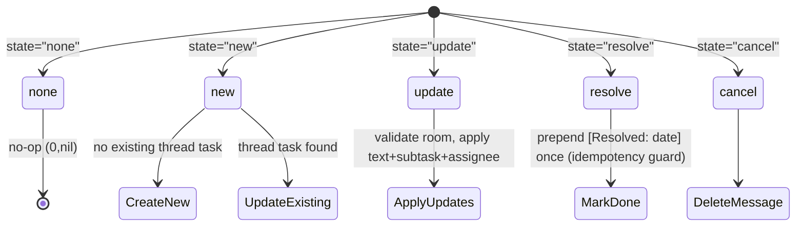
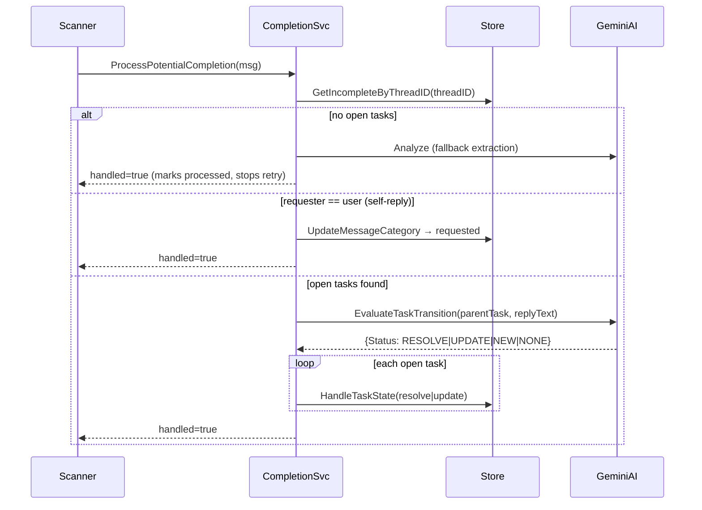
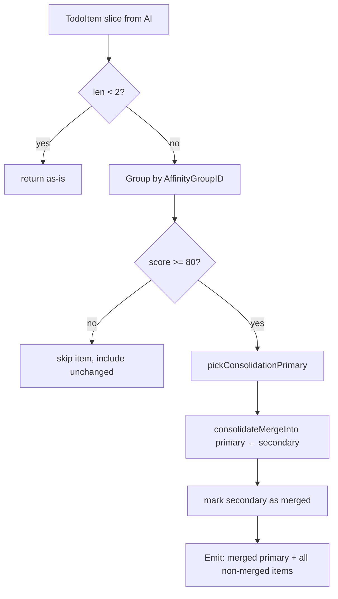
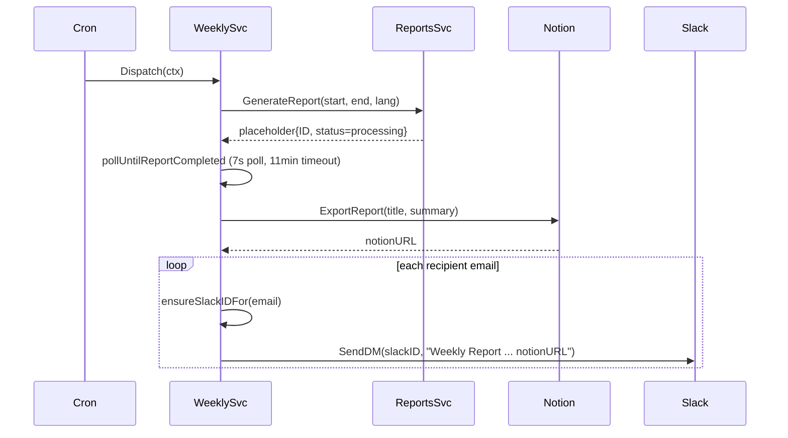

# 08. Services — Business Logic Layer

> Cross-references: `→ [03-backend-architecture.md]`, `→ [04-data-layer.md]`,
> `→ [06-scanner-pipeline.md]`, `→ [07-ai-filter-pipeline.md]`,
> `→ [09-identity-and-dedup.md]`, `→ [10-locking-and-concurrency.md]`,
> `→ [11-handlers-and-api.md]`

---

## 1. Service Layer Responsibilities

The service layer sits between HTTP handlers and the store layer, orchestrating
business logic without touching raw SQL or external SDK internals directly.

### Dependency Direction

```
Handler (11) → Service (08) → Store (04) → DB
                ↓
         channels/ (adapters)
         ai/ (LLM clients)
```

Rules enforced:
- Services **never** call external SDKs directly (Slack, Gmail, Notion, Gemini).
  They receive interface types whose concrete implementations live in `channels/`
  or `ai/`. This enables test doubles without network I/O.
- Store layer must not contain business logic (`→ [04-data-layer.md]`).
- Handlers own HTTP concern only; they delegate decisions to services
  (`→ [11-handlers-and-api.md]`).

### Service Inventory

| File | Type | Primary Responsibility |
|---|---|---|
| `task_builder.go` | Pure functions | `ConsolidatedMessage` construction from multi-channel envelope data |
| `tasks.go` | `TasksService` | Formatting, assignee rules, category assignment |
| `tasks_alias.go` | Package-level functions | `GetEffectiveAliases` — primary name / email / prefix / registered aliases |
| `tasks_merge.go` | `TasksService` | `MergeTasks` — AI-generated summary title, multi-task merge |
| `tasks_translate.go` | `TasksService` | Batch translation trigger, JIT translation goroutine |
| `task_routing.go` | Package-level functions | State-machine routing: new / update / resolve / cancel |
| `completion_service.go` | `CompletionService` | Thread-aware completion detection and fallback extraction |
| `consolidate.go` | Pure functions | Affinity-group deduplication before DB write |
| `reports_service.go` | `ReportsService` | Core infrastructure (Log type, `GetRecentMessages`, on-demand translation) |
| `reports_prepare.go` | `ReportsService` | Message preparation, identity resolution, risk keyword detection, activity stats |
| `reports_viz.go` | `ReportsService` | `GraphData` / `Node` / `Edge` types, visualization data construction |
| `daily_digest_service.go` | `DailyDigestService` | Daily Slack DM digest (Block Kit) |
| `weekly_report_service.go` | `WeeklyReportService` | Weekly report → Notion export → Slack DM |
| `reminder_service.go` | `ReminderService` | Deadline reminder DMs via configurable time windows |
| `translation_service.go` | `TranslationService` | Batched/JIT Gemini translation with singleflight dedup |
| `notion_export.go` | `NotionExporter` | Markdown → Notion Block API page creation |
| `lock_service.go` | `RoomLockService` | Per-room mutex to prevent scanner race conditions |
| `ai_parser.go` | Pure functions | AI response JSON extraction (fenced + brace fallback) |
| `embedding_service.go` | `EmbeddingService` | Hybrid Archive Search — FTS5 BM25 + cosine via RRF fusion |
| `slack_bot.go` | `SlackBot` | Slack DM bot command dispatch and Block Kit interaction handling |
| `slack_bot_blocks.go` | Pure functions | Block Kit rendering — paginated task list, action buttons |

---

## 2. Task Pipeline

The task pipeline converts a raw inbound message into a persisted
`ConsolidatedMessage`. Three files collaborate:

### 2.1 `task_builder.go` — Envelope-Driven Construction

`BuildTask(ctx, TaskBuildParams) ConsolidatedMessage` is the single factory that
assembles a `ConsolidatedMessage` from cross-channel envelope metadata and AI
output.

`TaskBuildParams` captures every source-specific field that callers in
`channels/` supply:

| Field | Purpose |
|---|---|
| `SenderRaw` / `SenderEmail` | Authoritative requester — AI result is last-resort fallback |
| `IsCcOnly` | Overrides AI self-assignment; forces `AssigneeShared` so CC'd messages land in the Reference tab |
| `RepliedToID` | Thread linkage for completion detection |
| `GmailClassification` | `CategorySent` / `CategoryMine` / `CategoryOthers` hint |
| `OriginalText` | Stored verbatim for evidence snippets in reports |

**Requester resolution chain (Phase J Path B):**

1. `SenderRaw` (resolved display name from platform adapter)
2. `SenderEmail` (raw identifier)
3. AI-extracted `Item.Requester` only when both envelope sources are empty

Envelope metadata is authoritative because platform adapters have ground truth
(e.g., WhatsApp JID, Slack user profile). AI is allowed to fill in only when the
adapter could not resolve the sender.

**Self-DM external requester preservation (`feat(chat): preserve external requester`):**

`aiRequesterOverrideForSelfDM` introduces a narrow exception: when the envelope
sender is the logged-in user _and_ the AI extracted a distinct (non-self) requester,
the AI value wins over the envelope. This handles the chat_system 1.9.0
reported-speech rule — a user who forwards a colleague's request to their own
self-DM chat as a memo retains the original external requester name in the
`ConsolidatedMessage`, not the user's own name.

```go
// resolveRequester: self-DM exception path
if ai := aiRequesterOverrideForSelfDM(ctx, p); ai != "" {
    return ai  // external requester recorded in reported-speech memo
}
```

Without this exception the envelope override would lose the colleague's identity,
collapsing all self-DM memos to the same requester (the user themselves).

**Assignee resolution chain:**

1. AI-extracted assignee, normalized via `normalizeAIAssignee`
2. `category=PROMISE` with empty AI → `SenderRaw` (speaker made the promise)
3. Falls back to `AssigneeShared` when AI returns empty

The `IsCcOnly` flag intercepts step 1 — if the AI self-assigns but the user is
only on Cc, the assignee is forced to `AssigneeShared`. This prevents informational
CC copies from appearing in the personal inbox tab.

**Task title fallback (`resolveTaskTitle`):**

Empty, stub ("NONE"), or very short (< 5 chars) AI titles trigger three fallback
levels:
1. Gmail `S:` subject line extracted from `OriginalText`
2. First 60 runes of `OriginalText`
3. `[<room>]` or `[Unidentified message]`

### 2.2 `tasks.go` / `tasks_alias.go` / `tasks_merge.go` / `tasks_translate.go` — TasksService

`TasksService` handles all post-persistence, presentation-layer concerns. Responsibilities are split into four focused files: core formatting (`tasks.go`), alias resolution (`tasks_alias.go`), merge logic (`tasks_merge.go`), and translation pipeline (`tasks_translate.go`).

**`FormatMessagesForClient`**

Performs bulk identity resolution before iterating messages:

```
extractUniqueIdentifiers(msgs)          // gather all Requester/Assignee strings
store.BulkResolveAliases(ctx, ids)      // single DB query instead of N
store.GetUserAliasesByEmail(ctx, email) // user's registered aliases
GetEffectiveAliases(user, aliases)      // name + email + prefix + aliases
```

For each message: alias map lookups replace Requester/Assignee strings, then
`applyAssigneeRules` and `assignCategory` run.

**Category assignment priority (server-side):**

| Priority | Condition | Category |
|---|---|---|
| 1 | Assignee matches user identity OR `AssigneeCanonical == user.Email` | `personal` |
| 2 | Assignee == `"shared"` | `shared` |
| 3 | `RequesterCanonical == user.Email` | `requested` |
| 4 | (none of the above) | `others` |

Classification uses only structural identity fields — never task body text. This
keeps classification stable across languages and translation states
(`→ [09-identity-and-dedup.md]`).

**Batch translation flow (`PrepareMessagesForClient`):**

```
FormatMessagesForClient   // resolve identities (uses English Task text)
ApplyTranslations         // overlay cached translations
StripOriginalText         // reduce payload: set HasOriginal flag, clear field
```

`ApplyTranslations` fetches cached translations from `task_translations` in a
single batch call. Missing IDs trigger `triggerJITTranslation`, a goroutine that
runs `ProcessBatchTranslation` with a 60-second timeout, so the current response
returns English immediately and the translation appears on the next page load.

The translated payload format (stored in `translated_text`):
- Plain string when no subtasks
- JSON `{"t":"<main>","s":["<sub1>","<sub2>"]}` when subtasks exist

**`MergeTasks`** calls `GenerateMergedTaskTitle` via `TaskAI` interface to
produce an AI-summarized English title. If the AI call fails or returns
whitespace, it concatenates all source titles with ` | ` separator, truncating
to 250 characters. An all-blank input preserves `dest.Task` verbatim.

**`ReclassifyUserTasks` and `RestoreGmailCCAssignment`** are self-healing
operations that fix historical misclassification. `RestoreGmailCCAssignment`
uses an `errgroup` with a concurrency limit of 20 to parallelize Gmail API
header resolution across a batch of messages
(`→ [09-identity-and-dedup.md]`).

### 2.3 `task_routing.go` — State Machine

`HandleTaskState` is the central dispatch function for all task mutations. It
logs a `DecisionLog` entry after every routing decision for observability.



Key invariants:
- `validateTargetTask` rejects cross-room operations (security boundary: task
  in room A cannot be mutated by a message from room B).
- `handleResolve` checks `resolvedPrefixMarker` (`"[Resolved:"`) before
  appending — duplicate AI signals or completion-service/scanner overlap never
  writes the prefix twice.
- `handleUpdate` wraps its statements in `runTaskTx` — if the caller passes a
  `*sql.Tx`, the existing transaction is reused; otherwise a new one starts.
- `applyAssigneeChange` (Phase J Path B): `@mention` reassignment bumps
  `assigned_at` to the trigger envelope timestamp. Same assignee = no-op.

For new tasks, `handleNew` applies a three-level resolution:
1. `msg.ID != 0` → update existing row
2. `msg.ThreadID` matches an incomplete thread task → update parent
3. Otherwise → create via `store.SaveMessage`

### 2.4 `completion_service.go` — Thread-Aware Completion

`CompletionService.ProcessPotentialCompletion` intercepts reply messages before
the main extraction loop. It prevents double AI calls and correctly closes
parent tasks when a reply constitutes a completion signal.

Flow:



**Commit ceaf099 context:** `GetLatestThreadAssignee` was added to propagate
a resolved thread's last non-shared assignee to the fallback new extraction
path. When the thread's parent task was closed, the fallback would otherwise
create an orphan task with no assignee. The store function retrieves the
most recent `assignee` from `messages` filtered by `thread_id`, excluding
`"shared"` values.

The self-reply shortcut (`RequesterCanonical == UserEmail`) uses structural
metadata, not AI, to prevent the common "Thanks! / Done." message from
falsely closing a task that only the actual assignee should close.

---

## 3. Consolidate — Pre-Persistence Deduplication

`consolidate.go` runs inside the scanner pipeline **before** any DB write,
eliminating duplicate AI extractions from the same message batch.

### Algorithm



**Primary selection** (`pickConsolidationPrimary`):
If the secondary has state `"update"` and the primary does not, the roles
swap — the update item becomes the canonical record because it carries the
most recent data.

**Merge content** (`consolidateMergeInto`):
Secondary content is appended to the primary with a timestamped separator:

```
<primary.Task>

--- [Update: 2026-04-30] ---
<secondary.Task>
```

If `secondary.Task` is already contained in `primary.Task` (substring check),
the merge is skipped — the content is already present.

**Threshold:** `MinConsolidationScore = 80`. Items scoring below 80 on
`affinity_score` (set by the AI, range 0–100) are never merged here.
Similarity-based merging at read time uses a different path
(`store.CalculateSimilarity`, Jaro-Winkler 0.85 threshold in
`ResolveProposals` / `findMatch`). The two mechanisms are complementary:

| Mechanism | Stage | Threshold | Basis |
|---|---|---|---|
| `ConsolidateTasks` | Pre-write (batch) | 80 (affinity_score) | AI-assigned group ID |
| `findMatch` in `ResolveProposals` | Incremental scan | 0.80 (Jaro-Winkler) | Task text similarity |
| Affinity bonus in `findMatch` | Incremental scan | 0.50 + group match | Group ID + similarity |

Original-text deduplication is handled at the DB layer by `UpdateTaskFullAppend`
(not in this file) — same-source messages skip the append to prevent body
duplication (`→ [04-data-layer.md]`).

---

## 4. Reports — Daily, Weekly, Reminder

### 4.1 `reports_service.go` / `reports_prepare.go` / `reports_viz.go` — ReportsService

`ReportsService` responsibilities are split into three files: core infrastructure (`reports_service.go`), message preparation & identity resolution (`reports_prepare.go`), and visualization data construction (`reports_viz.go`).

`ReportsService` is the shared engine for all report variants. It depends on
three injected components:

| Dependency | Interface | Role |
|---|---|---|
| `ReportSummarizer` | `Generate(ctx, email, logs, reportID)` | AI summary strategy (Flash single-pass) |
| `*ai.GeminiClient` | Direct | Visualization and on-demand translation |
| `*TranslationService` | Via `ProcessOnDemandTranslation` | JIT multi-language translation |

**`GenerateReport` flow:**

```
1. findReusableReport       // date-range cache; bypassed when source/done filters present
2. fetchAndFilterMessages   // GetMessagesForReport + date boundary filter
3. sanitizeMessages         // bulk contact resolution, eliminates N+1 queries
4. store.SaveReport         // create placeholder with status=processing
5. go processAsyncReport    // background: PrepareLogsForAI → Summarize → SaveTranslation → UpdateStatus
```

Step 5 is synchronous in test mode (`isTest=true`) so tests can assert the
final state without polling.

**`PrepareLogsForAI`** (`reports_prepare.go`) formats messages into a structured line format:

```
- [V][TASK] Update WhaTap config (Room: #ops, From: Alice (Internal), To: Bob (Internal), Due: 2026-05-01, Age: 3wd) | Evidence: ...
```

The `Age:` field uses `store.WorkingDaysSince` — business days since
`max(created_at, assigned_at)`. Done tasks omit `Age:` to avoid steering
Activity counting in the AI. Evidence snippets use 80 chars for done tasks
and 200 chars for active tasks: the longer window preserves risk signals
("blocked", "waiting since") that the AI uses for Key Insights.

**Risk keyword detection (`hasRiskKeyword` — `reports_prepare.go`):** Before appending an evidence snippet, `PrepareLogsForAI` tests the original message text against a keyword set (`["scalab", "blocker", "block", "delay", "concern", "urgent", "risk", ...]`). Matching tasks get longer evidence snippets (200 chars) even if they are done tasks, ensuring the AI prompt preserves risk context.

**Commit a3a1e01 — 3-working-day stale rule:** The `ageStr` field was
standardized to use `store.WorkingDaysSince` consistently so the AI prompt
always receives a working-day count, not calendar days. This feeds the
Stalled Tasks section of the report with a deterministic threshold.

**Visualization data** is computed in-process (no AI call). `aggregateRelationsAlt`
builds a weighted graph: nodes are unique requester/assignee canonical IDs, edges
are (requester → assignee) pairs weighted by occurrence count. The result is
stored as JSON in `reports.visualization`.

**On-demand translation (`ProcessOnDemandTranslation`)** uses a 30-second
timeout derived from the caller's context, delegates to `TranslationService.Translate`
(which uses singleflight internally), and caches the result in `report_translations`.

### 4.2 `daily_digest_service.go` — Daily Slack Digest

`DailyDigestService.Dispatch` sends a per-user daily digest as a Slack DM
using Block Kit formatting.

**Date window (`computeDailyWindow`):**

| Weekday | Window |
|---|---|
| Monday | Saturday → Monday (accumulates Sat/Sun, no weekend sends) |
| Tue–Fri | Today only |

**Block Kit rendering (`formatDailyDMBlocks`):**

The AI summary mixes free text and fenced JSON arrays. The renderer:

1. Splits on `dailyJSONRe` (```` ```json [...] ``` ````).
2. Free-text segments → `appendMrkdwnSections`: promotes `## [Title]` markers
   to Slack header blocks; chunks long paragraphs at 2900 chars to stay within
   the 3000-char section block limit.
3. JSON array segments → `appendJSONArrayBlocks`: unmarshals each object and
   renders short scalar fields as a 2-column fields grid (`len(v) <= 80`); long
   values and multi-line strings promote to their own section block.

Key field ordering: `jsonKeyOrderRe` captures the key insertion order from the
raw JSON string because `encoding/json` does not preserve map order when
unmarshaling into `map[string]any`.

**Commit 1be1772 (daily-digest enhance):** `DailyDigestConfig` was enriched
with `RecipientEmails []string` (multi-recipient), configurable `PollInterval`
and `PollTimeout` (defaults: 7s / 11 minutes), and `Language` fallback (`"en"`
if not set). The service now resolves Slack IDs lazily via `ensureSlackIDFor`,
bootstrapping from the Slack API on first send and persisting to the DB.

**Commit a3a1e01 (Block Kit DM):** `Dispatch` was updated to call
`SendDMBlocks` instead of `SendDM`, passing the structured block slice and a
plain-text fallback string. This enables native table rendering for Activity
sections in Slack clients.

### 4.3 `weekly_report_service.go` — Weekly Report

`WeeklyReportService.Dispatch` generates a Notion page from the weekly
summary and posts a Slack DM link.

**Date window:** `computeWeekWindow` always produces a 7-day range ending
today (dispatched Friday 18:00 KST): `start = today - 6d`, `end = today`.

Flow:



**Commit 6a40fb3 (weekly report):** Initial implementation of
`WeeklyReportService`, including the `computeWeekWindow` logic, Notion export
integration, and single-recipient Slack DM.

**Commit a3a1e01 (multi-recipient):** `WeeklyReportConfig.RecipientEmails` was
changed from a single string to `[]string`. The dispatch loop iterates all
recipients, using the primary (index 0) email for report generation and
sending the same Notion link to all recipients.

### 4.4 `reminder_service.go` — Deadline Reminders

`ReminderService.DispatchDueSoon` scans configurable time windows (default:
24h and 1h before deadline) and sends Slack DMs for due-soon tasks that have
not been reminded in that window.

**Window mechanics:**
- Each window is identified by a key (`"24h"`, `"1h"`).
- `store.SelectDueSoon(start, end)` queries tasks where `deadline` falls
  within `[center - toleranceM, center + toleranceM]`. Default tolerance: ±10
  minutes.
- `store.HasReminded(metadata, windowKey)` checks the task's JSON metadata for
  a prior reminder record for this window.
- On success, `store.MarkReminded` writes the window key and timestamp into
  metadata.
- On send failure, the task is not marked — it will retry on the next tick.

**Reminder text format (Korean, hardcoded):**

```
:alarm_clock: 마감 <N>시간 전 알림
• 작업: <task>
• 마감: <deadline>
• 채널: <source>/<room>
```

---

## 5. Translation Service

`TranslationService` centralizes all Gemini-powered translation with two
deduplication mechanisms:

| Mechanism | Scope | Implementation |
|---|---|---|
| `singleflight.Group` | Concurrent identical requests | Collapses duplicate in-flight calls into one |
| Semaphore (cap 5) | Concurrent AI API calls | `chan struct{}` prevents rate-limit bursts |

**`Translate` (single item):**
- `isReport=true` path calls `gemini.TranslateReport`, preserves ` ```json ``` `
  fences so the frontend renderer can convert them to table components.
- `isReport=false` path calls `gemini.TranslateTaskMessage`, then strips
  markdown formatting via `ai.CleanMarkdownText`.
- `reportID` is passed through for per-report token cost attribution in
  WhaTap APM.

**`TranslateBatch` (N task messages):**
- Builds a singleflight key from `"batch-<lang>-<ids>"` to deduplicate page
  loads that trigger JIT for overlapping ID sets.
- `gemini.TranslateTasksBatch` splits into chunks internally; partial successes
  are surfaced when a later chunk fails — callers cache what succeeded rather
  than wasting prior token spend.

**Language code map (`GetLanguageName`):**

| Code | Name sent to AI |
|---|---|
| `ko` | Korean |
| `en` | English |
| `id` | Indonesian |
| `th` | Thai |
| *(other)* | Passed through verbatim |

**Cache layer:** Results are stored via `store.SaveTaskTranslationsBulk`
(`task_translations` table) and retrieved by `store.GetTaskTranslationsBatch`.
Report translations go to `report_translations` via `store.SaveReportTranslation`.

---

## 6. Notion Export

`NotionExporter` converts AI report summaries (Markdown) to Notion pages via
the Notion REST API (version `2022-06-28`).

`ExportReport(ctx, title, content)` → returns the canonical Notion page URL
(`https://www.notion.so/<id-without-dashes>`).

**Page creation strategy:**
- Notion's block append endpoint accepts ≤100 blocks per request.
- `createPageWithBlocks` creates the page with the first 100 blocks, then
  calls `appendBlocks` in 100-block batches for the remainder.

**Markdown → Notion block conversion (`markdownToNotionBlocks`):**

A state-machine parser handles multi-line fenced code blocks (single-pass, no
regex backtracking):

| Markdown | Notion Block |
|---|---|
| `# heading` | `heading_1` |
| `## heading` | `heading_2` |
| `### heading` | `heading_3` |
| `- item` / `* item` | `bulleted_list_item` |
| ` ```json [...] ``` ` (flat array) | `table` with header row |
| ` ``` ``` ` (other code) | `code` block |
| Plain text | `paragraph` |

JSON arrays with uniform keys are promoted to Notion tables. Non-uniform or
non-array JSON falls back to a code block.

`richText` segments any text exceeding 2000 characters (Notion's rich_text
limit) into multiple segments automatically.

The HTTP client is `whataphttpx.Client()` — a plain base transport wrapped with
WhaTap APM tracing (`→ [03-backend-architecture.md]`).

> `any` usage note: `map[string]any` is the intentional design for Notion DTO
> construction. The Notion REST payload schema is heterogeneous per block type
> (heading, paragraph, code, table have different key sets). Struct-based
> dispatch would require ~10 concrete types for marginal readability gain.

---

## 7. AI Parser (Service-Side)

`ai_parser.go` provides two extraction utilities used when AI output needs to
be split into a structured section and a narrative section.

**`ExtractJSONBlock(content) (jsonStr, stripped, error)`:**

Two-pass extraction:
1. Fenced block (```` ```json ``` ```` or bare ` ``` ``` `) via regex.
2. Brace-delimited fallback: locates `{` … `}` span, optionally anchored by
   `## [Visualization Data]` header when the fenced block is absent.

The `stripped` return value has the JSON block removed and triple newlines
collapsed to doubles — callers receive clean narrative text alongside the
parsed data.

**`ExtractSection(content, sectionName) string`:**
Finds a named section header and returns the body up to the next `## ` marker.
Used to isolate individual report sections for downstream processing.

**Difference from `ai/parser.go` (`→ [07-ai-filter-pipeline.md]`):**
`services/ai_parser.go` operates on **report content** (string in, string out),
while `ai/parser.go` handles **task extraction responses** (JSON array of
`TodoItem`). Both share the "try fenced, fallback to brace" pattern, but they
serve different data shapes and callers.

---

## 8. Lock Service (Summary)

`RoomLockService` provides in-memory per-room mutexes to serialize scanner
goroutines processing messages from the same chat room.

```go
key := lockSvc.GetRoomKey(userEmail, source, roomID)
// "jjsong@whatap.io:slack:C012AB3CD"
mu := lockSvc.AcquireLock(key)
mu.Lock()
defer mu.Unlock()
```

**`feat(slack): include assignee information in task metadata`:** `buildTaskMeta`
in `slack_bot_blocks.go` now appends `"to <Assignee>"` to the task row subtitle
when `Assignee` is non-empty, so DM task lists surface assignment context inline.

`sync.Map.LoadOrStore` ensures the same `*sync.Mutex` pointer is always
returned for a given key — no lock-reference race conditions from temporary
deletions. Mutex pointers are never deleted from the map (acceptable: the
number of distinct rooms is bounded and small).

For full concurrency architecture including scanner-level atomic CAS and
prime-pool staggering, see `→ [10-locking-and-concurrency.md]`.

---

## 9. Regression Test Coverage

All service files have corresponding test files. The test suite uses
`testutil.SetupTestDB` (SQLite in-memory) for DB-backed tests and interface
mocks for AI dependencies.

| Test File | Services Under Test | Notable Coverage |
|---|---|---|
| `tasks_test.go` | `TasksService` | `FormatMessagesForClient`, `StripOriginalText`, identity resolution |
| `tasks_classification_test.go` | `TasksService` | Category assignment by alias, group mentions |
| `tasks_regression_test.go` | `TasksService` + `CompletionService` | `TestConversationalTaskLifecycle_Regression` — multi-turn resolve/update |
| `tasks_merge_test.go` | `TasksService.MergeTasks` | AI title generation, fallback concatenation |
| `tasks_merge_fallback_test.go` | `TasksService.generateSummaryTitle` | AI returns empty/whitespace/all-blank |
| `tasks_routing_test.go` | `HandleTaskState` | new/update/resolve/cancel state transitions |
| `tasks_performance_test.go` | `TasksService` | Bulk format benchmark |
| `task_builder_test.go` | `BuildTask` | Envelope override, CcOnly, PROMISE category, title fallback |
| `task_routing_assigned_at_test.go` | `handleUpdate` | `AssignedAt` bump on assignee change, no-op on same assignee |
| `task_routing_tx_test.go` | `handleResolve`, `handleUpdate` | Transaction atomicity, idempotency of `[Resolved:]` prefix |
| `consolidate_test.go` | `ConsolidateTasks` | Below-threshold no-merge, same-source no-duplicate |
| `consolidation_regression_test.go` | `ConsolidateTasks` | Complex email → single task with subtasks |
| `completion_service_test.go` | `CompletionService` | Thread task found/not-found, self-reply shortcut |
| `ambiguity_safeguard_test.go` | `TasksService` | Ambiguous alias detection |
| `self_healing_test.go` | `TasksService.ReclassifyUserTasks` | Gmail CC override, generic assignee clear |
| `reports_service_test.go` | `ReportsService` | Graph data, log formatting, node unification, multi-language |
| `daily_digest_service_test.go` | `DailyDigestService` | `computeDailyWindow`, Block Kit text formatting |
| `weekly_report_service_test.go` | `WeeklyReportService` | `computeWeekWindow`, DM text format |
| `reminder_service_test.go` | `ReminderService` | Window key, due-soon dispatch |
| `notion_export_test.go` | `NotionExporter` | `richText` long-text segmentation, JSON → table |
| `ai_parser_test.go` | `ExtractJSONBlock`, `ExtractSection` | Fenced JSON, brace fallback, section extraction |
| `lock_service_test.go` | `RoomLockService` | `AcquireLock` idempotency, `GetRoomKey` format |
| `slack_bot_test.go` | `SlackBot`, `BuildTaskListBlocks` | `ParseDMCommand`, Block Kit block count, `ParseSlackActionID` |

For the full test infrastructure and regression matrix, see `→ [17-testing.md]`.

---

## 10. Deltas from Recent Commits

| Commit | Change | Affected Service |
|---|---|---|
| `a3a1e01` | Standardized 3-working-day stale rule using `store.WorkingDaysSince`; switched `DailyDigestService` to Block Kit DM (`SendDMBlocks`); added multi-recipient support to `WeeklyReportService` | `reports_service.go`, `daily_digest_service.go`, `weekly_report_service.go` |
| `1be1772` | Enhanced `DailyDigestConfig` (RecipientEmails, PollInterval, PollTimeout, Language, Timezone defaults); lazy Slack ID bootstrap via `ensureSlackIDFor` | `daily_digest_service.go` |
| `6a40fb3` | Initial `WeeklyReportService` with `computeWeekWindow` (Sat-to-Fri 7-day window), Notion export, Slack DM | `weekly_report_service.go`, `notion_export.go` |
| `ceaf099` | Added `store.GetLatestThreadAssignee`; wired into `CompletionService.fallbackToNewExtraction` so orphan tasks created from resolved threads inherit the last non-shared assignee | `completion_service.go` |
| *(feat(embed))* | Added `EmbeddingService` with `SearchHybrid` (BM25 + cosine RRF), `BackfillBatch`, `EnqueueForMessage`, and helper functions (`rrfFuse`, `vectorToJSON`, `Float32sToBytes`) | `embedding_service.go` |
| *(feat(slack))* | Added `SlackBot` DM command dispatch, `BuildTaskListBlocks` Block Kit renderer, `ParseSlackActionID`; `HandleDoneAction`/`HandlePageAction` interactive handlers | `slack_bot.go`, `slack_bot_blocks.go` |
| *(feat(chat))* | `aiRequesterOverrideForSelfDM` preserves external requester in self-DM reported-speech memos — AI value overrides envelope when sender == user | `task_builder.go` |
| *(feat(slack))* | `buildTaskMeta` includes `"to <Assignee>"` in task row subtitle | `slack_bot_blocks.go` |

---

## 11. EmbeddingService & Hybrid Archive Search

`EmbeddingService` (`embedding_service.go`) provides vector embedding generation,
backfill, and a hybrid BM25 + cosine retrieval path over the archive.

### 11.1 Structure

```go
type EmbeddingService struct {
    client         Embedder
    enqueueTimeout time.Duration
    ftsCandidates  int   // default 100
    semCandidates  int   // default 100
    rrfK           int   // default 60
}
```

`Embedder` is the consumer-defined interface (`EmbedDocument`, `EmbedQuery`,
`Model`, `Dim`). The concrete implementation in `ai/` is injected at startup,
keeping this package free of SDK imports.

### 11.2 `SearchHybrid` Flow

`SearchHybrid(ctx, email, query string, limit int) ([]store.ConsolidatedMessage, error)`
fuses two independently ranked lists:

```
1. store.ArchiveFTSTopIDs(ctx, email, query, ftsCandidates)
       → BM25 rank order from messages_fts virtual table
2. Embedder.EmbedQuery(ctx, query) → queryVec
   store.SemanticTopK(ctx, email, model, queryVecJSON, semCandidates)
       → cosine rank order; distance computed inside libsql via vector_distance_cos
3. rrfFuse(ftsIDs, semIDs, rrfK=60, limit) → fused ID slice
4. store.GetMessagesByIDs → resolved ConsolidatedMessage rows (RRF order preserved)
```

Each side degrades gracefully: FTS failure → semantic-only; embed API failure →
FTS-only. Both failure modes log a warning and continue rather than returning an
error to the caller.

**RRF (k=60) rationale:** Classic Reciprocal Rank Fusion
(`score(id) = Σ 1/(k + rank_i)`) is parameter-light and outperforms naive score
addition when the two rankers come from different score distributions. BM25
captures exact name/IP/code token matches; cosine captures paraphrase and
cross-language meaning. k=60 is the original Cormack et al. value and is kept
as the default (`→ [04-data-layer.md]` for vector storage schema).

### 11.3 Background Embedding — `EnqueueForMessage`

`EnqueueForMessage(_, msgID)` detaches from the caller's context and spawns a
goroutine (`safego.Recover` guarded) with a fresh 30-second timeout. It calls
`embedAndStore`, which:

1. Loads message text via `store.GetMessageByID`.
2. Computes SHA-1 of `(task ∥ 0x1f ∥ original_text)` as a change-detection hash.
3. Skips the Gemini call if the stored hash matches (text unchanged, same model).
4. Upserts the BLOB via `store.UpsertEmbedding`.

The hash check means repeated `MarkDone` signals on the same message do not burn
Gemini quota re-embedding unchanged text.

### 11.4 `BackfillBatch`

`BackfillBatch(ctx, email string, batch int) (processed, skipped, failed int, err error)`

Fetches up to `batch` rows from `store.ListMissingEmbeddings` (rows where
`message_embeddings` has no entry or the model column does not match the current
model) and embeds them synchronously. Bounded batch keeps quota predictable;
callers (HTTP handler or cron job) drive a loop until `processed == 0`.

Cross-references: `→ [04-data-layer.md]` (embeddings schema, `ListMissingEmbeddings`),
`→ [11-handlers-and-api.md]` (search route, backfill trigger endpoint).

---

## 12. Slack DM Bot

`SlackBot` (`slack_bot.go` + `slack_bot_blocks.go`) handles user-facing Slack DM
interactions: command text, Block Kit button presses, and paginated task lists.

### 12.1 Structure

```go
type SlackBot struct {
    client SlackDMer
    tasks  *TasksService
}
```

`SlackDMer` is a three-method consumer interface (`SendDM`, `SendDMBlocks`,
`UpdateDMBlocks`). Handlers in `handlers/` parse the raw Slack webhook payload
and call `SlackBot` methods — the service layer never touches HTTP directly.

### 12.2 Events API / Interactive Handler Flow

```
Slack Events API (POST /slack/events)
    → auth/slack_sign.go HMAC-SHA256 verification (→ [12-auth.md])
    → handler: parse event type
        message / app_mention → SlackBot.HandleDMText
        block_actions          → SlackBot.HandleDoneAction | HandlePageAction

Slack Slash Commands (POST /slack/commands)
    → auth/slack_sign.go HMAC verification
    → handler: parse /tasks command
        → SlackBot.HandleListTasks
```

### 12.3 DM Command Dispatch (`HandleDMText`)

`ParseDMCommand(text)` extracts a `SlackDMCommand{Kind, Arg}`:

| Input text | Kind | Arg |
|---|---|---|
| `help` | `"help"` | — |
| `tasks` | `"tasks"` | — |
| `done` / `done <id>` | `"done"` | optional task ID |
| (unrecognized) | `""` | — |

`HandleDMText` resolves the Slack user ID to a registered email via
`store.GetUserBySlackID`, then routes to `HandleListTasks` or `completeTask`.
Unknown users receive a guidance DM explaining the Google login linkage.

### 12.4 Block Kit Rendering (`slack_bot_blocks.go`)

`BuildTaskListBlocks(tasks, page, pageSize, total) ([]slack.Block, string)` is a
pure function (no DB/SDK calls) that renders a paginated task list:

- Header section with page indicator.
- Per-task section block + actions block with a `完了` button
  (`action_id = "task_done:<MessageID>"`).
- Pagination footer button (`action_id = "task_page:<nextPage>"`) when more pages
  exist.
- Page size capped at `SlackBotPageSize = 24` to stay within Slack's 50-block limit.

`ParseSlackActionID(actionID) (kind, arg, ok)` splits the encoded action ID on
the first `:` separator so the interactive handler can dispatch without a
switch-case on raw strings.

### 12.5 HMAC Signature Verification

Request authenticity is verified in `auth/slack_sign.go` before the service layer
is reached. See `→ [12-auth.md]` for the HMAC-SHA256 signing key derivation and
replay-window logic.

---

## Cross-Reference Index

| Topic | Chapter |
|---|---|
| Scanner triggers service entry points | `→ [06-scanner-pipeline.md]` |
| AI extraction pipeline (LiteFilter → Flash → Pro) | `→ [07-ai-filter-pipeline.md]` |
| Identity resolution, alias normalization, Jaro-Winkler | `→ [09-identity-and-dedup.md]` |
| Room locks, prime-pool scheduler, atomic CAS | `→ [10-locking-and-concurrency.md]` |
| Handler → Service call sites, HTTP API contracts | `→ [11-handlers-and-api.md]` |
| store.SaveMessage, task_translations schema | `→ [04-data-layer.md]` |
| Embeddings schema, ListMissingEmbeddings, SemanticTopK, ArchiveFTSTopIDs | `→ [04-data-layer.md]` |
| Overall backend dependency graph | `→ [03-backend-architecture.md]` |
| Full regression test infrastructure | `→ [17-testing.md]` |
| Slack HMAC-SHA256 request signing | `→ [12-auth.md]` |
