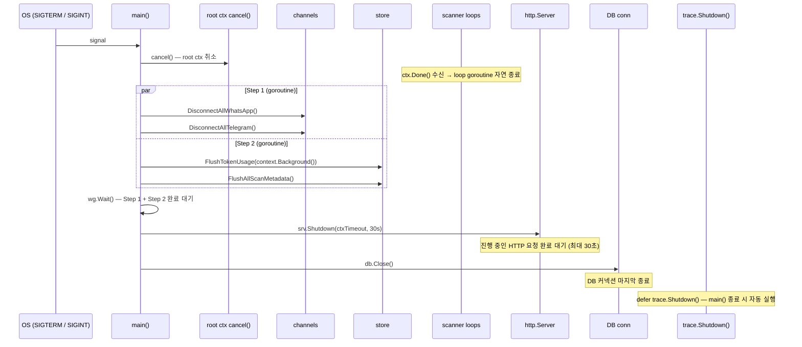

# 10. Locking and Concurrency

This chapter covers the concurrency model, in-process distributed locking, panic-safe goroutine helpers, WhaTap background transaction instrumentation, graceful shutdown sequencing, and known race-condition mitigations.

Cross-references: → [03-backend-architecture.md] (graceful shutdown overview), → [04-data-layer.md] (cache mutex layout, FlushAllScanMetadata), → [06-scanner-pipeline.md] (prime-pool cadence, scanner loop), → [15-observability.md] (WhaTap background TX tracing).

---

## 1. 동시성 모델 개요 / Concurrency Model Overview

### 1.1 설계 원칙 / Design Principles

**한국어:**
Message Consolidator의 모든 고루틴은 두 가지 원칙 중 하나를 반드시 지킵니다.

1. **ctx 취소 가드** — 루프 고루틴은 `select { case <-ctx.Done(): return }` 분기를 가져야 합니다. root context(`main.go`의 `cancel()`)가 취소되면 루프가 종료됩니다.
2. **done 채널 가드** — 수명이 명확히 분리된 고루틴(채널 클라이언트 등)은 전용 `done` 채널로 종료를 제어합니다.

공유 상태 보호는 **mutex** 또는 **채널** 중 하나로만 통일합니다. 같은 변수에 두 방식을 혼용하면 패턴을 추론하기 어려워져 CLAUDE.md에서 금지합니다.

**English:**
Every goroutine in the codebase satisfies one of two guards:

1. **ctx cancellation guard** — looping goroutines select on `ctx.Done()` and return when the root context is cancelled (via `cancel()` in `main.go`).
2. **done-channel guard** — goroutines with an independently-managed lifecycle (e.g., WhatsApp/Telegram clients) use a dedicated `done` channel instead.

Shared-state protection uses **either mutex or channel, never both for the same variable.** Mixing patterns makes invariants impossible to reason about at a glance.

### 1.2 고루틴 분류 / Goroutine Taxonomy

| 종류 | 예시 | 종료 가드 |
|------|------|-----------|
| 스캐너 background loop | `primeLoop.start()` | `<-ctx.Done()` |
| HTTP 서버 | `srv.ListenAndServe()` | `srv.Shutdown()` |
| 채널 클라이언트 | `DefaultWAManager.InitWhatsApp()` | `DisconnectAll*()` |
| 비동기 AI 작업 | `safego.Recover("async-report")` | 완료 후 자연 종료 |
| 번역/완성 파이프라인 | `safego.Recover("trigger-async-translation")` | 완료 후 자연 종료 |

### 1.3 mutex vs 채널 선택 기준

| 선택 | 언제 |
|------|------|
| `sync.Mutex` / `sync.RWMutex` | 공유 맵/슬라이스 읽기·쓰기 보호, 임시 exclusive 접근 |
| `sync.Map` | 키별 독립 뮤텍스처럼 쓰는 경우 — 키가 자주 추가되고 거의 삭제되지 않는 경우 (RoomLockService) |
| channel | 단방향 이벤트 스트림, 완료 통지, 작업 큐 |
| `singleflight.Group` | 같은 키로 동시에 들어온 요청을 하나로 병합 (캐시 스탬피드 방지) |

---

## 2. Distributed Lock — RoomLockService

### 2.1 파일 위치 / Location

`services/lock_service.go`

### 2.2 WHY

**한국어:**
Message Consolidator는 단일 인스턴스로 배포되므로 진정한 분산 락(Redis 등)은 필요 없습니다. 그러나 **같은 채팅방**에서 복수의 메시지 배치가 거의 동시에 도착할 때 문제가 발생합니다.

- 두 스캔 고루틴이 동시에 같은 room의 메시지를 처리하면 `UpsertMessage` 시점에 경합이 생겨 중복 레코드 또는 partial 업데이트가 발생합니다.
- `knownTS` 체크포인트가 인메모리이므로 두 고루틴이 체크포인트를 동시에 읽으면 둘 다 "새 메시지"로 판단해 동일 AI 추론을 이중 실행합니다. Gemini API 비용이 두 배로 청구됩니다.

`RoomLockService`는 방(room) 단위로 `*sync.Mutex`를 분리해 **같은 room의 처리는 한 번에 하나**만 진입하도록 보장합니다.

**English:**
The service is deployed as a single instance, so a distributed lock (Redis, etc.) is unnecessary. However, multiple message batches from the **same chat room** can arrive near-simultaneously (e.g., WhatsApp quick-fire messages or a Slack thread burst), producing a race between scanner goroutines.

Without a per-room lock:
- Concurrent `UpsertMessage` calls for the same room create duplicate records or partial writes.
- Both goroutines see the same `knownTS` state and trigger redundant Gemini API calls — doubling inference cost.

`RoomLockService` serialises processing within each room by maintaining a stable `*sync.Mutex` per room key.

### 2.3 구조 / Structure

```go
// services/lock_service.go
type RoomLockService struct {
    locks sync.Map
}
```

`sync.Map`을 선택한 이유: 키(room 키)는 런타임에 계속 추가되지만 거의 삭제되지 않습니다. `sync.Map`은 이 패턴에서 일반 `map + RWMutex` 대비 경합이 낮습니다. `LoadOrStore`는 원자적이므로 "체크 후 저장" 사이의 TOCTOU 경합이 없습니다.

### 2.4 락 키 설계 / Lock Key Design

```go
func (s *RoomLockService) GetRoomKey(userEmail, source, roomID string) string {
    return fmt.Sprintf("%s:%s:%s", userEmail, source, roomID)
}
```

키는 **`{userEmail}:{source}:{roomID}`** 3-tuple입니다.

| 세그먼트 | 예시 | 역할 |
|----------|------|------|
| `userEmail` | `alice@example.com` | 사용자별 격리 — 동일 채널이라도 다른 사용자의 스캔은 서로 블로킹하지 않음 |
| `source` | `gmail`, `slack`, `whatsapp`, `telegram` | 플랫폼별 격리 — Gmail 스캔이 WhatsApp 스캔을 블로킹하지 않음 |
| `roomID` | Slack channel name, WhatsApp JID, Gmail thread ID | 방 단위 격리 — 핵심 의도. 서로 다른 채널은 병렬 처리 |

실제 사용 예:

```
alice@example.com:slack:C1234ABCD
alice@example.com:whatsapp:+821012345678@s.whatsapp.net
alice@example.com:gmail:thread-1a2b3c
```

### 2.5 획득/해제 패턴 / Acquire–Release Pattern

`AcquireLock`은 뮤텍스 포인터를 반환하며 **잠금을 획득하지 않습니다.** 잠금은 호출부에서 직접 수행합니다.

```go
// scanner/channel_adapter.go:64-68
lockKey := roomLockSvc.GetRoomKey(user.Email, adapter.Source(), roomKey)
lock := roomLockSvc.AcquireLock(lockKey)
lock.Lock()
defer lock.Unlock()
```

`defer lock.Unlock()` 패턴은 AI 분석 도중 패닉이 발생해도 뮤텍스가 해제됨을 보장합니다(`safego.Recover`와 상호 보완).

### 2.6 뮤텍스 포인터 안정성 / Pointer Stability

```go
func (s *RoomLockService) AcquireLock(key string) *sync.Mutex {
    actual, _ := s.locks.LoadOrStore(key, &sync.Mutex{})
    return actual.(*sync.Mutex)
}
```

`LoadOrStore`는 원자적입니다. 두 고루틴이 동시에 같은 키로 호출해도 하나만 새 뮤텍스를 저장하고, 둘 다 **같은 포인터**를 받습니다. 포인터가 안정적이므로 삭제·재삽입 없이 애플리케이션 생명 주기 전체에서 동일 뮤텍스를 사용합니다. 이는 "임시 뮤텍스 생성 → 삭제 → 재생성" 패턴에서 발생하는 Lock-reference 경합을 원천 차단합니다.

### 2.7 사용처 / Usage Sites

| 파일 | 함수 | 보호 대상 |
|------|------|-----------|
| `scanner/channel_adapter.go:processChannelRoom` | 모든 채널(Gmail, WhatsApp, Telegram) | 방별 메시지 그룹 처리 직렬화 |
| `scanner/scanner_slack.go:processSlackThreadSweep` 부근 | Slack Sweep | Slack thread-level 처리 직렬화 |

두 사이트 모두 `GetRoomKey → AcquireLock → Lock() → defer Unlock()` 동일 패턴을 따릅니다.

---

## 3. safego 패키지

### 3.1 파일 위치 / Location

`internal/safego/safego.go`

### 3.2 WHY — `go fn()` 직접 사용 금지

Go에서 `go func() { ... }()` 내부의 패닉은 **프로세스를 즉시 종료**합니다. 스캐너 고루틴(Gemini 호출, DB 쓰기, 외부 SDK 응답 파싱)은 외부 응답 형식 변화, nil 역참조 등으로 인해 패닉이 발생할 수 있습니다. 하나의 방 처리 실패가 전체 서버를 다운시키면 안 됩니다.

`safego.Recover`는 모든 백그라운드 고루틴에 패닉 격리 레이어를 추가합니다.

### 3.3 API

```go
// internal/safego/safego.go
func Recover(name string)
```

사용 패턴은 항상 `defer`입니다:

```go
go func() {
    defer safego.Recover("scan-gmail")
    // ... work
}()
```

- `name`: WhaTap 로그와 에러 메시지에 출력되는 고루틴 식별자. 디버깅 시 어느 고루틴에서 패닉이 발생했는지 즉시 식별합니다.
- 패닉이 없으면 `recover()` 반환값이 `nil`이므로 즉시 반환 (제로 오버헤드).
- 패닉 발생 시 `runtime/debug.Stack()`과 함께 `logger.Errorf`로 기록하고 **프로세스를 살립니다.**

### 3.4 실제 사용 사례

| 파일 | name 태그 | 보호 대상 |
|------|-----------|-----------|
| `scanner/channel_adapter.go` | `scan-{source}-{roomKey}` | 방별 AI 분석 고루틴 |
| `scanner/scanner.go` | `scan-gmail`, `scan-whatsapp`, `scan-telegram`, `scan-slack` | 채널별 스캔 진입 고루틴 |
| `scanner/scanner.go` | `trigger-async-translation` | JIT 번역 비동기 워커 |
| `services/reports_service.go` | `async-report` | 비동기 보고서 생성 |
| `channels/telegram.go` | `tg-run-client`, `tg-hydrate-dialogs`, `tg-store-entities` | Telegram MTProto 고루틴 |
| `channels/whatsapp.go` | `wa-save-contact`, `wa-save-contact-mention` | WhatsApp 이벤트 핸들러 |
| `ai/gemini.go` | `ai-log-inference` | Gemini 호출 로그 고루틴 |
| `handlers/handlers_identity.go` | `proposal-job` | Identity 제안 비동기 잡 |

### 3.5 safego vs CLAUDE.md ctx 가드의 관계

`safego.Recover`와 ctx 가드는 **직교(orthogonal)** 합니다:
- ctx 가드: 고루틴이 **정상적으로** 언제 종료할지 제어
- `safego.Recover`: 고루틴 내부에서 **비정상 패닉** 발생 시 프로세스 보호

두 메커니즘은 상호 대체가 아니라 함께 사용합니다.

---

## 4. Background TX — WhaTap APM

### 4.1 패턴

백그라운드 고루틴에서 WhaTap 트랜잭션을 시작하려면 반드시 `trace.Start`를 사용합니다:

```go
// scanner/scanner_loop.go:45-47
traceCtx, _ := trace.Start(ctx, l.traceName)
defer func() { _ = trace.End(traceCtx, nil) }()
l.runFn(traceCtx, wg)
```

`trace.Start`는 새 트랜잭션 컨텍스트를 생성합니다. `runFn`에 `traceCtx`를 전달해야 해당 함수 내부의 SQL 호출·외부 HTTP 호출이 이 트랜잭션에 귀속됩니다.

### 4.2 트랜잭션 이름 규칙 — 슬래시 강제

```go
traceName: "/Background-ScanGmail"
traceName: "/Background-FlushTokenUsage"
```

트랜잭션 이름은 **반드시 `/`로 시작**해야 합니다. WhaTap 내부의 `urlutil.NewURL`은 슬래시가 없는 문자열을 **Host**로 파싱해 Transaction 컬럼이 공란으로 표시됩니다. 슬래시 하나의 차이가 WhaTap 대시보드 가시성을 결정합니다.

### 4.3 `StartWithContext` 사용 금지

`trace.StartWithContext`는 **기존 trace context가 있을 때만** 자식 트랜잭션을 생성합니다. 백그라운드 고루틴은 부모 trace context를 가지지 않으므로 `StartWithContext`를 호출하면 **silent no-op**이 되어 WhaTap에 아무것도 기록되지 않습니다.

| 컨텍스트 상황 | 사용 함수 |
|------|------|
| 백그라운드 고루틴 (신규 TX) | `trace.Start(ctx, "/TxName")` |
| HTTP 핸들러 내부 (부모 TX 이어받기) | `method.Start(ctx, name)` |

→ 자세한 내용은 [15-observability.md] 참조.

### 4.4 Background Loop의 WhaTap TX 이름

현재 코드에는 11개 루프가 등록되어 있습니다. 루프 이름과 TX 이름 전체 목록 → [06-scanner-pipeline.md](06-scanner-pipeline.md#3-prime-pool-부하-분산-prime-pool-load-distribution). 대표 4개 채널 TX: `/Background-ScanGmail`, `/Background-ScanWhatsApp`, `/Background-ScanTelegram`, `/Background-ScanSlack`.

---

## 5. Graceful Shutdown

### 5.1 시퀀스 다이어그램



### 5.2 단계별 WHY

#### Step 1 — 외부 클라이언트 종료 (goroutine A)

```go
// main.go:149-155
go func() {
    defer wg.Done()
    channels.DisconnectAllWhatsApp()
    channels.DisconnectAllTelegram()
}()
```

**WHY:** WhatsApp(whatsmeow)·Telegram(gotd/td) 클라이언트는 장기 WebSocket/MTProto 연결을 유지합니다. root ctx 취소만으로는 이 연결이 즉시 닫히지 않습니다. `DisconnectAll*`을 명시적으로 호출해야 채널 고루틴이 블로킹 없이 정리됩니다. Step 2와 **병렬**로 실행해 총 shutdown 시간을 단축합니다.

#### Step 2 — 인메모리 데이터 플러시 (goroutine B)

```go
// main.go:156-163
go func() {
    defer wg.Done()
    store.FlushTokenUsage(context.Background())
    store.FlushAllScanMetadata()
}()
```

**WHY — 토큰 플러시:** `tokenDirtyData` 맵은 Gemini API 호출마다 누적됩니다. 주기적 flush(`FlushTokenUsageIfNeeded`)는 1시간 간격이므로 마지막 flush 이후 최대 1시간 분의 데이터가 메모리에만 존재합니다. 프로세스가 갑자기 종료되면 그 데이터는 영구 손실됩니다. 비용 집계·모델별 사용량 리포트가 오염됩니다.

**WHY — 스캔 메타데이터 플러시:** `scanCache`는 채널별 마지막 처리 타임스탬프를 메모리에 캐시합니다. 재시작 후 DB에서 읽어야 하는데, dirty key가 미플러시 상태이면 이전에 처리한 메시지를 재처리합니다 — AI 재추론 비용 및 중복 task 생성.

**WHY — `context.Background()` 사용:** root ctx가 이미 취소된 상태이므로 DB 작업에 원래의 ctx를 전달하면 즉시 실패합니다. 플러시 전용 fresh context를 사용합니다.

#### Step 3 — HTTP drain (최대 30초)

```go
// main.go:166-171
ctxTimeout, cancelTimeout := context.WithTimeout(context.Background(), 30*time.Second)
defer cancelTimeout()
srv.Shutdown(ctxTimeout)
```

**WHY:** 진행 중인 API 요청 중 일부는 Gemini 분석(`/api/scan/manual` 등)처럼 수십 초가 걸릴 수 있습니다. `ListenAndServe`를 즉시 종료하면 클라이언트는 응답 없이 커넥션이 끊깁니다. 30초 타임아웃은 대부분의 장시간 요청을 수용하되, 무한 대기를 방지합니다. Step 1·2와 **직렬**로 실행 — HTTP 요청이 Step 2의 DB 플러시와 경합하면 안 되기 때문입니다.

#### Step 4 — DB close (마지막)

```go
// main.go:173-177
if db := store.GetDB(); db != nil {
    db.Close()
}
```

**WHY:** Step 2의 플러시와 Step 3의 HTTP 핸들러 모두 DB를 사용합니다. DB를 먼저 닫으면 진행 중인 쿼리가 에러를 반환합니다. DB는 반드시 **마지막**에 닫습니다.

#### defer trace.Shutdown() — 암묵적 마지막 단계

```go
// main.go:44-45
trace.Init(map[string]string{})
defer trace.Shutdown()
```

`trace.Shutdown()`은 `defer`로 등록됐으므로 `main()` 반환 시 자동 실행됩니다. 이 시점은 Step 4 이후입니다. WhaTap 에이전트 내부 버퍼(미전송 트랜잭션 데이터)를 에이전트에 최종 전송합니다.

### 5.3 신호 처리

```go
// main.go:136-140
func waitForShutdownSignal() {
    quit := make(chan os.Signal, 1)
    signal.Notify(quit, syscall.SIGINT, syscall.SIGTERM)
    <-quit
}
```

버퍼 크기 `1`을 사용합니다. 신호 핸들러가 채널을 즉시 읽지 않는 사이에 OS가 두 번째 신호를 보내도 첫 신호가 유실되지 않습니다.

`SIGTERM`: systemd/Docker의 정상 종료 신호. `SIGINT`: Ctrl-C 개발 환경 종료.

### 5.4 타임아웃 정책

| 단계 | 타임아웃 | 근거 |
|------|----------|------|
| Step 1 (채널 disconnect) | 무제한 (wg.Wait) | 외부 SDK disconnect는 보통 수 초 이내 |
| Step 2 (플러시) | 무제한 (wg.Wait) | DB 기록 실패 시 재시도(`WithDBRetry`) 필요 |
| Step 3 (HTTP drain) | **30초** | 장시간 AI 요청 수용, 무한 대기 방지 |
| Step 4 (DB close) | 즉시 | 모든 쿼리가 완료된 후 실행됨 |

---

## 6. Race Condition 방지 케이스

### 6.1 같은 메시지 중복 처리 방지

두 단계 방어선:

1. **RoomLockService (in-flight 직렬화):** 같은 room의 처리는 한 번에 하나만. `lock.Lock()` ~ `defer lock.Unlock()` 구간 안에서 `knownTS` 확인과 `UpsertMessage`가 원자적으로 실행됩니다.

2. **knownTS 체크포인트:** `cacheMu.Lock()`로 보호되는 인메모리 셋. 이미 처리된 `source_ts`는 이 셋에 존재하므로 재처리 시 skip합니다. `InvalidateCacheActive`로 캐시가 교체될 때 `knownTS`도 함께 교체됩니다.

```go
// store/cache_store.go:183-188
cacheMu.Lock()
messageCache[email] = newActive
knownTS[email] = newKnownTS
cacheInitialized[email] = true
cacheMu.Unlock()
```

### 6.2 스캔 메타데이터의 Lost-Update 방지

```go
// store/scan_store.go:182-191
func clearDirtyScanFlags(userEmail string, updates []scanMetaUpdate) {
    metadataMu.Lock()
    defer metadataMu.Unlock()
    for _, u := range updates {
        key := userEmail + ":" + u.source + ":" + u.target
        if scanCache[key] == u.ts {  // <- 낙관적 확인
            delete(dirtyScanKeys, key)
        }
    }
}
```

DB 플러시가 진행되는 동안 다른 고루틴이 `scanCache`를 더 최신 값으로 갱신했을 수 있습니다. `clearDirtyScanFlags`는 플러시한 `ts`와 현재 `scanCache`의 `ts`가 일치할 때만 dirty flag를 제거합니다. 일치하지 않으면 더 최신 값이 다음 flush에 포함됩니다 — lost update 없음.

### 6.3 토큰 카운터의 Double-Flush 방지

```go
// store/token_store.go:111-118
tokenMu.Lock()
if len(tokenDirtyData) == 0 {
    tokenMu.Unlock()
    return nil
}
tokenFlushingData = tokenDirtyData           // 현재 dirty를 flushing으로 이동
tokenDirtyData = make(map[tokenBucket]*tokenData)  // 새 dirty 맵 즉시 할당
tokenMu.Unlock()
```

락을 보유한 상태에서 `tokenDirtyData`를 `tokenFlushingData`로 이동하고 새 빈 맵을 즉시 할당합니다. 이후 DB 기록 중 새로 들어오는 토큰 집계는 새 `tokenDirtyData`에 쌓이고, 플러시 중인 데이터와 분리됩니다.

DB 기록 실패 시 `tokenFlushingData`의 내용을 `tokenDirtyData`에 **병합(+=)** 해 재시도 큐에 복구합니다.

### 6.4 캐시 스탬피드 방지 — singleflight

```go
// store/cache_store.go:217-228
func ensureCache(sfKey string, isReady func() bool, refresh func() error) error {
    cacheMu.RLock()
    ready := isReady()
    cacheMu.RUnlock()
    if ready {
        return nil
    }
    _, err, _ := sfGroup.Do(sfKey, func() (any, error) {
        return nil, refresh()
    })
    return err
}
```

캐시가 아직 초기화되지 않은 상태에서 다수의 HTTP 요청이 동시에 도착하면 모두 `EnsureCacheInitialized`를 호출합니다. `singleflight.Group.Do`는 동일 키로 들어온 요청 중 **하나만** 실제 DB 쿼리를 실행하고 나머지는 그 결과를 공유합니다. N개의 동시 요청이 N개의 DB 왕복을 유발하는 스탬피드를 방지합니다.

→ 자세한 캐시 레이어 설명은 [04-data-layer.md] 참조.

### 6.5 primeLoop의 중복 실행 방지 — atomic CAS

```go
// scanner/scanner_loop.go:38-48
func (l *primeLoop) tick(ctx context.Context, wg *sync.WaitGroup) {
    if !l.running.CompareAndSwap(false, true) {
        logger.Warnf("[SCAN] %s: previous run still in flight, skipping tick", l.name)
        return
    }
    defer l.running.Store(false)
    // ...
}
```

이전 스캔이 아직 실행 중인 상태에서 타이머가 다시 발화하면 `CompareAndSwap(false, true)`가 실패해 skip합니다. mutex 없이 원자 연산만으로 중복 실행을 방지합니다 — 경량이며 데드락 불가.

→ prime-pool 설계 및 8개 loop 전체 목록은 [06-scanner-pipeline.md] 참조.

---

## 7. Deltas and Cross-References

### 이 챕터에서 다루지 않는 것 (→ 타 챕터)

| 주제 | 위치 |
|------|------|
| prime-pool cadence 전체 설계 (소수 선택 근거, LCM resonance 회피) | → [06-scanner-pipeline.md] |
| Graceful shutdown 전체 시퀀스 다이어그램 (고수준) | → [03-backend-architecture.md §5] |
| FlushAllScanMetadata 호출 흐름, 캐시 레이어 구조 | → [04-data-layer.md] |
| WhaTap `method.Start`, HTTP 미들웨어, SQL instrumentation | → [15-observability.md] |

### 주요 파일 경로 요약

| 파일 | 역할 |
|------|------|
| `services/lock_service.go` | RoomLockService — 방별 인메모리 뮤텍스 관리 |
| `internal/safego/safego.go` | `Recover(name)` — 고루틴 패닉 격리 |
| `main.go` (L33-91, L136-179) | root ctx, `waitForShutdownSignal`, `gracefulShutdown` |
| `store/cache_store.go` | `metadataMu`, `cacheMu`, `singleflight`, `RefreshCache` |
| `store/scan_store.go` | `snapshotDirtyScanEntries`, `clearDirtyScanFlags`, `FlushAllScanMetadata` |
| `store/token_store.go` | `tokenMu`, `FlushTokenUsage`, double-flush 방지 패턴 |
| `scanner/scanner_loop.go` | `primeLoop`, atomic CAS skip-when-running |
| `scanner/channel_adapter.go` | `processChannelRoom` — lock acquire/release 사용처 |
