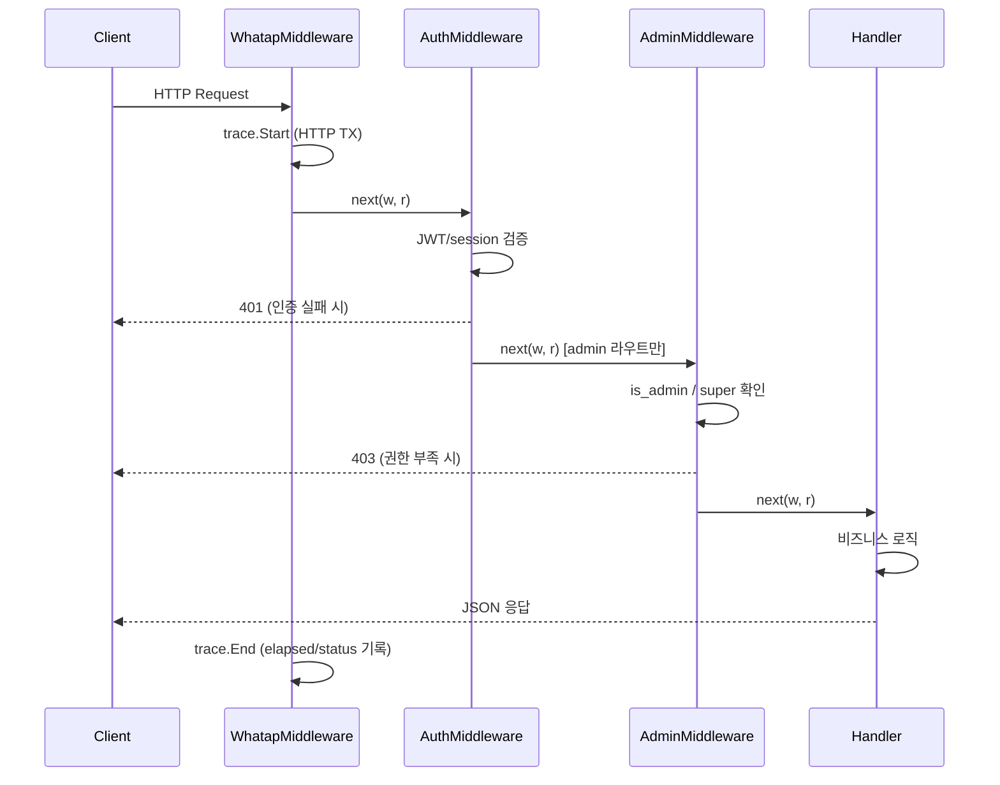

# 11. Handlers & API

---

## 1. HTTP API 설계 원칙

**한국어:**

핸들러 레이어는 HTTP 경계(boundary)만 담당한다. 비즈니스 로직은 `services`, 영속성은 `store`에 위임하며, 핸들러 자체는 다음 세 역할만 수행한다:

1. 요청 파싱 및 입력 검증 (boundary validation)
2. 인증된 이메일(`auth.GetUserEmail`) 획득
3. 응답 직렬화 (`respondJSON` / `respondError`)

모든 응답은 `Content-Type: application/json`이며, 에러는 `{"error": "..."}` 단일 키 구조를 유지한다.

**파일 분할 근거:** `handlers_*.go` 12개 파일은 도메인별 응집도를 높이고 파일당 복잡도(gocognit ≤ 15)를 유지하기 위해 분리되었다. 모든 파일은 동일한 `handlers` 패키지에 속하므로 내부 헬퍼(`respondJSON`, `bindJSON`, `parsePathID` 등)를 공유한다.

**English:**

The handler layer owns only the HTTP boundary. Business logic is delegated to `services`; persistence is delegated to `store`. Handlers themselves do three things only:

1. Parse and validate request input (boundary validation).
2. Obtain the authenticated email via `auth.GetUserEmail`.
3. Serialize the response via `respondJSON` / `respondError`.

All responses use `Content-Type: application/json`. Errors always carry a single-key body `{"error": "..."}`.

**Why 12 files:** Domain-cohesive splitting keeps per-file cognitive complexity within the `gocognit ≤ 15` rule. All files share the same `handlers` package so internal helpers are reused without cross-package imports.

---

### 1.1 `API` 구조체 — Dependency Injection

**파일:** [`handlers/handlers.go`](../../handlers/handlers.go)

**한국어:**

`API` 구조체는 모든 핸들러 메서드의 수신자(receiver)다. 전역 변수 없이 DI를 명시적으로 표현한다.

**English:**

The `API` struct is the receiver for every handler method. It makes dependency injection explicit and avoids global state.

```go
type API struct {
    Config           *config.Config
    ScanFunc         func(email string, lang string)
    FullScanFunc     func()
    Reports          *services.ReportsService
    Tasks            *services.TasksService
    IdentityResolver *ai.IdentityResolver
}
```

`Tasks`와 `Reports`는 nil 가능성이 있으므로 핸들러마다 nil guard를 통해 503을 반환한다. 이는 서비스 초기화 실패가 전체 서버를 중단시키지 않도록 방어한다.

`Tasks` and `Reports` may be nil; every handler guards with a nil check before use, returning 503. This prevents a service initialization failure from taking down the entire server.

---

### 1.2 공통 헬퍼

**파일:** [`handlers/handlers.go`](../../handlers/handlers.go)

| 헬퍼 | 역할 |
|---|---|
| `respondJSON(w, code, payload)` | JSON 직렬화 + `Content-Type` 설정 |
| `respondError(w, code, msg)` | `{"error": msg}` 응답 |
| `handleAPIError(w, r, err, prefix, msg)` | `context.Canceled` → 499, 나머지 → 500 |
| `bindJSON(w, r, v)` | 디코딩 실패 시 400 자동 응답 |
| `decodeJSON(r, v)` | Body 닫기 포함 |
| `parsePathID(r, key)` | 경로 변수 → `int64` |
| `parseBatchIDs(w, r)` | `BatchIDsRequest` 디코딩 + 검증 |

`handleAPIError`가 HTTP 499를 반환하는 이유: Turso(libsql)는 클라이언트 연결 끊김 시 `context.Canceled`를 반환한다. 이를 500으로 처리하면 APM에 불필요한 오류가 기록된다. 499는 nginx/Caddy 관례이며 WhaTap도 이를 구분한다.

`handleAPIError` emits HTTP 499 for `context.Canceled` because Turso (libsql) returns this error on client disconnect. Treating it as 500 pollutes APM error dashboards. 499 (nginx/Caddy convention for client-closed request) is recognized as non-actionable by WhaTap.

**39-site 표준화:** 모든 핸들러 에러 경로가 `handleAPIError(w, r, err, "[TAG]", msg)` 단일 패턴으로 통일됐다. 이전에는 일부 핸들러가 `respondError`를 직접 호출하거나 `context.Canceled` 분기를 인라인으로 처리했다. 표준화 후 서버사이드 로그가 `[TAG]` 접두사로 필터링 가능해졌고, Turso `context-canceled` → 499 처리가 전체 코드베이스에서 일관된다.

**39-site standardization:** All handler error paths now use the single `handleAPIError(w, r, err, "[TAG]", msg)` pattern. Previously, some handlers called `respondError` directly or inlined the `context.Canceled` branch. After standardization, server-side logs are filterable by `[TAG]` prefix, and Turso `context-canceled` → 499 mapping is consistent across the entire codebase.

---

## 2. 라우트 등록

**파일:** [`handlers/routes.go`](../../handlers/routes.go)

**한국어:**

라우트는 `RegisterRoutes`에서 일괄 등록된다. gorilla/mux를 사용하며, `r.Use(WhatapMiddleware)`가 최외곽에서 모든 요청을 감싼다. 보호 라우트는 `a.protected(h)` (→ `auth.AuthMiddleware`)로, 관리자 전용은 `a.adminProtected(h)` (→ `auth.AdminMiddleware`)로 래핑된다.

**English:**

All routes are registered in `RegisterRoutes`. gorilla/mux is used. `r.Use(WhatapMiddleware)` wraps every request at the outermost level. Protected routes use `a.protected(h)` (→ `auth.AuthMiddleware`); admin-only routes use `a.adminProtected(h)` (→ `auth.AdminMiddleware`).

---

### 2.1 라우트 전체 목록

| 그룹 | 경로 | 메서드 | 보호 수준 |
|---|---|---|---|
| **Auth** | `/auth/login` | GET | public |
| | `/auth/callback` | GET | public |
| | `/auth/logout` | GET | public |
| | `/auth/gmail/connect` | GET | auth |
| | `/auth/gmail/callback` | GET | public |
| **Static** | `/` | GET | auth |
| | `/static/*` | GET | auth |
| **Messages** | `/api/messages` | GET | auth |
| | `/api/messages/search` | GET | auth |
| | `/api/messages/done` | POST | auth |
| | `/api/messages/delete` | POST | auth |
| | `/api/messages/hard-delete` | POST | auth |
| | `/api/messages/restore` | POST | auth |
| | `/api/messages/archive` | GET | auth |
| | `/api/messages/archive/count` | GET | auth |
| | `/api/messages/export` | GET | auth |
| | `/api/messages/export/excel` | GET | auth |
| | `/api/messages/export/json` | GET | auth |
| | `/api/messages/update` | POST | auth |
| | `/api/messages/{id}/original` | GET | auth |
| | `/api/tasks/translate-batch` | POST | auth |
| | `/api/tasks/merge` | PUT | auth |
| | `/api/subtasks/toggle` | POST | auth |
| **Channels** | `/api/whatsapp/qr` | GET | auth |
| | `/api/whatsapp/status` | GET | auth |
| | `/api/whatsapp/logout` | POST | auth |
| | `/api/slack/status` | GET | auth |
| | `/api/telegram/status` | GET | auth |
| | `/api/telegram/auth/start` | POST | auth |
| | `/api/telegram/auth/confirm` | POST | auth |
| | `/api/telegram/auth/password` | POST | auth |
| | `/api/telegram/logout` | POST | auth |
| | `/api/telegram/credentials` | POST | auth |
| | `/api/scan` | GET | auth |
| | `/api/internal/scan` | GET | **public + secret header** |
| | `/api/translate` | POST | auth |
| **Users** | `/api/user/info` | GET | auth |
| | `/api/user/aliases` | GET | auth |
| | `/api/user/alias/add` | POST | auth |
| | `/api/user/alias/delete` | POST | auth |
| | `/api/user/stats` | GET | auth |
| | `/api/user/token-usage` | GET | auth |
| | `/api/tenant/aliases` | GET | auth |
| | `/api/tenant/alias/add` | POST | auth |
| | `/api/tenant/alias/delete` | POST | auth |
| | `/api/release-notes` | GET | auth |
| **Contacts** | `/api/contacts/mappings` | GET | auth |
| | `/api/contacts/mapping/add` | POST | auth |
| | `/api/contacts/mapping/delete` | POST | auth |
| | `/api/contacts/search` | GET | auth |
| | `/api/contacts/link` | POST | auth |
| | `/api/contacts/unlink` | POST | auth |
| | `/api/contacts/links` | GET | auth |
| **Identity** | `/api/identity/proposals/generate` | POST | auth |
| | `/api/identity/proposals/job-status` | GET | auth |
| | `/api/identity/proposals` | GET | auth |
| | `/api/identity/proposals/{id}/accept` | POST | auth |
| | `/api/identity/proposals/{id}/reject` | POST | auth |
| **Admin** | `/api/admin/backfill-room-actor` | GET | admin |
| | `/api/admin/reclassify` | GET | admin |
| | `/api/admin/invalidate-cache` | POST | admin |
| | `/api/admin/restore-gmail-cc` | GET | admin |
| | `/api/admin/settings` | GET | admin |
| | `/api/admin/settings/{key}` | PUT | admin |
| | `/api/admin/admins` | GET | admin |
| | `/api/admin/admins` | POST | admin |
| | `/api/admin/admins/{email}` | DELETE | admin |
| **Reports** | `/api/reports` | GET | auth |
| | `/api/reports/history` | GET | auth |
| | `/api/reports` | POST | auth |
| | `/api/reports/{id}` | GET | auth |
| | `/api/reports/{id}` | DELETE | auth |
| | `/api/reports/{id}/translate` | POST | auth |
| | `/api/reports/{id}/export/notion` | POST | auth |
| **Gmail** | `/api/gmail/status` | GET | auth |
| | `/api/gmail/disconnect` | POST | auth |
| **Health** | `/health` | GET | public |

총 라우트: 약 73개

---

### 2.2 라우트 계층 (mermaid)

```mermaid
graph TD
    ALL[모든 요청] --> WM[WhatapMiddleware]
    WM --> PUB[Public Routes]
    WM --> APROT[Protected Routes /api/*]
    WM --> ADMIN[Admin Routes /api/admin/*]

    PUB --> AUTH_LOGIN[/auth/login]
    PUB --> AUTH_CB[/auth/callback]
    PUB --> AUTH_LOGOUT[/auth/logout]
    PUB --> GMAIL_CB[/auth/gmail/callback]
    PUB --> HEALTH[/health]
    PUB --> INTERNAL[/api/internal/scan\nX-Internal-Secret header]

    APROT --> AM[AuthMiddleware\nJWT / session]
    AM --> MSG[/api/messages/*]
    AM --> USER[/api/user/*]
    AM --> CHAN[/api/whatsapp /api/telegram /api/slack]
    AM --> CONTACT[/api/contacts/*]
    AM --> IDENTITY[/api/identity/*]
    AM --> REPORT[/api/reports/*]
    AM --> GMAIL[/api/gmail/*]

    ADMIN --> ADMI[AdminMiddleware\nauth + is_admin / super]
    ADMI --> SETTINGS[/api/admin/settings/*]
    ADMI --> ADMINS[/api/admin/admins/*]
    ADMI --> OPS[reclassify / invalidate-cache / restore-gmail-cc]
```

---

## 3. 미들웨어 체인

**한국어:**

`RegisterRoutes` 등록 순서가 곧 실행 순서다. gorilla/mux의 `r.Use`는 LIFO 래핑이므로, 가장 먼저 등록된 `WhatapMiddleware`가 가장 바깥쪽에서 실행된다.

**English:**

Registration order in `RegisterRoutes` determines execution order. gorilla/mux `r.Use` wraps LIFO, so `WhatapMiddleware` — registered first — executes outermost.



---

### 3.1 WhatapMiddleware

**파일:** [`handlers/middleware_whatap.go`](../../handlers/middleware_whatap.go)

**한국어:**

`whatapmux.Middleware()(next)` 한 줄이 전부다. 내부적으로 `trace.HandlerFunc`가 HTTP method, URL, 헤더를 캡처하고 trace context를 request context에 주입한다. 이 context가 service/store 레이어의 `trace.Step` 호출까지 전파된다.

**최외곽에 위치하는 이유:** 인증 실패, 404 등 모든 요청(인증 전 프로브 포함)이 WhaTap TPS 통계에 잡혀야 하기 때문이다. auth 미들웨어 내부에 넣으면 미인증 트래픽이 누락된다.

**English:**

`whatapmux.Middleware()(next)` is the entire implementation. Internally `trace.HandlerFunc` captures HTTP method/URL/headers and injects trace context into the request context, which propagates to `trace.Step` calls in service/store layers.

**Why outermost:** Every request — including unauthenticated probes and 404s — must appear in WhaTap TPS dashboards. Placing it inside the auth middleware would blind the APM to pre-auth traffic.

→ [15-observability.md] WhaTap APM 상세

---

### 3.2 AuthMiddleware

`protected(h)` → `auth.AuthMiddleware`. JWT/세션 검증 후 통과하면 `auth.UserEmailKey` 를 context에 주입한다. 핸들러는 `auth.GetUserEmail(r)`로 이를 꺼낸다.

`protected(h)` wraps `auth.AuthMiddleware`. After JWT/session validation it injects `auth.UserEmailKey` into the request context; handlers retrieve it with `auth.GetUserEmail(r)`.

→ [12-auth-and-security.md] 인증 상세

---

### 3.3 AdminMiddleware

`adminProtected(h)` → `auth.AdminMiddleware`. AuthMiddleware를 포함하며, 추가로 `store.IsSuperAdmin(email)` 또는 `users.is_admin=1`을 확인한다. 미달 시 403 반환.

`adminProtected(h)` wraps `auth.AdminMiddleware`, which subsumes AuthMiddleware and additionally checks `store.IsSuperAdmin(email)` or `users.is_admin=1`. Returns 403 on failure.

**등록 순서 WHY:** `WhatapMiddleware`는 `r.Use`로, `Auth`/`Admin`은 개별 라우트에 `a.protected` / `a.adminProtected`로 적용된다. 따라서 공개 라우트(`/health`, `/auth/callback`)는 auth 오버헤드 없이 trace만 붙는다.

**Why this order:** `WhatapMiddleware` applies globally via `r.Use`; `Auth`/`Admin` are per-route wrappers. Public routes (`/health`, `/auth/callback`) therefore incur only trace overhead, not auth overhead.

---

## 4. 도메인별 핸들러

### 4.1 handlers_msgs.go — 메시지 조회 / 검색 / 생명주기

**파일:** [`handlers/handlers_msgs.go`](../../handlers/handlers_msgs.go)

**한국어:**

활성 메시지 피드, FTS 검색, 아카이브, 완료 마킹, 배치 삭제/복원, 태스크 텍스트 편집, 서브태스크 토글, 태스크 병합, JIT 번역을 담당한다. 캐시 무결성을 위해 `store.GetMessages` 결과를 `copy`해 뮤테이션으로부터 보호한다.

**English:**

Owns the active message feed, FTS search, archive, done-marking, batch delete/restore, task text edit, subtask toggle, task merge, and JIT batch translation. Cache integrity is preserved by `copy`-ing the `store.GetMessages` slice before mutation.

| 메서드 | 경로 | 설명 |
|---|---|---|
| GET | `/api/messages` | 활성 메시지 → Inbox/Delegated/Reference 분류 |
| GET | `/api/messages/search` | FTS (trigram, ≥3 runes) |
| POST | `/api/messages/done` | 완료 토글 → 사용자 XP/streak 갱신 |
| POST | `/api/messages/delete` | 소프트 삭제 (배치) |
| POST | `/api/messages/hard-delete` | 영구 삭제 |
| POST | `/api/messages/restore` | 아카이브 → 활성 복원 |
| GET | `/api/messages/archive` | 아카이브 목록 (offset 페이지네이션) |
| GET | `/api/messages/archive/count` | 아카이브 카운트 |
| POST | `/api/messages/update` | 태스크 텍스트 수정 |
| GET | `/api/messages/{id}/original` | 원문 조회 (cross-user 차단) |
| PUT | `/api/tasks/merge` | 태스크 병합 |
| POST | `/api/tasks/translate-batch` | JIT 배치 번역 (cache-first) |
| POST | `/api/subtasks/toggle` | 서브태스크 완료 토글 |

**의존:** `store.GetMessages` (캐시), `store.GetArchivedMessagesFiltered`, `services.TasksService`

**아카이브 페이지네이션:** `?limit=` (기본 50, 최대 200) + `?offset=` (offset-based). FTS 검색 결과는 cursor 없이 full-match 반환.

**Search min-rune 이유:** SQLite trigram 토크나이저는 3 rune 미만 쿼리에서 인덱스를 사용하지 않는다. 이 경계에서 클라이언트 사이드 LIKE로 fallback하도록 400을 반환한다.

**Why search min-rune:** SQLite's trigram tokenizer does not use the index for queries shorter than 3 runes. The 400 signals the frontend to fall back to client-side LIKE on the cached state.

→ [08-services-business-logic.md] TasksService

---

### 4.2 handlers_users.go — 사용자 프로필 / 별칭 / 연락처 매핑

**파일:** [`handlers/handlers_users.go`](../../handlers/handlers_users.go)

**한국어:**

사용자 프로필 조회, Slack 별칭 자동 동기화, 개인/테넌트 alias CRUD, 연락처 매핑 CRUD, 연락처 검색, 계정 링크/언링크, AI 토큰 사용량 집계를 담당한다.

**English:**

Owns user profile retrieval, Slack alias auto-sync, personal/tenant alias CRUD, contact mapping CRUD, contact search, account link/unlink, and AI token usage aggregation.

| 메서드 | 경로 | 설명 |
|---|---|---|
| GET | `/api/user/info` | 프로필 + Slack alias 동기화 + 토큰 사용량 |
| GET | `/api/user/aliases` | 개인 별칭 목록 |
| POST | `/api/user/alias/add` | 별칭 추가 |
| POST | `/api/user/alias/delete` | 별칭 삭제 |
| GET | `/api/user/token-usage` | AI 토큰 사용량 (일별/월별) |
| GET | `/api/tenant/aliases` | 테넌트 전체 연락처 매핑 |
| POST | `/api/tenant/alias/add` | 테넌트 매핑 추가 (→ HandleAddMapping) |
| POST | `/api/tenant/alias/delete` | 테넌트 매핑 삭제 (→ HandleDeleteMapping) |
| GET | `/api/contacts/mappings` | 연락처 매핑 목록 |
| POST | `/api/contacts/mapping/add` | 매핑 추가 (email 추출 우선, 중복 → 409) |
| POST | `/api/contacts/mapping/delete` | 매핑 삭제 |
| GET | `/api/contacts/search` | 연락처 검색 |
| POST | `/api/contacts/link` | 계정 링크 (동일 ID 자기참조 금지) |
| POST | `/api/contacts/unlink` | 계정 언링크 |
| GET | `/api/contacts/links` | 링크된 연락처 목록 |

**의존:** `store.GetOrCreateUser`, `store.AddContactMapping`, `channels.NewSlackClient`

**토큰 요금 계산:** Gemini 3 Flash 단가(prompt $0.50/1M, completion $3.00/1M)를 핸들러에서 직접 계산한다. 요금 변경 시 `handlers_users.go` 상단 상수 수정.

**Token cost calculation:** Gemini 3 Flash rates (prompt $0.50/1M, completion $3.00/1M) are computed directly in the handler. To update pricing, change the constants at the top of `handlers_users.go`.

---

### 4.3 handlers_actions.go — 스캔 / 번역 / 캐시 / 관리자 수동 작업

**파일:** [`handlers/handlers_actions.go`](../../handlers/handlers_actions.go)

**한국어:**

수동 스캔 트리거, 내부(cron) 스캔 트리거, 전체 번역, 데이터 재분류, Gmail CC 복원, 캐시 무효화를 담당한다. `HandleInternalScan`은 JWT 인증 없이 `X-Internal-Secret` 헤더로만 인가된다 (cron 호출용).

**English:**

Owns manual scan trigger, internal (cron) scan trigger, full translation, data reclassification, Gmail CC restore, and cache invalidation. `HandleInternalScan` is authorized only by the `X-Internal-Secret` header (no JWT) — designed for cron invocation.

| 메서드 | 경로 | 설명 |
|---|---|---|
| GET | `/api/scan` | 인증 사용자 수동 스캔 (비동기 goroutine) |
| GET | `/api/internal/scan` | 내부 full scan (secret header, 중복 실행 방지) |
| POST | `/api/translate` | 활성+아카이브 전체 JIT 번역 |
| GET | `/api/admin/reclassify` | 구 데이터 AI 재분류 (admin) |
| GET | `/api/admin/restore-gmail-cc` | Gmail CC 할당 복원 (admin) |
| POST | `/api/admin/invalidate-cache` | 사용자 캐시 강제 무효화 (admin) |

**`HandleInternalScan` concurrency guard:** `scanMutex` + `isScanning` 플래그로 중복 전체 스캔을 방지한다. 이미 실행 중이면 `{"status":"skipped"}` 반환.

**Why sync.Mutex over channel:** 스캔 함수는 단일 goroutine이며 채널 오버헤드가 불필요하다. mutex가 더 단순하고 가독성이 높다.

**`HandleBackfillRoomActor` build/apply 분리:** 핸들러가 `buildBackfillCandidates` (후보 수집) + `applyBackfillCandidates` (DB 적용) 두 단계로 분리됐다. 각 함수가 단일 책임을 가져 복잡도를 낮추고, `buildBackfillCandidates`는 DB 없이 단독 단위 테스트가 가능하다.

**`HandleBackfillRoomActor` build/apply split:** The handler delegates to `buildBackfillCandidates` (collect candidates) and `applyBackfillCandidates` (persist to DB) as separate stages. Each stage has a single responsibility; `buildBackfillCandidates` can be unit-tested without a DB.

**의존:** `ScanFunc` (패키지 레벨 변수), `FullScanFunc`, `services.TasksService`

---

### 4.4 handlers_reports.go — 보고서 생성/조회/내보내기

**파일:** [`handlers/handlers_reports.go`](../../handlers/handlers_reports.go)

**한국어:**

일별/주간 보고서 생성 (비동기 가능), 보고서 목록/이력 조회, 단건 조회, 삭제, 온디맨드 번역, Notion 내보내기를 담당한다.

**English:**

Owns report generation (potentially async), list/history retrieval, single-report fetch, deletion, on-demand translation, and Notion export.

| 메서드 | 경로 | 설명 |
|---|---|---|
| GET | `/api/reports` | 보고서 목록 (전체) |
| GET | `/api/reports/history` | 사이드바용 경량 이력 |
| POST | `/api/reports` | 보고서 생성 (완료 시 200, 처리 중 202) |
| GET | `/api/reports/{id}` | 단건 조회 (소유자 검증) |
| DELETE | `/api/reports/{id}` | 삭제 |
| POST | `/api/reports/{id}/translate` | 온디맨드 번역 (30s timeout) |
| POST | `/api/reports/{id}/export/notion` | Notion 페이지 생성 (30s timeout) |

**의존:** `services.ReportsService`, `services.NotionExporter`, `store.GetReportByID`

**202 Accepted 사용 이유:** 보고서 생성이 완료될 때까지 기다리면 프론트엔드가 블록된다. 즉시 생성 완료 시 200, 처리 중이면 202를 반환하므로 클라이언트가 폴링 여부를 결정할 수 있다.

**Why 202 Accepted:** Waiting for report generation blocks the frontend. Returning 200 when immediately done and 202 when still processing lets the client decide whether to poll.

→ [08-services-business-logic.md] ReportsService

---

### 4.5 handlers_telegram.go — Telegram MTProto 페어링

**파일:** [`handlers/handlers_telegram.go`](../../handlers/handlers_telegram.go)

**한국어:**

Telegram App ID/Hash 저장, 3단계 전화번호 인증 플로우(start → confirm → password), 상태 조회, 로그아웃을 담당한다. App ID/Hash는 per-user DB에 저장 가능하지만, 환경변수 폴백도 지원한다.

**English:**

Owns per-user App ID/Hash persistence, the 3-step phone auth flow (start → confirm → password), status, and logout. App ID/Hash can be stored per-user in the DB or fall back to env vars.

| 메서드 | 경로 | 설명 |
|---|---|---|
| GET | `/api/telegram/status` | 연결 상태 + App ID 마스킹 |
| POST | `/api/telegram/credentials` | App ID/Hash 저장 |
| POST | `/api/telegram/auth/start` | 전화번호 → OTP 발송 |
| POST | `/api/telegram/auth/confirm` | OTP 제출 → "connected" 또는 "password_required" |
| POST | `/api/telegram/auth/password` | 2FA 비밀번호 제출 |
| POST | `/api/telegram/logout` | 세션 종료 |

**민감 정보 마스킹:** 전화번호는 앞 3자리 + `****` + 마지막 4자리, App ID는 앞 3자리 + `***`로 마스킹한다.

**Phone masking:** First 3 digits + `****` + last 4 digits. App ID masking: first 3 digits + `***`. Why: prevents full credential exposure in API responses that may be logged.

**의존:** `channels.GetTelegramStatus`, `channels.StartTelegramAuth` 등 channels 패키지

---

### 4.6 handlers_whatsapp.go — WhatsApp 페어링

**파일:** [`handlers/handlers_whatsapp.go`](../../handlers/handlers_whatsapp.go)

**한국어:**

QR 코드 조회, 연결 상태 조회, 로그아웃 3개 엔드포인트만 제공한다. QR은 base64 인코딩 문자열로 반환되며 프론트엔드에서 렌더링한다.

**English:**

Provides only three endpoints: QR retrieval, status, and logout. QR is returned as a base64-encoded string for frontend rendering.

| 메서드 | 경로 | 설명 |
|---|---|---|
| GET | `/api/whatsapp/qr` | base64 QR 코드 |
| GET | `/api/whatsapp/status` | `{status, device_name}` |
| POST | `/api/whatsapp/logout` | 세션 종료 |

**상태 문자열 소문자 규약:** 모든 채널 status 핸들러(whatsapp, telegram, slack)는 소문자(`"connected"` / `"disconnected"`)를 반환한다. 프론트엔드 `isStatusConnected`가 케이스를 정규화하는 안전망이 있지만 신규 채널은 소문자 준수를 유지해야 한다.

**Lowercase status convention:** All channel status handlers emit lowercase (`"connected"` / `"disconnected"`). The frontend `isStatusConnected` normalizes case as a safety net, but new channels must still adhere to lowercase.

**의존:** `channels.GetWhatsAppQR`, `channels.GetWhatsAppStatus`, `channels.LogoutWhatsApp`

---

### 4.7 handlers_gmail.go — Gmail OAuth 연동

**파일:** [`handlers/handlers_gmail.go`](../../handlers/handlers_gmail.go)

**한국어:**

Gmail OAuth2 연결, OAuth 콜백 처리, 연결 상태, 연결 해제를 담당한다. `HandleGmailCallback`은 public 라우트이므로 JWT 없이 접근 가능하다. State 파라미터 `"gmail:<email>"` 접두사로 CSRF/오라우팅을 방지한다.

**English:**

Owns Gmail OAuth2 connect, OAuth callback, status, and disconnect. `HandleGmailCallback` is a public route (no JWT). CSRF/misrouting is prevented by validating the `"gmail:<email>"` state parameter prefix.

| 메서드 | 경로 | 설명 |
|---|---|---|
| GET | `/auth/gmail/connect` | OAuth URL 리다이렉트 (auth 필요) |
| GET | `/auth/gmail/callback` | 토큰 교환 후 저장 → `/` 리다이렉트 |
| GET | `/api/gmail/status` | `{connected: bool}` |
| POST | `/api/gmail/disconnect` | 토큰 삭제 |

**State prefix 검증 이유:** Google OAuth 콜백은 인증 없이 누구나 접근 가능하다. `"gmail:"` 접두사를 검증하지 않으면 다른 OAuth 플로우의 콜백이 gmail 처리기로 잘못 라우팅될 수 있다.

**Why state prefix check:** Google OAuth callback is publicly accessible. Without the `"gmail:"` prefix check, callbacks from other OAuth flows could be misrouted to the Gmail handler.

**의존:** `channels.GetGmailAuthURL`, `channels.ExchangeGmailCode`, `store.SaveGmailToken`

---

### 4.8 handlers_identity.go — 신원 매핑 제안

**파일:** [`handlers/handlers_identity.go`](../../handlers/handlers_identity.go)

**한국어:**

AI 기반 연락처 동일인 식별 제안 생성, 비동기 작업 상태 폴링, 제안 목록 조회, 수락(canonical name 병합)/거부를 담당한다. 생성은 비동기(`context.Background`)이며 per-user 인메모리 job 상태를 `sync.Mutex`로 보호한다.

**English:**

Owns async AI-based identity proposal generation, job-status polling, proposal listing, acceptance (contact merge under canonical name), and rejection. Generation is async (`context.Background`); per-user in-memory job state is protected by `sync.Mutex`.

| 메서드 | 경로 | 설명 |
|---|---|---|
| POST | `/api/identity/proposals/generate` | 비동기 AI 분석 시작 (202) |
| GET | `/api/identity/proposals/job-status` | `{status: running/done/error/idle}` |
| GET | `/api/identity/proposals` | 미결 제안 목록 |
| POST | `/api/identity/proposals/{id}/accept` | canonical name으로 병합 |
| POST | `/api/identity/proposals/{id}/reject` | 거부 |

**비동기 선택 이유:** AI 분석(ProposeGroups)은 수백 연락처를 처리할 수 있어 요청 타임아웃을 초과한다. 202 즉시 응답 + 폴링 패턴이 UX를 차단하지 않는다.

**Why async:** AI proposal generation (ProposeGroups) may process hundreds of contacts, exceeding request timeouts. The 202-immediate-response + polling pattern avoids blocking the UX.

**중복 실행 방지:** job 상태가 `"running"`이면 409 반환. 완료 후 결과는 메모리에 유지(재폴링 가능).

**의존:** `ai.IdentityResolver`, `store.AutoMergeByCanonicalID`, `store.GenerateTokenSortedProposals`

→ [09-identity-and-dedup.md]

---

### 4.9 handlers_exports.go — 아카이브 내보내기

**파일:** [`handlers/handlers_exports.go`](../../handlers/handlers_exports.go)

**한국어:**

아카이브 데이터를 CSV, Excel(xlsx), JSON 형식으로 내보내기한다. 모든 형식은 공통 `loadArchiveExport` 함수로 최대 10,000건을 조회한다. 응답은 `Content-Disposition: attachment`로 직접 다운로드된다.

**English:**

Exports archive data as CSV, Excel (xlsx), or JSON. All formats share `loadArchiveExport` which fetches up to 10,000 records. Responses carry `Content-Disposition: attachment` for direct download.

| 메서드 | 경로 | 설명 |
|---|---|---|
| GET | `/api/messages/export` | CSV (UTF-8 BOM 포함) |
| GET | `/api/messages/export/excel` | xlsx (헤더 볼드/회색 스타일) |
| GET | `/api/messages/export/json` | JSON (들여쓰기 포함) |

**CSV UTF-8 BOM 이유:** Excel은 BOM 없는 UTF-8 CSV를 Windows-1252로 오해한다. `\xEF\xBB\xBF` 3바이트 프리픽스가 한국어/아시아 문자 깨짐을 방지한다.

**Why UTF-8 BOM on CSV:** Excel on Windows misinterprets BOM-less UTF-8 as Windows-1252, garbling Korean/Asian characters. The 3-byte `\xEF\xBB\xBF` prefix fixes this.

**공통 컬럼:** ID, Source, Room, Task, Requester, Assignee, Assigned At, Created At, Completed At, Original Message

**의존:** `store.GetArchivedMessagesFiltered`, `github.com/xuri/excelize`

---

### 4.10 handlers_admin.go — 관리자 설정 / 어드민 관리

**파일:** [`handlers/handlers_admin.go`](../../handlers/handlers_admin.go)

**한국어:**

`config.Registry` 기반 설정 CRUD, 어드민 사용자 부여/회수, 비밀값 마스킹, 핫리로드 적용을 담당한다. 모든 엔드포인트는 `adminProtected`로 보호된다.

**English:**

Owns settings CRUD backed by `config.Registry`, admin user grant/revoke, secret masking, and hot-reload application. All endpoints are `adminProtected`.

| 메서드 | 경로 | 설명 |
|---|---|---|
| GET | `/api/admin/settings` | 전체 설정 목록 (secret → `••••••••`) |
| PUT | `/api/admin/settings/{key}` | 설정 갱신 (빈 값 → 행 삭제, env fallback) |
| GET | `/api/admin/admins` | 어드민 목록 (super 표시) |
| POST | `/api/admin/admins` | 어드민 부여 (GetOrCreateUser 선행) |
| DELETE | `/api/admin/admins/{email}` | 어드민 회수 (super admin 보호) |

**핫리로드 대상:** `LOG_LEVEL`, `ARCHIVE_DAYS`, `AUTH_DISABLED`, `DEFAULT_USER_EMAIL`, `GEMINI_ANALYSIS_MODEL`, `GEMINI_TRANSLATION_MODEL`, `COMPANY_DOMAINS`, `GMAIL_SKIP_SENDERS`, `MESSAGE_BATCH_WINDOW`. `GEMINI_API_KEY`, `DB_KEEP_ALIVE_INTERVAL` 등은 재시작 필요.

**Hot-reloadable keys:** `LOG_LEVEL`, `ARCHIVE_DAYS`, `AUTH_DISABLED`, `DEFAULT_USER_EMAIL`, `GEMINI_ANALYSIS_MODEL`, `GEMINI_TRANSLATION_MODEL`, `COMPANY_DOMAINS`, `GMAIL_SKIP_SENDERS`, `MESSAGE_BATCH_WINDOW`. Keys like `GEMINI_API_KEY` and `DB_KEEP_ALIVE_INTERVAL` require restart.

**applyHotReload dispatch table:** `switch` 문에서 `map[string]hotReloader` dispatch table로 리팩터됐다. 각 설정 키의 사이드이펙트 함수(`reloadLogLevel`, `reloadArchiveDays` 등)가 독립적으로 분리되어 `applyHotReload` 자체의 복잡도(gocognit)가 경계 이하로 유지된다. 새 핫리로드 대상을 추가할 때 `hotReloaders` map에 항목만 추가하면 된다.

**applyHotReload dispatch table:** Refactored from a `switch` to a `map[string]hotReloader` dispatch table. Each key's side-effect function (`reloadLogLevel`, `reloadArchiveDays`, etc.) is isolated, keeping `applyHotReload` itself within the gocognit ≤ 15 limit. Adding a new hot-reloadable key requires only a new entry in the `hotReloaders` map.

**Secret 마스킹 이유:** DB에 평문 저장된 API 키가 `/api/admin/settings` 응답에 노출되지 않도록, `def.Secret=true`인 설정은 항상 `••••••••`로 치환한다. `has_value`는 여전히 `true`로 반환해 UI가 "저장됨" 상태를 표시할 수 있게 한다.

**Why secret masking:** API keys stored plaintext in the DB must not leak through the settings API. `def.Secret=true` values are always substituted with `••••••••` while `has_value` remains `true` so the UI can show "saved" state without exposing the value.

**의존:** `config.Registry`, `config.FindDef`, `config.ValidateSetting`, `store.UpsertSetting`, `store.SetUserAdmin`

---

### 4.11 handlers_stats.go — 통계 조회

**파일:** [`handlers/handlers_stats.go`](../../handlers/handlers_stats.go)

**한국어:**

사용자 활동 통계를 타임존 인식으로 반환한다. `X-Timezone` 헤더로 클라이언트 타임존을 수신하며, 미전송 시 UTC를 기본값으로 사용한다.

**English:**

Returns user activity statistics with timezone awareness. Receives the client's timezone via the `X-Timezone` header; defaults to UTC when absent.

| 메서드 | 경로 | 설명 |
|---|---|---|
| GET | `/api/user/stats` | 활동 통계 (타임존 인식) |

**타임존 헤더 이유:** DB의 타임스탬프는 UTC로 저장된다. 일별 통계 집계(오늘/어제 구분)는 사용자의 로컬 타임존 기준이어야 하므로, `X-Timezone`을 받아 서버에서 변환한다.

**Why timezone header:** DB timestamps are stored in UTC. Daily aggregation (today vs. yesterday boundary) must respect the user's local timezone, so `X-Timezone` is passed and the server converts.

**의존:** `store.GetUserStats`

---

### 4.12 handlers_misc.go — 릴리스 노트 / Slack 상태

**파일:** [`handlers/handlers_misc.go`](../../handlers/handlers_misc.go)

**한국어:**

릴리스 노트 파일 서빙(`RELEASE_NOTES_{TYPE}_{LANG}.md`)과 Slack 연결 상태를 담당한다. 경로 트래버설 방지를 위해 `type`/`lang` 파라미터를 허용 목록으로 검증한다.

**English:**

Serves release note files (`RELEASE_NOTES_{TYPE}_{LANG}.md`) and the Slack connection status. Path traversal is prevented by allowlist-validating the `type` and `lang` query parameters.

| 메서드 | 경로 | 설명 |
|---|---|---|
| GET | `/api/release-notes` | 릴리스 노트 (type=user/tech, lang=ko/en, fallback EN) |
| GET | `/api/slack/status` | `{status, slack_id}` |

---

## 5. 요청/응답 패턴

### 5.1 JSON 직렬화

**한국어:**

모든 응답은 `respondJSON`을 통과한다. `payload` 파라미터가 `any`인 이유는 호출자별 임의 DTO 구조체를 수용하기 위함이며, `encoding/json`의 `Marshal` 시그니처와 동일한 패턴이다.

**English:**

All responses pass through `respondJSON`. The `payload any` parameter is justified because each caller passes a different DTO struct — matching the `encoding/json.Marshal` signature pattern.

`omitempty` 정책: 응답 DTO 필드에서 값이 없을 때 JSON 키 자체를 제거하는 경우에만 사용한다 (예: `telegramStatusResponse.PhoneMasked`). 기본값 0/false를 명시적으로 전달해야 하는 필드에는 사용하지 않는다.

`omitempty` policy: used only on response DTO fields where an absent value should omit the JSON key (e.g., `telegramStatusResponse.PhoneMasked`). Fields that must explicitly convey 0/false do not use it.

---

### 5.2 에러 응답 포맷

모든 에러는 `{"error": "<message>"}` 단일 키 구조다:

```go
respondError(w, http.StatusBadRequest, "query must be at least 3 characters")
// → {"error": "query must be at least 3 characters"}
```

특수 상태 코드:
- **499** — 클라이언트 연결 끊김 (`context.Canceled`)
- **202** — 비동기 보고서/제안 생성 수락
- **409** — 연락처 매핑 중복 충돌

Special status codes:
- **499** — client disconnect (`context.Canceled`)
- **202** — async report/proposal generation accepted
- **409** — contact mapping unique constraint conflict

---

### 5.3 페이지네이션

**아카이브 (offset-based):**
- `?limit=` (기본 50, 최대 200) + `?offset=`
- 응답: `{messages: [...], total: N}`
- 이유: 아카이브는 필터/정렬 조합이 다양해 cursor가 안정적이지 않다. offset은 UI 테이블 임의 페이지 이동에 적합하다.

**활성 메시지:** 페이지네이션 없음 — 전체를 캐시에서 반환. 활성 태스크 수는 수십~수백 수준으로 예상.

**Archive pagination (offset-based):**
- `?limit=` (default 50, max 200) + `?offset=`
- Response: `{messages: [...], total: N}`
- Why offset: archive supports arbitrary filter/sort combinations that make cursor positions unstable. Offset suits UI table navigation.

**Active messages:** No pagination — full set returned from cache. Active task counts are expected to be tens to low hundreds.

---

### 5.4 입력 검증 위치

입력 검증은 핸들러 경계(boundary)에서 수행한다. 서비스 레이어는 이미 검증된 값을 받는다고 가정한다.

Input validation happens at the handler boundary. The service layer assumes already-validated values.

| 검증 유형 | 위치 |
|---|---|
| JSON 파싱 실패 | `bindJSON` → 400 |
| ID ≤ 0 | 핸들러 inline guard |
| Path variable 파싱 | `parsePathID` → 400 |
| BatchIDs 비어있음 | `parseBatchIDs` → 400 |
| 설정 키 존재 여부 | `config.FindDef` → 404 |
| 설정 값 타입/범위 | `config.ValidateSetting` → 400 |
| 검색 쿼리 rune 수 | inline → 400 |
| 릴리스 노트 파라미터 | allowlist → 400 |

---

### 5.5 보안 패턴: 소유자 검증

단건 리소스 조회 시 DB 반환 행의 소유자를 명시적으로 검증한다:

```go
if msg.UserEmail != email {
    respondError(w, http.StatusUnauthorized, "Unauthorized access")
    return
}
```

이는 ID 열거(enumeration) 공격을 방지한다. AuthMiddleware가 이메일을 보장하더라도, DB 쿼리 자체는 테넌트 격리를 보장하는 `email` 조건을 포함하도록 설계되어야 한다.

This prevents ID enumeration attacks. Even though AuthMiddleware guarantees the email, DB queries themselves should also include the `email` condition for defense-in-depth.

→ [12-auth-and-security.md]

---

## 6. WebSocket / SSE

**한국어:**

현재 코드베이스에서 WebSocket이나 SSE(Server-Sent Events) 엔드포인트는 확인되지 않는다. 실시간 메시지 업데이트는 클라이언트가 주기적으로 `/api/messages`를 폴링하는 방식으로 구현된다.

**English:**

No WebSocket or SSE endpoints are present in the current codebase. Real-time message updates are achieved by client-side periodic polling of `/api/messages`.

비동기 작업 결과 조회(`/api/identity/proposals/job-status`)도 폴링 패턴으로 구현된다. 서버 푸시 필요 시 향후 SSE 도입이 자연스러운 확장점이다.

Async job result retrieval (`/api/identity/proposals/job-status`) is also polling-based. SSE would be a natural extension point if server push becomes necessary.

---

## 7. 테스트 패턴

**파일:** [`handlers/handlers_users_test.go`](../../handlers/handlers_users_test.go), [`handlers/handlers_admin_test.go`](../../handlers/handlers_admin_test.go)

**한국어:**

핸들러 테스트는 `testutil.SetupTestDB`로 인메모리 SQLite를 초기화한 후, `httptest.NewRecorder`와 `NewMockRequest` 헬퍼를 사용해 HTTP 요청을 직접 핸들러 함수에 주입한다. gorilla/mux 라우터를 거치지 않으므로 라우트 등록과 무관하게 핸들러 로직만 단위 테스트한다.

**English:**

Handler tests initialize an in-memory SQLite via `testutil.SetupTestDB`, then inject HTTP requests directly into handler functions using `httptest.NewRecorder` and `NewMockRequest`. Tests bypass the gorilla/mux router, unit-testing handler logic independently of route registration.

---

### 7.1 테스트 헬퍼

**파일:** [`handlers/handlers_test_util.go`](../../handlers/handlers_test_util.go)

```go
func NewMockRequest(method, url, email string) *http.Request {
    req, _ := http.NewRequest(method, url, nil)
    return req.WithContext(WithMockUser(req.Context(), email))
}
```

`WithMockUser`가 `auth.UserEmailKey`를 context에 직접 주입한다. 이는 실제 JWT 검증 없이 `auth.GetUserEmail(r)`이 올바른 이메일을 반환하게 하는 핵심 모킹 지점이다.

`WithMockUser` directly injects `auth.UserEmailKey` into the context. This is the key mocking point: `auth.GetUserEmail(r)` returns the correct email without actual JWT validation.

gorilla/mux path variables가 필요한 테스트는 `mux.SetURLVars(r, map[string]string{"key": "value"})`를 사용한다 (`handlers_admin_test.go` `HandleUpdateAdminSetting` 참조).

Tests requiring gorilla/mux path variables use `mux.SetURLVars(r, map[string]string{"key": "value"})` (see `HandleUpdateAdminSetting` in `handlers_admin_test.go`).

---

### 7.2 테스트 구조 패턴

```go
func TestHandleXxx(t *testing.T) {
    cleanup, err := testutil.SetupTestDB(store.InitDB, store.ResetForTest)
    defer cleanup()

    api := &API{Config: &config.Config{SlackToken: ""}}

    t.Run("Invalid JSON", func(t *testing.T) { /* bindJSON 경로 */ })
    t.Run("Success", func(t *testing.T) { /* 정상 경로 */ })
    t.Run("Edge case", func(t *testing.T) { /* 경계값 */ })
}
```

각 테스트는 DB를 격리된 상태로 시작한다. `ResetForTest`가 테이블을 초기화하므로 테스트 간 상태 오염이 없다.

Each test starts with an isolated DB. `ResetForTest` truncates tables, preventing state contamination between tests.

---

### 7.3 커버리지 범위

| 파일 | 주요 테스트 케이스 |
|---|---|
| `handlers_users_test.go` | buildSlackAliases, determineCanonicalID, gatherTokenUsageStats, 모든 alias/mapping CRUD, link/unlink, UserInfo (regular + super admin) |
| `handlers_admin_test.go` | splitCSVForReload, applyHotReload (11 케이스), HandleListAdminSettings (secret 마스킹 포함), HandleUpdateAdminSetting (빈 값 삭제 포함), HandleListAdmins, HandleAddAdmin, HandleRemoveAdmin |

**모킹 전략:** 외부 SDK(Slack, Gmail, Telegram)는 `Config.SlackToken = ""`로 단락시키고, DB 의존성은 실제 인메모리 SQLite로 테스트한다. 네트워크 호출은 없다.

**Mocking strategy:** External SDK calls are short-circuited by setting `Config.SlackToken = ""` (or nil services). DB dependencies use a real in-memory SQLite instance — no network calls.

→ [17-testing-strategy.md] 전체 테스트 전략

---

## 8. Cross-References & Deltas

### Cross-References

| 주제 | 챕터 |
|---|---|
| WhatapMiddleware 상세, trace.Step 전파 | → [15-observability.md] |
| JWT / AuthMiddleware / AdminMiddleware 구현 | → [12-auth-and-security.md] |
| ReportsService, TasksService, NotionExporter | → [08-services-business-logic.md] |
| Handler → Service → Store 단방향 아키텍처 | → [03-backend-architecture.md] |
| IdentityResolver, ProposalGroup 상세 | → [09-identity-and-dedup.md] |
| 전체 테스트 전략 | → [17-testing-strategy.md] |

---

### Deltas from Legacy Docs

이 챕터 작성 시점에 확인된 실제 코드와 구조적 차이:

1. **`handlers_actions.go`의 위치:** 이 파일은 스캔/번역 액션 외에도 `HandleReclassifyOldData`, `HandleRestoreGmailCC`, `HandleInvalidateCache` (관리자 운영 작업)를 포함한다. 이전 문서에서 별도 admin 파일로 분류했던 내용의 일부가 실제로는 `handlers_actions.go`에 있다.

2. **`handlers_misc.go` 존재:** 릴리스 노트 서빙(`HandleGetReleaseNotes`)과 Slack 상태(`HandleSlackStatus`)는 별도 파일 `handlers_misc.go`에 위치한다. 이 파일은 아웃라인에 명시적으로 나열되지 않았으나 실제 존재한다.

3. **`handlers_users.go`의 범위 확장:** 사용자 핸들러가 연락처 매핑(`HandleGetMappings`, `HandleAddMapping`, `HandleDeleteMapping`), 연락처 검색, 계정 링크까지 포함한다. routes.go에서 `/api/contacts/*`가 별도 `registerContactRoutes`로 분리되었으나 구현은 `handlers_users.go`에 있다.

4. **`/api/internal/scan` 공개 라우트:** `r.HandleFunc` (protected 없음)로 등록된다. 인가는 `X-Internal-Secret` 헤더로만 수행한다. 이는 외부 cron이 JWT 없이 호출하기 위한 의도적 설계다.

5. **토큰 사용량 이중 노출:** `HandleUserInfo`가 `token_usage` 필드를 응답에 포함하고, `HandleGetTokenUsage`가 동일 데이터를 별도 엔드포인트로도 노출한다. 두 엔드포인트 모두 `gatherTokenUsageStats`를 호출한다.

6. **신규 라우트 (2026-05):**

| 항목 | 이전 | 현재 |
|---|---|---|
| 신규 라우트 | — | `/api/messages/archive/semantic`, `/api/admin/embeddings/backfill`, `/api/internal/embeddings/backfill` (2026-07-22 임베딩 파이프라인 제거로 폐기, → [21-release-history.md](21-release-history.md)) |
| `handleAPIError` | 미표준화 (일부 직접 호출) | 39 site 표준화 완료 (`[TAG]` prefix + 499 일관화) |
| `applyHotReload` | `switch` 문 | `map[string]hotReloader` dispatch table 리팩터 |
| `HandleBackfillRoomActor` | 단일 함수 | `buildBackfillCandidates` + `applyBackfillCandidates` build/apply 분리 |
| `handlers_embeddings.go` | 미존재 | 신규 파일 — 시맨틱 검색 및 임베딩 백필 핸들러 3개 (2026-07-22 삭제, FTS5-only로 대체) |

---

_챕터 작성 기준: 코드 상태 2026-05-03_
