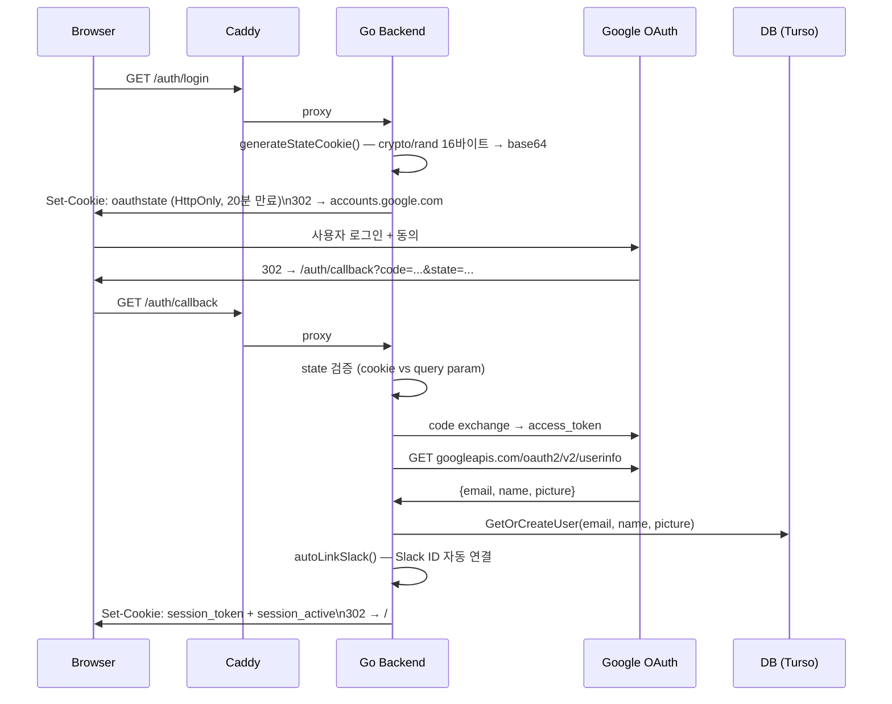

# 12. 인증 및 보안 (Authentication & Security)

## 목차

1. [보안 모델 개요](#1-보안-모델-개요)
2. [Google OAuth (사용자 인증)](#2-google-oauth-사용자-인증)
3. [세션 쿠키 관리](#3-세션-쿠키-관리)
4. [AuthMiddleware / AdminMiddleware](#4-authmiddleware--adminmiddleware)
5. [채널 토큰 영속](#5-채널-토큰-영속)
6. [시크릿 관리](#6-시크릿-관리)
7. [TLS / 프록시](#7-tls--프록시)
8. [알려진 위협 및 완화](#8-알려진-위협-및-완화)
9. [Cross-References + Deltas](#9-cross-references--deltas)

---

## 1. 보안 모델 개요

### 인증 vs 인가 (Authentication vs Authorization)

- **인증(Authentication)**: "이 요청은 누구인가?" — Google OAuth 2.0으로 신원 확인 후 세션 쿠키 발급
- **인가(Authorization)**: "이 사용자는 무엇을 할 수 있는가?" — `users.is_admin` 플래그 + super admin 하드코딩으로 관리 API 접근 통제

### 보호 자원

| 자원 | 보호 수단 |
|------|-----------|
| `/api/*` 라우트 | `AuthMiddleware` (세션 쿠키 검증) |
| `/api/admin/*` 라우트 | `AdminMiddleware` (인증 + `is_admin` 체크) |
| Gmail OAuth 토큰 | DB 암호화 없이 저장 (접근은 인증된 사용자만) |
| Telegram 자격증명 | DB 저장 (`telegram_credentials`, `telegram_sessions`) |
| `/auth/*` 라우트 | 공개 (OAuth 흐름 진입점) |

### 신뢰 경계 (Trust Boundary)

```
Browser
  │  HTTPS (TLS auto via Caddy)
  ▼
Caddy (34.67.133.18.nip.io)
  │  reverse_proxy → backend:8080
  │  X-Real-IP, X-Forwarded-For, X-Forwarded-Proto 헤더 전달
  ▼
Go Backend (port 8080)
  │  AuthMiddleware: session_token 쿠키 검증
  ▼
SQLite / Turso DB
```

Caddy가 TLS 종단점(TLS termination)을 담당하므로 백엔드 Go 서버는 HTTP만 처리한다.
외부에서 백엔드 포트(8080)에 직접 접근하는 경로는 없으며, 모든 트래픽은 Caddy를 통해서만 라우팅된다.

---

## 2. Google OAuth (사용자 인증)

### WHY Google OAuth

whatap.io Google Workspace를 기반으로 운영되므로, 별도 비밀번호 관리 없이 Workspace 계정으로 SSO(Single Sign-On)를 구현할 수 있다.
이메일 주소가 사용자 식별자(PK 역할)로 사용되므로, Google 인증이 반환하는 이메일이 그대로 내부 `users.email` 컬럼과 매핑된다.
OAuth를 선택한 또 다른 이유는 Gmail 채널 연동과 동일한 `google.golang.org/x/oauth2` 라이브러리를 재사용할 수 있어 의존성을 최소화하기 때문이다.

### 로그인 플로우



### CSRF 방지 (state 파라미터)

```go
// auth/auth.go: generateStateCookie
var b [16]byte
rand.Read(b[:])                                     // crypto/rand, 128비트 엔트로피
state := base64.RawURLEncoding.EncodeToString(b[:]) // URL-safe, 22자
http.SetCookie(w, &http.Cookie{
    Name: "oauthstate", Expires: time.Now().Add(20 * time.Minute),
    HttpOnly: true, SameSite: http.SameSiteLaxMode,
})
```

콜백에서 `r.FormValue("state") != oauthstate.Value` 조건이 맞지 않으면 즉시 `/`로 리다이렉트한다.
오류를 상세히 반환하지 않는 이유는 CSRF 탐지 로직을 공격자에게 노출하지 않기 위해서다.

### autoLinkSlack (부가 효과)

콜백 성공 시 `autoLinkSlack()`이 Slack 워크스페이스에서 동일 이메일의 Slack ID를 조회하고, DB의 `users.slack_id`와 `user_aliases`를 자동으로 채운다.
패키지 순환 참조(auth → channels → auth) 방지를 위해 Slack 조회 함수를 함수 파라미터(`lookupUserByEmail func(string) (string, string, error)`)로 주입받는다.

---

## 3. 세션 쿠키 관리

### WHY 쿠키 기반 세션 (JWT 미사용)

이 프로젝트는 JWT 서명 키 관리, 토큰 무효화(revocation) 문제를 회피하기 위해 **쿠키 기반 서버 세션**을 채택했다.
단일 서버(GCP e2-micro) 운영 환경에서는 Stateless JWT의 이점(수평 확장)이 없고,
서버 재기동 시 쿠키는 클라이언트가 보관하므로 세션 데이터를 별도 저장소에 유지할 필요가 없다.

### 쿠키 구성

`SetSessionCookie()`는 두 개의 쿠키를 동시에 발급한다:

| 쿠키 이름 | `HttpOnly` | `Secure` | `SameSite` | 내용 | 목적 |
|-----------|-----------|---------|------------|------|------|
| `session_token` | `true` | 프로덕션 `true` | `Lax` | base64(email) | 인증 토큰 |
| `session_active` | `false` | 프로덕션 `true` | `Lax` | `"true"` | 프론트엔드 로그인 상태 힌트 |

`session_active`를 `HttpOnly: false`로 두는 이유는 JS가 실제 토큰 값 없이 로그인 상태만 확인할 수 있게 하기 위해서다.
실제 인증에 사용되는 `session_token`은 JS 접근이 차단된다.

### 토큰 구조

`session_token` 값은 **서명 없는 base64 인코딩 이메일**이다.
서명이 없어도 위조 가능성이 낮은 이유: 쿠키 `Secure` + `HttpOnly` + `SameSite=Lax` 조합이 탈취 벡터(XSS, CSRF)를 막기 때문이다.
단점: 쿠키를 직접 탈취하면 임의 이메일로 위조 가능 → HTTPS(Caddy)가 전송 계층 보호를 담당한다.

### 만료 정책

- `session_token` / `session_active`: **24시간** (`maxAge := 24 * time.Hour`)
- `oauthstate`: **20분** (OAuth 흐름 완료에 충분한 최소 시간)
- Refresh 메커니즘 없음 — 만료 후 재로그인 필요

### 로그아웃

```go
// auth/auth.go: HandleLogout
http.SetCookie(w, &http.Cookie{
    Name: "session_token", Value: "", Expires: time.Unix(0, 0),
})
```

만료 시각을 Unix epoch(0)으로 설정해 즉시 무효화한다.

---

## 4. AuthMiddleware / AdminMiddleware

→ 전체 라우트 매핑: [`→ 11-handlers-and-api.md`](11-handlers-and-api.md)

### AuthMiddleware 검증 순서

```
요청 수신
  ├─ AuthDisabled=true? → DEFAULT_USER_EMAIL 컨텍스트 주입 후 통과 (dev only)
  ├─ session_token 쿠키 없음? → 401 JSON {"error":"unauthorized","code":401}
  ├─ base64 디코딩 실패? → 401
  └─ 성공 → context.WithValue(ctx, UserEmailKey, email) → next
```

`auth.UserEmailKey`는 unexported type `contextKey`를 사용한다.
이유: `string` 타입 키는 외부 패키지의 동일 문자열 키와 충돌할 수 있어, 타입 안전성을 위해 package-scoped 타입을 사용한다.

### AdminMiddleware 검증 순서

```go
// auth/auth.go
func AdminMiddleware(next http.Handler) http.Handler {
    return AuthMiddleware(http.HandlerFunc(func(w http.ResponseWriter, r *http.Request) {
        email := GetUserEmail(r)
        if !store.IsAdmin(r.Context(), email) {
            // 403 JSON {"error":"admin only","code":403}
            return
        }
        next.ServeHTTP(w, r)
    }))
}
```

`AdminMiddleware`는 `AuthMiddleware`를 래핑한다 — 미인증 요청은 여전히 401을 받는다(403이 아님).
이유: 401과 403을 분리해 클라이언트가 재로그인과 권한 부족을 구별할 수 있게 한다.

### Admin 판별 로직 (`store.IsAdmin`)

```
IsAdmin(ctx, email)
  ├─ email == SuperAdminEmail ("jjsong@whatap.io") → true (하드코딩, DB 불필요)
  └─ DB GetUserByEmail → users.is_admin == 1 → true
```

Super admin 이메일이 DB가 아닌 코드에 하드코딩된 이유는 DB 장애나 초기 마이그레이션 전에도 관리자 접근을 보장하기 위해서다.
`SetUserAdmin()`은 super admin을 변경하면 `ErrSuperAdminImmutable`을 반환한다.

### 컨텍스트 사용자 조회

핸들러에서 이메일을 조회할 때는 항상 `auth.GetUserEmail(r)`을 사용한다.
이 함수는 `AuthDisabled` 분기를 내부에서 처리하므로 핸들러가 dev/prod 차이를 알 필요가 없다.

---

## 5. 채널 토큰 영속

→ DB 스키마 상세: [`→ 04-data-layer.md`](04-data-layer.md)  
→ 채널 구현 상세: [`→ 05-channels.md`](05-channels.md)

### WHY DB 저장

채널 토큰(Gmail OAuth refresh token, Telegram MTProto session)을 DB에 저장하는 이유는 **서버 재기동 시 재인증을 회피**하기 위해서다.
메모리에만 보관하면 프로세스 재시작마다 사용자가 다시 인증해야 하므로 24시간 스캔 자동화가 불가능하다.

### Gmail OAuth 토큰

**테이블**: `gmail_tokens(user_email PK, token_json TEXT, updated_at)` → DB 스키마 상세: [04-data-layer.md](04-data-layer.md)

Gmail 연동은 로그인용 Google OAuth와 **별도 OAuth 플로우**를 거친다:
- 로그인 OAuth: `userinfo.email`, `userinfo.profile` 스코프 (read-only 프로필)
- Gmail OAuth: `gmail.readonly` 스코프 (메일 읽기 전용)

두 플로우를 분리한 이유: 최소 권한 원칙(Principle of Least Privilege). 로그인 시 이메일 스코프만 요청하고, 사용자가 명시적으로 Gmail 연동을 선택할 때만 읽기 권한을 요청한다.

Gmail OAuth 플로우 시퀀스 다이어그램(state prefix 검증, `AccessTypeOffline`, `ApprovalForce` 상세, 자동 토큰 갱신 패턴)은 → [05-channels.md §3](05-channels.md#3-gmail) 참조 (sequence diagram + state prefix + token auto-refresh).

### Telegram 자격증명 및 세션

**테이블**:
- `telegram_credentials(email PK, app_id INTEGER, app_hash TEXT, updated_at)`
- `telegram_sessions(email PK, session_data BLOB, updated_at)`

Telegram MTProto는 OAuth가 없으며, 사용자가 직접 Telegram API로부터 발급받은 `app_id`와 `app_hash`를 등록해야 한다.
`session_data`는 gotd/td 라이브러리의 MTProto 세션 바이너리로, 인증된 연결 상태를 포함한다. 재기동 시 이 세션으로 재연결하면 전화번호 인증 없이 바로 사용 가능하다.

→ Telegram 채널 구현: [`→ 05-channels.md`](05-channels.md)

---

## 6. 시크릿 관리

### .env 파일 구성

5개의 환경별 `.env` 파일이 프로젝트 루트에 존재한다:

| 파일 | 용도 |
|------|------|
| `.env` | 기본값 (개발/테스트 공용) |
| `.env.local` | 로컬 오버라이드 (`.gitignore` 대상) |
| `.env.development` | 개발 환경 |
| `.env.vps` | VPS (GCP e2-micro) 환경 |
| `.env.production` | 프로덕션 |

**등록된 시크릿 키** (값 제외):

```
GOOGLE_CLIENT_ID=...
GOOGLE_CLIENT_SECRET=...
SLACK_TOKEN=...
TELEGRAM_APP_ID=...
TELEGRAM_APP_HASH=...
```

### GCP Secret Manager 미사용

Secret Manager를 도입하지 않은 이유: 단일 서버 e2-micro 환경에서 API 호출 비용과 복잡도가 ROI를 넘지 않는다.
대신 SSH 접근이 제한된 VM에 `.env` 파일을 직접 배치한다.

### 시크릿 노출 방지

- **코드**: `auth.go`의 OAuth 콜백에서 `access_token`을 URL 파라미터로 받지 않고 code exchange 후 서버 사이드에서만 처리한다.
- **로그**: `logger.Infof("[GMAIL] connected for %s", email)`처럼 이메일만 기록하고 토큰 값은 로그에 출력하지 않는다.
- **WhaTap trace**: Gmail 토큰 JSON을 `trace.Step()` 인자로 전달하지 않는다 (CLAUDE.md 규정).
- **응답**: 인증 실패 시 `{"error":"unauthorized","code":401}`만 반환하고 상세 원인(쿠키 만료 vs 위조)을 구분하지 않는다.

---

## 7. TLS / 프록시

### Caddyfile 구성

```
34.67.133.18.nip.io {
    @backend_routes { path /api/* /auth/* /health }
    handle @backend_routes {
        reverse_proxy backend:8080 {
            header_up X-Real-IP {remote_host}
            header_up X-Forwarded-Proto {scheme}
        }
    }
    handle {
        try_files {path} /index.html
        file_server
    }
}
```

### TLS 자동화

Caddy는 nip.io 도메인에 대해 **Let's Encrypt ACME**를 통해 TLS 인증서를 자동 발급·갱신한다.
Go 백엔드는 HTTP만 처리하므로 인증서 관리 코드가 없다.

### HTTPS 전용 정책

`SetSessionCookie`와 `generateStateCookie`에서 `isProd` 플래그를 통해 프로덕션 환경에서는 쿠키에 `Secure: true`를 강제한다:

```go
isProd := os.Getenv("ENV") == "production" || strings.HasPrefix(appBaseURL, "https://")
```

`AppBaseURL` 프리픽스도 확인하는 이유: `ENV` 환경변수 설정을 빠뜨려도 HTTPS URL이면 자동으로 Secure 쿠키가 적용되도록 이중 방어를 구성하기 때문이다.

### SPA 라우팅 격리

`handle @backend_routes`가 `/api/*`, `/auth/*`, `/health`만 백엔드로 포워딩하고, 나머지는 `file_server`가 정적 파일을 서빙한다.
`handle_path` 대신 `handle`을 사용하는 이유: `handle_path`는 prefix를 제거하므로 백엔드의 라우트 패턴(`/api/messages`)이 깨진다.

---

## 8. 알려진 위협 및 완화

### CSRF

- **로그인 CSRF**: `state` 파라미터 + `oauthstate` HttpOnly 쿠키로 방지 (§2 참조)
- **Gmail 연동 CSRF**: `state` 값에 `"gmail:"` 프리픽스 + 로그인한 사용자 이메일 포함
  - 콜백에서 prefix 검증: `!strings.HasPrefix(state, "gmail:")` → 400 반환
- **API CSRF**: `SameSite=Lax` 쿠키는 cross-site POST 요청 시 전송되지 않으므로 상태 변경 API가 보호된다

### XSS

- `session_token`은 `HttpOnly: true` — JS로 접근 불가
- 프론트엔드 렌더링은 Vite + TypeScript (DOM innerHTML 직접 삽입 회피 패턴)
- CSP(Content-Security-Policy) 헤더는 Caddyfile에 명시되어 있지 않음 — 미구현

### SQL Injection

- sqlc를 사용하므로 모든 쿼리가 파라미터화된 `?1`, `?2` 바인딩을 사용한다 → 구조적으로 SQL injection 불가
- dynamic IN 절 등 raw SQL이 필요한 케이스는 CLAUDE.md 정책에 따라 최소화

### Rate Limiting

- HTTP 레벨 rate limiting 미구현 (Caddy나 Go 레이어 모두 없음)
- 단일 사용자 서비스 특성상 현재는 위험도가 낮음
- AI API 호출(Gemini)에는 배치 사이즈(10), 스캔 주기, 컨텍스트 취소를 통한 암묵적 쓰로틀링 존재

### Audit Log

`identity_merge_history` 테이블이 연락처 병합 이력을 기록한다:

```sql
CREATE TABLE IF NOT EXISTS identity_merge_history (
    id INTEGER PRIMARY KEY AUTOINCREMENT,
    source_contact_id INTEGER NOT NULL REFERENCES contacts(id),
    target_contact_id INTEGER NOT NULL REFERENCES contacts(id),
    reason TEXT NOT NULL,
    merged_at DATETIME DEFAULT CURRENT_TIMESTAMP
);
```

이 테이블이 존재하는 이유: 자동 identity merge가 잘못 병합했을 때 원인을 추적하고 되돌리기 위해서다.
`reason` 컬럼에 병합 근거(이름 유사도, 이메일 패턴 등)가 기록된다.

→ Identity 관리 상세: [`→ 09-identity-and-dedup.md`](09-identity-and-dedup.md)

### AuthDisabled 모드 보안 고려사항

`AUTH_DISABLED=true`는 로컬 개발 전용이다. 이 모드에서는:
- 모든 API 요청이 `DEFAULT_USER_EMAIL` 이메일로 처리됨
- `AuthMiddleware`가 쿠키 검증을 완전히 건너뜀
- 프로덕션 환경에서 활성화 시 전체 API가 무인증 상태가 됨

`handlers_admin.go`에서 admin API를 통해 `AUTH_DISABLED`를 런타임에 변경할 수 있는 경로가 있다.
이 엔드포인트 자체는 `AdminMiddleware`로 보호되므로 super admin만 호출 가능하다.

---

## 9. Cross-References + Deltas

### Cross-References

| 항목 | 참조 문서 |
|------|-----------|
| Gmail OAuth 토큰 DB 스키마 (`gmail_tokens`) | [`→ 04-data-layer.md`](04-data-layer.md) |
| Telegram 세션/자격증명 스키마 | [`→ 04-data-layer.md`](04-data-layer.md) |
| Gmail 채널 스캔 파이프라인 | [`→ 05-channels.md`](05-channels.md) |
| `AuthMiddleware` 적용 라우트 목록 | [`→ 11-handlers-and-api.md`](11-handlers-and-api.md) |
| Identity merge 자동화 로직 | [`→ 09-identity-and-dedup.md`](09-identity-and-dedup.md) |
| WhaTap trace + HTTP out 패턴 | [`→ 03-backend-architecture.md`](03-backend-architecture.md) |

### 구현 갭 (Deltas) — 알려진 미구현 항목

| 항목 | 현황 | 위험도 |
|------|------|--------|
| CSP 헤더 | 미구현 (Caddyfile에 없음) | 중 |
| Rate limiting | 미구현 | 낮음 (단일 사용자 서비스) |
| Gmail 토큰 암호화 | DB에 평문 JSON 저장 | 중 (DB 유출 시 토큰 노출) |
| Session revocation | 서버 사이드 세션 목록 없음, 쿠키 만료만 존재 | 낮음 |
| Telegram app_hash 암호화 | DB에 평문 저장 | 중 |
