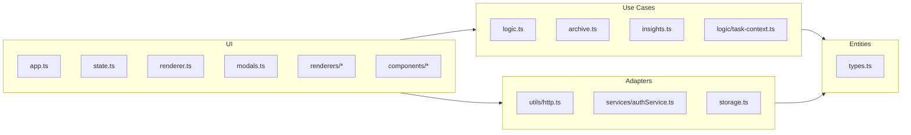
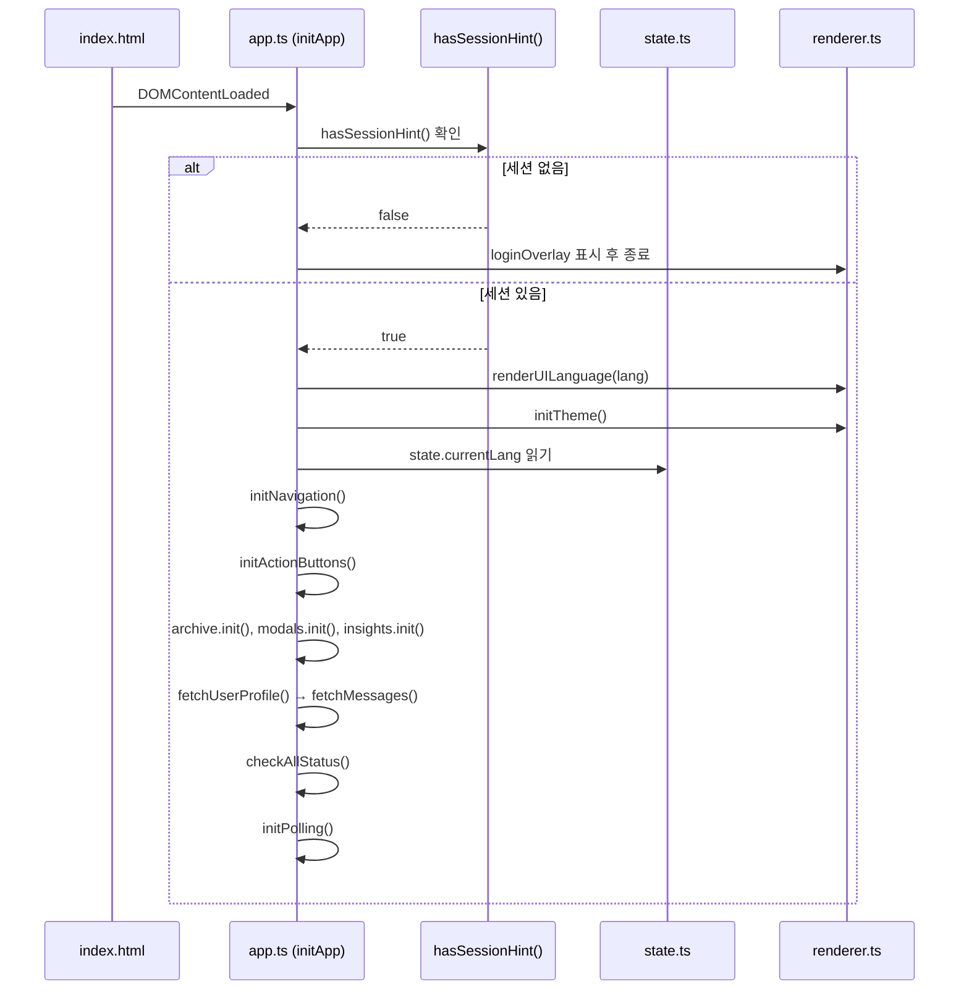
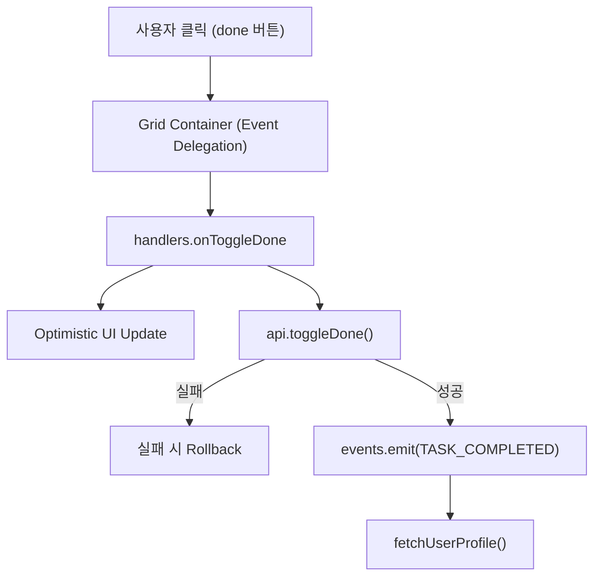
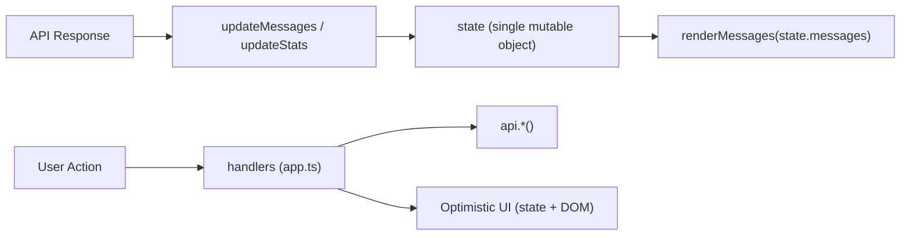

# 13. 프론트엔드 아키텍처 (Frontend Architecture)

> **Cross-references**
> - UI 시스템(컴포넌트·CSS·i18n) → [14-frontend-ui-system.md](14-frontend-ui-system.md)
> - 백엔드 API 엔드포인트 → [11-handlers-and-api.md](11-handlers-and-api.md)
> - 인증 흐름 → [12-auth-and-security.md](12-auth-and-security.md)

---

## 1. 프론트 아키텍처 개요 (Overview)

### 1.1 기술 스택 선택 이유 (Why Vanilla TypeScript + Vite)

React·Vue를 사용하지 않은 이유: 서버-렌더링 없이 단일 사용자 대시보드만 제공하며, 번들 크기(번들러 런타임 ~40 KB 절감)와 외부 의존성 없는 DOM 직접 조작이 중요했습니다. Vite는 ESM 네이티브 HMR 및 `rollup` 기반 트리-쉐이킹을 제공합니다.

- **Vite 6.x**: dev proxy + production `dist/` 번들 분리
- **TypeScript 5.7**: strict mode, `noImplicitAny`, `noUnusedLocals`
- **Vitest 4.x**: 동일한 Vite 설정을 재사용하는 단위 테스트

### 1.2 Clean Architecture 레이어 매핑

프론트엔드는 **4-레이어 Clean Architecture**를 따릅니다.



- **Entities**: 공유 타입 정의만 포함. DOM·네트워크 의존 없음.
- **Use Cases**: 순수 비즈니스 로직 (정렬·필터·데이터 변환). 테스트 단독 실행 가능.
- **Adapters**: 외부 시스템(HTTP, localStorage) 추상화. Fetch API·스토리지를 격리.
- **UI**: DOM 조작·이벤트 바인딩·상태 갱신. app.ts가 전체를 조율.

### 1.3 SPA 진입점 (Entry Point)

```
index.html
  └─ <script type="module" src="/src/app.ts">  ← Vite 처리
       └─ DOMContentLoaded → initApp()
```

`index.html`은 최소 마크업(`glass-container`, 모달 DOM, nav 탭)과 WhaTap Browser RUM 스니펫만 포함합니다. 테마 FOUC(Flash Of Unstyled Content) 방지를 위해 `localStorage.getItem('mc_theme')` 인라인 스크립트가 `<body>` 최상단에 위치합니다.

---

## 2. 레이어 매핑 상세 (Layer Mapping)

### 2.1 Entities — [`src/types.ts`](../../src/types.ts)

모든 공유 타입의 단일 진실 공급원(Single Source of Truth). 외부 의존성 없음.

주요 인터페이스:

| 타입 | 역할 |
|---|---|
| `Message` | 메시지 카드 데이터 모델 (id, task, requester, source, subtasks 등) |
| `AppState` | 전역 상태 구조체 (lang, theme, messages, reports, selectedTaskIds 등) |
| `CategorizedMessages` | `{ inbox, delegated, reference }` 3-분류 메시지 컨테이너 |
| `IReportData` | AI 보고서 (id, summary, visualization_data, translations) |
| `UserProfile` | 사용자 프로필 (email, name, aliases, points, is_admin) |
| `ServiceHandlers` | app.ts → renderer.ts 간 핸들러 인터페이스 |
| `I18nEntry` | `Record<string, any>` — 로케일 딕셔너리 항목 (`any` 사용 사유 주석 포함) |

`I18nEntry`에 `any`를 사용한 이유: 로케일 딕셔너리는 ~220개 키와 배열 값이 혼재하며, 완전한 named interface는 모든 UI 문자열 감사를 강제함. 언어 코드별 typed access 유지에 충분.

### 2.2 Use Cases

#### `src/logic.ts` — 순수 비즈니스 로직

DOM·네트워크 의존 없음. 테스트 커버리지 확보된 순수 함수 집합.

| 함수 | 역할 |
|---|---|
| `sortAndSearchMessages` | 완료-후-X일 아카이브 필터 + 검색어 필터 + 정렬 |
| `generateHeatmapData` | 과거 N일 히트맵 셀 생성 (level 0-4) |
| `normalizeReportData` | 백엔드 raw JSON → `IReportData` 안전 변환 |
| `getDeadlineBadge` | 마감일 기준 urgency 배지 HTML 반환 |
| `parseMarkdown` | marked.js 래퍼 (releases notes, report) |
| `getDisplayTask` | 언어별 번역 우선 순위 (`task_ko` → `task_en` → `task`) |

#### `src/archive.ts` — 보관함 Use Case

[`src/archive.ts`](../../src/archive.ts) 는 보관함 뷰의 모든 Use Case를 캡슐화합니다: 페이지네이션, 검색 debounce(500ms), 정렬, 다중 선택(bulk), CSV·Excel·JSON 내보내기, 영구 삭제 2단계 confirm.

#### `src/insights.ts` — 인사이트 컨트롤러

[`src/insights.ts`](../../src/insights.ts): AI 보고서 생성·번역·폴링·삭제 Use Case. Tab Isolation 패턴으로 Insights 탭이 보일 때만 데이터를 페치합니다. 보고서 상태 `processing` 시 5초 간격 폴링(최대 30회 = 150초).

#### `src/logic/task-context.ts` — 태스크 컨텍스트 파싱

[`src/logic/task-context.ts`](../../src/logic/task-context.ts): 백엔드 `consolidated_context` 필드는 JSON 배열 문자열 또는 실제 배열로 올 수 있습니다. `parseTaskContext(unknown): string[]` 함수가 양쪽을 안전하게 처리합니다.

### 2.3 Adapters

#### `src/utils/http.ts` — API 클라이언트 코어

[`src/utils/http.ts`](../../src/utils/http.ts): 모든 HTTP 통신의 단일 진입점. `apiFetch<T>` 제네릭 함수가 URL 조립, 쿼리 파라미터 직렬화, 401/HTML 응답 감지, `ApiError` throw를 담당합니다. → [섹션 5](#5-api-클라이언트-apits--utilshttpts) 상세.

#### `src/services/authService.ts` — Gmail OAuth 어댑터

[`src/services/authService.ts`](../../src/services/authService.ts): Gmail OAuth 흐름을 격리합니다. `connectGmail()`은 `fetch` 대신 `window.location.href` 리디렉션을 사용합니다 — OAuth 흐름은 Fetch API로 처리할 수 없기 때문입니다. → [12-auth-and-security.md](12-auth-and-security.md)

#### `src/storage.ts` — localStorage 어댑터

[`src/storage.ts`](../../src/storage.ts): `STORAGE_KEYS` 상수(`mc_lang`, `mc_theme`)로 키 드리프트를 방지합니다. `index.html` 인라인 스크립트의 `mc_theme` 리터럴과 반드시 동기화해야 합니다(주석으로 명시).

### 2.4 UI 레이어

`app.ts`(코디네이터) + `state.ts`(전역 상태) + `renderer.ts`(메인 DOM 애그리게이터) + `renderers/*`(도메인별 렌더러) + `components/*`(재사용 컴포넌트). CSS·컴포넌트 상세 → [14-frontend-ui-system.md](14-frontend-ui-system.md)

**인터랙티브 가이드 모듈 (2026-05-03 추가):**
- [`src/guide.ts`](../../src/guide.ts) — 사이드바 탭 네비게이션 + `parseMarkdown` 기반 섹션 렌더링. `guide.init()`은 `.c-guide__sidebar-btn` 버튼에 이벤트를 바인딩하고 `guide.onShow()`는 초기 섹션을 로드합니다.
- [`src/guide-content.ts`](../../src/guide-content.ts) — `docs/user-guide/` 마크다운 내용을 빌드 타임에 문자열로 번들링. `GUIDE_SECTIONS` + `GUIDE_CONTENT` 레코드를 export합니다.
- [`static/css/v2-guide.css`](../../static/css/v2-guide.css) — `.c-guide__*` BEM 블록 (패널·사이드바·콘텐츠 레이아웃).

### 2.5 events.ts — Pub/Sub 이벤트 버스

[`src/events.ts`](../../src/events.ts): 모듈 간 강한 결합을 피하기 위한 타입-안전 이벤트 에미터. 리스너 저장 타입은 `EventCallback<unknown>`이지만 `on<T>` / `emit<T>` 제네릭이 호출 지점에서 타입 추론을 유지합니다.

```ts
export const EVENTS = {
    TASK_COMPLETED:      'task:completed',
    USER_PROFILE_UPDATED: 'user:profile_updated',
    THEME_CHANGED:       'theme:changed',
    LANGUAGE_CHANGED:    'language:changed',
} as const;
```

구독 패턴: `events.on(EVENTS.THEME_CHANGED, () => ...)` — insights.ts와 connections-renderer.ts가 테마 변경을 독립적으로 구독합니다. app.ts가 emit하면 각 모듈이 자율적으로 반응.

### 2.6 constants.ts — 전역 상수

[`src/constants.ts`](../../src/constants.ts):

| 상수 | 내용 |
|---|---|
| `POLLING_INTERVALS` | MESSAGES: 60s, WHATSAPP/SLACK/TELEGRAM: 10s, GMAIL: 30s |
| `STATUS_STATES` | 채널 상태 문자열 (`connected`, `disconnected` 등) |
| `DOM_IDS` | 동적 DOM ID 생성 함수 (`${service}StatusLarge`) |
| `TELEGRAM_STATUS` | Telegram 다단계 인증 상태 enum |

`isStatusConnected(status)` in `utils.ts`가 `STATUS_STATES.CONNECTED`와 대소문자 무관 비교를 수행합니다 — 백엔드 케이싱 슬립에 대한 방어 계층.

---

## 3. app.ts (코디네이터)

[`src/app.ts`](../../src/app.ts)는 애플리케이션의 단일 조율자(Orchestrator)입니다. 비즈니스 로직을 직접 포함하지 않고 각 레이어를 연결하는 글루 코드 역할만 합니다.

### 3.1 부팅 시퀀스



### 3.2 이벤트 라우팅 패턴

app.ts는 두 가지 이벤트 채널을 사용합니다:

1. **DOM 이벤트 위임(Event Delegation)**: 각 그리드 컨테이너(`receivedTasksList` 등)에 단일 리스너 부착. `data-action` 속성으로 액션 분기.
2. **Pub/Sub (`events.ts`)**: 모듈 간 느슨한 결합. `EVENTS` 상수(4개: `TASK_COMPLETED`, `USER_PROFILE_UPDATED`, `THEME_CHANGED`, `LANGUAGE_CHANGED`)로 타입 안전 이벤트 이름 관리.



### 3.3 핵심 함수 요약

| 함수 | 역할 |
|---|---|
| `fetchMessages(bypassVisibility)` | 메시지 fetch + 해시 비교 변경 감지 + 배치 번역 트리거 |
| `checkAllStatus(bypass)` | 4개 채널 상태 병렬 fetch (`Promise.allSettled`) |
| `triggerBatchTranslation()` | 현재 활성 탭의 미번역 메시지 ID 수집 후 배치 번역 |
| `schedulePoll(task, interval)` | 재귀 setTimeout으로 겹침 없는 폴링 |
| `initVisibilityListener()` | 탭 복귀(`visibilitychange`) 시 즉시 데이터 갱신 |
| `updateMergeBar()` | 선택 개수 ≥2 시 merge bar 표시 |

### 3.4 Optimistic Update 패턴

사용자 응답성을 위해 서버 응답 전 UI를 먼저 갱신하고 실패 시 롤백합니다:

```ts
// 1. Optimistic Update
updateTaskStatusInState(id, done);
updateTaskNodeStatus(id, done);
// 2. API 호출
await api.toggleDone(id, done);
// 3. 실패 시 Rollback
updateTaskStatusInState(id, !done);
updateTaskNodeStatus(id, !done);
```

`onDeleteTask`의 롤백은 더 복잡합니다: 삭제된 태스크를 카테고리 기반으로(`category === 'requested'` → `delegated`, `'personal'` → `inbox`, 기타 → `reference`) 올바른 배열에 `upsertItem`으로 복원하고 `renderMessages(state.messages)` 전체 재렌더를 트리거합니다. 개별 DOM 삽입보다 안전한 fallback입니다.

### 3.5 폴링 전략

`schedulePoll(task, interval)`은 재귀 `setTimeout`으로 구현됩니다. `setInterval`을 쓰지 않는 이유: 이전 요청이 완료되기 전에 다음 요청이 시작되는 겹침 현상(overlap)을 방지.

```
schedulePoll(fetchMessages, 60_000)
  └─ setTimeout(60s) → await fetchMessages(false)
       └─ finally: schedulePoll(fetchMessages, 60_000)
```

`activeTimers` 배열로 진행 중인 타이머를 추적하여 `initPolling()` 재호출 시 기존 타이머를 모두 정리합니다.

---

## 4. State 관리 (state.ts)

[`src/state.ts`](../../src/state.ts): 단일 가변 객체 `state: AppState`를 모듈 스코프에 선언합니다. Flux/Redux 없이 직접 참조하는 방식을 선택한 이유: 단일 사용자 SPA에서 time-travel debugging 불필요, 파일 수·번들 크기 최소화.

### 4.1 AppState 구조

```
AppState {
  userProfile: UserProfile        // 이메일, 이름, 포인트, 별칭
  currentLang: string             // localStorage 초기화
  currentTheme: string            // localStorage 초기화
  waConnected / gmailConnected    // 채널 연결 상태
  messages: CategorizedMessages   // inbox / delegated / reference
  archivePage/Limit/Search/Sort   // 보관함 페이지네이션 상태
  archiveSemantic: boolean        // Smart 토글 상태 (기본값 false)
  selectedTaskIds: Set<number>    // 병합 선택 집합
  reports: Record<string, IReportData>  // O(1) date-keyed 캐시
  reportHistory: IReportData[]    // 보고서 목록 메타데이터
  isFetchingMessages / isFetchingStatus // 동시성 Lock 플래그
  deadlineFilter: 'all'|'today'|'week'|'has_deadline'
}
```

### 4.2 갱신 함수

state를 직접 변경하지 않고 export된 함수를 사용합니다:

| 함수 | 동작 |
|---|---|
| `updateLang(lang)` | state + localStorage 동기 갱신 |
| `updateTheme(theme)` | state + localStorage 동기 갱신 |
| `updateMessages(msgs)` | 전체 교체 (idempotent, 백엔드 단일 진실) |
| `updateStats(user)` | Partial merge — `archive_days`, `stale_threshold_working_days` 포함 |
| `upsertReport(report)` | `{start_date}_{end_date}` 키로 O(1) upsert |
| `deleteTaskFromState(id)` | 3개 배열 동시 filter (Optimistic Delete) |
| `updateTaskStatusInState(id, done)` | 3개 배열 map (Optimistic Toggle) |
| `updateSubtaskStateInState(taskId, idx, done)` | 서브태스크 불변 갱신 |
| `upsertItem<T>(collection, item)` | Generic upsert — 중복 방지 |

### 4.3 localStorage 영속화

`lang`, `theme` 두 키만 영속화합니다. `storage.ts`의 `STORAGE_KEYS` 상수를 통해 키 리터럴 중복을 제거합니다.

### 4.4 동시성 Lock 플래그

`isFetchingMessages`, `isFetchingStatus`는 동시 중복 fetch를 방지하는 소프트 Lock입니다. `try/finally`로 항상 해제합니다. `document.hidden` 체크와 조합하여 백그라운드 탭에서 폴링을 억제합니다.

### 4.5 단방향 흐름 보장

state는 단방향으로 흐릅니다:



양방향(two-way binding)을 사용하지 않는 이유: 단일 사용자 대시보드에서 데이터 흐름을 단방향으로 제한하면 디버깅이 쉽고, 상태와 DOM이 불일치하는 버그를 줄입니다.

---

## 5. API 클라이언트 (api.ts + utils/http.ts)

### 5.1 apiFetch — 중앙 HTTP 래퍼

[`src/utils/http.ts`](../../src/utils/http.ts)의 `apiFetch<T>` 함수가 모든 통신을 처리합니다.

**URL 조립 규칙** (proxy 환경과 production 모두 대응):

```
BASE_URL = VITE_API_BASE_URL (개발: 'http://host/api', 프로덕션: '/api')
- /auth/* → origin root (OAuth redirect)
- /api/* + BASE_URL === '/api' → 절대 경로 (이중 /api/api 방지)
- 기타 → BASE_URL + endpoint
```

**오류 처리**:
- `401` → `ApiError(isAuthError=true)` throw → `safeAsync`가 `triggerAuthOverlay` 옵션으로 로그인 오버레이 표시
- HTML 응답 → 세션 만료 또는 Caddy 리디렉션으로 간주, `ApiError` 401 throw
- `credentials: 'include'` — 쿠키 기반 세션 전달 필수

### 5.2 Vite Proxy (vite.config.ts)

[`vite.config.ts`](../../vite.config.ts): 개발 시 `/api` 및 `/auth` 경로를 백엔드 서버로 프록시합니다. `secure: false`는 nip.io self-signed 인증서 검증 우회를 위한 것입니다.

```ts
proxy: {
  '/api':  { target: 'https://34.67.133.18.nip.io', changeOrigin: true, secure: false },
  '/auth': { target: 'https://34.67.133.18.nip.io', changeOrigin: true, secure: false },
}
```

프로덕션에서는 Caddy가 동일 역할을 합니다 — 프론트엔드 `dist/`와 백엔드 API가 동일 origin을 공유합니다.

### 5.3 api.ts — API 메서드 컬렉션

[`src/api.ts`](../../src/api.ts): `apiFetch`를 사용하는 모든 엔드포인트 메서드의 집합. ID 입력 검증(`ensureInt`, `ensureIntArray`)으로 음수·비정수 ID가 백엔드에 전달되지 않도록 방어합니다.

주요 그룹:

| 그룹 | 메서드 |
|---|---|
| 메시지 | `fetchMessages`, `searchActiveMessages`, `toggleDone`, `deleteTask`, `mergeTasks` |
| 번역 | `requestTranslation`(batcher), `translateTasksBatch` |
| 채널 상태 | `fetchWhatsAppStatus`, `fetchSlackStatus`, `fetchTelegramStatus`, `fetchGmailStatus` |
| 보고서 | `generateReport`, `fetchReportHistory`, `translateReport`, `exportReportToNotion` |
| 보관함 | `fetchArchive`, `fetchArchiveCount`, `hardDeleteTasks`, `restoreTasks` |
| 관리자 | `fetchAdminSettings`, `updateAdminSetting`, `addAdmin`, `removeAdmin` |

### 5.4 TranslationBatcher — 50ms 윈도우 배치

동시다발적 번역 요청이 개별 API 호출로 폭증하는 것을 방지합니다. 50ms 내에 수집된 모든 번역 요청을 단일 `POST /tasks/translate-batch` 호출로 병합합니다.

```
requestTranslation(id, lang)  →  queue.set(lang, ids)
                                      │
                              setTimeout(flush, 50ms)
                                      │
                              POST /tasks/translate-batch
                                  { task_ids: [...], lang }
```

`Map<string, Promise>` 구조로 동일 ID·언어 조합의 중복 요청을 dedup합니다.

### 5.5 isApiError 패턴

```ts
import { isApiError } from './utils';
// 409 Conflict는 이미 실행 중인 작업 — poll에 합류
if (!isApiError(e) || e.status !== 409) throw e;
```

`unknown` 타입의 catch 블록에서 `ApiError`로 안전하게 narrowing합니다.

### 5.6 Report 더블 캐싱

`api.getReport(date)`는 두 레이어 캐시를 거칩니다:

```
state.reports[date] hit? → 즉시 반환 (Memory)
아니면 → api.generateReport() → normalizeReportData() → upsertReport()
```

---

## 6. Renderer (renderer.ts)

[`src/renderer.ts`](../../src/renderer.ts)는 애그리게이터 패턴으로 구현된 메인 DOM 컨트롤러입니다. 도메인별 세부 렌더러(`renderers/*`)에서 함수를 re-export하여 app.ts가 단일 import 지점을 갖도록 합니다.

### 6.1 Re-export 구조

```ts
// renderer.ts → re-exports from:
export { updateSlackStatus, updateWhatsAppStatus, ... } from './renderers/status-renderer';
export { updateUserProfile } from './renderers/profile-renderer';
export { showToast, setTheme, ... } from './renderers/ui-effects';
export { renderProposals } from './renderers/settings-renderer';
```

이 구조로 app.ts는 `import { ... } from './renderer'` 단일 import만 필요합니다.

### 6.2 renderMessages — 핵심 렌더링 함수

4개 그리드(`receivedTasksList`, `delegatedTasksList`, `referenceTasksList`, `allTasksList`)를 동시에 갱신합니다. FTS 서버 검색 결과(`skipClientSearch: true`) 또는 클라이언트 LIKE 필터를 선택적으로 적용합니다.

전체 re-render 대신 `innerHTML` 일괄 교체 방식 — Virtual DOM 없이도 카드 수가 적어(보통 <200) 성능 문제 없음.

### 6.3 Optimistic DOM 조작 함수

| 함수 | 방식 |
|---|---|
| `removeTaskNode(id)` | CSS 애니메이션(`c-message-card--removing`) + 300ms 후 DOM 제거 |
| `updateTaskNodeStatus(id, done)` | classList.toggle만 변경 — re-render 없음 |
| `updateSubtaskNodeStatus(taskId, idx, done)` | subtask-item 요소만 직접 조작 |

### 6.3 getVisibleUntranslatedIds — 배치 번역 트리거 소스

현재 활성 탭(`.c-tabs__panel.active`)의 카드만 스캔하여 `task_ko`가 없고 `is_translating`이 false인 메시지 ID를 반환합니다. 이 ID 목록이 `triggerBatchTranslation()` → `TranslationBatcher.request()` → `POST /tasks/translate-batch`로 이어집니다. 탭 전환 시에도 동일하게 호출되므로 탭마다 JIT(Just-In-Time) 번역이 실행됩니다.

### 6.4 이벤트 위임 (Event Delegation)

`initMessageGridEvents(gridId, handlers)`는 그리드 컨테이너에 단일 click 리스너를 부착합니다. `data-action` 속성(`toggle-done`, `delete`, `show-original`, `select-task`, `toggle-subtask`, `map-alias`)으로 핸들러를 분기합니다. 카드가 동적으로 추가·제거되어도 리스너 재등록이 불필요합니다.

### 6.5 도메인별 렌더러 목록

`src/renderers/` 디렉터리:

| 파일 | 역할 |
|---|---|
| `status-renderer.ts` | 채널 연결 상태 아이콘·텍스트 갱신 |
| `profile-renderer.ts` | 사용자 프로필(아바타, 이름, 포인트) |
| `connections-renderer.ts` | Settings → Connections 탭 카드 렌더링 |
| `settings-renderer.ts` | Identity Proposals, 설정 패널 |
| `reports-renderer.ts` | 보고서 상세·목록 렌더링 |
| `admin-renderer.ts` | 관리자 패널 |
| `i18n-renderer.ts` | `data-i18n` 속성 기반 UI 언어 교체 |
| `telegram-modal-renderer.ts` | Telegram 인증 모달 플로우 |
| `task-renderer.ts` | 개별 태스크 렌더링 헬퍼 |
| `ui-effects.ts` | toast, scan 로딩, 테마 전환 |

CSS·컴포넌트 상세 → [14-frontend-ui-system.md](14-frontend-ui-system.md)

---

## 7. Logic 모듈 (Use Cases)

### 7.1 logic.ts — 정렬·필터·캐시

`sortAndSearchMessages(messages, query)`의 처리 순서:
1. `done` + 완료 후 `archiveThresholdDays` 초과 → 제외 (보관함 이관 기준)
2. 검색어 → `task` + `requester` LIKE 필터
3. 정렬: done 업무 후순위, 최신 created_at 우선

`getArchiveThresholdDays()`는 state에서 읽음 — 사용자 설정 반영.

### 7.2 archive.ts — 페이지네이션·검색

state의 `archivePage`, `archiveLimit`, `archiveSearch`, `archiveSort`, `archiveOrder`, `archiveStatus`를 파라미터로 `api.fetchArchive()` 호출. 검색 debounce: 500ms. 정렬 토글: 동일 필드 재클릭 시 ASC↔DESC 전환.

**Smart 토글 (의미 검색)**: `#archiveSemanticToggle` 버튼이 `state.archiveSemantic`을 플립하고 즉시 `fetch()`를 재실행합니다. 검색어 길이 ≥ 3이고 `archiveSemantic === true`일 때 `api.fetchArchiveSemantic()` → `POST /api/messages/archive/semantic`을 호출하며, 그 외에는 기존 FTS 페이지 경로를 유지합니다. semantic 모드에서는 RRF 랭커가 전체 아카이브를 대상으로 결과를 반환하므로 status·정렬 필터를 건너뜁니다.

```ts
// archive.ts — fetch() 분기 핵심
const useSemantic = state.archiveSemantic && state.archiveSearch.trim().length >= 3;
if (useSemantic) {
    const data = await api.fetchArchiveSemantic(state.archiveSearch, state.currentLang, state.archiveLimit);
    // ... renderArchive, pagination UI 갱신
    return;
}
```

i18n: `archiveSemanticToggle` / `archiveSemanticToggleHint` 키 — en("Smart"), ko("스마트"), id("Cerdas"), th("อัจฉริยะ") 4개 언어 지원.

내보내기 3종: `/api/messages/export` (CSV), `/api/messages/export/excel` (XLSX), `/api/messages/export/json`. 브라우저 native `<a download>` 방식으로 파일 저장.

### 7.3 insights.ts — 분석·차트

**Tab Isolation** 전략: `onShow()`가 현재 활성 서브탭을 확인하여 `refreshData()`(통계) 또는 `refreshReport()`(보고서)만 호출합니다. 사용하지 않는 탭의 API 호출을 방지합니다.

**보고서 폴링 전략**:
```
generateReport() → status === 'processing'
  → pollReportStatus(id, 0)
    → 5초마다 fetchReportDetail(id)
    → status === 'completed' → refreshReport(id)
    → attempts > 30 (150초) → handlePollTimeout()
```

**Theme/Language 반응**: `events.on(THEME_CHANGED)`와 `events.on(LANGUAGE_CHANGED)`를 구독하여 현재 활성 탭에만 재렌더링.

**JIT 번역**: 언어 변경 시 이미 로드된 보고서에 번역이 없으면 `api.translateReport(id, lang)` 호출 후 결과를 `report.translations[lang]`에 캐시.

### 7.4 insightsRenderer.ts — Passive View

[`src/insightsRenderer.ts`](../../src/insightsRenderer.ts)는 **Passive View** 패턴: 전역 state·i18n 의존 없음. 모든 데이터는 컨트롤러(`insights.ts`)가 주입합니다.

SVG 차트(pieChart, completionTrend, hourlyActivity, activityHeatmap)는 라이브러리 없이 `document.createElementNS` 직접 생성합니다. CSS 변수(`var(--accent-color)` 등)를 `getComputedStyle`으로 읽어 테마 반응성을 확보합니다.

### 7.5 logic/task-context.ts

`parseTaskContext(unknown): string[]`는 백엔드 API 단계에 따라 JSON 배열 문자열 또는 실제 배열로 오는 `consolidated_context` 필드를 안전하게 파싱합니다. unknown type guard 패턴으로 런타임 예외 방지.

---

## 8. Modals (modals.ts)

[`src/modals.ts`](../../src/modals.ts): 모달 시스템의 단일 진입점. `modals.init(fetchMessagesCallback)` 호출 한 번으로 전체 모달 이벤트 바인딩을 완료합니다.

### 8.1 모달 시스템 패턴

**단일 전역 이벤트 위임**으로 모든 모달 닫기를 처리합니다:
```
document.body.click
  → .c-modal__close 또는 [data-action="close-modal"] → 해당 .c-modal 닫기
  → .c-modal (backdrop 직접 클릭) → 자기 자신 닫기
```

모달 열기는 각각의 버튼 이벤트(`settingsBtn`, `releaseNotesBtn` 등)에서 직접 처리.

### 8.2 모달 목록

| 모달 ID | 역할 |
|---|---|
| `settingsModal` | 설정 (Connections, Identity Proposals, Token Usage, Admin 탭) |
| `releaseNotesModal` | 릴리즈 노트 (user/admin, ko/en 탭) |
| `originalMessageModal` | 원본 메시지 전문 표시 |
| `waModal` | WhatsApp QR 코드 스캔 |
| `gmailModal` | Gmail 연동/해제 |
| `mergeConfirmModal` | 태스크 병합 확인 |
| `deleteConfirmModal` | 영구 삭제 확인 (Archive) |
| `exportModal` | 아카이브 내보내기 (CSV/XLSX/JSON) |
| Telegram 모달 | Telegram 인증 플로우 (`telegram-modal-renderer.ts`) |

### 8.2a WhatsApp QR 자동 갱신

WhatsApp QR 코드는 20초마다 만료됩니다. `startQRAutoRefresh()`는 두 개의 인터벌을 관리합니다:

- `qrTimerInterval`: 1초마다 카운트다운 표시 갱신 (`updateQRTimer`)
- `qrRefreshInterval`: 20초마다 `refreshWhatsAppQR()` 호출

`state.waConnected === true`가 되면 두 인터벌 모두 즉시 중지합니다. 모달이 닫힐 때도 `stopQRAutoRefresh()`를 호출하여 백그라운드 타이머 누수를 방지합니다.

### 8.3 Identity Proposals 폴링 패턴

AI 분석 작업은 수십 초 소요. 409 Conflict(이미 실행 중) 예외는 무시하고 폴링에 합류합니다:

```ts
pollProposalJob() // MAX 72회, 5초 간격 = 최대 6분
```

---

## 9. Build & Bundle

### 9.1 vite.config.ts

[`vite.config.ts`](../../vite.config.ts):
- `root: './'` — `index.html`이 프로젝트 루트에 위치
- `plugins: [tsconfigPaths()]` — `@/*` → `./src/*` 별칭 자동 해석
- `build.outDir: 'dist'` — Go 백엔드가 `dist/`를 static 파일로 서빙

`tsconfigPaths` 플러그인 사용 이유: `tsconfig.json`의 `paths` 매핑을 Vite 번들러와 TypeScript 컴파일러가 동시에 참조하도록 단일 소스 유지.

### 9.2 tsconfig.json

[`tsconfig.json`](../../tsconfig.json):

```json
{
  "compilerOptions": {
    "strict": true,
    "noImplicitAny": true,
    "noUnusedLocals": true,
    "noUnusedParameters": true,
    "target": "ESNext",
    "module": "ESNext",
    "moduleResolution": "bundler"
  }
}
```

`moduleResolution: "bundler"` — Node.js 해석 없이 Vite bundler 규칙을 따름. `noEmit: true` — 타입 체크만, 실제 빌드는 Vite가 처리.

### 9.3 빌드 출력

```bash
npm run build        # vite build → dist/
npm run optimize:css # PurgeCSS → 미사용 CSS 제거
```

`optimize:css` 파이프라인:
1. `node bundle-css.cjs` — CSS 파일 번들링
2. `purgecss --config purgecss.config.cjs` — HTML/JS에서 참조되지 않는 CSS 선택자 제거

### 9.4 의존성 관리

```json
dependencies:   { "zod": "^4.3.6" }
devDependencies: {
  "vite": "^6.2.0",
  "typescript": "^5.7.3",
  "vitest": "^4.1.0",
  "marked": "^17.0.5",
  "@fortawesome/fontawesome-free": "^7.2.0",
  "pretendard": "^1.3.9",
  "purgecss": "^8.0.0"
}
```

`zod`는 런타임 의존성(유효성 검사용). 차트 라이브러리 없이 SVG를 직접 그림 — 번들 크기 절감.

### 9.5 테스트

```bash
npm test        # vitest run (모든 *.test.ts)
```

TS 단위 테스트 상세 (파일 분포 21개, vitest 설정) → [17-testing-strategy.md §5](17-testing-strategy.md).

---

## 10. TypeScript 컨벤션 (CLAUDE.md 준수)

### 10.1 any 금지

`any`는 원칙적으로 금지입니다. 불가피한 경우 `unknown` + type guard를 사용합니다:

```ts
// 금지
const data: any = response;

// 올바른 패턴
const data: unknown = response;
if (typeof data === 'string') { ... }
```

현재 코드베이스에서 `any`가 허용된 유일한 예외: `I18nEntry = Record<string, any>` — 이유가 `types.ts`에 주석으로 명시됩니다.

### 10.2 .js → .ts 전환 규칙

`.js` 파일 발견 시 즉시 `.ts`로 전환합니다. `tsconfig.json`의 `allowJs: true`는 점진적 마이그레이션을 위한 임시 옵션입니다. 현재 `src/` 디렉터리는 `.ts` 전환 완료 상태입니다.

### 10.2a safeAsync 패턴

`safeAsync<T, R>(fn, options)`는 Higher-Order Function으로 async 핸들러를 래핑합니다:
- `triggerAuthOverlay: true` — `ApiError.isAuthError` 시 `loginOverlay` 표시
- `onError` — 커스텀 오류 처리 콜백 (예: archive.ts의 restore 실패 toast)
- 기본: 오류를 다시 throw (호출자가 처리)

`this` 컨텍스트를 `fn.apply(this, args)`로 전달하는 이유: `modals.ts`처럼 객체 메서드로 사용될 때 `this`가 올바르게 바인딩되어야 합니다.

### 10.3 strict 모드 적용 범위

`strict: true`는 다음을 포함합니다:
- `strictNullChecks`: null/undefined 명시적 처리 강제
- `strictFunctionTypes`: 함수 타입 반공변 검사
- `noImplicitAny`: 추론 불가 `any` 타입 오류

### 10.4 CSS 컨벤션

- `px`/`hex` 하드코딩 금지 → `rem` 또는 `variables.css` 토큰 사용
- BEM: `.c-message-card__subtask-item--done`
- 상세 → [14-frontend-ui-system.md](14-frontend-ui-system.md)

---

## 11. Cross-References + 변경 이력 (FRONTEND_ARCHITECTURE.md 흡수)

### 10.4 검색 debounce + FTS 분기

대시보드 태스크 검색에서 FTS와 클라이언트 LIKE 필터를 자동으로 분기합니다:

```ts
// trigram tokenizer 최소 3 rune 요구
const useFts = [...q.trim()].length >= 3;
if (!useFts) {
    renderMessages(state.messages); // 클라이언트 LIKE
    return;
}
// FTS: POST /messages/search
const filtered = await api.searchActiveMessages(q, lang);
renderMessages(filtered, { skipClientSearch: true });
```

`seq` 변수로 race condition(입력 중 이전 응답이 늦게 도착) 방지: `seq !== taskSearchSeq`이면 결과를 버립니다.

---

## 11. Cross-References + 변경 이력 (FRONTEND_ARCHITECTURE.md 흡수)

### 11.1 기존 문서 대비 변경점

`knowledge/FRONTEND_ARCHITECTURE.md`에서 다음 사항이 업데이트/확장되었습니다:

1. **`.js` → `.ts` 전환 완료**: 기존 문서의 `app.js`, `logic.js` 등은 모두 `.ts`로 마이그레이션됨.
2. **신규 모듈 추가**: `events.ts`, `storage.ts`, `logic/task-context.ts`, `renderers/*` 폴더(7개 파일), `services/authService.ts`, `utils/http.ts`, `components/*` — 기존 문서에 미반영.
3. **TranslationBatcher**: 기존 문서에 없는 50ms 배치 번역 메커니즘 상세화.
4. **Optimistic Update 패턴**: 기존 문서의 플로우 예시가 단방향 흐름만 설명; 롤백 패턴 추가.
5. **Insights Tab Isolation**: 기존 문서에 언급 없음.
6. **Clean Architecture 레이어 명시**: 기존 문서는 파일별 역할표였으나, 레이어 의존 방향을 mermaid로 시각화.
7. **Build 상세**: `optimize:css` 파이프라인, `tsconfigPaths` 이유 추가.
8. **Smart 토글**: 없음 → 아카이브 검색에 의미 검색 토글 추가 (`archiveSemantic` 상태, `POST /api/messages/archive/semantic` 분기, 4개 언어 i18n).

### 11.2 Cross-Reference 맵

```
13-frontend-architecture.md (본 문서)
  ├─ CSS·컴포넌트·i18n    → 14-frontend-ui-system.md
  ├─ 백엔드 API 엔드포인트 → 11-handlers-and-api.md
  └─ 인증 흐름(Gmail OAuth) → 12-auth-and-security.md

app.ts 참조 모듈:
  state.ts · api.ts · renderer.ts · archive.ts · modals.ts
  insights.ts · events.ts · utils.ts · constants.ts
  services/authService.ts
  renderers/connections-renderer.ts
  renderers/admin-renderer.ts
  renderers/i18n-renderer.ts
  renderers/telegram-modal-renderer.ts
```
