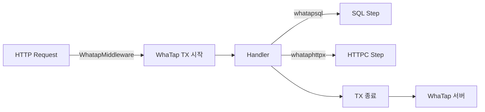

# 15. 관측 가능성 (Observability)

> 관련 파일: [`main.go`](../../main.go), [`handlers/middleware_whatap.go`](../../handlers/middleware_whatap.go), [`store/db.go`](../../store/db.go), [`internal/whataphttpx/whataphttpx.go`](../../internal/whataphttpx/whataphttpx.go), [`logger/logger.go`](../../logger/logger.go), [`logger/structured_logger.go`](../../logger/structured_logger.go), [`logger/ai_logger.go`](../../logger/ai_logger.go)

---

## 1. 관측 전략 개요 (Observability Strategy Overview)

시스템 관측은 **3+1축**으로 구성됩니다.

| 축 | 도구 | 적용 범위 |
|---|---|---|
| APM 트레이싱 | WhaTap go-api (수동 계측) | HTTP in/out, SQL, 백그라운드 TX |
| 구조화 로그 | `logger.LogDecision` (JSON) | AI 태스크 라우팅 결정 |
| AI 호출 로그 | `ai_logger.go` + lumberjack | 프롬프트 입출력, raw 응답 |
| 토큰 사용량 | `token_usage` DB 테이블 | 비용 분석, 모델별 집계 |

**왜 수동 계측인가?**  
`whatap-go-inst` 자동 계측 도구는 빌드 시 바이너리를 패치하는 방식이며 `gorilla/mux`와 호환되지 않아 제거했습니다. 수동 계측은 계측 지점을 코드로 명확히 표현하므로 의도치 않은 TX 누락을 컴파일 타임에 발견할 수 있습니다. 빌드는 `go build`(또는 `make`) 단독으로 충분합니다.



---

## 2. WhaTap 부트스트랩 (Bootstrap)

### 2-1. 초기화 / 종료

[`main.go`](../../main.go) L44–45:

```go
trace.Init(map[string]string{})
defer trace.Shutdown()
```

`trace.Init` 호출 전까지 전역 `disable` 플래그가 `true`로 유지됩니다. 그 상태에서 모든 `trace.Start*`, `trace.Step`, `method.Start`는 **silent no-op**이 되어 WhaTap 콘솔에 트랜잭션이 전혀 나타나지 않습니다 (2026-04-25 검증).

빈 맵(`map[string]string{}`)을 넘기면 에이전트가 `whatap.conf`에서 `license`, `server.host`, `app_name`을 읽습니다. 환경변수로 오버라이드할 경우 이름 목록은 아래 §7 참조.

### 2-2. 설정 우선순위

```
환경변수 (WHATAP_LICENSE, WHATAP_SERVER_HOST …)
    └→ whatap.conf
        └→ trace.Init 맵 인라인 (현재 비어있음 → 무시)
```

### 2-3. 누락 시 증상

| 누락 항목 | 증상 |
|---|---|
| `trace.Init` 미호출 | 모든 trace 호출 silent no-op, 콘솔 TX 없음 |
| `WHATAP_LICENSE` 미설정 | 에이전트 인증 실패, WARN 로그 |
| `whatap.conf` 없음 + 환경변수 없음 | 에이전트 disabled 상태로 기동 |

### 2-4. 종료 순서

`defer trace.Shutdown()`은 `main()`의 `defer cancel()` 보다 먼저 등록되어 나중에 실행됩니다. 따라서 WhaTap 플러시는 context 취소 *후* 발생합니다. 이 순서는 진행 중인 TX 데이터 유실 방지에 중요합니다.

---

## 3. 계측 패턴 매트릭스 (Instrumentation Pattern Matrix)

### 3-1. HTTP Inbound: WhatapMiddleware

파일: [`handlers/middleware_whatap.go`](../../handlers/middleware_whatap.go)

```go
func WhatapMiddleware(next http.Handler) http.Handler {
    return whatapmux.Middleware()(next)
}
```

`whatapmux.Middleware()`는 내부적으로 `trace.HandlerFunc`를 사용해 HTTP 메서드, URL, 헤더를 캡처하고 `*http.Request.Context()`에 trace context를 주입합니다. 이후 레이어에서 `trace.Step`, `method.Start` 호출 시 이 context를 통해 부모 TX에 연결됩니다.

미들웨어 등록 위치: [`handlers/`](../../handlers/) `NewAPI` → `r.Use(WhatapMiddleware)` (route 등록 전).

### 3-2. HTTP Outbound: whataphttpx 래핑

파일: [`internal/whataphttpx/whataphttpx.go`](../../internal/whataphttpx/whataphttpx.go)

각 통합 SDK(Slack, Notion, Gmail, Gemini)별로 다른 패턴을 씁니다.

| 상황 | 함수 | 내부 동작 |
|---|---|---|
| 새 HTTP 클라이언트 (Slack-go 등) | `whataphttpx.Client()` | `NewRoundTrip(bg, nil)` → 새 transport |
| OAuth2 클라이언트 래핑 (Gmail) | `whataphttpx.WrapClient(c)` | 기존 transport를 base로 보존 후 WhaTap 래핑 |
| API Key 인증 (Gemini) | `whataphttpx.ClientWithAPIKey(key)` | `apiKeyTransport` → WhaTap 래핑 |

**왜 별도 패키지인가?**  
`google.golang.org/api/option.WithHTTPClient`를 지정하면 `WithAPIKey`, `WithCredentials`, `WithTokenSource`가 모두 무시됩니다. 각 통합마다 인증 방식이 달라 WhaTap RoundTripper 삽입 위치가 다르기 때문에, 이 패키지가 올바른 wrapping 순서를 중앙화합니다 (→ [05-channels.md](05-channels.md)).

`whataphttp.HttpGet(ctx, url)` 헬퍼도 사용 가능하나, 기존 클라이언트 인스턴스를 재사용해야 하는 경우 `NewRoundTrip`이 더 적합합니다.

### 3-3. SQL: whatapsql.OpenContext

파일: [`store/db.go`](../../store/db.go) L65:

```go
conn, err = whatapsql.OpenContext(ctx, driverName, finalURL)
```

`whatapsql.OpenContext`는 드라이버를 래핑해 모든 `Exec/Query/QueryRow` 호출을 WhaTap SQL step으로 자동 기록합니다. sqlc가 생성한 `DBTX` 인터페이스를 투명하게 만족하므로 생성 코드 변경 없이 적용됩니다.

trace가 비활성화되어 있거나 `go_sql_profile_enabled=false`인 경우 `sql.Open`으로 폴백합니다.

→ 자세한 DB 연결 설정: [04-data-layer.md](04-data-layer.md)

### 3-4. 백그라운드 고루틴: trace.Start + defer trace.End

파일: [`store/db.go`](../../store/db.go) L236–239:

```go
traceCtx, _ := trace.Start(ctx, "/Background-DBKeepAlive")
err := db.QueryRowContext(traceCtx, "SELECT 1").Scan(&v)
_ = trace.End(traceCtx, err)
```

**규칙**: 백그라운드 TX 이름은 반드시 `/`로 시작해야 합니다. `urlutil.NewURL`이 슬래시 없는 문자열을 Host로 파싱하므로, 슬래시 미포함 시 WhaTap 콘솔의 Transaction 컬럼이 빈 칸으로 표시됩니다.

`StartWithContext` 대신 `trace.Start`를 사용해야 하는 이유: `StartWithContext`는 부모 trace context가 없으면 silent skip합니다. 독립 백그라운드 작업은 항상 `trace.Start`로 새 루트 TX를 시작해야 합니다.

→ 백그라운드 고루틴 동시성 패턴: [10-locking-and-concurrency.md](10-locking-and-concurrency.md)

### 3-5. 함수 단위: method.Start/End

서비스 레이어 함수 단위 계측:

```go
methodCtx, _ := method.Start(ctx, "FunctionName")
defer method.End(methodCtx, err)
```

`method.Start`는 현재 TX의 하위 스텝으로 등록됩니다. 부모 HTTP TX가 없으면 독립 TX로 기록됩니다.

### 3-6. 외부 SDK Step: trace.Step

Gemini API 같은 외부 SDK 호출에서 SDK가 자체 HTTP 클라이언트를 사용해 `whataphttpx`로 래핑하기 어려운 경우:

```go
trace.Step(ctx, "GeminiAnalyze", "", elapsedMs, value)
```

`name`, `desc`, `elapsed(ms)`, `value` 파라미터로 커스텀 스텝을 추가합니다.

### 3-7. gRPC

현재 코드베이스에서 gRPC는 사용하지 않습니다. WhaTap SDK가 제공하는 `whatapgrpc.{Unary,Stream}{Client,Server}Interceptor()`는 미적용 상태입니다.

---

## 4. WhaTap Gotcha

### 4-1. SDK 인증 transport — WrapClient vs ClientWithAPIKey

`google.golang.org/api/option.WithHTTPClient`는 SDK 내부의 모든 인증 옵션을 무효화합니다. 따라서 custom client를 넘길 때는 인증을 client 자체에 내장해야 합니다.

| 인증 방식 | 올바른 패턴 | 잘못된 패턴 |
|---|---|---|
| OAuth2/토큰 (Gmail) | `whataphttpx.WrapClient(oauth2Client)` | `whataphttpx.Client()` + `option.WithTokenSource` |
| API Key (Gemini) | `whataphttpx.ClientWithAPIKey(key)` | `whataphttpx.Client()` + `option.WithAPIKey` |

`whataphttpx.Client()`는 base transport가 `nil`이므로 인증 없이 403 응답을 받게 됩니다.

→ 각 채널별 실제 사용 예: [05-channels.md](05-channels.md)

### 4-2. Background TX 이름 규칙

```
올바름: "/Background-DBKeepAlive", "/Scanner-WeeklyReport"
잘못됨: "Background-DBKeepAlive"  ← Host 파싱, TX 컬럼 빈 칸
```

### 4-3. StartWithContext 사용 금지

`trace.StartWithContext(ctx, name)`는 `ctx`에 이미 활성 trace가 있을 때만 동작합니다. 활성 trace가 없으면 **silent skip**합니다.

- HTTP handler context → `trace.Start` 또는 `method.Start` 모두 사용 가능
- 독립 백그라운드 고루틴 → 반드시 `trace.Start`

### 4-4. 우회 금지 패턴

아래를 직접 사용하면 해당 호출이 WhaTap에 보이지 않습니다.

| 금지 패턴 | 대안 |
|---|---|
| `http.DefaultClient`, `http.Get` | `whataphttpx.Client()` or `WrapClient` |
| `sql.Open(driver, dsn)` | `whatapsql.OpenContext(ctx, driver, dsn)` |
| `http.NewRequest` + `http.DefaultTransport` | `whataphttpx.Client().Do(req)` |

---

## 5. 로깅 시스템 (3종)

### 5-1. 범용 레벨 로거 (`logger/logger.go`)

파일: [`logger/logger.go`](../../logger/logger.go)

**역할**: 애플리케이션 전반의 운영 로그. Stdout + lumberjack 파일 동시 기록.

| 항목 | 값 |
|---|---|
| 레벨 | DEBUG / INFO / WARN / ERROR |
| 기본 레벨 | INFO (cfg.LogLevel로 오버라이드) |
| 파일 | `$LOG_DIR/app.log` (기본 `/app/logs/app.log`) |
| 로테이션 | MaxSize 100MB, MaxBackups 30, MaxAge **7일**, 압축 |
| 로테이션 트리거 | 매일 자정 `StartLogRotator` 고루틴 |

`InitLogging()` → `InitAIInferenceLogger()` 순서로 호출되어 AI 로그 디렉토리도 함께 초기화합니다.

**결정 가이드**: 시스템 초기화, DB 연결, 채널 연결/해제, HTTP 요청 처리 흐름 → `logger.Infof/Warnf/Errorf`

### 5-2. 구조화 결정 로거 (`logger/structured_logger.go`)

파일: [`logger/structured_logger.go`](../../logger/structured_logger.go)

**역할**: AI 태스크 라우팅 결정을 JSON으로 기록. WhaTap/CloudWatch 파싱 용이.

```go
logger.LogDecision(logger.DecisionLog{
    UserEmail: email,
    Source:    "slack",
    State:     "extracted",
    Task:      "task text",
    Reasoning: "why this routing",
})
```

`DecisionLog` 구조체는 `message_id`, `source`, `state`, `task_id`, `reasoning` 필드를 포함하며 JSON으로 직렬화되어 `[DECISION] {...}` 태그로 app.log에 기록됩니다 (별도 파일 아님).

**결정 가이드**: 스캐너가 메시지를 태스크로 추출/스킵하는 모든 분기 → `logger.LogDecision`

→ 스캐너 파이프라인 라우팅 흐름: [06-scanner-pipeline.md](06-scanner-pipeline.md)

### 5-3. AI 추론 로거 (`logger/ai_logger.go`)

파일: [`logger/ai_logger.go`](../../logger/ai_logger.go)

**역할**: Gemini API 호출의 원문 프롬프트(input)와 raw 응답(output)을 별도 파일에 기록. 추출 품질 감사 및 프롬프트 디버깅 전용.

| 항목 | 값 |
|---|---|
| 파일 | `$LOG_DIR/ai_inference.log` |
| 포맷 | `[AI-LOG] date time file — INFERENCE 블록` |
| 로테이션 | MaxSize 100MB, MaxBackups 30, MaxAge **30일** (app.log보다 긴 보존) |
| 파일 생성 시점 | 프로세스 기동 시 즉시 (`InitAIInferenceLogger`) |

30일 보존은 프롬프트 품질 이슈가 뒤늦게 발견되는 경우를 위한 값입니다.

```go
logger.LogAIInferenceToFile(source, originalText, rawResponse)
```

**결정 가이드**: Gemini 응답이 예상과 다를 때 → `ai_inference.log`에서 원문·응답 직접 확인

→ AI 필터 파이프라인 호출 흐름: [07-ai-filter-pipeline.md](07-ai-filter-pipeline.md)

### 5-4. 로거 선택 결정표

| 상황 | 로거 |
|---|---|
| 서버 기동/종료, DB 연결 | `logger.Infof` |
| SQL 에러, 채널 연결 실패 | `logger.Errorf` |
| 메시지 라우팅 결정 추적 | `logger.LogDecision` |
| AI 프롬프트/응답 원문 보존 | `logger.LogAIInferenceToFile` |
| 비용/토큰 집계 | DB `token_usage` 테이블 (로거 아님) |

---

## 6. AI 호출 추적 — DB 레이어 (AI Call Tracking via DB)

### 6-1. 테이블 구조

**`ai_inference_logs`** (파일: [`store/queries/ai_inference_logs.sql`](../../store/queries/ai_inference_logs.sql))

| 컬럼 | 용도 |
|---|---|
| `message_id` | 어느 메시지에 대한 추론인지 역추적 |
| `source` | 채널 종류 (slack/whatsapp/gmail/…) |
| `original_text` | 전처리된 입력 텍스트 |
| `raw_response` | Gemini 응답 전문 (JSON 포함) |
| `created_at` | 추론 시각 |

**`token_usage`** (파일: [`store/queries/tokens.sql`](../../store/queries/tokens.sql))

| 컬럼 | 용도 |
|---|---|
| `step` | 파이프라인 단계 (ReportSummary, TranslateReport 등) |
| `model` | 사용된 Gemini 모델명 |
| `source` | 채널 |
| `report_id` | 특정 리포트 귀속 비용 계산용 |
| `prompt_tokens / completion_tokens / call_count` | 집계 단위 |
| `filtered_count` | AI 필터 통과 건수 |

`UNIQUE(user_email, date, step, model, source, report_id)` + `ON CONFLICT DO UPDATE`로 upsert 집계됩니다. 재시도 시 중복 계산 없이 누적됩니다.

### 6-2. 비용 분석 쿼리 패턴

```sql
-- 단일 리포트 비용
SELECT * FROM token_usage WHERE report_id = ?;  -- GetReportTokenUsage

-- 일별 사용량 (사용자)
SELECT ... FROM token_usage WHERE user_email = ? AND date = ?;  -- GetDailyTokenUsage

-- 파이프라인 단계별 breakdown
SELECT step, SUM(prompt_tokens) ... GROUP BY step;  -- GetTokenUsageByStep

-- 모델별 비용 비교
SELECT model, SUM(prompt_tokens) ... GROUP BY model;  -- GetTokenUsageByModel
```

→ 쿼리 전체: [`store/queries/tokens.sql`](../../store/queries/tokens.sql)

### 6-3. 인메모리 버퍼 + 종료 시 플러시

토큰 사용량은 매 AI 호출 후 DB에 직접 쓰지 않고 인메모리에 누적됩니다. `gracefulShutdown`에서 `store.FlushTokenUsage(ctx)`로 일괄 flush합니다. 비정상 종료 시 마지막 배치가 유실될 수 있습니다 (허용된 트레이드오프).

→ AI 추론 로그 보존 정책 논의: [07-ai-filter-pipeline.md](07-ai-filter-pipeline.md)

---

## 7. 환경별 설정 (Environment Configuration)

### 7-1. 운영 환경 (Production)

WhaTap 에이전트 동작에 필요한 환경변수 이름 (값 절대 인용 금지):

| 변수 | 용도 |
|---|---|
| `WHATAP_LICENSE` | 에이전트 인증 키 |
| `WHATAP_SERVER_HOST` | WhaTap 수집 서버 주소 |
| `WHATAP_APP_NAME` | 콘솔 표시 앱 이름 |

부트 시 `logEnvDebug()`가 `WHATAP_*` 키 목록을 로그에 출력합니다. `WHATAP_LICENSE` 값은 `****`로 마스킹됩니다 ([`main.go`](../../main.go) L106–109).

`LOG_DIR` 환경변수로 로그 디렉토리를 오버라이드할 수 있습니다 (기본: `/app/logs`).

### 7-2. 로컬 개발 환경

`trace.Init`은 `whatap.conf`와 환경변수 모두 없으면 에이전트를 disabled 상태로 기동합니다. 이 경우 모든 `trace.*` 호출이 no-op이므로 로컬에서 WhaTap 없이 개발할 수 있습니다.

로컬에서 APM을 활성화하려면 `whatap.conf`를 프로젝트 루트에 배치하거나 `WHATAP_LICENSE` + `WHATAP_SERVER_HOST`를 `.env`에 설정합니다.

**AI 로그 로컬 경로**: `LOG_DIR`이 미설정이면 `/app/logs`를 시도합니다. 로컬에서는 `LOG_DIR=./logs`를 설정하거나 `/app/logs`를 생성해야 합니다.

### 7-3. 테스트 환경

`store.TestDSN`을 설정하면 `whatapsql.OpenContext`가 `sqlite` 드라이버로 폴백합니다. `testMode=true` 시 WhaTap trace는 여전히 초기화되나, `trace.Init`이 호출되지 않으면 모두 no-op입니다.

---

## 8. Cross-References + Deltas

| 주제 | 참조 챕터 |
|---|---|
| `whatapsql.OpenContext` DB 연결 풀 설정 | → [04-data-layer.md](04-data-layer.md) |
| `whataphttpx` 채널별 사용 예 (Gmail/Slack/Gemini) | → [05-channels.md](05-channels.md) |
| 백그라운드 고루틴 TX / 동시성 패턴 | → [10-locking-and-concurrency.md](10-locking-and-concurrency.md) |
| `token_usage` / `ai_logger` AI 파이프라인 흐름 | → [07-ai-filter-pipeline.md](07-ai-filter-pipeline.md) |

**Deltas (이 챕터 집필 시점 알려진 미결 사항)**

- `token_usage` 인메모리 버퍼의 flush 주기가 shutdown에만 묶여 있어, 장기 실행 중 비정상 종료 시 마지막 배치 유실 가능. 주기적 flush 또는 WAL 방식 검토 필요.
- `ai_inference_logs`의 `original_text`/`raw_response` 컬럼 제거(Migrations Phase C)가 보류 중임. → [MEMORY: project_migrations_phase_c_pending.md]
- gRPC 인터셉터 미적용 — gRPC 도입 시 `whatapgrpc` 인터셉터 등록 필요.
