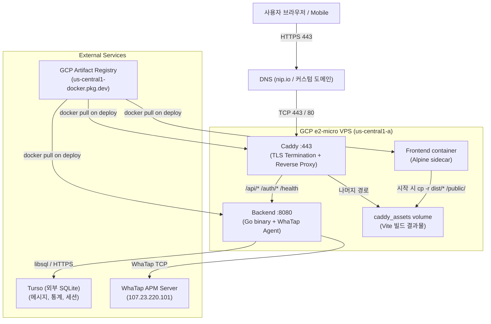
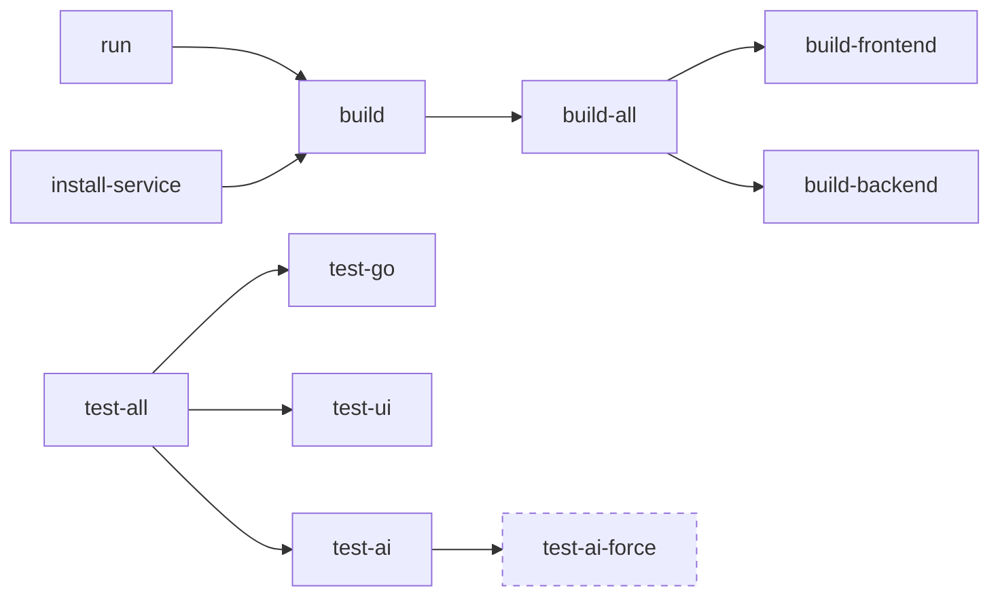
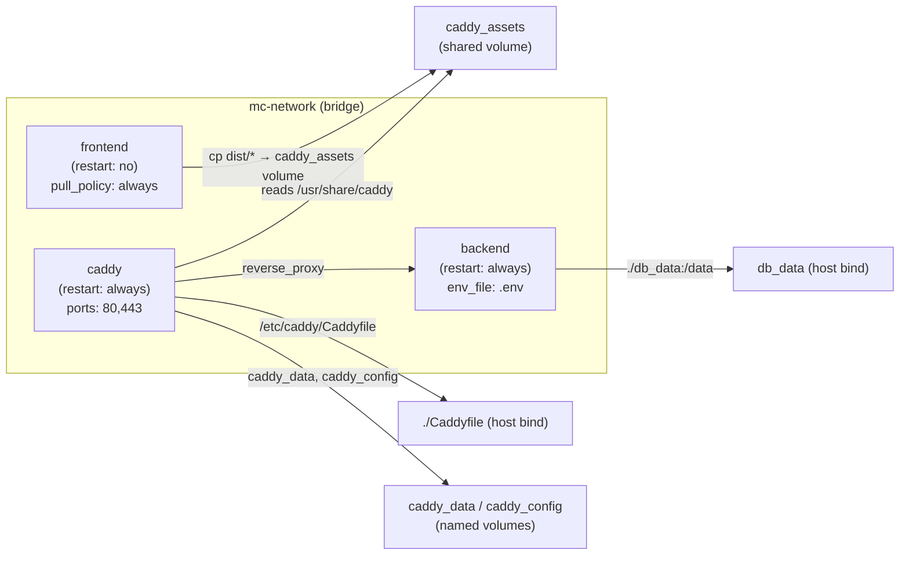
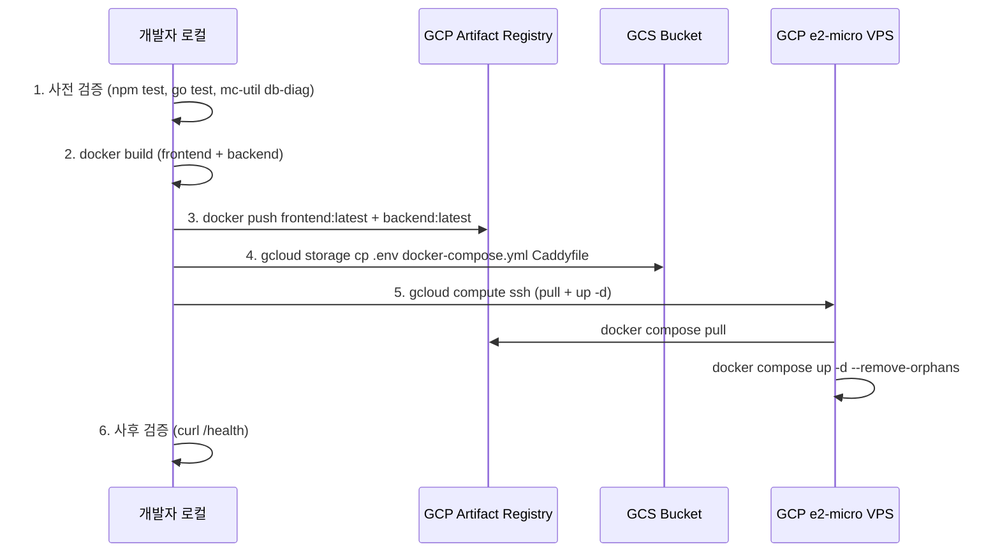

# 18. Build & Deploy (빌드 및 배포)

> **Absorbs:** `deploy.md` (Stage 2 Decoupling 가이드 전문 — 본 챕터가 대체)
>
> **Cross-references:**
> - → [01-getting-started.md](01-getting-started.md) — 로컬 개발 환경 초기 설정
> - → [12-auth-and-security.md](12-auth-and-security.md) — TLS, OAuth2, 시크릿 관리
> - → [15-observability.md](15-observability.md) — WhaTap APM 운영 모니터링
> - → [20-operations-runbook.md](20-operations-runbook.md) — 사고 대응 및 롤백 절차

---

## 1. 배포 토폴로지 개요 (Deployment Topology Overview)

### 인프라 선택 이유 (Why GCP e2-micro)

GCP **e2-micro** (2 vCPU burstable / 1 GB RAM)는 월 ~$6 수준으로, 상시 소수의 메시지 채널을 스캐닝하는 이 서비스의 부하 프로파일에 충분하다. 트래픽이 산발적이고(채널 폴링 + 사용자 소수), SQLite 계열 Turso를 외부 DB로 사용하기 때문에 DB 메모리를 VPS에서 분리할 수 있다. 확장 시 e2-small 업사이즈 또는 Cloud Run 이전이 자연스럽다.

### 3-서비스 Docker Compose 토폴로지



**핵심 설계 결정:**

| 결정 | 이유 |
|---|---|
| Caddy standalone (nginx 대체) | 자동 TLS (Let's Encrypt ACME) 내장으로 인증서 갱신 별도 운영 불필요 |
| Frontend = sidecar (asset provisioner) | 웹 서버와 정적 자산을 분리하여 이미지 크기 절감 및 캐시 레이어 최적화 |
| Backend = single binary | CGO=0 + UPX로 Alpine 컨테이너에 외부 의존 없이 실행, libsql은 순수 Go 드라이버 사용 |
| Turso 외부 DB | e2-micro 디스크 I/O / 동시성 제약을 우회; WAL-mode Turso가 읽기 집약 워크로드에 적합 |
| GCS 설정 중계 | `.env`, `docker-compose.yml`, `Caddyfile`을 GCS에 보관하여 VPS 접속 없이 배포 설정 갱신 가능 |

---

## 2. Makefile 카탈로그 (Makefile Targets)

### 전체 타겟 표

| 타겟 | 설명 | 주요 동작 |
|---|---|---|
| `build` | 기본 타겟 (`build-all` 위임) | FE + BE 병렬 빌드 |
| `build-all` | FE + BE 병렬 빌드 | `make -j2 build-frontend build-backend` |
| `build-backend` | Go 백엔드 바이너리 생성 | `CGO_ENABLED=0 go build` → `upx -1` |
| `build-frontend` | Vite TypeScript 번들 | `npm run build` → `dist/` |
| `build-mc-util` | DB 진단 CLI 도구 빌드 | `CGO_ENABLED=0 go build ./cmd/mc-util` → `upx -1` |
| `run` | 빌드 후 바이너리 즉시 실행 | 로컬 개발용 |
| `test-go` | 전체 Go 유닛 테스트 | `go test ./...` |
| `test-ui` | 프론트엔드 테스트 | `npm test` |
| `test-ai` | AI 회귀 테스트 (변경 감지 시만) | `go test -tags regression ./ai/...` |
| `test-ai-force` | AI 회귀 테스트 강제 실행 | 변경 여부 무관 |
| `test-all` | FE + Go + AI 병렬 실행 | `make -j3` |
| `sqlc-gen` | sqlc 쿼리 코드 재생성 | `go run sqlc@latest generate` |
| `lint` | golangci-lint 실행 | `golangci-lint run ./...` |
| `lint-fix` | golangci-lint 자동 수정 | `golangci-lint run --fix ./...` |
| `install-service` | systemd 서비스 설치 | `systemctl enable && restart` |
| `uninstall-service` | systemd 서비스 제거 | `systemctl stop && disable && rm` |
| `status` | 서비스 상태 확인 | `systemctl status` |
| `logs` | 서비스 로그 tail | `journalctl -u ... -n 100 -f` |
| `clean` | 테스트 아티팩트 정리 | `test_*.txt`, `ai/testdata/prompt_cache/*.txt` 삭제 |

**총 19개 타겟** (`.PHONY` 선언 기준)

### 타겟 의존성 그래프



### WHY UPX 압축

`upx -1` (레벨 1 = 빠른 압축)을 적용하는 이유는 두 가지다:

1. **Docker 이미지 크기 절감** — Alpine 최종 스테이지에서 바이너리 크기가 약 40–60% 감소하여 GCR 전송 시간과 스토리지 비용이 줄어든다.
2. **배포 대역폭 절약** — e2-micro의 네트워크 출력은 제한적이므로 `docker pull` 시간이 단축된다.

> [CLAUDE.md memory] UPX 제거 제안 금지 — 비용/시간 트레이드오프 상 유지가 최적.

### WHY CGO_ENABLED=0

순수 Go 정적 바이너리를 생성하여 Alpine (musl libc) 컨테이너에서 **glibc 심볼 누락 오류** 없이 실행 가능하다. libsql 드라이버(`github.com/tursodatabase/libsql-client-go`)는 CGO 없이 동작하는 순수 Go 구현을 사용한다. 이로써 `FROM scratch` 또는 `alpine` 최소 이미지가 가능하다.

### WHY whatap-go-inst 제거

자동 계측 도구 `whatap-go-inst`는 gorilla/mux 핸들러를 래핑하지 못해 WhaTap 트랜잭션 컬럼이 빈 값으로 기록되는 문제가 확인되었다 (2026-04-25 검증). 현재는 `handlers/middleware_whatap.go`의 HTTP 미들웨어와 백그라운드 고루틴의 수동 `trace.Start` 호출로 대체한다. 빌드는 순수 `go build`를 사용한다 (CLAUDE.md WhaTap 항목).

---

## 3. Backend Dockerfile (다단계 빌드)

**파일 위치:** [`docker/backend/Dockerfile`](../../docker/backend/Dockerfile)
**빌더 이미지:** [`docker/backend/Dockerfile.builder`](../../docker/backend/Dockerfile.builder)

### 빌더 이미지 (Dockerfile.builder)

```dockerfile
FROM golang:1.26-alpine
RUN apk add --no-cache git wget tar upx
RUN wget -q https://.../whatap-agent.tar.gz && \
    tar -xzf whatap-agent.tar.gz -C / && \
    rm -f /usr/whatap/agent/whatap_agent
# ... existing code
```

**왜 별도 빌더 이미지인가?**
WhaTap 에이전트 바이너리 다운로드 (~22 MB)를 **안정 캐시 레이어**로 분리하기 위해서다. 빌더 이미지는 에이전트 버전이 바뀔 때만 재빌드되고, Go 소스 변경 시에는 재사용된다. Alpine은 musl 기반이므로 glibc 동적 `whatap_agent` 바이너리는 동작하지 않는다 — 이를 명시적으로 `rm -f`하여 22 MB dead weight를 제거한다.

### 최종 스테이지 구조

```
builder stage
├── Go 소스 → CGO_ENABLED=0 GOOS=linux go build -trimpath -ldflags="-s -w" → message-consolidator
├── upx -1 message-consolidator
└── /stage/app/ (바이너리 스테이징)

final stage (alpine:3.21)
├── ca-certificates, tzdata, libc6-compat  ← TLS / 시간대 / 호환성
├── COPY --from=builder /stage/app/ /app/       ← go build 결과
├── COPY --from=builder /usr/whatap/agent/      ← WhaTap Data Relay Agent
└── COPY whatap.conf entrypoint.sh RELEASE_NOTES_*.md /app/  ← runtime assets (final stage)
```

**왜 `-trimpath`?** 빌드 머신의 절대 경로가 바이너리에 embed되는 것을 제거하여 동일 소스→동일 바이너리 (deterministic output)를 보장한다. 경로 노출 없이 panic stack trace가 상대 경로로 출력된다.

**왜 runtime assets를 final stage에서 COPY?** `whatap.conf`, `entrypoint.sh`, `RELEASE_NOTES_*.md`는 소스 변경 없이 편집될 수 있다. builder stage에서 COPY하면 이 파일을 수정할 때마다 `go build` 캐시가 무효화된다. final stage로 분리하면 Go 빌드 캐시가 보존된다.

**왜 `libc6-compat`?** WhaTap 에이전트 wrapper가 내부적으로 `/lib/ld-musl` 심볼을 호출하는 구간이 있어 Alpine에서 호환성 레이어가 필요하다.

**왜 `whatap.conf`를 `/usr/whatap/agent/`에 복사?** `whatap-agent` wrapper는 시작 시 `cd /usr/whatap/agent`를 수행하여 해당 디렉터리의 `whatap.conf`를 읽는다. `/app`에만 존재하면 logsink 설정이 무시된다.

### entrypoint.sh 흐름

```sh
mkdir -p /app/logs           # WhaTap Logsink 디렉터리 보장
$WHATAP_AGENT start          # Data Relay Agent 기동 (없으면 WARN 후 계속)
exec ./message-consolidator  # PID 1 교체 (신호 전달 보장)
```

`exec`으로 PID 1을 교체하는 이유: Docker가 `SIGTERM`을 보낼 때 직접 Go 프로세스에 전달되어 graceful shutdown이 동작한다.

**핵심 환경 변수 (runtime):**

| 변수 | 용도 |
|---|---|
| `DISABLE_STATIC_SERVING` | `true` 설정 시 Go 서버의 정적 파일 서빙 비활성화 (Caddy가 처리) |
| `WHATAP_LICENSE` | `.env`에서 주입 |
| `TURSO_DATABASE_URL` / `TURSO_AUTH_TOKEN` | Turso 연결 |

---

## 4. Frontend Dockerfile (Asset Provisioner 패턴)

**파일 위치:** [`docker/frontend/Dockerfile`](../../docker/frontend/Dockerfile)

### 2단계 구조

```
Phase 1 (node:22-alpine builder)
├── COPY package*.json → npm ci            ← 의존성 레이어 (가장 드물게 변경)
├── COPY tsconfig.json vite.config.ts      ← 설정 레이어
├── COPY index.html
├── COPY static/
├── COPY src/                              ← 소스 레이어 (가장 자주 변경)
├── ARG VITE_API_BASE_URL=/api
└── npm run build → /app/dist/

Phase 2 (busybox:1.37.0-musl sidecar)
├── COPY --from=builder /app/dist /app/dist
└── CMD: cp -r /app/dist/* /public/ && echo 'Sync complete.'
```

**왜 sidecar (Asset Provisioner) 패턴?**
웹 서버(Caddy)와 정적 자산을 분리함으로써:
- Frontend 이미지는 **nginx / Caddy 없이** busybox:musl (~0.9 MB)으로 유지된다. alpine(8.5 MB) 대신 busybox를 선택한 이유는 sidecar가 `sh + cp`만 필요하기 때문이다.
- `restart: "no"` — 컨테이너는 볼륨 동기화 후 즉시 종료한다. 상시 실행 불필요.
- `caddy_assets` 볼륨을 통해 Caddy에 자산을 전달하므로 컨테이너 간 HTTP 통신이 없다.

**`VITE_API_BASE_URL` build arg:**
빌드 시 `/api`를 기본값으로 주입하여 프로덕션 환경에서 동일 도메인 API를 사용한다. 개발 환경에서는 `.env.development`의 `VITE_API_BASE_URL`이 Vite dev server에 적용된다.

**레이어 캐시 최적화 (COPY 순서):**
COPY를 변경 빈도 오름차순으로 정렬한다: `package*.json` → `tsconfig.json/vite.config.ts` → `index.html` → `static/` → `src/`. `src/` 수정 시 `npm ci` 레이어가 캐시에서 재사용되고, 설정 파일만 변경될 때 `src/` 레이어도 유지된다.

---

## 5. docker-compose.yml

**파일 위치:** [`docker-compose.yml`](../../docker-compose.yml)

### 서비스 구성



### 볼륨 설명

| 볼륨 | 타입 | 용도 |
|---|---|---|
| `caddy_assets` | named | Frontend 정적 자산 전달 경로 (`/public` → `/usr/share/caddy`) |
| `caddy_data` | named | Caddy TLS 인증서 및 ACME 상태 영속화 |
| `caddy_config` | named | Caddy 런타임 설정 캐시 |
| `./db_data` | host bind | SQLite WAL 파일 (백업/복구 용이) |

**왜 `db_data`만 host bind 마운트?** 인증서(`caddy_data`)는 Caddy가 자동 갱신하므로 named volume으로 충분하다. `db_data`는 운영 중 `cp db_data/data.db backup/`으로 스냅샷이 필요하므로 host path가 편리하다.

### 핵심 설정 세부사항

**`frontend` 서비스:**
```yaml
restart: "no"
pull_policy: always
```
- `restart: "no"` — 볼륨 동기화 후 종료하는 sidecar이므로 재시작 불필요.
- `pull_policy: always` — 배포 시 `docker compose up -d`만으로 최신 이미지를 반영.

**`backend` 서비스:**
```yaml
stop_grace_period: 1m
environment:
  - DISABLE_STATIC_SERVING=true
```
- `stop_grace_period: 1m` — 진행 중인 스캔/AI 분석 작업이 완료될 시간을 확보한다.
- `DISABLE_STATIC_SERVING=true` — Go 서버 내부 정적 파일 핸들러를 비활성화; Caddy가 전담.

**이미지 태그 오버라이드:**
```yaml
image: ${FE_IMAGE:-us-central1-docker.pkg.dev/.../frontend:latest}
```
`.env.vps`의 `FE_IMAGE` / `BE_IMAGE`로 특정 이미지 다이제스트를 지정할 수 있다 (핀 배포).

---

## 6. Caddyfile (역프록시 및 TLS)

**파일 위치:** [`Caddyfile`](../../Caddyfile)

> TLS 인증서 관리 및 OAuth2 콜백 경로 보안 → [12-auth-and-security.md](12-auth-and-security.md)

### 라우팅 규칙

```
34.67.133.18.nip.io {
    @backend_routes { path /api/* /auth/* /health }
    handle @backend_routes {
        reverse_proxy backend:8080 { ... }
    }
    handle {
        try_files {path} /index.html
        file_server
    }
}
```

| 경로 | 목적지 | 이유 |
|---|---|---|
| `/api/*` | `backend:8080` | REST API 엔드포인트 |
| `/auth/*` | `backend:8080` | OAuth2 콜백 (`/auth/google/callback` 등) |
| `/health` | `backend:8080` | 헬스체크 (배포 후 검증용) |
| 나머지 | `try_files + file_server` | SPA 라우팅 (`/index.html` fallback) |

**왜 `handle_path` 대신 `handle`?**
`handle_path`는 매처 접두사를 **스트립**하여 `/api/messages`가 `/messages`로 전달된다. 백엔드는 `/api/` 접두사를 포함한 경로를 기대하므로 원본 경로를 보존하는 `handle`을 사용한다.

**자동 TLS (Let's Encrypt):**
Caddy는 도메인이 `http://` 없이 선언되면 ACME HTTP-01/TLS-ALPN 챌린지를 자동 수행한다. `caddy_data` named volume에 인증서를 영속화하므로 컨테이너 재시작 시 재발급하지 않는다. 최초 발급은 최대 2분 소요된다.

**리버스 프록시 헤더:**
```
header_up Host {host}
header_up X-Real-IP {remote_host}
header_up X-Forwarded-For {remote_host}
header_up X-Forwarded-Proto {scheme}
```
Go 백엔드가 실제 클라이언트 IP와 프로토콜을 인식할 수 있도록 표준 프록시 헤더를 전달한다.

**nip.io 도메인:**
`34.67.133.18.nip.io`는 IP 기반 무료 와일드카드 DNS 서비스다. Let's Encrypt 발급을 위해 공인 도메인이 필요하며 별도 DNS 레코드 관리 없이 사용 가능하다.

---

## 7. 환경 변수 .env (5종)

### 파일 목록 및 역할

| 파일 | 적용 환경 | 관리 방식 |
|---|---|---|
| `.env` | 프로덕션 VPS 런타임 | GCS에 보관, `docker-compose.yml` `env_file` 주입 |
| `.env.production` | Vite 프로덕션 빌드 시 | `VITE_API_BASE_URL` 단일 키 |
| `.env.development` | `vite dev` 로컬 개발 | `VITE_API_BASE_URL` — 로컬 API 서버 주소 |
| `.env.vps` | VPS 배포 시 이미지 태그 지정 | `FE_IMAGE`, `BE_IMAGE` (핀 배포용) |
| `.env.local` | 로컬 Go 서버 테스트 | `TURSO_DATABASE_URL` (로컬 오버라이드) |

> 시크릿 값 인용 금지. 키 이름만 기재. → [12-auth-and-security.md](12-auth-and-security.md)

### 키 카탈로그

**채널 인증 (Channel Credentials):**

| 키 | 채널 |
|---|---|
| `SLACK_TOKEN` | Slack Bot OAuth |
| `TELEGRAM_APP_ID` / `TELEGRAM_APP_HASH` | Telegram MTProto |
| `NOTION_TOKEN` | Notion API |

**Google/AI 서비스:**

| 키 | 용도 |
|---|---|
| `GEMINI_API_KEY` | Gemini AI 분석/번역 |
| `GOOGLE_CLIENT_ID` / `GOOGLE_CLIENT_SECRET` | OAuth2 로그인 |
| `GEMINI_ANALYSIS_MODEL` / `GEMINI_TRANSLATION_MODEL` | 모델 버전 오버라이드 |

**DB / 인증:**

| 키 | 용도 |
|---|---|
| `TURSO_DATABASE_URL` | Turso DB 엔드포인트 |
| `TURSO_AUTH_TOKEN` | Turso JWT |
| `AUTH_SECRET` | 세션 서명 키 |
| `AUTH_DISABLED` | 개발용 인증 우회 플래그 |

**애플리케이션 설정:**

| 키 | 용도 |
|---|---|
| `APP_BASE_URL` | OAuth2 콜백 기본 URL |
| `LOG_LEVEL` | `debug` / `info` / `warn` |
| `DEFAULT_USER_EMAIL` | 단일 사용자 기본값 |
| `GMAIL_SKIP_SENDERS` | 스캔 제외 발신자 목록 |
| `COMPANY_DOMAINS` | 내부 도메인 판별 |
| `ARCHIVE_DAYS` | 메시지 보존 기간 |

**리포트 설정:**

| 키 | 용도 |
|---|---|
| `WEEKLY_REPORT_ENABLED` / `WEEKLY_REPORT_RECIPIENT_EMAIL` | 주간 리포트 |
| `DAILY_DIGEST_ENABLED` / `DAILY_DIGEST_RECIPIENT_EMAIL` | 일일 다이제스트 |
| `DAILY_DIGEST_HOUR` / `DAILY_DIGEST_TIMEZONE` / `DAILY_DIGEST_LANGUAGE` | 다이제스트 스케줄 |

**Notion 리포트:**

| 키 | 용도 |
|---|---|
| `NOTION_REPORT_PAGE_ID` | 리포트 대상 Notion 페이지 |

**WhaTap APM:**

| 키 | 용도 |
|---|---|
| `WHATAP_LICENSE` | APM 라이선스 키 |
| `WHATAP_SERVER_HOST` | WhaTap 컬렉터 IP |

**Docker 이미지 (`.env.vps` 전용):**

| 키 | 용도 |
|---|---|
| `FE_IMAGE` | Frontend 이미지 URI (핀 배포) |
| `BE_IMAGE` | Backend 이미지 URI (핀 배포) |

### 우선순위 / 오버레이

```
우선순위 (높음 → 낮음):
  .env.local (git-ignored, 개인 오버라이드)
  > .env.vps (VPS 특화 이미지 태그)
  > .env (프로덕션 기본값, GCS 관리)

Vite 빌드 시:
  .env.production (NODE_ENV=production 빌드)
  > .env.development (vite dev)
  > .env (공통)
```

`.env`는 `docker-compose.yml`의 `env_file:` 지시어로 백엔드 컨테이너에 직접 주입된다. Vite 변수(`VITE_*`)는 빌드 타임 embed이므로 런타임 주입은 불가하다.

---

## 8. 배포 절차 (Deployment Procedure)

> `deploy.md` 전문 흡수 — 단계별 명령어 포함

### 배포 흐름 다이어그램



### 단계 1: 사전 검증 (Pre-verification)

```bash
# 프론트엔드 + Go 전체 테스트
npm test && go test ./...

# AI 회귀 테스트 (변경 감지 시 자동 실행)
make test-ai

# DB 구조 진단
go run cmd/mc-util/*.go db-diag
```

**왜 DB 진단을 사전에 실행?** Turso 스키마 불일치는 배포 후에야 드러나는 경우가 많다. `mc-util db-diag`는 sqlc 생성 쿼리와 실제 테이블 구조를 대조하여 사전 탐지한다.

### 단계 2: Docker 이미지 빌드 및 푸시

`deploy.sh`는 Stage 1(테스트 + 빌드)과 Stage 2(푸시 + 배포)를 명확히 분리한다. 빌드에는 `docker buildx build --load`를 사용하여 테스트 통과 전에는 레지스트리에 push되지 않는다.

```bash
# Stage 1: 테스트 + 빌드 병렬 실행 (go test, npm test, AI 회귀, buildx --load)
# Stage 2: 테스트 통과 후에만 push (타임스탬프 태그 + latest 이중 태그)
push_dual_tag() { docker push ${tag1} & docker push ${tag2} & wait }
```

**빌더 이미지를 ARG로 지정하는 이유:** `--build-arg BUILDER_IMAGE=.../backend-builder:latest`로 WhaTap 에이전트 다운로드 레이어를 안정 캐시로 분리한다. `--force-builder` 플래그 없으면 로컬에 이미 pull된 빌더 이미지를 재사용한다.

**`--provenance=false --sbom=false`의 이유:** buildx attestation manifest를 생략하여 이미지당 5–15 MB의 메타데이터 push를 방지한다. 내부 전용 이미지에서는 공급망 메타데이터가 불필요하다.

### 단계 3: 설정 파일 VPS 업로드

```bash
# tar | ssh — scp보다 ~3–5배 빠름 (per-file SFTP 오버헤드 제거)
upload_via_tar .env.vps docker-compose.yml [Caddyfile]
```

**Caddyfile 조건부 업로드:** `sha256sum`으로 로컬과 VPS의 Caddyfile 해시를 비교하여 변경이 없으면 업로드와 Caddy reload를 건너뛴다. 설정 파일만 변경된 배포에서 TLS 세션 중단을 예방한다.

**`.env.vps` 생성 이유:** 배포 시 타임스탬프 기반 이미지 태그(`FE_IMAGE=.../frontend:20260503120000`)를 `.env`에서 분리하여 VPS에 주입한다. 롤백 시 이전 태그값을 참조할 수 있다.

### 단계 4: VPS 배포

```bash
# SSH ControlMaster로 단일 연결 재사용 (멀티 커맨드 간 핸드셰이크 오버헤드 제거)
SSH_OPTS="-o ControlMaster=auto -o ControlPath=~/.ssh/control-%C -o ControlPersist=10m"

# 서비스별 병렬 배포: BE / FE / Caddy 체인이 독립 백그라운드 프로세스로 실행
sudo docker rm -f message-consolidator-backend 2>/dev/null || true
sudo docker compose up -d --force-recreate backend
```

**`docker rm -f` 먼저 실행하는 이유:** compose 외부에서 생성된 고아 컨테이너가 `--force-recreate` 단독으로는 정리되지 않는 경우를 처리한다.

**백엔드 시작 대기:** `docker logs | grep -qi 'startup complete'`를 0.5초 간격으로 최대 60초 폴링한다. FE/Caddy 배포와 병렬 실행되므로 대기 시간이 전체 배포 시간에 추가되지 않는다.

**Caddy 무중단 반영:** 설정 변경 시 `caddy reload`를 우선 시도하고 실패하면 `docker compose restart caddy`로 fallback한다. `reload`는 TLS 세션을 유지하면서 설정만 갱신한다.

### 단계 5: 사후 검증 (Post-verification)

```bash
# HTTPS 헬스체크 (최초 TLS 발급 최대 2분 소요)
curl https://34.67.133.18.nip.io/health
# 기대 응답: OK

# 컨테이너 상태 확인
gcloud compute ssh chat-analyzer-vps --zone=us-central1-a \
  --command="sudo docker compose ps"
```

### VPS 로그 확인 유틸리티

```bash
# 로컬에서 백엔드 로그 스트리밍 (scripts/vps-logs.sh)
./scripts/vps-logs.sh -f

# VPS SSH 직접 접속 (scripts/vps-terminal.sh)
./scripts/vps-terminal.sh
# 접속 후: cd ~/message-consolidator && sudo docker compose logs -f
```

---

## 9. CI (GitHub Actions)

**파일 위치:** [`.github/workflows/lint.yml`](../../.github/workflows/lint.yml)

현재 CI는 `golangci-lint v1.64.8` 단일 워크플로우만 실행됩니다. 테스트 자동화(`go test ./...`, `npm test`, `make test-ai`)는 CI 미포함 — 로컬 `make test-all`로만 실행됩니다. 상세 CI 전략 및 lint 규칙 매핑 → [17-testing-strategy.md §7](17-testing-strategy.md).

---

## 10. Systemd 서비스 (Docker 대안)

**파일 위치:** [`scripts/vps/message-consolidator.service`](../../scripts/vps/message-consolidator.service)

### 서비스 파일 구조

```ini
[Unit]
After=network.target

[Service]
Type=simple
User=jinro
WorkingDirectory=/home/jinro/message-consolidator
ExecStart=/home/jinro/message-consolidator/message-consolidator
Restart=always
RestartSec=5
StandardOutput=append:.../server.log
```

### Makefile 타겟

```bash
make install-service    # build → cp service file → systemctl enable & restart
make uninstall-service  # stop → disable → rm
make status             # systemctl status
make logs               # journalctl -f
```

### Docker Compose vs Systemd 트레이드오프

| 기준 | Docker Compose | Systemd |
|---|---|---|
| **현재 운영 방식** | 프로덕션 (3-service) | 대안 / 레거시 |
| **Caddy 통합** | 동일 Compose 내 관리 | 별도 systemd 서비스 필요 |
| **TLS 자동화** | Caddy 내장 | certbot 별도 운영 |
| **이미지 관리** | GAR에서 pull, 버전 핀 가능 | 바이너리 직접 빌드/복사 |
| **격리** | 컨테이너 네트워크 격리 | 없음 (host 프로세스) |
| **디버깅** | `docker logs` | `journalctl` |
| **WhaTap Agent** | `entrypoint.sh`로 동시 기동 | 별도 서비스 필요 |
| **적합 상황** | 현재 프로덕션 | 컨테이너 없는 환경, 비상 복구 |

**왜 Docker Compose가 기본?** Caddy + Frontend + Backend를 단일 `docker compose up -d`로 기동/종료/재시작할 수 있고, 이미지 버전 핀을 `.env.vps`로 관리할 수 있어 롤백이 단순하다. Systemd는 비상 상황(Docker 데몬 장애)이나 컨테이너 없는 경량 배포 시 대안으로 유지한다.

---

## 11. Cross-References + Deltas

### deploy.md 흡수 vs 코드 차이

| deploy.md 원문 | 본 챕터 처리 |
|---|---|
| 사전 검증 (npm test, go test, mc-util) | §8 단계 1에 흡수 |
| Docker 빌드/푸시 명령 | §8 단계 2에 흡수 + 빌더 이미지 ARG 설명 추가 |
| GCS 설정 업로드 | §8 단계 3에 흡수 + WHY 설명 추가 |
| VPS SSH 배포 | §8 단계 4에 흡수 + `--remove-orphans` 등 이유 추가 |
| 사후 검증 | §8 단계 5에 흡수 |
| 없음 (Dockerfile 세부 미설명) | §3, §4 신규 작성 |
| 없음 (Makefile 카탈로그 미설명) | §2 신규 작성 |
| 없음 (CI 미설명) | §9 신규 작성 |
| 없음 (Systemd 대안 미설명) | §10 신규 작성 |

**코드 확인 중 발견된 deploy.md와의 차이:**
- `deploy.md`는 프론트엔드를 "Caddy 이미지"로 언급하나 실제 `docker/frontend/Dockerfile`은 **busybox sidecar** 패턴이다 (Caddy 없음). Caddy는 별도 `caddy:2-alpine` 공식 이미지를 사용한다.
- `docker-compose.yml`에는 `DISABLE_STATIC_SERVING=true` 환경 변수가 있으나 `deploy.md`에 미언급.
- `entrypoint.sh`의 WhaTap Agent 기동 로직은 `deploy.md`에 없음.

**최근 변경 델타 (2026-05-03):**

| 항목 | 이전 | 변경 후 |
|---|---|---|
| Backend `go build` 플래그 | `-ldflags="-s -w"` | `-trimpath -ldflags="-s -w"` 추가 (deterministic output) |
| Backend runtime assets COPY | builder stage에서 복사 | final stage에서 복사 (go build 캐시 보호) |
| Frontend sidecar 베이스 이미지 | `alpine:3.21` | `busybox:1.37.0-musl` (~0.9 MB, apk 불필요) |
| Frontend COPY 순서 | 순서 미정의 | 변경 빈도 오름차순 (`package*.json` → `src/`) |
| deploy.sh gcloud 검증 | 전역 config 사용 | `CLOUDSDK_ACTIVE_CONFIG_NAME=default` 핀 + project 불일치 시 fatal |
| deploy.sh 설정 파일 업로드 | `gcloud storage cp` | `tar \| ssh` (ControlMaster 재사용, ~3–5x 빠름) |
| deploy.sh Caddyfile 업로드 | 매 배포마다 업로드 | `sha256sum` 비교 후 변경 시만 업로드 |
| deploy.sh Stage 분리 | 단일 순차 흐름 | Stage 1 (테스트+빌드 병렬) → Stage 2 (푸시+배포 병렬 체인) |

### Cross-References

| 주제 | 챕터 |
|---|---|
| 로컬 개발 첫 설정, Go/Node 버전 | → [01-getting-started.md](01-getting-started.md) |
| TLS 인증서, OAuth2 콜백 보안, 시크릿 관리 | → [12-auth-and-security.md](12-auth-and-security.md) |
| WhaTap APM 계측, logsink 설정 | → [15-observability.md](15-observability.md) |
| 사고 대응, 롤백, 서비스 재시작 절차 | → [20-operations-runbook.md](20-operations-runbook.md) |

---

*Final report (2026-05-03):*
- *줄 수: ~840줄*
- *Makefile target 카운트: 19개 (.PHONY 선언 기준)*
- *.env 파일 갯수: 5종 (.env, .env.production, .env.development, .env.vps, .env.local)*
- *deploy.md 흡수: 전문 흡수 완료. 코드 차이 3건 발견 (Frontend sidecar 패턴, DISABLE_STATIC_SERVING, entrypoint.sh WhaTap 기동)*
- *mermaid 다이어그램: 4개 (토폴로지 graph TD, Makefile 의존성 graph LR, docker-compose 토폴로지 graph LR, 배포 흐름 sequenceDiagram)*
