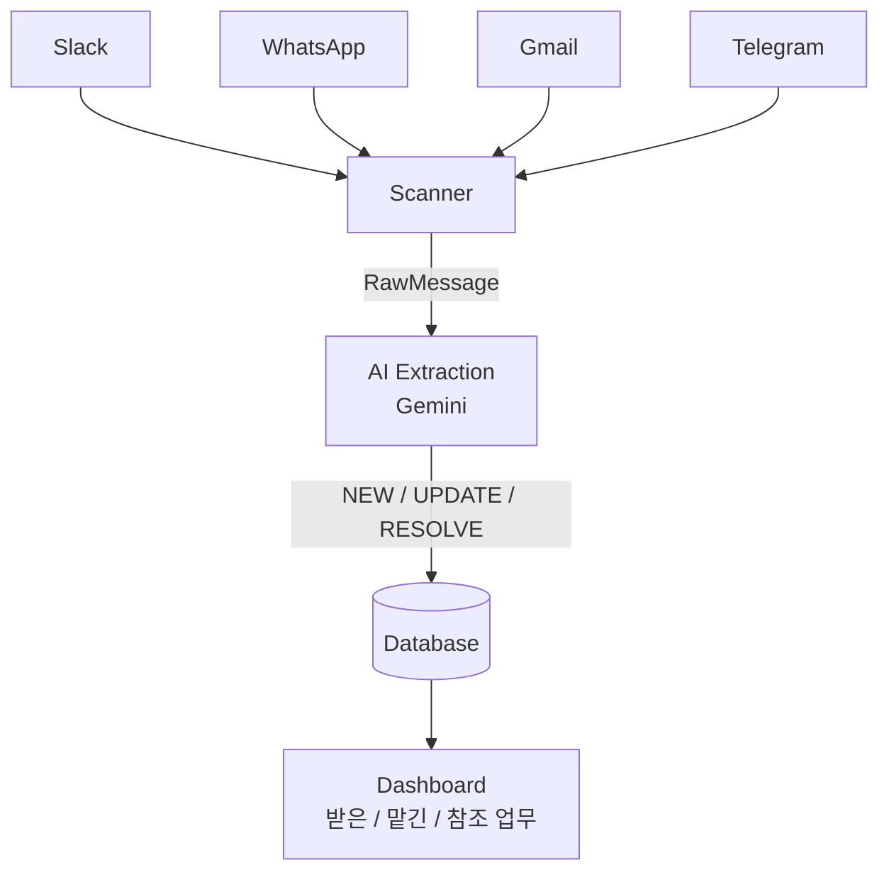
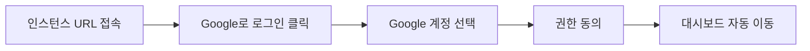
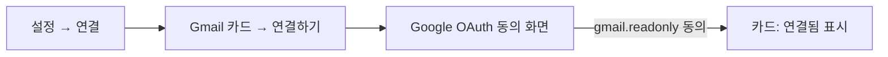
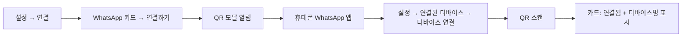
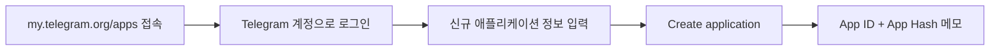
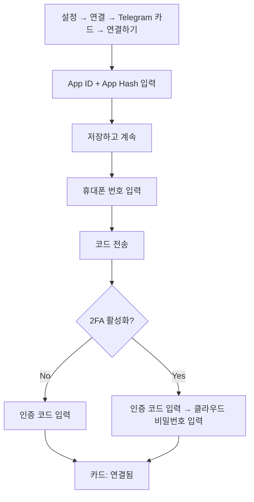
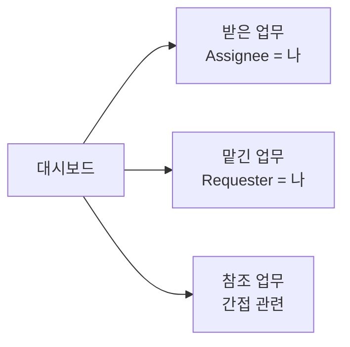
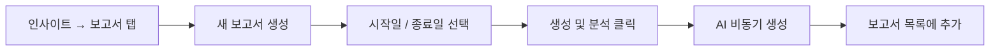

# 19 — 사용자 매뉴얼 (User Manual)

> **대상**: 이미 배포된 Message Consolidator 인스턴스에 접속하는 **최종 사용자**.  
> 인프라 셋업·환경변수 구성은 운영자 영역이므로 다루지 않습니다.  
> Cross-ref: → [05-channels.md](05-channels.md) (채널 어댑터 내부 구조) | → [12-auth-and-security.md](12-auth-and-security.md) (OAuth 흐름 상세)

> **인터랙티브 가이드**: 앱 내 사이드바에서 제공되는 간편 버전은 [`docs/user-guide/`](../../docs/user-guide/)에 있습니다 — [getting-started](../../docs/user-guide/getting-started.md) · [channels](../../docs/user-guide/channels.md) · [tasks](../../docs/user-guide/tasks.md) · [reports](../../docs/user-guide/reports.md) · [faq](../../docs/user-guide/faq.md)

---

## 목차

1. [소개](#1-소개)
2. [시작하기](#2-시작하기)
3. [채널 연동](#3-채널-연동)
4. [메시지와 업무 사용하기](#4-메시지와-업무-사용하기)
5. [보고서 / 인사이트](#5-보고서--인사이트)
6. [설정 / FAQ](#6-설정--faq)
7. [보안 / 프라이버시](#7-보안--프라이버시)

---

## 1. 소개

### 1.1 한 줄 요약

여러 채널(Slack · WhatsApp · Gmail · Telegram)에 흩어진 업무 메시지를 한 곳으로 모으고, AI가 자동으로 "업무"를 추출·분류해 단일 대시보드에서 관리할 수 있게 해주는 도구입니다.

### 1.2 작동 방식



AI가 메시지를 읽고 다음 세 가지 상태로 판별합니다.

| 상태 | 의미 |
|---|---|
| **NEW** | 새로 들어온 업무 — 대시보드에 신규 항목으로 추가 |
| **UPDATE** | 기존 업무에 대한 답변·진행 상황 — 같은 업무에 누적 |
| **RESOLVE** | 업무가 완료된 것으로 판단 — 자동으로 보관함 이동 |

> **이 인스턴스의 멀티테넌시**: 각 사용자 데이터(메시지·업무·태그)는 이메일 단위로 완전 격리됩니다. 다른 사용자의 업무는 보이지 않으며, 영향을 주고받지도 않습니다.

### 1.3 지원 채널 요약

| 채널 | 연동 방식 | 누가 설정하나 |
|---|---|---|
| Gmail | Google OAuth | 사용자 직접 |
| WhatsApp | QR 코드 페어링 | 사용자 직접 |
| Telegram | 휴대폰 번호 + OTP | 사용자 직접 |
| Slack | 워크스페이스 Bot Token | **운영자 사전 설정** — 사용자는 가입 시 자동 매핑 |

각 채널의 내부 어댑터 구조는 → [05-channels.md](05-channels.md)를 참조하세요.

### 1.4 누구를 위한 도구인가

- 업무 요청이 Slack DM, WhatsApp 그룹, Gmail, Telegram에 분산되어 어디서 뭘 해야 하는지 놓치는 분
- 여러 채널의 메시지를 하나의 할 일 목록으로 통합하고 싶은 분
- 주간·일일 업무 활동을 AI 요약 보고서로 받고 싶은 팀

---

## 2. 시작하기

### 2.1 첫 로그인



1. 운영자에게 받은 인스턴스 URL에 접속합니다.
2. **Google로 로그인** 버튼을 클릭합니다.
3. Google 계정을 선택하고 권한 동의 화면에서 동의합니다.
4. 로그인이 완료되면 대시보드로 자동 이동합니다.

별도의 회원가입 절차는 없습니다. 첫 Google 로그인 시 사용자 계정이 자동 생성됩니다.

### 2.2 첫 화면 이해

대시보드는 크게 세 영역으로 구성됩니다.

```
┌─────────────────────────────────────────────────────┐
│  헤더: [Slack][WhatsApp][Gmail][Telegram] 상태 아이콘 │
│        [🔄 지금 스캔]  [노이즈 필터링 카드]           │
├─────────────────────────────────────────────────────┤
│  탭: [받은 업무] [맡긴 업무] [참조 업무]              │
├─────────────────────────────────────────────────────┤
│  업무 목록: 채널 | 룸 | 업무 내역 | 요청자 | 담당자   │
└─────────────────────────────────────────────────────┘
```

- **헤더 채널 아이콘**: 각 채널의 연결 상태 표시. 클릭하면 설정 → 연결 화면으로 이동합니다.
- **노이즈 필터링 카드**: Gmail 마케팅·뉴스레터 차단 건수(오늘 / 이번 달).
- **🔄 지금 스캔**: 즉시 새 메시지를 가져옵니다. 그 외에는 백그라운드에서 자동 스캔됩니다.

### 2.3 데이터 격리 안내

- 같은 인스턴스에 여러 사용자가 가입해도 각자 이메일 기준으로 데이터가 격리됩니다.
- Slack만 워크스페이스 단위 공용 Bot Token으로 동작합니다. 메시지 자체는 본인 Slack 계정 기준으로 분류됩니다.

### 2.4 권장 채널 연동 순서

처음 가입 후 아래 순서를 권장합니다. Why: 각 채널별로 필요한 사전 작업량이 다르기 때문입니다.

```
1. Gmail   — 가장 안정적, 즉시 동작
2. WhatsApp — QR 1회 스캔으로 완료
3. Telegram — my.telegram.org에서 App ID/Hash 발급 필요 (10분 소요)
4. Slack    — 별도 작업 불필요 (자동 매핑)
```

---

## 3. 채널 연동

### 연결 화면 진입

모든 채널의 연결·재인증·해제는 **설정 → 연결** 화면에서 통합 관리합니다.

- 경로 1: 헤더 오른쪽 톱니바퀴(설정) 아이콘 → 좌측 **연결** 탭
- 경로 2: 대시보드 헤더의 채널 아이콘(Slack/WhatsApp/Gmail/Telegram) 클릭

채널 아이콘 상태 표시:

| 표시 | 의미 |
|---|---|
| **연결됨** | 정상 동작 중 |
| **연결 안됨** | 연동 필요 |
| **연결 끊김** | 토큰 만료·디바이스 로그아웃 — 재연동 필요 |

연결 화면에는 4개 채널 카드가 한 화면에 표시됩니다. 각 카드에서 상태와 식별 정보(이메일·디바이스명·전화번호·사용자 ID)를 확인하고 연결/재인증/해제 액션을 수행할 수 있습니다.

---

### 3.1 Gmail 연동

**역할**: 본인 Gmail의 신규 메일을 자동으로 스캔하여 업무 메시지를 추출합니다. 마케팅·뉴스레터는 자동 필터링됩니다.

**사전 준비물**: 사용 중인 Google 계정(로그인 계정과 달라도 무방)

#### 연동 절차



1. **설정 → 연결** 화면을 엽니다.
2. **Gmail 카드** → **연결하기** 버튼 클릭.
3. Google OAuth 동의 화면이 열립니다.
4. 요청 권한: **Gmail 메일 읽기 전용**(`gmail.readonly`). 발송·삭제 권한은 요청하지 않습니다.
5. 동의 후 대시보드로 자동 이동, 카드가 "연결됨"으로 표시됩니다.

#### 재인증 / 연결 해제

설정 → 연결 → **Gmail 카드** → **재인증** 또는 **연동 해제** 버튼을 사용합니다.

#### 권한 범위

| 권한 | 범위 |
|---|---|
| `gmail.readonly` | 메일 읽기만 가능 — 발송·삭제·레이블 변경 불가 |

문제가 발생하면 → [§트러블슈팅: Gmail 연결이 끊겼다고 나옴](#gmail-oauth-토큰-만료--연결-끊김)

---

### 3.2 WhatsApp 연동

**역할**: 본인 WhatsApp 계정의 1:1 채팅·그룹 메시지를 모니터링하여 업무를 추출합니다. WhatsApp Web과 동일한 디바이스 페어링 방식입니다.

**사전 준비물**:
- 모바일 WhatsApp 앱이 설치된 휴대폰
- 활성화된 WhatsApp 계정

#### 연동 절차



1. **설정 → 연결** 화면을 엽니다.
2. **WhatsApp 카드** → **연결하기** 버튼 클릭 — QR 모달이 열립니다.
3. 휴대폰의 WhatsApp 앱을 엽니다.
4. WhatsApp 앱 **설정 → 연결된 디바이스 → 디바이스 연결** 메뉴에서 화면의 QR을 스캔합니다.
5. 스캔 완료 시 카드가 "연결됨"으로 변경되고 디바이스명이 표시됩니다.

> **주의**: QR 코드는 발급 후 약 1분 내에 만료됩니다. 만료된 경우 **QR 재스캔** 버튼으로 새 QR을 발급받으세요.

#### 연결 해제 / 재연동

- **설정 → 연결 → WhatsApp 카드 → 로그아웃**: 인스턴스 측 세션만 해제합니다.
- **설정 → 연결 → WhatsApp 카드 → QR 재스캔**: 새 QR 발급 후 재스캔합니다.
- 휴대폰 측에서 끊으려면 WhatsApp 앱의 **연결된 디바이스** 메뉴에서 해당 세션을 제거합니다.

#### 모니터링 범위

| 대상 | 포함 여부 |
|---|---|
| 1:1 채팅 | 포함 |
| 그룹 채팅 | 포함 |
| 채널(broadcast) | 제외 |

특정 대화를 제외하는 기능은 현재 미제공입니다. 특정 그룹을 모니터링하지 않으려면 해당 그룹에서 나가는 방법을 사용해야 합니다.

문제가 발생하면 → [§트러블슈팅: WhatsApp 재인증 필요](#whatsapp-재인증-필요)

---

### 3.3 Telegram 연동

**역할**: 본인 Telegram 계정의 1:1 대화·그룹·채널 메시지를 모니터링합니다. Telegram MTProto 사용자 API를 사용하므로 본인이 직접 App ID/Hash를 발급받아야 합니다.

**사전 준비물**:
- 활성화된 Telegram 계정과 사용 가능한 휴대폰
- `my.telegram.org/apps`에서 발급받은 **App ID** 와 **App Hash** (최초 1회)

#### 3.3.1 App ID / App Hash 발급 (최초 1회)



1. 브라우저에서 [https://my.telegram.org/apps](https://my.telegram.org/apps) 접속.
2. 본인 Telegram 계정의 휴대폰 번호로 로그인(SMS·앱 코드 인증).
3. 신규 애플리케이션 정보를 입력합니다.
   - App title: 자유 입력 (예: `MessageConsolidator`)
   - Short name: 자유 입력 (예: `msgc`)
   - Platform: `Web`
4. **Create application** 클릭.
5. 표시되는 **App ID**(숫자)와 **App Hash**(32자 문자열)를 메모합니다.

> **보안 주의**: App ID/Hash는 본인 Telegram 계정에 종속된 민감한 자격증명입니다. 인스턴스 운영자 외 누구와도 공유하지 마세요.

#### 3.3.2 인스턴스에 등록



1. **설정 → 연결** 화면을 엽니다.
2. **Telegram 카드** → **연결하기** 버튼 클릭.
3. 발급받은 **App ID**와 **App Hash** 입력 → **저장하고 계속**.
4. 휴대폰 번호 입력(국가번호 포함, 예: `+821012345678`) → **코드 전송**.
5. Telegram 앱으로 도착한 **인증 코드** 입력 → **확인**.
6. 2단계 인증을 사용 중인 경우 **클라우드 비밀번호** 입력 → **확인**.
7. 카드가 "연결됨"으로 표시되면 완료. 마스킹된 전화번호와 App ID가 카드에 표시됩니다.

> **인증 코드 수신 위치**: Telegram 앱이 켜진 다른 디바이스가 있다면 SMS가 아닌 **앱 내 메시지**로 코드가 전송됩니다.

#### App ID·Hash 변경 / 재인증 / 연결 해제

설정 → 연결 → **Telegram 카드**의 각 버튼:

| 버튼 | 동작 |
|---|---|
| **App ID·Hash 변경** | 연결된 상태에서 인증 정보 갱신 |
| **재인증** | 다른 번호로 재인증 |
| **로그아웃** | 인스턴스 측 세션 해제 (App ID/Hash 보존) |

문제가 발생하면 → [§트러블슈팅: Telegram 세션 만료](#telegram-세션-만료)

---

### 3.4 Slack 연동

**역할**: 워크스페이스의 채널·DM 메시지를 모니터링하여 본인 Slack 계정 기준으로 업무를 추출합니다.

**사용자 액션**: **없습니다**. Slack은 운영자가 워크스페이스에 설치한 Bot Token으로 동작하며, 본인 Google 로그인 이메일과 같은 이메일이 등록된 Slack 사용자가 자동으로 매핑됩니다.

#### 연동 확인 방법

- 대시보드 헤더에 **"Slack: 모니터링 중"** 표시 → 정상.
- 설정 → 연결 → **Slack 카드**에서 본인에게 매핑된 Slack 사용자 ID 확인 가능.

#### 자동 매핑 실패 시

본인 Slack 가입 이메일이 Google 로그인 이메일과 다른 경우 자동 매핑이 실패할 수 있습니다.

- Slack 카드에 "자동 매핑이 아직 완료되지 않았습니다" 안내가 표시됩니다.
- 이때는 운영자에게 문의하거나, 설정 → **이름 관리 규칙** 메뉴에서 본인 식별자를 직접 등록하세요.

#### Slack 모니터링 범위

| 대상 | 포함 여부 |
|---|---|
| 공개 채널 (본인 참여 중) | 포함 |
| 비공개 채널 (본인 참여 중) | Bot 초대 시 포함 |
| DM (Direct Message) | Bot이 DM 권한 가진 경우 포함 |

Slack Bot의 정확한 권한 범위는 운영자에게 확인하세요.

---

## 4. 메시지와 업무 사용하기

### 4.1 대시보드 탭 구조



| 탭 | 의미 |
|---|---|
| **받은 업무** | 본인이 처리해야 할 업무 — 본인이 Assignee로 지정된 항목 |
| **맡긴 업무** | 본인이 다른 사람에게 부탁한 업무 — 본인이 Requester인 항목 |
| **참조 업무** | 직접 관련되지 않았지만 참고할 만한 업무 |

각 업무 행은 다음 정보를 표시합니다:

- 채널 아이콘 (Slack / WhatsApp / Gmail / Telegram)
- 룸/스레드 출처
- 업무 내역 (AI 추출 결과)
- 요청자 / 담당자
- 발생 시간
- 상태 배지 (정체됨 / 방치됨 / 오늘 마감 등)

> **정체됨/방치됨**: 3영업일 이상 업데이트가 없는 업무에 표시됩니다. 병목 확인을 위해 주의가 필요합니다.

### 4.2 업무 액션

각 업무 행에서 사용 가능한 액션:

| 액션 | 결과 |
|---|---|
| **✓ 완료** | 완료 상태로 표시, 보관함 "완료된 업무"로 이동 |
| **삭제** (소프트) | 보관함 "취소한 업무"로 이동, 복원 가능 |
| **영구 삭제** (하드) | DB에서 완전 삭제, **되돌릴 수 없습니다** |
| **편집** | 제목·요청자·담당자를 직접 수정 |
| **병합** | 중복으로 추출된 업무를 하나로 통합 |
| **원문 보기** | 메시지 원본 텍스트를 모달로 표시 |
| **{채널}에서 열기** | 원본 메시지가 있는 Slack/Telegram 등으로 직접 이동 |

> **AI 오류 수정**: AI 모델은 100% 정확하지 않습니다. 요청자·담당자가 잘못 추출됐다면 **편집** 버튼으로 직접 수정할 수 있습니다.

### 4.3 보관함 (Archive)

대시보드 → **보관함** 메뉴.

| 탭 | 내용 |
|---|---|
| **전체** | 아카이브된 모든 업무 |
| **완료된 업무** | 완료 처리한 업무 |
| **취소한 업무** | 소프트 삭제한 업무 |
| **병합한 업무** | 병합 처리된 업무 |

- 보관함 항목은 **복원** 또는 **영구 삭제** 가능합니다.
- **영구 삭제** 후에는 복원 불가합니다.
- **내보내기** 버튼으로 Excel(.xlsx) / CSV / JSON 다운로드가 가능합니다.

### 4.4 신원 매핑 (Identity Mapping)

AI가 업무를 "받은 업무" 탭에 올바르게 분류하려면, 본인이 메시지에서 어떤 이름으로 불리는지 시스템이 알아야 합니다.

#### 내 별칭 설정

설정 → **내 별칭 설정**:

- 자신을 지칭하는 이름이나 별명(예: `송재진`, `JJ`, `jjsong`)을 추가합니다.
- 등록된 별칭이 포함된 업무는 "받은 업무" 탭에 표시됩니다.

#### 이름 관리 규칙 (표기명 정규화)

설정 → **이름 관리 규칙** (매핑 탭):

- 플랫폼별로 다르게 표시되는 이름을 하나의 대표 이름으로 통일합니다.
- 예: WhatsApp `YOSEP PARK` → 대표 이름 `박요셉`

#### 표기명 변경 (Display Name Override)

설정 → **표기명 변경**:

- 화면에 강제로 표시할 이름을 지정합니다.
- 예: `송재진` → `Jaejin Song`

---

## 5. 보고서 / 인사이트

### 5.1 일일 요약 (Daily Digest)

운영자가 Daily Digest를 활성화한 경우, 매일 정해진 시간에 AI가 그날 업무 활동을 요약하여 지정된 채널로 전송합니다.

- 내용: 완료 업무 수, 집중 시간대, 정체 업무 현황
- 수신 채널: 운영자 설정에 따라 Slack DM 또는 기타 채널

### 5.2 주간 보고서 (Weekly Report)

운영자가 Weekly Report를 활성화한 경우, 매주 최근 7일간의 커뮤니케이션 데이터를 기반으로 업무 요약 및 관계망 분석 보고서를 제공합니다.

대시보드 → **인사이트** → **보고서** → **AI 주간 업무 인사이트** 탭:

- 주간 업무 요약
- 커뮤니케이션 관계망 시각화
- 채널별 분포 차트

### 5.3 AI 리포트 (기간 지정)

기간을 지정하여 해당 기간 업무 활동을 AI가 요약한 보고서를 생성합니다.

#### 생성 절차



1. 대시보드 → **인사이트** → **보고서** 탭 → **새 보고서 생성**.
2. **시작일 / 종료일** 선택.
3. **생성 및 분석** 클릭.
4. AI가 비동기로 생성하며, 완료 시 보고서 목록에 추가됩니다.

> 데이터가 많은 기간을 선택하면 토큰 한도 초과로 일부 과거 데이터가 생략될 수 있습니다. 이 경우 보고서 상단에 안내가 표시됩니다.

#### 보고서 내 기능

| 기능 | 설명 |
|---|---|
| **번역** | 이미 생성된 보고서를 다른 언어로 번역 (원본 유지) |
| **Notion으로 내보내기** | Notion 페이지로 export (운영자가 Notion 연동을 설정한 경우만) |
| **삭제** | 개별 보고서 삭제 |

### 5.4 인사이트 통계

대시보드 → **인사이트** → **통계** 탭:

| 항목 | 설명 |
|---|---|
| **누적 완료** | 지금까지 완료한 업무 총 개수 |
| **최고 집중 시간** | 시간대별 업무 완료 패턴 분석 결과 |
| **최근 30일 활동** | 히트맵 — 날짜별 업무 완료 수 |
| **시간대별 활동** | 라인 차트 |
| **채널별 분포** | 원형 차트 |
| **업무 완료 추이** | 1개월 / 3개월 / 1년 필터 지원 |

### 5.5 토큰 사용량 확인

설정 → **토큰 사용량 모니터링** (또는 인사이트 → 통계 탭의 AI 사용 카드):

- 오늘/이번 달 Gemini API 토큰 사용량과 추정 비용 확인
- 모델별(분석/번역) 사용량 구분

---

## 6. 설정 / FAQ

### 6.1 설정 메뉴 구조

| 메뉴 | 기능 |
|---|---|
| 설정 → **연결** | 채널 연결·재인증·해제 |
| 설정 → **내 별칭 설정** | AI 담당자 분류를 위한 본인 별칭 등록 |
| 설정 → **이름 관리 규칙** | 플랫폼별 이름 표기 정규화 |
| 설정 → **표기명 변경** | 화면 표시 이름 강제 지정 |
| 설정 → **토큰 사용량 모니터링** | Gemini API 사용량·비용 확인 |

### 6.2 FAQ

**Q. 다른 사용자의 메시지·업무가 제 대시보드에 보일 수 있나요?**  
A. 보이지 않습니다. 데이터는 본인 이메일 단위로 격리됩니다. Slack의 경우 본인이 참여한 채널·DM의 메시지만 본인 기준으로 필터링됩니다.

**Q. 채널 연동을 끊으면 기존 업무도 사라지나요?**  
A. 사라지지 않습니다. 연동 해제는 **신규 메시지 수집만 중단**합니다. 기존 업무를 지우려면 보관함에서 영구 삭제하거나 운영자에게 계정 삭제를 요청하세요.

**Q. 메시지가 Dashboard에 안 보입니다.**  
A. 다음 순서로 확인하세요.  
1. 채널 상태가 **연결됨**인지 확인 — 연결 끊김이면 재연동.  
2. 메시지가 업무성 내용인지 확인 — AI가 단순 인사·잡담은 필터링합니다.  
3. 노이즈 필터링에 걸렸는지 확인 (Gmail 마케팅은 자동 차단).  
4. **🔄 지금 스캔** 버튼으로 강제 스캔.  
5. 그래도 누락이 있으면 운영자에게 문의.

**Q. AI 추출 결과가 잘못됐어요.**  
A. 행의 **편집** 버튼으로 직접 수정할 수 있습니다. 본인이 받은 업무에 잘못 포함되거나 누락된다면 설정 → **내 별칭 설정**에서 본인 이름/별칭을 추가하세요.

**Q. Gemini가 제 메시지 내용을 학습하나요?**  
A. 메시지 내용은 업무 추출을 위해 Gemini API로 전송됩니다. 학습 사용 여부는 Google의 API 데이터 정책에 따릅니다. 민감한 메시지의 채널은 연동을 차단하시기 바랍니다.

**Q. WhatsApp 그룹 메시지도 다 들어오나요?**  
A. 네. 본인이 참여 중인 모든 1:1·그룹 채팅이 대상입니다. 특정 대화를 제외하는 개별 차단 기능은 현재 미제공입니다.

**Q. 보관함에서 복원할 수 있나요?**  
A. 소프트 삭제·완료 처리된 항목은 보관함 → **복원**으로 되돌릴 수 있습니다. **영구 삭제**한 항목은 복원 불가합니다.

**Q. 보고서를 다른 언어로 받고 싶어요.**  
A. 보고서 상세 화면의 **번역** 버튼을 사용하세요. 원본 보고서는 유지되고 번역본이 추가됩니다.

**Q. 이름 표시가 잘못됩니다.**  
A. 설정 → **표기명 변경**에서 원본 이름과 표시할 이름을 매핑하면 대시보드 전반에 적용됩니다.

**Q. 한 Gmail 계정을 여러 사람이 공유해도 되나요?**  
A. 권장하지 않습니다. 인스턴스는 "1 사용자 = 1 Google 로그인 이메일"을 가정합니다. 공유 메일함은 운영자에게 별도 워크플로우를 문의하세요.

**Q. Slack 메시지가 어떻게 자동으로 들어와 있나요?**  
A. Slack만 워크스페이스 단위 공용 Bot Token으로 동작합니다. 운영자가 워크스페이스에 Bot을 설치하면, 가입 시 본인 Slack 이메일과 자동 매핑됩니다.

---

## 7. 보안 / 프라이버시

### 7.1 수집 범위 요약

| 채널 | 권한 | 실제 사용 |
|---|---|---|
| Gmail | `gmail.readonly` (읽기 전용) | 메일 발송·삭제 불가 |
| WhatsApp | WhatsApp Web 동등 권한 | 인스턴스는 **수신만** 사용 |
| Telegram | MTProto 사용자 API | 본인이 가입한 모든 대화 접근 |
| Slack | 운영자 설정 Bot Token 권한 | 채널 메시지·사용자 정보 읽기 |

### 7.2 데이터 저장 위치

- 모든 데이터는 이 인스턴스의 자체 DB(Turso/SQLite)에 저장됩니다.
- Gemini AI 호출 시 메시지 내용이 Google Gemini API로 전송되어 추출에 사용됩니다.
- 외부 SaaS로 데이터가 송출되지 않습니다 (Notion 내보내기를 직접 실행한 경우 제외).

### 7.3 토큰·세션 관리

- 로그인 세션은 HttpOnly 쿠키로 관리되며 JavaScript에서 접근할 수 없습니다.
- Gmail OAuth refresh token, Telegram 세션은 인스턴스 DB에 저장됩니다 — 인스턴스 운영자의 신뢰가 전제됩니다.
- 보안 우려가 있으면 **연동 해제** 후 외부 서비스에서도 해당 세션·앱을 폐기하세요.
  - Google 계정 → [보안 → 타사 앱](https://myaccount.google.com/permissions)
  - Telegram → [my.telegram.org/apps](https://my.telegram.org/apps) → 앱 삭제

### 7.4 연결 해제와 데이터 삭제

| 행위 | 효과 |
|---|---|
| 채널 **연동 해제** | 해당 채널의 신규 메시지 수집 중단. 이미 수집된 업무는 유지. |
| 업무 **삭제**(소프트) | 보관함으로 이동. 복원 가능. |
| 업무 **영구 삭제** | DB에서 완전 삭제. 되돌릴 수 없음. |
| **로그아웃** | 세션 종료. 데이터·연동 상태는 유지. |
| 계정 자체 삭제 | 운영자에게 별도 요청 필요 (UI 미제공). |

---

*Cross-ref: → [05-channels.md](05-channels.md) (채널 어댑터 내부) | → [12-auth-and-security.md](12-auth-and-security.md) (OAuth·세션 상세) | → [20-operations-runbook.md](20-operations-runbook.md) (운영자 트러블슈팅)*
