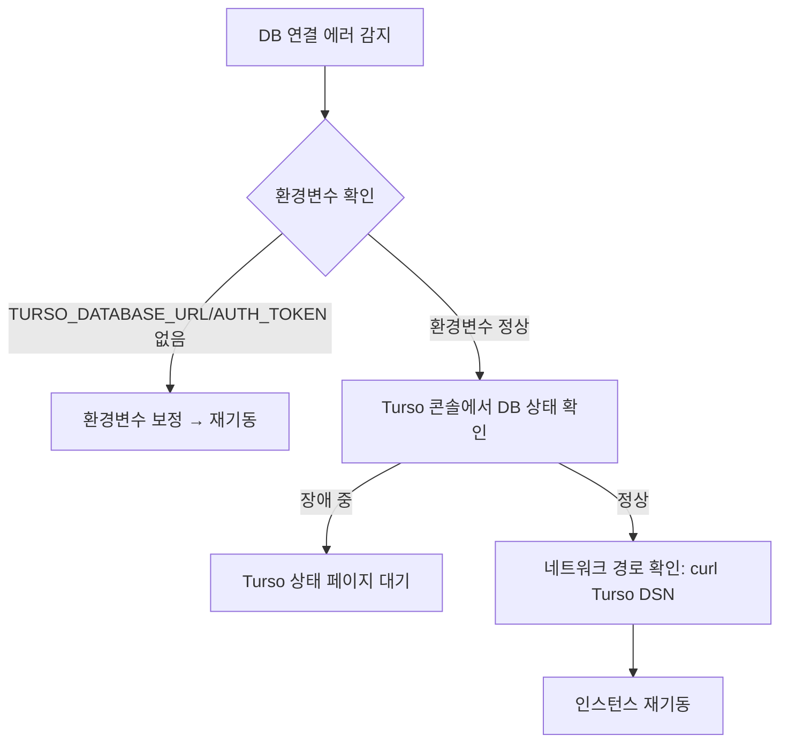
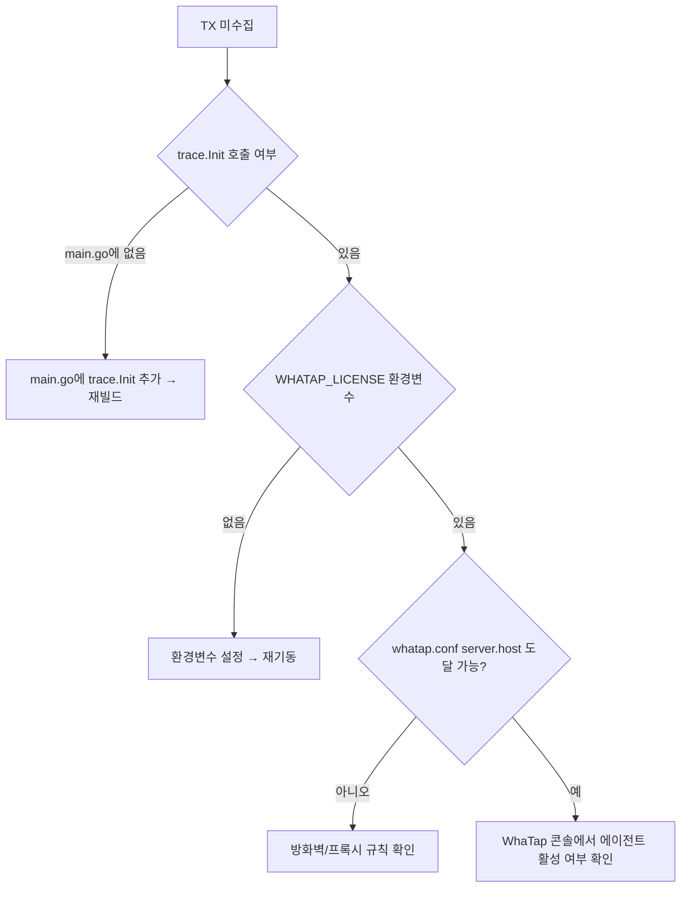

# 20 — 운영 런북 (Operations Runbook)

> **대상**: 인스턴스를 운영하는 관리자·SRE.  
> Cross-ref: → [15-observability.md](15-observability.md) (WhaTap APM 계측 상세) | → [18-build-and-deploy.md](18-build-and-deploy.md) (빌드·배포 절차) | → [04-data-layer.md](04-data-layer.md) (DB 레이어 상세) | → [01-getting-started.md](01-getting-started.md) (환경변수 전체 목록)

---

## 목차

1. [운영 책임 매트릭스](#1-운영-책임-매트릭스)
2. [모니터링 (WhaTap 대시보드)](#2-모니터링-whatap-대시보드)
3. [트러블슈팅 시나리오 Top 10](#3-트러블슈팅-시나리오-top-10)
4. [사고 대응 흐름](#4-사고-대응-흐름)
5. [로그 위치 / 보관 정책](#5-로그-위치--보관-정책)
6. [Cross-References](#6-cross-references)

---

## 1. 운영 책임 매트릭스

| 영역 | 운영자 | 사용자 |
|---|---|---|
| 인스턴스 기동/재기동 | O | X |
| 환경변수·시크릿 관리 | O | X |
| Slack Bot Token 설정 | O | X |
| Gemini API Key 관리 | O | X |
| WhaTap 에이전트 모니터링 | O | X |
| Gmail OAuth 연동 | X | O |
| WhatsApp QR 페어링 | X | O |
| Telegram App ID/Hash + 인증 | X | O |
| 업무 편집·완료·삭제 | X | O |
| Notion 연동 설정 (`NOTION_TOKEN`) | O | X |
| 계정 삭제 요청 처리 | O | (요청만) |
| DB 스키마 마이그레이션 | O | X |
| 로그 로테이션·보관 정책 | O | X |

**운영 on-call 연락처**: 인스턴스 배포 시 운영자가 별도 지정합니다. 이 문서에는 포함하지 않습니다.

---

## 2. 모니터링 (WhaTap 대시보드)

> WhaTap APM 계측 상세: → [15-observability.md](15-observability.md)

### 2.1 대시보드 진입

WhaTap 콘솔 → 프로젝트 **49153** (또는 `WHATAP_LICENSE` 환경변수로 지정한 프로젝트) → **Application Monitoring**.

### 2.2 핵심 지표 체크리스트

WhaTap 계측 패턴 매트릭스 전체 → [15-observability.md §3](15-observability.md). 운영 임계값 요약:

| 지표 | 정상 기준 | 이상 판단 기준 |
|---|---|---|
| **Active TX** | ≤ 5 | 지속 10 이상 → 응답 지연 의심 |
| **Error Rate** | ≤ 1% | 5% 이상 → 핸들러·서비스 오류 확인 |

### 2.3 WhaTap 트랜잭션 명명 규칙

| 트랜잭션 이름 | 의미 |
|---|---|
| `POST /api/scan` | 사용자 수동 스캔 요청 |
| `GET /api/tasks` | 대시보드 태스크 목록 조회 |
| `/Background-DBKeepAlive` | DB warm 유지 쿼리 (SELECT 1) |
| `/Scanner-*` | 백그라운드 스캔 루프 TX |
| `/WeeklyReport-*` | 주간 리포트 생성 TX |

> 백그라운드 TX 이름은 반드시 `/`로 시작 (→ [15-observability.md §4-2](15-observability.md)).

### 2.4 MXQL 예시 — 최근 에러 트랜잭션

```mxql
SELECT * FROM app_active
WHERE error_count > 0
ORDER BY start_time DESC
LIMIT 20
```

WhaTap 콘솔 → **MXQL** 탭에서 실행합니다. SSH 진입점·PCODE·OID는 운영자 메모리 노트(`reference_whatap_project.md`)에 별도 보관됩니다 (저장소 외부).

### 2.5 알림 채널 권장 설정

| 알림 조건 | 권장 임계값 | 채널 |
|---|---|---|
| Active TX ≥ 20 (5분 지속) | 즉시 | Slack #ops |
| Error Rate ≥ 5% (3분 지속) | 즉시 | Slack #ops |
| Response Time ≥ 3000ms (5분 avg) | 즉시 | Slack #ops |
| 프로세스 사망 (PID 미검출) | 즉시 | PagerDuty or SMS |

---

## 3. 트러블슈팅 시나리오 Top 10

### 시나리오 1 — DB 연결 끊김

**증상**
- 로그에 `libsql: connection refused` 또는 `turso: dial tcp: timeout`
- 모든 API 요청이 500 반환
- WhaTap SQL Step이 에러 상태로 집계됨

**원인**
- Turso 서비스 장애 또는 DSN/Auth Token 만료
- `TURSO_DATABASE_URL` / `TURSO_AUTH_TOKEN` 환경변수 미설정

**대응 절차**



1. `docker logs <container>` 또는 `cat /app/logs/app.log | grep ERROR | tail -30`으로 에러 확인.
2. `TURSO_DATABASE_URL`, `TURSO_AUTH_TOKEN` 환경변수 유효성 확인.
3. [Turso 상태 페이지](https://status.turso.tech) 확인.
4. `curl -H "Authorization: Bearer $TURSO_AUTH_TOKEN" $TURSO_DATABASE_URL/v2/pipeline` 로 직접 연결 테스트.
5. 환경변수 이상이면 보정 후 컨테이너 재기동.

---

### 시나리오 2 — Turso Latency 급등

**증상**
- WhaTap SQL Step 응답시간 지속 2s 이상
- 사용자 대시보드 로딩 느림
- `app.log`에 `slow query` 또는 타임아웃 경고

**원인**
- Turso 인스턴스가 cold 상태 (keepalive 실패 시 발생)
- 리전 간 레이턴시 — e2-micro(us-central1) ↔ Turso replica RTT ~900–1800ms

**대응 절차**

1. WhaTap → SQL Step 탭에서 느린 쿼리 식별.
2. `/Background-DBKeepAlive` TX 이력 확인 — 누락되면 keepalive 고루틴이 종료된 것.
3. keepalive는 `SELECT 1` 기반 (`store/db.go`). `PingContext`로 교체 금지 — warm 차단 목적이므로 반드시 `SELECT 1` 유지 (→ feedback_libsql_keepalive_select1.md).
4. 리전 간 레이턴시는 인메모리 캐시로 대부분 흡수됨 — 캐시 히트율이 낮다면 `AUTO_ARCHIVE_DAYS` 축소 또는 캐시 TTL 재검토.
5. Turso replica를 인스턴스와 동일 리전에 추가하는 방법도 고려 (Turso 콘솔에서 설정).

---

### 시나리오 3 — WhatsApp 재인증 필요

**증상**
- 사용자 대시보드에 "WhatsApp: 연결 끊김" 표시
- `app.log`에 `whatsmeow: logged out` 또는 `session not found`
- WhatsApp 메시지 수집 중단

**원인**
- 사용자가 휴대폰 WhatsApp 앱에서 "연결된 디바이스 → 이 디바이스 로그아웃" 실행
- 휴대폰이 14일 이상 오프라인 상태 → WhatsApp 자동 세션 만료
- QR 코드 발급 후 약 60초 내 미스캔

**대응 절차**

운영자 조치 불필요 — **사용자가 직접 재연동** 합니다.

1. 사용자에게 **설정 → 연결 → WhatsApp 카드 → QR 재스캔** 안내.
2. 60초 이내에 휴대폰 WhatsApp 앱 → **설정 → 연결된 디바이스 → 디바이스 연결** 에서 스캔.
3. `app.log`에서 `whatsmeow: pair success` 확인.

whatsmeow 세션 파일이 손상된 경우 → `store/` DB의 `whatsmeow_*` 테이블을 사용자 JID 기준으로 삭제 후 재연동 안내 (직접 SQL 조작 필요):

```sql
-- Turso MCP 또는 CLI에서 실행
DELETE FROM whatsmeow_sessions WHERE our_jid LIKE '%<user_phone>%';
```

---

### 시나리오 4 — Telegram 세션 만료

**증상**
- 사용자 대시보드에 "Telegram: 연결 끊김"
- `app.log`에 `telegram: AUTH_KEY_UNREGISTERED` 또는 `SESSION_REVOKED`
- Telegram 메시지 수집 중단

**원인**
- 사용자가 Telegram 앱 → **설정 → 개인 정보 및 보안 → 세션** 에서 해당 세션을 종료
- Telegram 서버 측 세션 강제 만료 (보안 이벤트 후 발생)
- App ID/Hash가 Telegram 측에서 비활성화된 경우

**대응 절차**

운영자 조치 불필요 — **사용자가 직접 재인증** 합니다.

1. 사용자에게 **설정 → 연결 → Telegram 카드 → 재인증** 안내.
2. 인증 코드 미수신 시 → Telegram 앱의 다른 디바이스 확인 (SMS가 아닌 앱 내 메시지로 전송됨).
3. App ID/Hash 오류일 경우 → **App ID/Hash 변경** 버튼으로 my.telegram.org에서 재발급 후 재등록.
4. `telegram_sessions` 테이블 손상 시 해당 레코드 삭제 후 재인증 안내:

```sql
DELETE FROM telegram_sessions WHERE user_email = '<user_email>';
DELETE FROM telegram_credentials WHERE user_email = '<user_email>';
```

---

### 시나리오 5 — Gmail OAuth 토큰 만료 / 연결 끊김

**증상**
- 사용자 Gmail 카드에 "연결 끊김"
- `app.log`에 `gmail: oauth2: token expired` 또는 `401 Unauthorized`
- Gmail 메시지 수집 중단

**원인**
- Google 계정 비밀번호 변경 시 기존 refresh token 폐기
- Google 계정 → 보안 → 타사 앱에서 접근 차단
- Refresh token이 180일 이상 미사용으로 Google에 의해 만료

**대응 절차**

운영자 조치 불필요 — **사용자가 직접 재인증** 합니다.

1. 사용자에게 **설정 → 연결 → Gmail 카드 → 재인증** 안내.
2. 재인증 실패 시 → **연동 해제 → 연결하기** 로 OAuth 흐름 처음부터 재진행.
3. 그래도 실패 시 → [Google 계정 → 보안 → 타사 앱](https://myaccount.google.com/permissions) 확인 안내.

운영자 환경변수 점검:
- `GOOGLE_CLIENT_ID`, `GOOGLE_CLIENT_SECRET` 유효성 확인.
- Google Cloud Console → OAuth 2.0 클라이언트에서 Redirect URI가 `APP_BASE_URL/api/auth/google/callback`인지 확인.

---

### 시나리오 6 — Slack Rate Limit

**증상**
- `app.log`에 `slack: rate limited, retry after Ns`
- 스캔 결과가 일부 채널에서 누락됨
- WhaTap HTTPC Step에서 429 에러 급증

**원인**
- Slack Web API `conversations.history` 호출 빈도가 채널당 tier 한도를 초과
- 채널 수가 많거나 스캔 주기가 너무 짧은 경우

**대응 절차**

1. `app.log`에서 rate limit 발생 채널과 retry-after 시간 확인.
2. Slack 채널 스캔 코드는 `withSlackRetry(3, ...)` 로 자동 백오프합니다 — 일시적 429는 자동 회복.
3. 지속적인 rate limit → Slack Bot Token의 tier 확인 (Tier 2: 20 req/min per method).
4. 근본 해결: 채널 수 축소 또는 스캔 주기 연장 (환경변수 스캔 인터벌 조정).
5. `channels/slack.go`의 `withSlackRetry` 재시도 횟수 증가는 개선이 아님 — 오히려 rate limit 악화.

---

### 시나리오 7 — Gemini API Quota 초과

**증상**
- `app.log`에 `gemini: 429 RESOURCE_EXHAUSTED` 또는 `quota exceeded`
- AI 추출 결과가 비어있거나 빈 응답
- 보고서 생성 실패
- `token_usage` 테이블 값이 할당량 근처

**원인**
- 분당/일당 Gemini API 요청 한도 초과
- 데이터가 많은 기간의 보고서 생성 시 토큰 한도 초과

**대응 절차**

1. Google Cloud Console → Gemini API → 쿼터 현황 확인.
2. `token_usage` 테이블에서 당일 사용량 조회:

```sql
SELECT step, model, SUM(prompt_tokens + completion_tokens) AS total
FROM token_usage
WHERE date = DATE('now') AND user_email = '<email>'
GROUP BY step, model;
```

3. 단기: 보고서 생성 기간을 짧게 분할하여 재시도 안내.
4. 장기: `GEMINI_ANALYSIS_MODEL` 을 lite 모델로 교체 검토 (비용·속도 트레이드오프 있음 — 운영자 판단).
5. 할당량 증가: Google Cloud Console → 쿼터 증가 요청 제출.

---

### 시나리오 8 — 디스크 공간 부족 (로그 로테이션)

**증상**
- `app.log`에 쓰기 실패: `no space left on device`
- lumberjack 로테이션이 더 이상 작동하지 않음
- 프로세스가 로그 쓰기에서 block 상태

**원인**
- 기본 보관 정책(app.log: 7일 / ai_inference.log: 30일)에도 로그가 예상보다 빠르게 누적
- `/app/logs` 마운트 볼륨의 용량이 부족

**대응 절차**

```bash
# 디스크 현황 확인
df -h /app/logs

# 로그 파일 크기 확인
ls -lh /app/logs/

# 압축되지 않은 오래된 로그 수동 삭제 (7일 초과)
find /app/logs -name "*.log.*" -mtime +7 -delete

# ai_inference.log 크기만 큰 경우 별도 truncate (보관 단축)
truncate -s 0 /app/logs/ai_inference.log
```

lumberjack 설정 변경이 필요한 경우 (→ `logger/logger.go`):

| 파라미터 | 현재값 | 조정 방향 |
|---|---|---|
| `MaxSize` | 100MB | 축소 가능 (최소 10MB 권장) |
| `MaxBackups` | 30 | 축소 가능 |
| `MaxAge` app.log | 7일 | 현 상태 유지 또는 축소 |
| `MaxAge` ai_inference.log | 30일 | 필요시 축소 |

설정 변경 후 재빌드·재기동 필요.

---

### 시나리오 9 — 메모리 Leak 의심

**증상**
- 프로세스 RSS가 시간이 지남에 따라 계속 증가 (수 시간 이내 복귀 없음)
- OOMKilled 이벤트 (`docker inspect <container>`)
- WhaTap → 시스템 메트릭에서 JVM Heap (Go의 경우 Heap Inuse) 지속 증가

**원인 후보**
- 고루틴 leak: `ctx` 취소 없이 종료되지 않는 백그라운드 고루틴
- 캐시 eviction 미동작: `store/` 인메모리 캐시에 무한 누적
- lumberjack 로테이션 버퍼 미해제 (드묾)

**대응 절차**

```bash
# 고루틴 수 확인 (pprof 엔드포인트가 열려있는 경우)
curl http://localhost:8080/debug/pprof/goroutine?debug=1 | head -50

# 또는 WhaTap 콘솔 → Active Thread 수 모니터링
```

1. 고루틴 수가 지속 증가하면 → 스캐너 루프의 `ctx` 취소 가드 확인 (`channels/` 코드).
2. 메모리 증가가 점진적이고 고루틴 수가 정상이면 캐시 TTL/크기 확인 (`store/` 캐시 구현).
3. 즉각 조치: 컨테이너 재기동 (운영 중단 없이 `docker restart <container>`).
4. 재발 시 → 재기동 시점 전후 goroutine dump 수집 후 개발팀 에스컬레이션.

---

### 시나리오 10 — WhaTap Silent No-op (Trace 미수집)

**증상**
- WhaTap 콘솔 → Application Monitoring에 TX가 전혀 표시되지 않음
- Active TX, TPS 모두 0
- 서비스는 정상 동작하는 것으로 보임

**원인**
- `main.go`에서 `trace.Init(map[string]string{})` 미호출 → 전역 `disable` 플래그 `true`
- `WHATAP_LICENSE` 환경변수 미설정 + `whatap.conf` 부재 → 에이전트 auth 실패
- `whatap.conf`의 `server.host` 도달 불가 (방화벽·프록시)

**확인 절차**

```bash
# whatap 부트 로그 확인
cat /app/logs/whatap-boot-*.log | tail -30

# 환경변수 확인
printenv | grep WHATAP

# whatap.conf 존재 확인
cat whatap.conf
```

**대응 절차**



> `trace.Init` silent no-op 동작 상세 → [15-observability.md §2-3](15-observability.md).

---

## 4. 사고 대응 흐름

```mermaid
flowchart TD
    ALERT[알림 수신\nWhaTap / Slack #ops] --> TRIAGE[1. 트리아지\n증상 범위 파악]
    TRIAGE --> IMPACT{영향도}
    IMPACT -->|전체 서비스 불가| SEV1[SEV-1: 즉시 대응]
    IMPACT -->|일부 채널/기능 이상| SEV2[SEV-2: 30분 이내]
    IMPACT -->|성능 저하, 노이즈| SEV3[SEV-3: 업무 시간 내]
    SEV1 --> CONTAIN[2. 격리\n영향 범위 제한]
    SEV2 --> CONTAIN
    SEV3 --> ROOT[루트 코즈 분석]
    CONTAIN --> LOGS[3. 로그 수집\n/app/logs/app.log\n/app/logs/ai_inference.log]
    LOGS --> WHATAP_CHK[4. WhaTap 확인\nTX 에러율·응답시간·SQL]
    WHATAP_CHK --> ROOT[5. 루트 코즈 분석\n시나리오 §3 참조]
    ROOT --> FIX[6. 수정·재기동]
    FIX --> VERIFY[7. 검증\nWhaTap TX 정상화 확인]
    VERIFY --> PIR[8. PIR 작성\n(SEV-1/2 필수)]
```

### 4.1 SEV 기준

| SEV | 기준 | 목표 대응 시간 | 목표 복구 시간 |
|---|---|---|---|
| **SEV-1** | 전체 서비스 불가 / DB 완전 단절 / 데이터 손실 | 15분 | 2시간 |
| **SEV-2** | 하나 이상 채널 수집 중단 / 보고서 생성 불가 | 30분 | 4시간 |
| **SEV-3** | 성능 저하 / 일부 사용자 이상 / 비기능 이슈 | 4시간 | 다음 근무일 |

### 4.2 즉각 격리 조치

```bash
# 스캐너 비활성화 (스캔 엔드포인트만 차단)
# — gorilla/mux 라우터에 점검 미들웨어 추가 후 재기동

# 컨테이너 재기동 (운영 중단 최소화)
docker restart message-consolidator

# 환경변수 변경 후 재기동
docker stop message-consolidator
docker run --env-file .env.prod ... message-consolidator
```

### 4.3 PIR (Post-Incident Review) 체크리스트

SEV-1/2 사고 후 24시간 이내 작성:

- [ ] 사고 타임라인 (감지 → 격리 → 복구)
- [ ] 루트 코즈 (기술적 원인, 환경적 원인)
- [ ] 영향도 (사용자 수, 데이터 손실 여부)
- [ ] 대응 효과성 검토
- [ ] 재발 방지 액션 아이템 (소유자·기한 명시)

---

## 5. 로그 위치 / 보관 정책

### 5.1 로그 파일 목록

| 파일 | 위치 | 용도 | 보관 기간 |
|---|---|---|---|
| `app.log` | `$LOG_DIR/app.log` (기본: `/app/logs/app.log`) | 운영 로그 (INFO/WARN/ERROR) + AI 라우팅 결정 (`[DECISION]` 태그) | **7일** |
| `app.log.*` | 동일 디렉토리 | 로테이션된 압축 파일 | 최대 30개 (MaxBackups) |
| `ai_inference.log` | `$LOG_DIR/ai_inference.log` | Gemini 프롬프트 입출력 원문 | **30일** |
| `whatap-boot-*.log` | `/app/logs/whatap-boot-*.log` | WhaTap 에이전트 부트 로그 | WhaTap SDK 자체 관리 |

> `$LOG_DIR`은 환경변수 `LOG_DIR`로 오버라이드 가능 (기본값: `/app/logs`).

### 5.2 로테이션 설정

lumberjack 기반 자동 로테이션 (`app.log` MaxAge 7일 / `ai_inference.log` MaxAge 30일). 상세 파라미터 → [15-observability.md §5-1](15-observability.md).

### 5.3 주요 로그 패턴

**정상 기동 확인:**
```
[INFO] DB initialized
[INFO] WhatapMiddleware registered
[INFO] Server listening on :8080
```

**채널 연결 이벤트:**
```
[INFO] WhatsApp paired: <jid>
[INFO] Telegram authenticated: <masked_phone>
[INFO] Gmail OAuth: token refreshed for <email>
```

**AI 라우팅 결정 (DECISION 태그):**
```
[INFO] [DECISION] {"user_email":"...","source":"slack","state":"extracted","task":"...","reasoning":"..."}
```

**에러 패턴 검색:**
```bash
grep -E "ERROR|WARN|panic" /app/logs/app.log | tail -50
grep "rate limited" /app/logs/app.log | wc -l
grep "AUTH_KEY_UNREGISTERED" /app/logs/app.log | tail -5
```

### 5.4 DB 레이어 감사 로그

로그 파일 외 `ai_inference_logs` · `token_usage` DB 테이블에도 AI 호출 이력이 저장됩니다. 테이블 구조 및 쿼리 패턴 → [15-observability.md §6](15-observability.md). Turso MCP 또는 CLI로 직접 조회 가능합니다.

---

## 6. Cross-References

| 항목 | 문서 |
|---|---|
| WhaTap APM 계측 상세 (패턴 매트릭스, gotcha) | → [15-observability.md](15-observability.md) |
| 빌드·배포 절차 | → [18-build-and-deploy.md](18-build-and-deploy.md) |
| DB 레이어·Turso 설정·마이그레이션 | → [04-data-layer.md](04-data-layer.md) |
| 환경변수 전체 목록 | → [01-getting-started.md](01-getting-started.md) |
| 채널 어댑터 내부 구조 | → [05-channels.md](05-channels.md) |
| AI 필터 파이프라인 | → [07-ai-filter-pipeline.md](07-ai-filter-pipeline.md) |
| 사용자 매뉴얼 (사용자 트러블슈팅) | → [19-user-manual.md](19-user-manual.md) |
| 인증·세션 보안 | → [12-auth-and-security.md](12-auth-and-security.md) |
| 동시성·고루틴 패턴 | → [10-locking-and-concurrency.md](10-locking-and-concurrency.md) |
